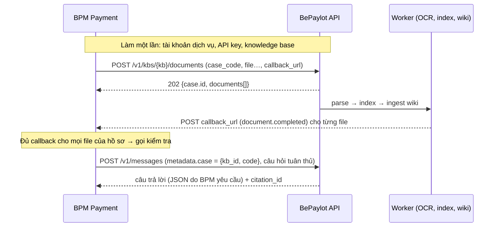

# BePaylot

Nền tảng xử lý tài liệu và agent AI viết bằng Go. File tải lên (PDF, ảnh scan) được
OCR thành nội dung có cấu trúc đến từng dòng và vị trí trên trang. Mỗi file thuộc một
**case** (bộ hồ sơ theo một mã, ví dụ `RT112233`); mỗi case có một **LLM Wiki** do LLM biên
soạn và lưu trong Postgres. Tìm kiếm **không cần embedding**: đọc index của wiki, rồi trang
wiki, rồi trang gốc. Agent làm việc trong đúng một case, trích dẫn chính xác về trang, dòng.

- **API:** [Hertz](https://github.com/cloudwego/hertz), tương thích Anthropic Messages API và AG-UI.
- **Agent:** [Eino](https://github.com/cloudwego/eino), streaming, skill, MCP.
- **Lưu trữ:** PostgreSQL (dữ liệu, full-text, wiki), S3/MinIO (file gốc, ảnh trang).
- **Hàng đợi:** [asynq](https://github.com/hibiken/asynq) trên Redis, nhiều worker pool độc lập.
- **Render PDF:** [go-pdfium](https://github.com/klippa-app/go-pdfium) (PDFium), có giới hạn CPU/RAM.

Đặc tả đầy đủ: [spec/spec.md](spec/spec.md).

---

## Mục lục

1. [Bốn module](#bốn-module)
2. [Chạy nhanh](#chạy-nhanh)
3. [Luồng xử lý một tài liệu](#luồng-xử-lý-một-tài-liệu)
4. [Tìm kiếm](#tìm-kiếm)
5. [Case và wiki](#case-và-wiki)
6. [Agent](#agent)
7. [Tích hợp từ backend khác (ví dụ BPM Payment)](#tích-hợp-từ-backend-khác-ví-dụ-bpm-payment)
8. [API](#api)
9. [Cấu hình](#cấu-hình)
10. [Triển khai](#triển-khai)
11. [Phát triển](#phát-triển)
12. [Cấu trúc thư mục](#cấu-trúc-thư-mục)
13. [Giới hạn hiện tại](#giới-hạn-hiện-tại)

---

## Bốn module

| Module | Làm gì |
|---|---|
| **1. Parser** | Nhận file (stream thẳng lên S3), render PDF thành ảnh từng trang, OCR bằng TurboOCR (tuỳ chọn: TurboOCR rồi **VLM đọc cả trang một lần gọi, kèm text OCR để kiểm**, ví dụ olmOCR), ghép với text layer có sẵn trong PDF (ưu tiên PDF/A), rồi dựng thành block, dòng có bounding box và markdown có offset. Từ bất kỳ đoạn text nào cũng tra ngược được trang, dòng và vùng trên ảnh. |
| **2. Index (LLM Wiki + PageIndex)** | Chia section, dựng **cây mục lục** có tóm tắt và thẻ tài liệu cho từng file. Mỗi case có một **wiki** do LLM biên soạn (ingest / lint, có index và log): trang tổng quan, trang nguồn (mỗi file một trang), trang entity theo schema, chủ đề, ghi chú; mọi ý có chú thích về dòng gốc. Tìm kiếm `reasoning` đọc index wiki → trang wiki → trang gốc, mọi hit được đối chiếu lại với dòng gốc; ngoài ra có `keyword`, `metadata`. **Không dùng embedding.** |
| **3. Hiển thị wiki** | API đọc/sửa wiki theo hồ sơ kiểu DeepWiki: mục lục, trang, chú thích bấm tới trang gốc, sơ đồ liên kết, nhật ký, kiểm tra, xuất file, sự kiện realtime. |
| **4. Agent** | Agent chat hiện có; session gắn **đúng một case** (`sessions.case_id`, bất biến) thì có các tool `wiki_*` và `kb_*`, chỉ thấy dữ liệu của case đó. Mọi câu trả lời từ tài liệu kèm `citation_id`. |

Mỗi file có thể kèm **metadata tuỳ chọn** (ví dụ `loai_giay_to`), gán khi upload, kể cả upload nhiều file một lần, để lọc **bên trong** case. Mã hồ sơ là case, không phải metadata.

Khi upload cũng có thể truyền **`callback_url` (tuỳ chọn)**: xem mục [Callback khi hoàn thành](#callback-khi-hoàn-thành).

---

## Chạy nhanh

Cần Go 1.26+ và Docker. Không cần API key: mặc định dùng LLM giả (`fake`).

```bash
cp .env.example .env     # xem mục Cấu hình để sửa
make up                  # Postgres :5433, Redis :6380, MinIO :9110 (console :9111)
make migrate             # tạo schema
make skills-sync         # nạp skills/ vào Postgres
make run                 # API + worker trên :8080
make run-web             # (tuỳ chọn) API + giao diện web :5174
```

`make dev` gộp `up`, `migrate` và `run`. Swagger UI ở `http://localhost:8080/docs`.

**Đăng nhập** giống WeKnora: mở `http://localhost:5174/login`, bấm **Tạo tài khoản** (email + mật khẩu) rồi dùng luôn; không cần `make seed` nữa. Server cấp access token JWT (24h) và refresh token (7 ngày, dùng một lần), web tự làm mới khi hết hạn. Bật OIDC (Keycloak, Google, Azure AD…) bằng các biến `BEPAYLOT_OIDC_*` trong `.env`; trang đăng nhập sẽ hiện nút "Đăng nhập bằng …". `BEPAYLOT_REGISTRATION=closed` tắt tự đăng ký.

API key cho script/curl tạo trong web (**Tài khoản → API key**) hoặc `POST /v1/auth/api-keys`. `make seed` vẫn còn cho CI; `make seed EMAIL=dev@bepaylot.local PASSWORD='…'` đặt mật khẩu cho một tài khoản có sẵn (ví dụ dữ liệu tạo trước khi có trang đăng nhập) để đăng nhập được.

> Nếu cổng 5433 đã bị dùng (ví dụ bởi WeKnora), đặt `BEPAYLOT_PG_PORT=5434` khi `make up`
> và sửa cổng trong `DATABASE_URL` tương ứng.

### Thử với tài liệu

```bash
KEY=sk-bepaylot-...      # tạo ở Tài khoản → API key (hoặc make seed)
H=(-H "x-api-key: $KEY")

# 1. Tạo knowledge base
KB=$(curl -s localhost:8080/v1/kbs "${H[@]}" -d '{"name": "Hồ sơ thanh toán"}' | jq -r .id)

# 2. Upload nhiều file vào một case (tạo case nếu chưa có; mã được chuẩn hoá theo loại case)
curl -s localhost:8080/v1/kbs/$KB/documents "${H[@]}" \
  -F 'case_code= rt112233' -F 'case_type=thanh_toan' \
  -F 'files_metadata={"hd.pdf":{"loai_giay_to":"HOP_DONG"},"unc.pdf":{"loai_giay_to":"UNC"}}' \
  -F 'callback_url=https://your-app.example.com/hooks/bepaylot' \
  -F file=@hd.pdf -F file=@unc.pdf | jq     # → case.id; callback_url: tuỳ chọn
CASE=...                                     # case.id ở trên, hoặc GET /v1/kbs/$KB/cases/by-code/RT112233

# 3. Theo dõi tiến độ (SSE), xem wiki của hồ sơ
curl -sN localhost:8080/v1/documents/$DOC/events "${H[@]}"
curl -s  localhost:8080/v1/cases/$CASE/wiki "${H[@]}" | jq '.pages[] | {slug, kind, summary}'
curl -s  localhost:8080/v1/cases/$CASE/wiki/index "${H[@]}" | jq -r .content

# 4. Tìm trong hồ sơ
curl -s localhost:8080/v1/cases/$CASE/search "${H[@]}" -d '{"query":"Số tiền trên uỷ nhiệm chi là bao nhiêu?"}' \
  | jq '.hits[] | {file_name, page_no, quote, citation_id, via}'

# 5. Chat với hồ sơ: session gắn đúng một case
curl -s localhost:8080/v1/messages "${H[@]}" -d "{\"model\":\"claude-sonnet-5\",\"max_tokens\":1024,
  \"metadata\":{\"case_id\":\"$CASE\"},
  \"messages\":[{\"role\":\"user\",\"content\":\"Lấy số hợp đồng, bên thụ hưởng, số tài khoản, số tiền. Trả JSON có citation_id.\"}]}" | jq
```

### Dùng LLM thật

Trong `.env`:

```bash
# Claude
BEPAYLOT_DEFAULT_PROVIDER=claude
BEPAYLOT_DEFAULT_MODEL=claude-sonnet-5
ANTHROPIC_API_KEY=sk-ant-...

# hoặc server tương thích OpenAI (LM Studio, vLLM, Ollama, llama.cpp), không cần key
BEPAYLOT_DEFAULT_PROVIDER=openai
BEPAYLOT_DEFAULT_MODEL=<model id>
OPENAI_BASE_URL=http://127.0.0.1:1234/v1
```

Tree, search và wiki có thể dùng model riêng (`index.tree.model`, `search.model`,
`wiki.model`); nên chọn model nhanh cho `search` và model mạnh cho `wiki`. Với LLM giả, hệ
thống vẫn chạy: tóm tắt dùng trích đoạn, `reasoning` tự rơi về `keyword`, và ingest wiki sau
5 lần lỗi rơi về trang nguồn dạng mẫu (thẻ tài liệu + mục lục, trạng thái `partial`).

### Giao diện web

```bash
cd frontend && npm install && npm run dev    # http://localhost:5174
```

Giao diện theo phong cách Google Drive (Material 3), gồm bốn màn hình:
- **Tài liệu:** danh sách hoặc lưới file, upload bằng kéo thả, trình xem trang OCR có khung toạ độ.
- **Hỏi đáp:** chat kiểu Gemini với agent, bấm citation để xem đúng vùng trên trang.
- **Wiki:** xếp theo cây từng file và mục lục của file.
- **Graph:** graph 3D dùng three.js, cùng stack với codebase-memory-mcp.

> Frontend chưa được chuyển sang API case/wiki mới (spec 0.5): các màn hình Wiki/Graph vẫn gọi API graph cũ đã bị bỏ.

Khi dev, Vite proxy `/v1` sang API ở cổng 8080. Chi tiết trong [frontend/README.md](frontend/README.md). Thư mục `prototypes/` giữ bản HTML tĩnh ban đầu.

---

## Luồng xử lý một tài liệu

```
upload ──► S3 ──► document:split ──► page:render (lô) ──► page:ocr (từng trang) ──► document:assemble
                  (đếm trang,        (PDFium: JPEG +       (TurboOCR + ghép           (header lặp lại,
                   bookmark, PDF/A)   text layer → S3)      text layer)                markdown toàn văn)
                                                                                           │
                    wiki:ingest ◄──────────────────── index:tree ◄── index:build ◄────────┘
                    (tuần tự theo case) → wiki:lint   (cây + tóm tắt) (section)
```

Các điểm chính (spec §4–§5):

- **File nặng.** Xử lý theo từng trang:
  - mỗi tài liệu chỉ có một cửa sổ trang đang render/OCR (`render_ahead_pages`, `ocr_inflight_pages`), nên nhiều file lớn chạy xen kẽ công bằng;
  - retry theo trang, trang hỏng hẳn vào dead-letter;
  - file kết thúc `partial` thay vì hỏng cả file.
- **Render PDF.**
  - Chạy trong process con PDFium; số process bằng số core dùng cho render.
  - DPI tự hạ cho trang khổ lớn; process được tái chế sau N trang; trang quá timeout thì process bị kill.
  - JPEG được encode ngay trong process con.
- **OCR bằng VLM (engine `turboocr_vlm`, spec §5.9).**
  - Hai bước, không gọi VLM theo vùng: (1) TurboOCR trả về text, dòng, bbox và layout; (2) **một lần gọi VLM cho cả trang** (thu nhỏ về ≤ 1288 px, qua agent, VLM chuẩn OpenAI, mặc định `allenai/olmocr-2-7b`) để lấy markdown. Prompt gửi kèm **text TurboOCR của trang** (dòng confidence thấp đánh dấu `[?]`) để model kiểm không thiếu, tên/số khớp ảnh. `max_concurrency` = số trang gọi đồng thời.
  - Markdown được kiểm lại bằng OCR: căn từ với OCR cả trang, chia về đúng vùng layout; đoạn không có từ OCR nào khớp thì bỏ; dòng OCR bị markdown bỏ sót được chèn lại. Mỗi dòng vẫn giữ bbox và `md_start/md_end`, text OCR gốc nằm ở `text_ocr`.
  - Block có text không khớp OCR (bịa) giữ nguyên OCR; lần gọi lỗi thì cả trang giữ OCR (`on_error: fallback`).
  - Trang PDF có text layer tốt thì không gọi VLM.
  - **TurboOCR không có hoặc lỗi** (hoặc không tìm thấy vùng nào): cả ảnh trang được gửi cho VLM; markdown được tách thành tiêu đề (kể cả "Điều N", "HỢP ĐỒNG…"), bảng, hình, đoạn văn với bbox xấp xỉ. Mỗi hàng bảng thành một dòng nên vẫn search được.
- **Text layer / PDF/A.**
  - PDF/A được nhận diện ngay lúc upload.
  - Text layer đạt chất lượng thì sửa dấu và số của OCR theo từng dòng, và bổ sung dòng OCR bỏ sót.
  - OCR hỏng hẳn thì trang được dựng từ text layer.
- **Khởi động lại.** Trang đã xong không bao giờ OCR lại; housekeeping định kỳ đưa việc bị treo trở lại hàng đợi.
- **Worker pool tách riêng:**
  - `core`, `render` (nặng CPU), `ocr` (nặng I/O, bảo vệ OCR), `index`, `wiki` (ingest/lint/index, tuần tự trong một case), `maintenance`;
  - mỗi pool có một lane `interactive` ưu tiên cho file đính kèm từ chat.

Trạng thái tài liệu: `queued → splitting → parsing → assembling → indexing → (enriching) → completed | partial | failed | cancelled`.

---

## Tìm kiếm

`POST /v1/search` với `mode`:

| Mode | Cách chạy | Khi nào dùng |
|---|---|---|
| `reasoning` (mặc định) | (1) Lọc phạm vi bằng SQL: case, metadata, trạng thái. (2) LLM đọc **index của wiki** (kèm gợi ý full-text) và chọn trang wiki hoặc nhánh file cần đọc gốc. (3) LLM đọc trang wiki, trả lời bằng chú thích hoặc chỉ ra chỗ cần đọc gốc. (4) Duyệt cây mục lục kiểu PageIndex, đọc trang dạng dòng đánh số. (5) Mọi hit (cả từ chú thích wiki) được đối chiếu với dòng gốc hiện tại; trích dẫn bịa hoặc cũ bị loại, chú thích cũ đánh dấu `stale`. | Câu hỏi tự nhiên |
| `keyword` | Full-text Postgres + trigram trên section và dòng, không phân biệt dấu | Mã số, số tiền, tên riêng; nhanh và không tốn LLM |
| `metadata` | Chỉ lọc metadata, trả danh sách file | "Mọi file của hồ sơ X" |

Phạm vi là `case_ids` (hoặc `kb_ids` để tìm trên mọi case của KB, chỉ dành cho API/UI).
Mỗi hit gồm `file_name`, `case_code`, `page_no`, `lines`, `quote`, `citation_id`
(`doc:<id>:p<trang>:l<a>-<b>`), `via` (`wiki` | `raw` | `keyword`) và `bboxes` để tô sáng trên
ảnh trang. Response có `trace`: phiên bản wiki, trang wiki và nhánh đã đọc, số lần gọi LLM,
số hit bị loại, số chú thích cũ.

**Bộ lọc metadata** dùng ở `/v1/search`, `/v1/kbs/{id}/documents` và các tool của agent:

```json
{"loai_giay_to": {"in": ["GCN_HKD", "CCCD"]},
 "ngay_nop": {"gte": "2026-01-01"},
 "chi_nhanh": {"prefix": "Binh"},
 "ghi_chu": {"exists": true}}
```

Các toán tử: `eq, ne, in, prefix, gte, gt, lte, lt, exists`. Giá trị lọc được chuẩn hoá theo
`metadata_schema` giống lúc ghi (của loại case, nếu không có thì của KB): `upper_trim`, ngày
`dd/mm/yyyy` → `yyyy-mm-dd`, số. Bộ lọc luôn AND với phạm vi case, không bao giờ mở rộng nó.

Tìm trong một file: `POST /v1/documents/{id}/search` trả kết quả nhóm theo trang,
dùng như "Ctrl+F" cho PDF scan.

---

## Case và wiki

- **Case** (`configs/case_types/*.yaml`): mỗi loại case khai báo quy tắc mã (`pattern`, `normalize`), metadata schema của case và của file, engine parse, bật/tắt wiki và wiki schema. Không có workflow hay prompt trong loại case. Có sẵn `thanh_toan` (`^RT\d{6}$`), `tin_dung_dn`, và loại `default` (mã tự do).
  - `documents.case_id NOT NULL`, không FK; chống trùng theo `(case_id, sha256)`, nên cùng một file được nằm ở hai case.
  - Case `closed` không nhận file (409); xoá case (`DELETE /cases/{id}`) xoá mọi file và toàn bộ wiki của case.
- **Wiki schema** (`configs/wiki_schemas/*.yaml`, nạp vào bảng `wiki_schemas`): loại entity với thuộc tính định danh, quan hệ có kiểu, chủ đề gợi ý, quy ước viết. Có sẵn `generic`, `thanh_toan`, `ho_kinh_doanh`.
- **Ingest** (mỗi file index xong, tuần tự trong một case): **LLM chỉ trích xuất** entity, thuộc tính và quan hệ dạng JSON, **1 lần gọi mỗi file** (file lớn: 1 lần mỗi nhánh cây). Code kiểm từng giá trị với dòng gốc (chú thích là nguyên văn dòng gốc), giải định danh entity (định danh chuẩn hoá, rồi trigram tên — không embedding) và **dựng mọi trang**: trang nguồn từ cây mục lục có tóm tắt, trang entity từ thuộc tính/quan hệ, trang tổng quan. Hai nguồn khác nhau → giữ cả hai (`conflict`) + lint issue. Trang người dùng sửa tay nhận `proposed_content` thay vì bị ghi đè. Ghi trong một transaction cùng log và index. `wiki.ingest.extract: false` → 0 lần gọi LLM (chỉ trang nguồn + tổng quan).
- **Retract** khi xoá/reparse file (không gọi LLM): trang nguồn bị xoá, trang entity mất hết chú thích bị xoá, trang còn lại được dựng lại bằng code.
- **Lint** (sau mỗi đợt ingest, định kỳ, hoặc `POST /cases/{id}/wiki/lint`): tự sửa liên kết, index, đánh dấu stale; báo cáo mâu thuẫn, thiếu dữ liệu, trang mồ côi.
- **Index** (như `index.md` của LLM Wiki) dựng bằng code sau mỗi thay đổi, nhóm theo loại, mỗi trang một dòng `[w<n>] tiêu đề — tóm tắt (metadata)`; không in slug để tiết kiệm token vì index được nạp ở mọi câu hỏi. Tóm tắt entity = định danh + vai trò (LLM trả kèm trong lần trích xuất) + số tệp. Có ngân sách token (`wiki.index.max_tokens`); file chưa vào wiki vẫn có dòng `(chưa vào wiki)` để search không bỏ sót.
- **Log** (như `log.md`): ghi ingest, retract, lint, sửa tay và cả **query** (câu hỏi, trang wiki đã đọc).

## Agent

Agent giữ nguyên các khả năng sẵn có:

- **System prompt động** dựng lại mỗi lượt: ngữ cảnh môi trường, tóm tắt hội thoại, skill liên quan, hướng dẫn dùng tool.
- **Tính toán và JSON chính xác:** tool `calculate` tính bằng số hữu tỉ chính xác. Server còn tự tính các biểu thức sót trong giá trị JSON trước khi trả.
- **Skill tự tìm theo ngữ cảnh:** người dùng không cần gọi tên skill. `allowed_tools` của skill được bật tự động.
- **Tool search:** tool ngoài (MCP) chỉ hiện tên; model gọi `tool_search` để nạp schema khi cần, nên context luôn nhỏ.
- **Không chặn tin nhắn mới:** tin gửi khi đang chạy được chuyển vào lượt đang chạy (`202 steered`). Gõ "stop"/"dừng"/"hủy" để ngắt lượt.
- **Câu trả lời dài không bị cụt:** tự viết tiếp tối đa 4 lần mỗi lần gọi model. Lượt cuối không có tool để luôn kết thúc bằng câu trả lời.
- **Nhiều provider:** `claude`, `openai`-compatible, `ark`, và `fake` cho dev/test.
- **Lưu an toàn:** tin nhắn không mất khi client ngắt kết nối. Mỗi lượt ghi lại trong `agent_runs`.

**Làm việc với hồ sơ.** Gắn case vào session bằng `metadata.case_id` (hoặc `metadata.case:
{kb_id, code}`) trong `POST /v1/messages` / `POST /v1/ag-ui/run`, hoặc `case_id` khi
`POST /v1/sessions`. Case của session **không đổi được**: gửi case khác → `409`; gửi
`kb_ids`/`kb_filter` (đã bỏ) → `422`. Khi đó agent có thêm:

| Tool | Dùng để |
|---|---|
| `kb_case_toc` | nạp cây của case vào context: mỗi file một dòng kèm cây mục lục (nguyên cây khi vừa ngân sách) |
| `kb_search` | tìm full-text đúng từ (mã số, số tiền, tên) trong case, lọc theo metadata và khoảng trang |
| `kb_list_documents`, `kb_metadata_values` | liệt kê file của case; đếm giá trị metadata trong case |
| `kb_read_pages` | nạp trang của một node trên cây (`node_id`) hoặc một khoảng trang, dạng dòng đánh số `[L5] …` (tối đa 10 trang/lần) |
| `kb_document_tree`, `kb_page_overview` | duyệt mục lục từng cấp; tổng quan từng trang |
| `kb_find_in_document`, `kb_locate` | tìm trong một file (lọc theo khoảng trang), giải citation hoặc tìm vị trí một đoạn text |

Không tool nào có tham số chọn case hay KB: phạm vi lấy từ `sessions.case_id` phía server. File của
case khác bị từ chối với cùng thông báo như file không tồn tại. Case bị xoá giữa chừng thì tool báo
"case không còn tồn tại". Prompt có section `<case>` (mã, loại, số file, các trường metadata) và
quy tắc trích dẫn, không có flow: agent tự lên plan từ các tool (cây của case có ID node →
`kb_read_pages(node_id)`; hit `kb_search` kèm `node`). Việc cần bóc tách hay rule cần kiểm tra do người
dùng viết trong tin nhắn; câu trả lời trích dẫn `citation_id` của dòng gốc.

File đính kèm trong chat: `POST /v1/sessions/{id}/attachments` đưa file vào **case của session**
(lane ưu tiên); session chưa gắn case → `409`. Câu trả lời tốt có thể lưu vào wiki bằng
`POST /v1/cases/{id}/wiki/notes {session_id, message_id}` (agent không tự ghi vào wiki).

### MCP servers

Tắt mặc định (`BEPAYLOT_MCP_ENABLED=true` để bật). Có hai nguồn cấu hình, cả hai đều gắn/gỡ **không cần restart**:

- **File `configs/mcp.yaml`:** đọc lại mỗi `mcp.reload_interval`. Hỗ trợ transport `stdio`, `sse`, `streamable_http`, cùng `tool_allowlist` và `disabled`.
- **API `/v1/mcp/servers`:** cấu hình lưu trong Postgres và tự gắn lại khi khởi động. Mã lỗi: `502` khi không kết nối được server, `409` khi tên đã được file cấu hình giữ.

```yaml
servers:
  - name: github
    transport: stdio
    command: docker
    args: ["run", "-i", "--rm", "-e", "GITHUB_PERSONAL_ACCESS_TOKEN", "ghcr.io/github/github-mcp-server"]
    env: { GITHUB_PERSONAL_ACCESS_TOKEN: "${GITHUB_TOKEN}" }
  - name: search
    transport: streamable_http
    url: https://mcp.example.com/mcp
    headers: { Authorization: "Bearer ${SEARCH_MCP_TOKEN}" }
    tool_allowlist: ["web_search"]
```

Tool MCP có tên `mcp__<server>__<tool>`. Tool MCP **không bị sandbox**, chỉ gắn server bạn tin cậy.

### Skills

Mỗi skill là một thư mục trong `skills/` có file `SKILL.md` với frontmatter
`name`, `description` và `allowed_tools`. `description` quyết định việc tìm skill, nên viết theo
dạng "là gì + khi nào dùng". Đồng bộ bằng `make skills-sync` hoặc `POST /v1/skills/sync`.

---

## Callback khi hoàn thành

Upload kèm field form `callback_url` (không bắt buộc). Khi mỗi document kết thúc, bepaylot gửi **`POST`** JSON tới URL đó. Sự kiện gồm `document.completed`, `document.partial`, `document.failed` và `document.cancelled`. Case có wiki thì callback được gửi sau khi file đã ingest vào wiki.

```http
POST /hooks/bepaylot HTTP/1.1
Content-Type: application/json
X-Bepaylot-Event: document.completed
X-Bepaylot-Delivery: de0ff6c8-…          # giữ nguyên giữa các lần thử: dùng để chống trùng
X-Bepaylot-Attempt: 2
X-Bepaylot-Timestamp: 1790347725
X-Bepaylot-Signature: sha256=…           # HMAC-SHA256(secret, timestamp + "." + body), khi có BEPAYLOT_CALLBACK_SECRET

{"event":"document.completed","delivery_id":"…","occurred_at":"…",
 "document":{"id":"…","kb_id":"…","case_id":"…","case_code":"RT112233","file_name":"…","status":"completed",
             "wiki_status":"done","page_count":1,"pages_failed":0,"metadata":{"loai_giay_to":"…"},"title":"…","summary":"…", …},
 "links":{"document":"/v1/documents/…","markdown":"/v1/documents/…/markdown","pages":"/v1/documents/…/pages"}}
```

- Chỉ HTTP **2xx** là thành công. Mọi lỗi khác (mạng, timeout 10 s, 4xx/5xx, redirect) được lưu lại và retry theo backoff 10s → 30s → 1m → 5m → 15m → 30m → 1h, tối đa 8 lần. Sau đó lần giao chuyển sang `failed`.
- `GET /v1/documents/{id}/callbacks` trả trạng thái (`pending | succeeded | failed`), số lần thử, mã HTTP và lỗi cuối, cùng lịch sử từng lần thử.
- `POST /v1/documents/{id}/callbacks/retry` gửi lại ngay.
- Reparse cũng gửi callback khi xong; có thể đổi URL bằng `callback_url` trong body reparse.
- URL phải là `http(s)`. Mặc định chặn đích nội bộ (localhost, IP private) để tránh SSRF. Khi dev, đặt `BEPAYLOT_CALLBACK_ALLOW_PRIVATE=true`.

## Tích hợp từ backend khác (ví dụ BPM Payment)

Ví dụ: hệ thống **BPM Payment** cần kiểm tra tuân thủ giữa các tài liệu trong cùng một bộ hồ sơ
thanh toán (hợp đồng, hoá đơn, uỷ nhiệm chi…). Kiểm tra tuân thủ ở đây chỉ là **đặt câu hỏi cho
agent**: agent tự tìm đúng tài liệu và thông tin trong bộ hồ sơ đó rồi trả lời, kèm trích dẫn tới
trang và dòng gốc. BePaylot không giữ danh sách rule: BPM tự viết rule trong câu hỏi.

Mỗi bộ hồ sơ của BPM là một **case** trong BePaylot, định danh bằng mã hồ sơ của BPM (ví dụ
`RT112233`). Agent chỉ tìm trong đúng case được chỉ định, không bao giờ lấy nhầm tài liệu của hồ sơ khác.



Trong các ví dụ dưới đây, `BP=https://bepaylot.example.com` là địa chỉ API.

### Bước 1. Lấy key tích hợp (làm một lần)

BPM gọi API bằng **API key** gửi trong header `x-api-key` (hoặc `Authorization: Bearer <key>`).
Key gắn với một tài khoản, và **dữ liệu thuộc về tài khoản đó**: knowledge base, hồ sơ và phiên hỏi đáp
mà BPM tạo chỉ tài khoản đó nhìn thấy. Vì vậy nên dùng một **tài khoản dịch vụ riêng** cho BPM, ví dụ
`bpm-payment@congty.vn`. Muốn xem hồ sơ của BPM trên web thì đăng nhập bằng chính tài khoản này.

**Cách 1 — trên web:** mở `/login`, **Tạo tài khoản** `bpm-payment@congty.vn` (hoặc đăng nhập bằng
tài khoản đó), vào avatar → **Tài khoản & API key** → **Tạo key**, đặt tên `bpm-payment`. Key
`sk-bepaylot-…` chỉ hiện **một lần**; lưu vào kho secret của BPM.

**Cách 2 — bằng API:**

```bash
# Tạo tài khoản dịch vụ (khi auth.registration=open); tài khoản đã có thì dùng /v1/auth/login
TOKEN=$(curl -s $BP/v1/auth/register -H 'Content-Type: application/json' \
  -d '{"email":"bpm-payment@congty.vn","name":"BPM Payment","password":"<mật-khẩu-mạnh>"}' | jq -r .access_token)

# Tạo API key; api_key chỉ trả về một lần
curl -s $BP/v1/auth/api-keys -H "Authorization: Bearer $TOKEN" -H 'Content-Type: application/json' \
  -d '{"name":"bpm-payment"}' | jq -r .api_key
```

Nếu đăng ký đang tắt (`BEPAYLOT_REGISTRATION=closed`), quản trị viên tạo tài khoản và key bằng
`make seed EMAIL=bpm-payment@congty.vn PASSWORD='…'`.

- Xoay key: tạo key mới, cập nhật BPM, rồi thu hồi key cũ (`DELETE /v1/auth/api-keys/{id}`, hoặc nút **Thu hồi** trên web).
- Key sai hoặc đã thu hồi → `401`.

**Tạo knowledge base** (một lần) và lưu `kb_id` vào cấu hình BPM:

```bash
KEY=sk-bepaylot-...
curl -s $BP/v1/kbs -H "x-api-key: $KEY" -H 'Content-Type: application/json' \
  -d '{"name":"BPM Payment"}' | jq -r .id          # → KB
```

### Bước 2. Upload file của bộ hồ sơ

Upload vào `POST /v1/kbs/{kb_id}/documents` (multipart). Mỗi lần gọi có thể gửi một hoặc nhiều file;
bổ sung file sau này thì gọi lại với cùng `case_code`.

| Field | Bắt buộc | Ý nghĩa |
|---|---|---|
| `case_code` | có | mã hồ sơ của BPM. Hồ sơ chưa có thì được tạo; đã có thì file được thêm vào |
| `case_type` | không | loại hồ sơ (`GET /v1/case-types`). `thanh_toan` yêu cầu mã dạng `RT` + 6 số, mã sai → `422`. Mã của BPM khác mẫu này thì bỏ trống (loại `default`, mã tự do) hoặc thêm loại mới trong `configs/case_types/` |
| `file` | có | lặp lại cho từng file (PDF, JPG, PNG, TIFF) |
| `files_metadata` | không | JSON theo tên file, ví dụ `{"hd.pdf":{"loai_giay_to":"HOP_DONG"}}`. Giúp agent lọc tài liệu nhanh hơn, nhưng không bắt buộc |
| `metadata` | không | JSON áp cho mọi file của lần gọi, ví dụ `{"ma_giao_dich_bpm":"TX-9981"}` |
| `callback_url` | nên có | URL của BPM nhận `POST` khi **từng file** xử lý xong (xem Bước 3) |

```bash
curl -s $BP/v1/kbs/$KB/documents -H "x-api-key: $KEY" \
  -F 'case_code=RT112233' -F 'case_type=thanh_toan' \
  -F 'files_metadata={"hd.pdf":{"loai_giay_to":"HOP_DONG"},"hoadon.pdf":{"loai_giay_to":"HOA_DON"},"unc.pdf":{"loai_giay_to":"UNC"}}' \
  -F 'callback_url=https://bpm.congty.vn/hooks/bepaylot' \
  -F file=@hd.pdf -F file=@hoadon.pdf -F file=@unc.pdf
```

Trả về `202` ngay, file được xử lý ở nền:

```json
{"batch_id": "…",
 "case": {"id": "5b0c…", "code": "RT112233", "case_type": "thanh_toan", "created": true},
 "documents": [{"document_id": "a1f…", "file_name": "hd.pdf", "status": "queued", "callback_url": "https://bpm…"}, …],
 "rejected": []}
```

BPM nên lưu `case.id` và danh sách `document_id` theo hồ sơ.

- Gửi lại cùng một file vào cùng hồ sơ không tạo bản sao: document trả về có `duplicate: true`.
- Hồ sơ đã đóng (`PATCH /v1/cases/{id}` với `{"status":"closed"}`) không nhận thêm file → `409`.
- Thay một file: `DELETE /v1/documents/{id}` rồi upload file mới.

### Bước 3. Biết khi nào hồ sơ sẵn sàng để kiểm tra

Mỗi file đi qua OCR → index → wiki (vài giây đến vài phút tuỳ số trang). Nên gọi kiểm tra tuân thủ khi
**mọi file của hồ sơ đã xử lý xong**. Có hai cách để biết:

**Cách A — callback (khuyến nghị).** BePaylot gửi `POST callback_url` cho **từng file** khi file kết
thúc, *sau khi* file đã được đưa vào wiki của hồ sơ (chi tiết body và chữ ký ở mục
[Callback khi hoàn thành](#callback-khi-hoàn-thành)):

```json
{"event": "document.completed",
 "document": {"id": "a1f…", "case_id": "5b0c…", "case_code": "RT112233", "file_name": "hd.pdf",
              "status": "completed", "wiki_status": "done", "pages_failed": 0, …}}
```

BPM đánh dấu file đã xong theo `document.id`. Khi **mọi** `document_id` của hồ sơ đã nhận callback thì
gọi Bước 4.

| `event` | Xử lý ở BPM |
|---|---|
| `document.completed` | file xong, dùng được |
| `document.partial` | một số trang lỗi (`pages_failed > 0`), phần còn lại vẫn dùng được; có thể vẫn kiểm tra và ghi chú, hoặc gọi `POST /v1/documents/{id}/reparse` |
| `document.failed` | file không đọc được (file hỏng, OCR lỗi…): báo người dùng tải lại, không nên kết luận tuân thủ khi thiếu file |
| `document.cancelled` | file bị huỷ |

- Endpoint của BPM phải trả **2xx**; lỗi khác sẽ được gửi lại theo backoff, tối đa 8 lần. Chống trùng bằng header `X-Bepaylot-Delivery`.
- Khi đặt `BEPAYLOT_CALLBACK_SECRET`, xác thực bằng `X-Bepaylot-Signature = sha256=HMAC-SHA256(secret, X-Bepaylot-Timestamp + "." + body)`.
- Mất callback thì xem lại bằng `GET /v1/documents/{id}/callbacks`, gửi lại bằng `POST /v1/documents/{id}/callbacks/retry`.

**Cách B — hỏi trạng thái (polling).** Khi BPM không nhận được callback (mạng nội bộ một chiều), gọi
định kỳ (ví dụ 10–30 s):

```bash
curl -s $BP/v1/cases/$CASE -H "x-api-key: $KEY" | jq '{documents, wiki_status, wiki_docs_covered}'
# {"documents": {"completed": 3}, "wiki_status": "ready", "wiki_docs_covered": 3}
```

Hồ sơ sẵn sàng khi `documents` chỉ còn các trạng thái kết thúc (`completed`, `partial`, `failed`,
`cancelled`; không còn `queued`, `parsing`, `indexing`, `enriching`…) **và** `wiki_status` khác
`building`. Tra trạng thái theo mã, không cần `case.id`: `GET /v1/kbs/{kb_id}/cases/by-code/RT112233`.

### Bước 4. Hỏi agent để kiểm tra tuân thủ

Gọi `POST /v1/messages` (định dạng Anthropic Messages API) và chỉ định hồ sơ bằng
`metadata.case = {kb_id, code}` (hoặc `metadata.case_id`). Agent chỉ thấy tài liệu của hồ sơ này: nó
tự đọc wiki của hồ sơ, tìm đúng tài liệu và trang, đọc dòng gốc rồi trả lời. `model` và `max_tokens`
không bắt buộc (mặc định theo cấu hình server).

```bash
curl -s $BP/v1/messages -H "x-api-key: $KEY" -H 'Content-Type: application/json' --max-time 300 -d '{
  "metadata": {"case": {"kb_id": "'$KB'", "code": "RT112233"}},
  "messages": [{"role": "user", "content": "Kiểm tra tuân thủ bộ hồ sơ thanh toán này theo các rule sau:\n1. Số tiền trên uỷ nhiệm chi bằng số tiền trên hoá đơn.\n2. Bên thụ hưởng trên uỷ nhiệm chi trùng với bên bán trên hợp đồng.\n3. Số tài khoản thụ hưởng trên uỷ nhiệm chi trùng với số tài khoản trên hợp đồng.\n4. Ngày hoá đơn nằm trong thời hạn hợp đồng.\nChỉ trả về JSON, không giải thích thêm: {\"results\":[{\"rule\":1,\"status\":\"PASS|FAIL|NOT_FOUND\",\"reason\":\"...\",\"values\":{},\"citations\":[\"citation_id\"]}],\"overall\":\"PASS|FAIL|NEED_REVIEW\"}"}]
}'
```

Câu trả lời (rút gọn):

```json
{"id": "msg_…", "type": "message", "role": "assistant", "stop_reason": "end_turn",
 "content": [
   {"type": "text", "text": "{\"results\":[{\"rule\":1,\"status\":\"PASS\",\"reason\":\"UNC 125.000.000 = hoá đơn 125.000.000\",\"values\":{\"unc\":125000000,\"hoa_don\":125000000},\"citations\":[\"doc:a1f…:p1:l12\",\"doc:c3d…:p1:l20\"]}, …],\"overall\":\"PASS\"}"}],
 "session": {"id": "9e2…", "case_id": "5b0c…", …}}
```

- **Lấy kết quả:** nối các block `type: "text"` trong `content` rồi parse JSON theo định dạng BPM đã yêu cầu. Nên yêu cầu thêm trạng thái `NOT_FOUND` / `NEED_REVIEW` cho trường hợp agent không tìm thấy thông tin, thay vì để agent đoán.
- **Trích dẫn:** mỗi `citation_id` (`doc:<document_id>:p<trang>:l<dòng>`) giải được ra nguyên văn dòng gốc và toạ độ bằng `GET /v1/citations?id=…`, ảnh trang ở `GET /v1/documents/{id}/pages/{n}/image`. BPM dùng chúng để hiện bằng chứng cho người duyệt.
- **Phiên hỏi đáp:** mỗi lần gọi không có `metadata.session_id` tạo một phiên mới gắn với hồ sơ (`session.id`). Muốn hỏi tiếp trong cùng ngữ cảnh (ví dụ "giải thích rule 2") thì gửi lại `metadata.session_id`. Mỗi lần kiểm tra độc lập nên dùng phiên mới. Xem lại phiên bằng `GET /v1/sessions?case_id=…` và `GET /v1/sessions/{id}/messages`.
- **Thời gian:** một lượt có thể mất từ vài chục giây đến vài phút (agent đọc nhiều tài liệu). Đặt timeout HTTP của BPM đủ dài (ví dụ 5 phút), hoặc gửi `"stream": true` để nhận SSE (`content_block_delta` chứa text, `message_stop` khi xong).
- **Chỉ trích xuất trường thông tin:** cùng cách gọi, chỉ đổi câu hỏi, ví dụ "Lấy số hợp đồng, bên thụ hưởng, số tài khoản, số tiền. Trả JSON có citation_id."
- **Tìm kiếm không qua agent** (nhanh hơn, không lập luận): `POST /v1/cases/{id}/search {"query":"…"}` trả các đoạn khớp kèm `citation_id`.

### Tóm tắt API BPM cần dùng

| Việc | API |
|---|---|
| Tạo tài khoản dịch vụ, lấy token (một lần) | `POST /v1/auth/register`, `POST /v1/auth/login` |
| Tạo / thu hồi API key (một lần, khi xoay key) | `POST /v1/auth/api-keys`, `GET /v1/auth/api-keys`, `DELETE /v1/auth/api-keys/{id}` |
| Tạo knowledge base (một lần) | `POST /v1/kbs` |
| Upload file vào hồ sơ | `POST /v1/kbs/{kb_id}/documents` (multipart, `case_code`, `callback_url`) |
| Nhận kết quả xử lý từng file | `POST <callback_url>` do BePaylot gọi |
| Kiểm tra trạng thái hồ sơ (polling) | `GET /v1/cases/{id}`, `GET /v1/kbs/{kb_id}/cases/by-code/{code}` |
| Kiểm tra tuân thủ / trích xuất | `POST /v1/messages` với `metadata.case` |
| Xem bằng chứng | `GET /v1/citations?id=`, `GET /v1/documents/{id}/pages/{n}/image` |
| Sửa hồ sơ | `DELETE /v1/documents/{id}`, `POST /v1/documents/{id}/reparse`, `PATCH /v1/cases/{id}` |

Mã lỗi thường gặp: `401` key sai/thu hồi; `409` hồ sơ đã đóng, hoặc session đã gắn hồ sơ khác; `422` mã
hồ sơ sai mẫu của `case_type`, hoặc thiếu `case_code`; `503` server chưa cấu hình S3/Redis. Chi tiết
từng endpoint ở Swagger `/docs`.

## API

Tất cả nằm dưới `/v1` và cần `Authorization: Bearer <access token>` (từ `/v1/auth/login`) hoặc `x-api-key`; riêng `/v1/auth/config|register|login|refresh|logout|oidc/*` không cần. Tài liệu đầy đủ
có ở Swagger `/docs` và `/openapi.yaml`.

| Nhóm | Endpoint |
|---|---|
| Chat | `POST /messages` (tương thích Anthropic, SSE khi `stream`), `POST /ag-ui/run` (AG-UI) |
| Session | `POST/GET /sessions` (`case_id`, `GET ?case_id=`), `GET/PATCH/DELETE /sessions/{id}`, `GET /sessions/{id}/messages`, `POST /sessions/{id}/attachments` |
| Knowledge base | `POST/GET /kbs`, `GET/PATCH/DELETE /kbs/{id}`, `GET/PUT /kbs/{id}/metadata-schema`, `GET /kbs/{id}/metadata/values?key=&case_id=` |
| Case | `GET /case-types`, `POST/GET /kbs/{id}/cases`, `GET /kbs/{id}/cases/by-code/{code}`, `GET/PATCH/DELETE /cases/{id}`, `GET/POST /cases/{id}/documents`, `POST /cases/{id}/search` |
| Tài liệu | `POST/GET /kbs/{id}/documents` (field `case_code`/`case_id` bắt buộc, `case_type`, `callback_url` tuỳ chọn), `GET /documents/{id}/callbacks`, `POST /documents/{id}/callbacks/retry`, `POST /kbs/{id}/documents/metadata/bulk-update`, `GET/DELETE /documents/{id}`, `GET /documents/{id}/events` (SSE), `POST /documents/{id}/cancel`, `POST /documents/{id}/reparse`, `PATCH /documents/{id}/metadata`, `GET /documents/{id}/file`, `GET /documents/{id}/markdown` |
| Trang | `GET /documents/{id}/pages`, `GET /documents/{id}/pages/{n}`, `GET /documents/{id}/pages/{n}/image` (302 → presigned S3), `POST /documents/{id}/locate`, `GET /parser/engines` |
| Tìm kiếm | `POST /search`, `POST /documents/{id}/search`, `GET /documents/{id}/tree`, `GET /citations?id=` |
| Wiki của case | `GET /cases/{id}/wiki`, `GET /cases/{id}/wiki/index`, `GET/PUT/DELETE /cases/{id}/wiki/pages/{slug}` (slug có `/`), `GET …/{slug}/revisions`, `POST …/{slug}/revisions/{v}/restore`, `POST …/{slug}/proposal`, `GET /cases/{id}/wiki/links`, `GET /cases/{id}/wiki/search`, `POST /cases/{id}/wiki/notes`, `GET /cases/{id}/wiki/log`, `GET/POST /cases/{id}/wiki/lint`, `PATCH /cases/{id}/wiki/lint/{issue_id}`, `POST /cases/{id}/wiki/rebuild`, `GET /cases/{id}/wiki/export?format=md\|html`, `GET /cases/{id}/wiki/events` (SSE) |
| Wiki schema | `GET/POST /wiki/schemas`, `GET /wiki/schemas/{name}`, `POST /wiki/schemas/{name}/test` |
| Skill, MCP | `POST /skills/sync`, `GET /skills`, `GET/POST /mcp/servers`, `DELETE /mcp/servers/{name}` |
| Vận hành | `GET /admin/queues`, `GET /admin/dead-letters`, `POST /admin/dead-letters/{id}/retry`; chỉ cho email trong `http.admin_emails` |

Công khai, không cần key: `/healthz`, `/readyz`, `/docs`, `/openapi.yaml`.

Các API tài liệu trả `503` nếu server không cấu hình được S3 hoặc Redis
(ngoài môi trường `development`).

---

## Cấu hình

Cấu hình nằm trong `configs/config.yaml`; mọi giá trị `${VAR}` được lấy từ biến môi trường (file mẫu: `.env.example`).

| Biến | Ý nghĩa | Mặc định / ghi chú |
|---|---|---|
| `DATABASE_URL` | Postgres | bắt buộc |
| `BEPAYLOT_HTTP_ADDR` | địa chỉ API | `:8080` |
| `BEPAYLOT_ROLE` | `api` \| `worker` \| `all` | `all` |
| `REDIS_ADDR` | Redis cho asynq | rỗng = chạy task trong process (chỉ dev, 1 instance) |
| `REDIS_USERNAME`, `REDIS_PASSWORD`, `REDIS_DB` | tài khoản Redis (ACL user, mật khẩu) và số DB | container dev dùng mật khẩu `REDIS_PASSWORD` (mặc định `bepaylot`); username rỗng = `default`; DB `0` |
| `S3_ENDPOINT`, `S3_BUCKET`, `S3_ACCESS_KEY`, `S3_SECRET_KEY`, `S3_REGION` | S3 / MinIO | bucket rỗng = lưu trong RAM (chỉ `development`) |
| `TURBOOCR_URL` | engine OCR mặc định (`POST /ocr/raw`) | |
| `BEPAYLOT_CALLBACK_SECRET` | secret ký HMAC cho callback | rỗng = không ký |
| `BEPAYLOT_CALLBACK_ALLOW_PRIVATE` | cho callback tới localhost/IP private | `false` (chỉ bật khi dev) |
| `BEPAYLOT_OCR_ENGINE` | engine mặc định: `turboocr` \| `turboocr_vlm` | `turboocr` |
| `VLM_BASE_URL`, `VLM_API_KEY` | VLM chuẩn OpenAI cho `turboocr_vlm` (ví dụ `http://localhost:1234/v1` của LM Studio) | rỗng = không đăng ký engine VLM |
| `BEPAYLOT_RENDER_MODE` | `multi_threaded` (production, cần `pdfium-worker`) \| `webassembly` | `webassembly` |
| `BEPAYLOT_PDFIUM_WORKER` | đường dẫn binary `pdfium-worker` | |
| `BEPAYLOT_DEFAULT_PROVIDER`, `BEPAYLOT_DEFAULT_MODEL` | LLM mặc định | `fake` |
| `ANTHROPIC_API_KEY`, `OPENAI_API_KEY`, `OPENAI_BASE_URL` | khoá / endpoint LLM | |
| `BEPAYLOT_MCP_ENABLED` | bật MCP | `false` |
| `BEPAYLOT_AUTH_BYPASS` | bỏ qua xác thực (**chỉ dev**) | `false` |
| `BEPAYLOT_ADMIN_EMAILS` | email được gọi `/v1/admin/*` (hàng đợi, dead-letter), phân cách dấu phẩy | rỗng = tắt |
| `BEPAYLOT_JWT_SECRET`, `BEPAYLOT_REGISTRATION`, `BEPAYLOT_OIDC_*` | đăng nhập web, OIDC | xem `.env.example` |

Các nhóm tinh chỉnh chính trong `config.yaml` (giải thích chi tiết ở spec §11):

- `workers.*`: concurrency từng pool, cửa sổ trang cho mỗi tài liệu.
- `parser.render.*`: DPI, trần pixel, số worker, tái chế, timeout, cache.
- `parser.engines.vlm.*`: model, `page_prompt`, `max_concurrency` (số trang), `context_max_chars`, `context_low_conf`, `max_side`, `min_coverage`, `on_error`, `skip_with_text_layer`.
- `parser.text_layer.*`, `index.*`, `search.*`: ngân sách token, số lần gọi LLM tối đa, cache.
- `cases.*`: thư mục loại case, loại mặc định, tự tạo case khi upload.
- `wiki.*`: thư mục schema, model, số trang viết song song, ngân sách index, giới hạn ingest, lint.

---

## Triển khai

Tài liệu vận hành cho đội vận hành (kiểm tra trạng thái, runbook sự cố, backup): [spec/van-hanh.md](spec/van-hanh.md).

Một binary, chọn vai trò bằng `-role`:

```bash
bin/server -config configs/config.yaml -role api      # chỉ HTTP
bin/server -config configs/config.yaml -role worker   # chỉ worker (scale theo tải OCR)
```

Chạy API và worker thành hai deployment riêng, dùng chung Postgres, Redis và S3.

Docker (`deploy/Dockerfile`):

```bash
docker build -f deploy/Dockerfile --target api    -t bepaylot-api .
docker build -f deploy/Dockerfile --target worker -t bepaylot-worker .   # kèm libpdfium + pdfium-worker
```

Image `worker` bật `BEPAYLOT_RENDER_MODE=multi_threaded`: mỗi trang được render trong process
PDFium riêng. Nên đặt `resources.limits` cho container; image đã có `GOMEMLIMIT`.

Build `pdfium-worker` ngoài Docker cần libpdfium và `pkg-config pdfium`:

```bash
make pdfium-worker        # CGO_ENABLED=1 go build -tags pdfium_cgo ./cmd/pdfium-worker
```

---

## Phát triển

```bash
make test          # unit test, không cần mạng hay DB
make test-db       # thêm test tích hợp, chạy trên DB riêng bepaylot_test
make bench-render  # đo tốc độ render trang (BEPAYLOT_RENDER_MODE=multi_threaded để đo PDFium native)
make swag          # sinh lại OpenAPI sau khi thêm/sửa endpoint
make vet
```

- **Không bao giờ** trỏ `TEST_DATABASE_URL` vào database dev hoặc production. Test tích hợp tạo và xoá dữ liệu của riêng nó, nhưng vẫn phải chạy trên DB riêng.
- Thêm endpoint: viết handler có annotation swag, đăng ký route trong `internal/router`, rồi `make swag`. Test `TestRoutesMatchOpenAPISpec` fail nếu route thiếu tài liệu. Xem [docs/adding-endpoints.md](docs/adding-endpoints.md).
- Quy tắc module (spec §3.3), được `internal/archtest` kiểm tra:
  - service không import service khác, mà đi qua `internal/types/interfaces`;
  - `internal/parser` là thư viện thuần, không đụng DB, queue, storage hay HTTP.
- Test đầu-cuối dùng `internal/testkit`: gồm Postgres thật, storage trong RAM, queue in-process, OCR giả và LLM kịch bản.

---

## Cấu trúc thư mục

```
cmd/
  server/          API và/hoặc worker (-role), -migrate-only
  pdfium-worker/   process con PDFium cho render multi_threaded (cgo, tag pdfium_cgo)
  seed/            tạo user + API key
  skills-sync/     đồng bộ skills/ vào Postgres
configs/           config.yaml, mcp.yaml, case_types/*.yaml, wiki_schemas/*.yaml
migrations/        goose SQL migrations (postgres/), được nhúng vào binary
internal/
  container/       nối các module, vai trò api/worker, housekeeping
  router/          Hertz engine và bảng route
  handler/         HTTP handler (+ dto/, sse/)
  middleware/      auth, request id, recovery, CORS
  types/           entity, topology hàng đợi, kiểu search/case/wiki; interfaces/ = hợp đồng giữa module
  application/
    repository/postgres/   repository pgx (+ bộ dựng SQL lọc metadata)
    service/document/      Module 1: upload, split → render → ocr → assemble, locate
    service/cases/         case và loại case (§6.2)
    service/index/         Module 2: section, cây mục lục, search (index wiki → trang wiki → gốc)
    service/wiki/          Module 2: LLM Wiki của case (ingest, retract, lint, index, log, schema); API cho Module 3
    service/metadata/      kiểm tra và chuẩn hoá metadata
  parser/          thư viện thuần: turboocr/, vlm/ (TurboOCR + VLM mỗi trang, kèm text OCR), assemble/, textlayer/, pdf/ (go-pdfium), imagefile/
  queue/           asynq theo pool, dead-letter, queue in-process cho dev/test
  storage/         S3, store trong RAM, cache file nguồn trên đĩa
  textutil/        bỏ dấu tiếng Việt, độ tương đồng, ước lượng token
  agent/ llm/ tools/ skills/ mcp/ retrieval/   Module 4 (agent)
  archtest/        kiểm tra ranh giới module
  testkit/         harness cho test tích hợp
deploy/            docker-compose (Postgres, Redis, MinIO), Dockerfile (target api / worker)
docs/              OpenAPI sinh bởi swaggo + Swagger UI nhúng
frontend/          giao diện web React + Vite (tài liệu, hỏi đáp, wiki, graph)
prototypes/        prototype HTML tĩnh của giao diện
skills/            tài liệu skill
spec/              đặc tả (spec.md) và dữ liệu mẫu parser
```

---

## Giới hạn hiện tại

Trạng thái chi tiết có ở spec §15.

- **VLM đã chạy thật** với `allenai/olmocr-2-7b` qua LM Studio trên một trang dựng từ layout mẫu (≈ 1 phút/trang, 30 vùng). Chưa đo trên bản scan thật cùng TurboOCR thật. Chạy lại bằng: `VLM_BASE_URL=http://localhost:1234/v1 VLM_TEST_IMAGE=<ảnh> go test -run TestLiveVLM -v ./internal/parser/vlm`.
- **Chưa kiểm với TurboOCR thật, PDFium native và LLM thật.** Các luồng này đã chạy đầu-cuối với OCR giả, WebAssembly PDFium và LLM giả/kịch bản; cần đánh giá chất lượng khi cắm dịch vụ thật.
- **Chưa làm:**
  - `parser.pdf_mode=auto` (bỏ qua OCR cho trang có text tốt);
  - DOCX/XLSX;
  - TIFF nhiều trang;
  - kiểm tra citation phía server trước khi stream câu trả lời của agent;
  - lint bằng LLM (`wiki.lint.llm`) mới là cờ cấu hình, chưa có hiệu lực.
- **Hạn chế đã biết:**
  - Cache search nằm trong RAM của từng instance.
  - Trong lúc reparse toàn bộ, tài liệu tạm thời không tìm được.
  - Chưa có rate limit hay phân quyền nhiều tenant; KB thuộc về một user.
  - `http_fetch` chặn host nội bộ; `web_search` là stub khi chưa cấu hình backend.
