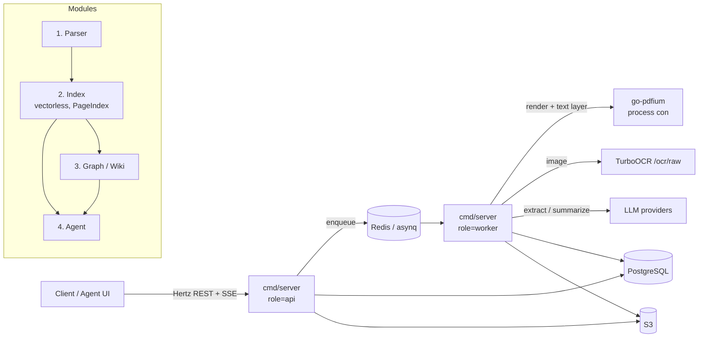
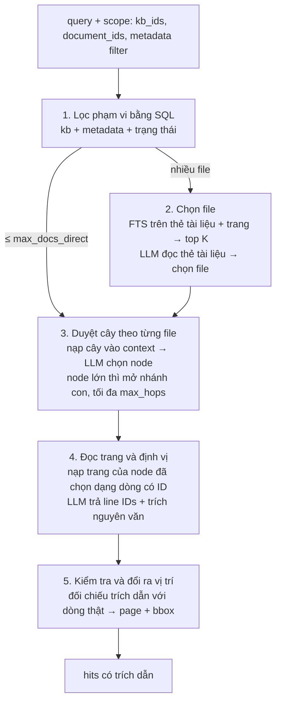

# BePaylot — Đặc tả kỹ thuật (Spec)

> Phiên bản: 0.4 · Ngày: 2026-09-25 · Trạng thái: đã triển khai P0–P3 (bản đầu), xem §15
>
> Phạm vi: nền tảng xử lý tài liệu, tìm kiếm và agent gồm bốn module:
> **Parser → Index (vectorless, kiểu PageIndex) → Graph/Wiki → Agent**.
>
> Thay đổi so với 0.3: thêm §0 (các yêu cầu gốc của người dùng), đồng bộ API §10 với code, trạng thái §13 và §15 (triển khai, khác biệt, việc chưa kiểm được).
>
> Thay đổi so với 0.1/0.2:
> - **Không dùng embedding** cho tài liệu. Search do LLM suy luận trên cây mục lục được nạp vào context (§6).
> - Render PDF bằng **thư viện Go (go-pdfium)**, có giới hạn RAM/CPU. **Text layer** (đặc biệt PDF/A) được dùng để sửa và bổ sung kết quả OCR (§5.7, §5.8).
> - File gốc và ảnh lưu trên **S3**, metadata lưu trên **Postgres** (§9.1).
> - Thêm **metadata tuỳ chọn theo file** (ví dụ `ma_ho_so`): gán khi upload, kể cả upload nhiều file một lần, và tìm kiếm/lọc được theo metadata (§6.2, §9, §10).

---

## 0. Yêu cầu gốc của người dùng

Các yêu cầu dưới đây là nguồn của spec, ghi theo thứ tự đưa ra. Mọi thay đổi spec về sau phải giữ đúng các yêu cầu này.

| # | Yêu cầu (tóm tắt nội dung người dùng đưa ra) | Đáp ứng tại |
|---|---|---|
| U1 | Cấu trúc dự án bố trí giống WeKnora | §3 |
| U2 | Xử lý job/task tương tự WeKnora, đặc biệt với file PDF nặng | §4 |
| U3 | Các module phân tách độc lập, dễ maintain | §3.3 (có test `internal/archtest`) |
| U4 | Dùng CloudWeGo Hertz để phát triển API | §1.1, §10 |
| U5 | Cơ sở dữ liệu dùng Postgres (pgvector) | §9 |
| U6 | **Module Parser:** engine mặc định built-in là TurboOCR, theo mẫu `spec/parser/ocr_curl.txt` và response `spec/parser/output_example.json`. Kết quả phải có đầy đủ nội dung trang, các line, thứ tự trang và nội dung markdown, sao cho tra ngược thông tin text về trang và vị trí được tường minh | §5 |
| U7 | **Module 2:** bộ chuyển đổi vectorless tạo nội dung cho hybrid search, lưu vào database, hỗ trợ tìm kiếm trên toàn bộ nội dung file theo trang | §6 |
| U8 | **Module 3:** chuyển nội dung đã parse thành graph kiểu wiki: xác định entity và quan hệ, cho phép cấu hình nhiều schema khác nhau, gọi LLM để trích xuất | §7 |
| U9 | **Module cuối:** agent, như source code đang có | §8 |
| U10 | Vectorless nghĩa là **không dùng embedding**. Search kiểu PageIndex: nạp context (cây mục lục) để LLM xác định nội dung nào cần tìm trong file | §6.1, §6.4, §6.5 |
| U11 | Mỗi file có **metadata đi kèm, không bắt buộc**, và search được theo metadata. Ví dụ upload nhiều file cùng gán một mã hồ sơ thì phải tìm được theo mã hồ sơ đó | §6.2, §10.2 |
| U12 | Render PDF sang ảnh bằng **thư viện Go**, nhanh, kiểm soát được RAM/CPU | §5.7 |
| U13 | Với PDF/A (và PDF có text), nếu lấy được nội dung text thì dùng để **bổ sung context** cho đúng | §5.8 |
| U14 | Ngôn ngữ lập trình là Go | toàn bộ |
| U15 | File lưu trên **S3 storage**, ảnh cũng vậy; metadata lưu **Postgres** | §9.1 |
| U16 | Spec đặt tại `spec/spec.md`, viết tiếng Việt | — |

---

## 1. Yêu cầu chung

| # | Yêu cầu | Cách đáp ứng trong spec này |
|---|---|---|
| R1 | Cấu trúc dự án bố trí giống WeKnora | Phân lớp `types` / `types/interfaces` / `application/service` / `application/repository` / `handler` / `router` / `container` như WeKnora (§3) |
| R2 | Xử lý job/task tương tự WeKnora, nhất là file PDF nặng | Hàng đợi `asynq` + Redis, nhiều worker pool cô lập, fan-out theo **từng trang**, retry theo trang, dead-letter, khôi phục khi restart (§4) |
| R3 | Module phân tách độc lập, dễ maintain | Mỗi module chỉ giao tiếp qua interface trong `types/interfaces` và qua task; có quy tắc import bắt buộc (§3.3) |
| R4 | API dùng CloudWeGo **Hertz** | Toàn bộ HTTP qua Hertz, SSE qua `hertz-contrib/sse` (giữ nguyên từ code hiện tại) |
| R5 | CSDL là **PostgreSQL + pgvector** | Một Postgres duy nhất cho dữ liệu, metadata (JSONB), full-text và graph (bảng quan hệ + recursive CTE) (§9). Luồng tài liệu **không dùng vector**; pgvector chỉ còn phục vụ phần tìm skill sẵn có của agent |
| R6 | Search không dùng embedding, kiểu PageIndex | LLM đọc cây mục lục (tiêu đề, khoảng trang, tóm tắt) trong context, chọn nhánh, rồi đọc trang và chỉ ra đúng dòng (§6) |
| R7 | Metadata tuỳ chọn theo file, tìm được theo metadata | `documents.metadata` JSONB + GIN, gán khi upload đơn lẻ hoặc theo lô, lọc bằng toán tử `eq/in/prefix/range` (§6.2) |
| R8 | Render PDF → ảnh bằng thư viện Go, nhanh, kiểm soát RAM/CPU; PDF/A có text thì dùng bổ sung | go-pdfium chạy multi-process, DPI thích ứng, tái chế process, timeout theo trang; text layer hợp nhất với OCR theo dòng (§5.7, §5.8) |
| R9 | Code bằng Go; file và ảnh lưu S3, metadata lưu Postgres | §9.1 |

### 1.1 Tech stack

| Thành phần | Lựa chọn | Ghi chú |
|---|---|---|
| Ngôn ngữ | Go 1.26 | giữ như `go.mod` hiện tại |
| HTTP | `cloudwego/hertz` | + `hertz-contrib/sse`, `hertz-contrib/swagger` |
| LLM / Agent | `cloudwego/eino` (+ eino-ext) | giữ nguyên module agent hiện có |
| DB | PostgreSQL 16 + `pg_trgm`, `unaccent`, `pgcrypto`, `citext` (+ `pgvector` cho skill của agent) | driver `jackc/pgx/v5`, migration `pressly/goose` (giữ như hiện tại) |
| Task queue | `hibiken/asynq` + Redis 7 | giống WeKnora |
| Object storage | **S3** (AWS S3 / MinIO / Ceph), `aws-sdk-go-v2` | file gốc, ảnh trang, JSON thô từ OCR/text layer, ảnh crop, markdown toàn văn (§9.1) |
| Render PDF | `klippa-app/go-pdfium` (PDFium), chế độ multi-process | render + encode JPEG trong process con, giới hạn CPU/RAM, lấy text layer có toạ độ (§5.7) |
| Ảnh | Go stdlib `image/*`, `golang.org/x/image` (tiff, draw) | file ảnh upload trực tiếp |
| OCR mặc định | TurboOCR (`POST /ocr/raw`) | engine built-in, cắm thêm engine khác qua interface |

---

## 2. Kiến trúc tổng thể



- **Một binary, nhiều vai trò**: `cmd/server --role=api|worker|all` (mặc định `all` cho dev). Production chạy API và worker thành deployment riêng để scale worker theo tải OCR.
- **Luồng dữ liệu**: file + metadata → trang → block/line (Parser) → cây mục lục có tóm tắt + section + chỉ mục full-text (Index) → entity/relation + trang wiki (Graph) → tool cho Agent.
- **Mọi thứ đều truy vết được về nguồn**: section, kết quả search, entity, câu trả lời của agent đều mang `source_spans` trỏ về `(document_id, page_no, line_no, bbox)`.

---

## 3. Cấu trúc dự án

### 3.1 Cây thư mục

Phân lớp theo WeKnora. Mỗi module nghiệp vụ là **một package con** trong `service/` và `repository/`, thay vì để phẳng như WeKnora.

```
cmd/
  server/              main: --role=api|worker|all, -migrate-only
  pdfium-worker/       process con của go-pdfium (multi_threaded), do pool render sinh ra
  seed/                tạo user + API key (giữ nguyên)
  skills-sync/         đồng bộ skills (giữ nguyên)
configs/
  config.yaml
  mcp.yaml
  graph_schemas/       schema graph mẫu (YAML), nạp vào DB khi khởi động
migrations/
  postgres/            goose SQL migrations (chuyển từ internal/store/migrations)
internal/
  config/              nạp YAML + ${ENV}
  container/           wiring phụ thuộc, khởi tạo worker pool, khôi phục task khi restart
  router/
    router.go          đăng ký route Hertz theo nhóm
    routes_document.go
    routes_search.go
    routes_graph.go
    routes_agent.go    (routes hiện có: /v1/messages, /v1/ag-ui, sessions, skills, mcp)
    task.go            đăng ký asynq handler + khởi tạo các server theo pool
  handler/             HTTP handler mỏng: bind → gọi service → trả DTO
    dto/
  middleware/          auth, request-id, recover, CORS; asynq: dead-letter, tracing, background ctx
  types/               entity, enum, payload task, cấu hình queue
    interfaces/        interface của service & repository (hợp đồng giữa các module)
  application/
    service/
      document/        Module 1: điều phối parse (split → page → assemble)
      index/           Module 2: section, cây vectorless + tóm tắt, FTS, metadata, search suy luận bằng LLM
      graph/           Module 3: schema, trích xuất, gộp entity, truy vấn graph
      wiki/            Module 3: sinh / cập nhật trang wiki
      agent/           Module 4: session, message, run (bọc internal/agent)
    repository/
      postgres/        repository thuần SQL (pgx)
      retriever/
        postgres/      lọc metadata + truy vấn FTS/trigram
  parser/              engine parse (không phụ thuộc DB)
    engine.go          interface Engine + registry
    turboocr/          client TurboOCR + ánh xạ response
    pdf/               go-pdfium: probe, render batch, text layer, bookmark
    textlayer/         kiểm tra chất lượng + hợp nhất text layer với OCR (§5.8)
    assemble/          layout + lines → page model → markdown
  storage/             ObjectStore trên S3 (aws-sdk-go-v2): upload/download stream, presign
  queue/               asynq client, topology queue/pool, helper enqueue
  agent/ llm/ tools/ skills/ mcp/ retrieval/    (giữ nguyên code hiện có)
  logging/
deploy/
  docker-compose.yml   postgres(pgvector, dùng cho skill) + redis + minio (S3) + turboocr(optional)
  Dockerfile           kèm libpdfium (version cố định) + binary pdfium-worker
docs/                  swagger (swaggo)
skills/
spec/                  tài liệu mẫu (parser/ocr_curl.txt, output_example.json)
```

### 3.2 Ánh xạ từ code hiện tại

| Hiện tại | Chuyển sang | Ghi chú |
|---|---|---|
| `internal/domain` | `internal/types` | entity dùng chung |
| `internal/store/*.go` | `internal/application/repository/postgres` | giữ pgx, không chuyển sang GORM |
| `internal/store/migrations` | `migrations/postgres` | giữ số thứ tự; migration mới bắt đầu từ `0006` |
| `internal/api` | `internal/handler` (+ `handler/dto`) | route giữ nguyên đường dẫn |
| `internal/server` | `internal/router` + `internal/middleware` | Hertz engine, SSE writer |
| `cmd/server/wire.go` | `internal/container` | wiring tay, không dùng `dig` |

Việc chuyển code là refactor thuần: **không đổi hành vi, không đổi API** của phần agent. Nên làm trong một PR riêng trước khi thêm module mới.

### 3.3 Quy tắc độc lập module (bắt buộc, có kiểm tra CI)

1. `service/<A>` **không import** `service/<B>`. Nếu cần gọi chéo thì phụ thuộc vào `types/interfaces.<B>Service`, được inject tại `container`.
2. `handler` chỉ phụ thuộc `types/interfaces`, không phụ thuộc repository.
3. `parser/*` là thư viện thuần: không biết DB, queue hay HTTP, nên test được bằng file mẫu.
4. Module sau **chỉ đọc** dữ liệu của module trước qua interface đọc (`DocumentReader`, `SectionReader`), không ghi chéo bảng.
5. Chuyển giai đoạn luôn đi qua **task** (không gọi đồng bộ), để mỗi giai đoạn retry và scale độc lập.
6. CI chạy một test kiểm tra import graph (`go list -deps`) để chặn vi phạm quy tắc 1–3.

---

## 4. Hệ thống Job / Task (theo mô hình WeKnora)

### 4.1 Worker pool và queue

Mỗi pool là một `asynq.Server` riêng, nên concurrency được cô lập cứng: import hàng loạt không làm nghẽn các việc khác. Topology khai báo **một chỗ duy nhất** (`types/task.go`: `QueueDefinition{Name, Pool, Weight, TaskTypes}`) và được dùng cho cả khởi tạo server lẫn trang admin.

| Pool | Queue (weight) | Task type | Concurrency mặc định | Lý do |
|---|---|---|---|---|
| `core` | `default`(1), `interactive`(3) | `document:split`, `document:assemble` | 4 | việc nhẹ, cần độ trễ thấp |
| `render` | `render`(1), `render_interactive`(3) | `page:render` | `render.workers` (mặc định `min(NumCPU-1,4)`) | nặng CPU; số task song song = số process PDFium (§5.7) |
| `ocr` | `page`(1), `page_interactive`(3) | `page:ocr` | 8 (= năng lực TurboOCR) | nặng I/O, **nút thắt chính**; tách riêng để bảo vệ OCR |
| `index` | `index`(1), `index_interactive`(3) | `index:build`, `index:tree` | 6 | tách section, full-text, dựng cây + tóm tắt node (gọi LLM). Là điều kiện để search được nên tách khỏi enrichment |
| `enrichment` | `graph`(1) | `graph:extract` | 8 | các lần gọi LLM, không ai chờ trực tiếp |
| `wiki` | `wiki`(1) | `graph:resolve`, `wiki:ingest`, `wiki:finalize` | 4 | cần khoá theo knowledge base |
| `maintenance` | `low`(1) | `document:delete`, `kb:delete`, `document:reparse`, `housekeeping:sweep` | 2 | việc dài, chạy nền |

- Queue `*_interactive` dành cho file đính kèm trong chat (người dùng đang chờ). Queue này có weight cao hơn để không bị kẹt sau import hàng loạt, giống `QueueChatAttachment` của WeKnora.
- Concurrency cấu hình qua `config.yaml` hoặc env `BEPAYLOT_ASYNQ_<POOL>_CONCURRENCY`.
- Mọi handler được bọc middleware: `backgroundCtx` → `tracing` → `deadLetter` → `cancelGuard` (bỏ qua nếu document đã `cancelled`/`deleting`).

### 4.2 Pipeline xử lý một tài liệu

```mermaid
sequenceDiagram
  participant API
  participant Q as asynq
  participant S as document:split
  participant RD as page:render (batch)
  participant P as page:ocr (xN)
  participant A as document:assemble
  participant I as index:*
  participant G as graph:* / wiki:*

  API->>API: stream upload → S3 (+ sha256, quét PDF/A), validate metadata, tạo documents(status=queued, metadata)
  API->>Q: document:split (TaskID=split:{doc})
  Q->>S: tải PDF về cache → pdfium Probe: page_count, kích thước, Info, bookmark → tạo N document_pages(pending)
  S->>Q: Advance(doc): enqueue các page:render batch đầu tiên
  Q->>RD: mở PDF 1 lần → mỗi trang: render JPEG + text layer → S3 → page rendered
  RD->>Q: enqueue page:ocr cho từng trang đã render; Advance(doc)
  Q->>P: stream ảnh S3 → TurboOCR → hợp nhất text layer → assemble trang → lưu page/blocks/lines
  P->>Q: Advance(doc): bù cửa sổ render/ocr
  P->>P: UPDATE documents SET pages_done=pages_done+1 RETURNING
  P->>Q: nếu done+failed = page_count → document:assemble (TaskID=assemble:{doc}:{gen})
  Q->>A: ghép markdown toàn văn + offset, status=indexing
  A->>Q: index:build
  Q->>I: section + FTS → index:tree (dựng cây, tóm tắt node bằng LLM)
  I->>Q: graph:extract (nếu KB bật graph)
  Q->>G: extract theo lô section → graph:resolve → wiki:ingest (debounce) → wiki:finalize
```

### 4.3 Xử lý file PDF nặng (vài trăm đến vài nghìn trang)

| Vấn đề | Cách xử lý |
|---|---|
| Upload file lớn | Stream thẳng từ multipart vào S3 (multipart upload, RAM ≤ 64 MB), không buffer toàn file. Giới hạn `upload.max_bytes` (mặc định 500 MB). Tính sha256 trong khi stream để dedup trong cùng KB. |
| Render tốn RAM/CPU | go-pdfium chạy multi-process: số process = giới hạn CPU; bitmap nằm trong process con, chặn bởi `MaxPixels`; process được tái chế theo số trang và RSS; timeout mỗi trang thì kill process. Một batch mở PDF một lần. PDF gốc được cache trên đĩa local (LRU có giới hạn dung lượng). Chi tiết ở §5.7 |
| Tách render (CPU) khỏi OCR (I/O) | Hai pool riêng. Ảnh render xong nằm trên S3 nên OCR chạy song song với render các trang sau; lỗi OCR không bắt render lại |
| Một file chiếm hết render/OCR | **`Advance(doc)`**: hàm idempotent, khoá dòng `documents` (`FOR UPDATE`), đếm trang theo trạng thái rồi bù cửa sổ: ≤ `render_inflight_batches` batch render (mặc định 1) **và** ≤ `render_ahead_pages` trang đã render mà chưa OCR (mặc định 32, tạo backpressure); ≤ `ocr_inflight_pages` trang đang OCR (mặc định 8). Hàm được gọi sau mỗi task render/ocr và bởi `housekeeping:sweep`. Nhờ vậy nhiều file lớn chạy xen kẽ công bằng |
| Lỗi một trang làm hỏng cả file | Retry **theo trang** (`MaxRetry=3`, backoff mũ, `Timeout=3m`/trang). Batch render lỗi thì các trang đã xong được giữ, chỉ retry phần còn lại. Trang OCR hết lượt retry mà có text layer đạt chất lượng thì dựng từ text layer (§5.8). Nếu không, trang được đánh dấu `failed` và ghi dead-letter; document vẫn assemble với trạng thái cuối `partial` kèm danh sách trang lỗi. Có thể reparse riêng trang đó. |
| Trùng lặp / chạy hai lần | Task ID xác định: `render:{doc}:{first_page}:{gen}`, `ocr:{doc}:{n}:{gen}`. Kết quả ghi bằng `UPSERT` theo `(document_id, page_no)`. `gen` tăng mỗi lần reparse để task cũ tự bỏ qua. |
| Đếm hoàn thành đúng khi chạy song song | `UPDATE documents SET pages_done = pages_done + 1 ... RETURNING pages_done, pages_failed, page_count`. Chỉ task nhìn thấy tổng = `page_count` mới enqueue `assemble`; task này còn có `TaskID` duy nhất để chống trùng. |
| OCR service quá tải hoặc sập | Concurrency của pool `ocr` = năng lực OCR. Client có circuit breaker: lỗi 5xx hoặc timeout liên tiếp thì mở mạch 30 giây, task trả lỗi retry thay vì dồn request. |
| Restart giữa chừng | Asynq giữ task trong Redis. `housekeeping:sweep` (chạy mỗi 5 phút) tìm trang `processing` quá `2 × timeout` mà không có task sống trong asynq, rồi đưa về `pending` và enqueue lại. Trang đã `rendered` không render lại, trang đã `done` **không bao giờ OCR lại**. |
| Theo dõi tiến độ | `documents.progress` (pages_done/page_count) và bảng `processing_spans` (giống `knowledge_processing_spans` của WeKnora). SSE `GET /v1/documents/:id/events` đẩy sự kiện thay đổi trạng thái. |
| Huỷ | `POST /cancel` đặt `status=cancelled`. Middleware `cancelGuard` bỏ qua các task còn lại; các trang đã xong vẫn được giữ. |
| Trang trắng / trang ảnh nhỏ | Trang có kết quả OCR rỗng được lưu `is_blank=true`, không tạo section. |

### 4.4 Tham số task mặc định

| Task | Queue | MaxRetry | Timeout | TaskID (dedup) |
|---|---|---|---|---|
| `document:split` | default / interactive | 3 | 5m | `split:{doc}:{gen}` |
| `page:render` | render / render_interactive | 3 | 10m (batch) | `render:{doc}:{first_page}:{gen}` |
| `page:ocr` | page / page_interactive | 3 | 3m | `ocr:{doc}:{n}:{gen}` |
| `document:assemble` | default | 3 | 10m | `assemble:{doc}:{gen}` |
| `index:build` | index | 3 | 30m | `index:{doc}:{gen}` |
| `index:tree` | index | 5 | 30m | `tree:{doc}:{gen}` |
| `graph:extract` | graph | 3 | 10m | `gx:{doc}:{gen}:{batch}` |
| `graph:resolve` / `wiki:ingest` | wiki | 10 | 60m | debounce theo KB (xem §7.5) |
| `document:delete` | low | 3 | 1h | `del:{doc}` |

### 4.5 Dead-letter và pending ops (theo WeKnora)

- **`task_dead_letters`**: middleware asynq ghi một dòng khi task hết retry. Dòng gồm `task_type`, `scope`, `scope_id`, `related_id` (ví dụ `page_no`), `payload`, `last_error` và `fail_count`. Admin xem và retry qua API (§10.6).
- **`task_pending_ops`**: hàng đợi bền trong DB cho việc cần gom lô hoặc debounce (wiki ingest theo KB). Dữ liệu sống qua restart và không bị TTL của Redis xoá.

### 4.6 Trạng thái document

```
queued → splitting → parsing → assembling → indexing → enriching → completed
                                   │                                  ↑
                                   └──(có trang failed)──────────→ partial
bất kỳ ─→ failed | cancelled | deleting
```

- `enriching` chỉ có khi KB bật graph. Search đã dùng được từ khi index xong: document ở `enriching` vẫn tìm kiếm được.
- Lọc theo metadata và tìm full-text theo trang dùng được **ngay khi parse xong** (trước khi có cây). Search kiểu cây cần `index:tree` hoàn tất.
- Mỗi giai đoạn con có trạng thái riêng: `parse_status`, `index_status`, `graph_status`. UI và agent nhờ đó biết chính xác phần nào đã sẵn sàng.

---

## 5. Module 1 — Parser

### 5.1 Mục tiêu

Chuyển file (PDF, ảnh; giai đoạn 2 thêm DOCX/XLSX qua convert sang PDF) thành **mô hình trang có cấu trúc**:

- đầy đủ nội dung từng trang, giữ **thứ tự trang** và **thứ tự đọc** trong trang;
- đến cấp **line**: text, độ tin cậy, bounding box;
- nhóm theo **block** (layout region): tiêu đề, đoạn văn, bảng, ảnh, công thức, header;
- **markdown** theo trang và markdown toàn văn, mỗi line có **offset ký tự** trong cả hai;
- từ một đoạn text bất kỳ tra ngược ra được `trang → block → line → bbox`, và ngược lại.

### 5.2 Engine TurboOCR (mặc định, built-in)

Request (tham chiếu `spec/parser/ocr_curl.txt`):

```
POST {turboocr.base_url}/ocr/raw?layout=1&reading_order=1&tables=1&formulas=1
Content-Type: application/octet-stream
Body: <bytes ảnh trang, JPEG>
```

Response (tham chiếu `spec/parser/output_example.json`):

| Trường | Kiểu | Ý nghĩa | Cách dùng |
|---|---|---|---|
| `results[]` | `{id, text, confidence, bounding_box[4][2], layout_id}` | từng **line** OCR, bbox là tứ giác pixel (TL, TR, BR, BL) | → `page_lines` |
| `layout[]` | `{id, class, class_id, confidence, bounding_box[4][2]}` | vùng layout | → `page_blocks` |
| `reading_order[]` | `int[]` (id của `results`) | thứ tự đọc các line | → `line_no` |
| `tables[]` | `{layout_id, html, confidence, bounding_box}` | bảng dạng HTML, gắn với block `table` | → `page_blocks.html` + markdown bảng |
| `formulas[]` (khi bật) | `{layout_id, latex, ...}` | công thức | → `page_blocks.latex` |

Nhận xét từ file mẫu, bắt buộc xử lý:

1. **Block không có line**: 5/35 layout (ví dụ `header` 15, `image` 34) không có line nào. Vẫn lưu block, đặt `text=''`; với `image` thì lưu ảnh crop.
2. **Line nằm trong block `image`**: text trên con dấu ("PHÒNG / KINH T / NHA BỊCH") được gắn cho block `image`. Giữ line và đánh dấu `in_figure=true`. Mặc định line này không đưa vào section dùng cho graph nhưng vẫn tìm kiếm được.
3. **`reading_order` có thể sai hình học**: line 17 "3. Ngành, nghề kinh doanh:" nằm **phía trên** bảng nhưng lại đứng sau mọi line của bảng. Assembler áp dụng bước sửa thứ tự: nếu block X nằm hoàn toàn phía trên block Y và hai block giao nhau theo trục ngang ≥ 30%, thì X phải đứng trước Y (bật/tắt bằng `parser.reading_order_fix`).
4. **Line OCR chất lượng thấp** (con dấu ngân hàng: "Ngày surta thhnng am ng Băm"): line có `confidence < parser.low_conf_threshold` (mặc định 0.6) được đánh dấu `low_confidence=true`. Không loại bỏ, nhưng index và graph giảm trọng số hoặc bỏ qua.
5. **`class_id` phụ thuộc model OCR**. Hệ thống **chỉ dựa vào `class` (tên)** và ánh xạ sang `BlockType` chuẩn qua bảng cấu hình, không hard-code id.
6. **Block `header`** trong mẫu chứa quốc hiệu và cơ quan ban hành, tức là **nội dung có giá trị**. Chỉ coi là "page furniture" (loại khỏi body) khi cùng text lặp lại ở ≥ 50% số trang (running header/footer), giống cơ chế lọc lặp lại theo trang của WeKnora.

### 5.3 BlockType chuẩn

| `class` của OCR | `BlockType` | Markdown |
|---|---|---|
| `doc_title` | `title` | `# …` |
| `paragraph_title` | `heading` | `## …` (cấp heading có thể suy từ cỡ bbox hoặc đánh số "1.", "I.") |
| `text`, `abstract`, `content`, `reference`, `aside_text` | `paragraph` | nối các line thành đoạn; line kết thúc bằng gạch nối thì ghép liền |
| `table` | `table` | HTML → GFM table nếu không có `rowspan`/`colspan`, ngược lại giữ HTML đã làm sạch |
| `formula`, `formula_number` | `formula` | `$$ latex $$` |
| `image`, `chart`, `seal`, `header_image`, `footer_image` | `figure` | `` + text trong hình (nếu có) dạng `> ` |
| `figure_title`, `table_title`, `chart_title` | `caption` | `*…*` |
| `header`, `footer`, `number`, `footnote` | `header` / `footer` / `page_number` / `footnote` | theo quy tắc lặp lại ở mục 5.2 (6) |
| (khác) | `unknown` | như `paragraph` |

### 5.4 Mô hình dữ liệu parse (Go)

```go
// internal/types/parse.go
type BBox struct { X0, Y0, X1, Y1 float64 }          // pixel trên ảnh trang
type Quad [4][2]float64                                // tứ giác gốc từ OCR

type ParsedPage struct {
    PageNo      int           // 1-based
    Width       int           // px ảnh đã render
    Height      int
    DPI         int           // để quy đổi về point PDF: pt = px * 72 / DPI
    Rotation    int
    Engine      string        // "turboocr"
    TextSource  string        // ocr | merged | layer_only (§5.8)
    TextQuality float64       // chất lượng text layer, 0 nếu không có
    IsBlank     bool
    Blocks      []ParsedBlock // đã sắp theo thứ tự đọc
    Lines       []ParsedLine  // đã sắp theo thứ tự đọc
    Markdown    string        // markdown của riêng trang
    RawRef      string        // object key của JSON gốc từ OCR (để debug/reparse)
}

type ParsedBlock struct {
    BlockNo    int       // thứ tự đọc trong trang (0-based)
    SourceID   int       // layout.id gốc
    Type       BlockType
    RawClass   string
    Confidence float64
    BBox       BBox
    Text       string    // các line ghép lại
    HTML       string    // bảng
    LaTeX      string    // công thức
    AssetKey   string    // ảnh crop (figure)
    IsFurniture bool
    MdStart, MdEnd int   // offset (rune) trong ParsedPage.Markdown
}

type ParsedLine struct {
    LineNo     int       // thứ tự đọc trong trang (0-based)
    SourceID   int       // results.id gốc
    BlockNo    int       // -1 nếu không thuộc block nào
    Text       string
    Confidence float64
    Quad       Quad
    BBox       BBox
    InFigure, LowConfidence bool
    TextSource string    // ocr | layer | layer_only
    TextOCR    string    // text gốc từ OCR (khi đã thay bằng text layer)
    TextLayer  string    // text layer tương ứng (khi không dùng để thay)
    MdStart, MdEnd int   // offset trong markdown trang; -1 nếu không xuất hiện (vd line trong bảng)
}
```

- **Offset tính theo rune (ký tự Unicode)**, không theo byte, vì tiếng Việt có dấu.
- Line thuộc bảng không có offset riêng trong markdown (bảng render từ HTML). Line vẫn được lưu với `BlockNo` của bảng, nên tra vị trí theo bảng hoặc theo text của line.
- **Markdown toàn văn** = nối markdown các trang, mỗi trang bắt đầu bằng marker `<!-- page:{n} -->`. Bảng `document_pages.doc_md_offset` lưu offset đầu trang trong toàn văn, nên `doc_offset = doc_md_offset[page] + page_offset`.

Ví dụ markdown trang từ file mẫu (sau khi sửa thứ tự đọc):

```markdown
<!-- page:1 -->
UBND XÃ NHA BÍCH
PHÒNG KINH TẾ

CỘNG HÒA XÃ HỘI CHỦ NGHĨA VIỆT NAM
Độc lập - Tự do - Hạnh phúc

# GIẤY CHỨNG NHẬN ĐĂNG KÝ HỘ KINH DOANH

Mã số hộ kinh doanh: 070082001498
...
3. Ngành, nghề kinh doanh:

| STT | Tên ngành | Mã ngành |
|---|---|---|
| 1 | Gia công cơ khí; xử lý và tráng phủ kim loại Chi tiết: Gia công tôn) | 2592 |
| 2 | Bán buôn vật liệu, thiết bị lắp đặt khác trong xây dựng (Chi tiết: …) | 4673 (Chính) |

4. Vốn kinh doanh:
...
```

### 5.5 Interface engine (cắm được engine khác)

```go
// internal/parser/engine.go
type PageImage struct {
    DocumentID string
    PageNo     int
    Image      []byte // JPEG
    Width, Height, DPI int
}

type Engine interface {
    Name() string
    // ParsePage nhận ảnh một trang, trả về dữ liệu thô đã chuẩn hoá (chưa ghép markdown).
    ParsePage(ctx context.Context, in PageImage, opt PageOptions) (*RawPage, error)
    Health(ctx context.Context) error
}

type PageOptions struct { Layout, ReadingOrder, Tables, Formulas bool }

// Registry: chọn engine theo KB config hoặc theo request reparse.
type Registry interface {
    Get(name string) (Engine, bool)
    Default() Engine
    List() []EngineInfo
}
```

- `parser/turboocr`: client HTTP (timeout, retry cho lỗi mạng, circuit breaker) cộng với ánh xạ response → `RawPage`.
- `parser/assemble`: nhận `RawPage` và trả `ParsedPage` (sắp thứ tự, gán line vào block, dựng markdown, tính offset, lọc furniture). Hàm thuần: có golden test với `spec/parser/output_example.json`.
- `parser/pdf`: go-pdfium, `Probe` + `RenderBatch` (§5.7).
- `parser/textlayer`: kiểm tra chất lượng + hợp nhất với OCR (§5.8). Hàm thuần, có golden test.
- Chế độ PDF: `parser.pdf_mode = ocr_all` (mặc định, mọi trang qua OCR nên dữ liệu line/bbox đồng nhất) hoặc `auto` (P4: trang có text layer đạt chất lượng thì bỏ qua OCR, §5.8 bước 7). Ở `ocr_all`, text layer vẫn được dùng để sửa và bổ sung OCR.

### 5.6 Tra cứu vị trí (locate)

| Truy vấn | Kết quả |
|---|---|
| `(doc, page, line_no)` | text + quad + bbox (px và pt) + block |
| `(doc, doc_md_start, doc_md_end)` | danh sách `(page, line_no, bbox)` giao với đoạn |
| `(doc, text, page?)` | tìm chuỗi (chuẩn hoá khoảng trắng, không phân biệt dấu nếu `fuzzy=true`, dùng `pg_trgm`) và trả các vị trí khớp |
| `citation_id` / `section_id` / `entity mention` | `source_spans[]` → danh sách vị trí |

Kết quả `locate` đủ để UI tô sáng vùng trên ảnh trang: `GET /v1/documents/:id/pages/:n/image` cộng với bbox.

### 5.7 Render PDF bằng Go (pdfium) — nhanh và kiểm soát được RAM/CPU

**Chọn thư viện**

| Lựa chọn | Kết luận |
|---|---|
| **`github.com/klippa-app/go-pdfium`** (binding Go cho PDFium) | **Chọn.** PDFium là engine của Chrome: render nhanh, ổn định với PDF lỗi. Giấy phép BSD/Apache, dùng thương mại được. Một thư viện lo cả render, text layer có toạ độ, metadata Info và bookmark |
| `gen2brain/go-fitz` (MuPDF) | Loại: MuPDF là **AGPL**, cần license thương mại |
| `pdfcpu` (thuần Go) | Không render được. Chỉ dùng làm phương án dự phòng để đọc XMP/metadata khi cần |
| Gọi `pdftoppm` (poppler) qua subprocess | Loại: yêu cầu là dùng thư viện Go, và subprocess mỗi trang tốn chi phí khởi động |

**Chế độ chạy go-pdfium**

| Chế độ | Khi nào dùng | Cách kiểm soát tài nguyên |
|---|---|---|
| `multi_threaded` (**production**) | worker mặc định | Mỗi instance là **một process con** (`cmd/pdfium-worker`) chạy PDFium đơn luồng. Số process = số trang render song song = số core dùng cho render. Một PDF làm treo hoặc crash chỉ giết process con đó; pool tự sinh lại |
| `webassembly` (dev/CI) | máy dev, CI không có `libpdfium` | Thuần Go (wazero), không cần cgo. Chậm hơn nên không dùng cho production |
| `single_threaded` | không dùng | PDFium không thread-safe; chế độ này buộc tuần tự hoá toàn process |

Binary PDFium lấy từ bản build dựng sẵn (ví dụ `bblanchon/pdfium-binaries`), cố định version trong `Dockerfile`, build với `CGO_ENABLED=1` và tag `pdfium_experimental` nếu cần API thử nghiệm.

**Package `internal/parser/pdf`**

```go
type Renderer interface {
    // Probe: số trang, kích thước từng trang (pt), Info dict, bookmark, dấu hiệu PDF/A.
    Probe(ctx context.Context, path string) (*DocInfo, error)
    // RenderBatch mở document MỘT lần rồi xử lý một dải trang liên tiếp.
    // Mỗi trang gọi emit ngay khi xong, để upload S3 song song với việc render trang tiếp theo.
    RenderBatch(ctx context.Context, path string, pages []int, opt RenderOptions,
        emit func(PageRender) error) error
}

type RenderOptions struct {
    DPI          int  // mặc định 300
    MaxLongSide  int  // px, mặc định 4000: chặn trang khổ lớn (A0, bản vẽ)
    MaxPixels    int  // mặc định 16_000_000 (RGBA ≈ 64 MB)
    JPEGQuality  int  // mặc định 85
    ExtractText  bool // lấy text layer kèm toạ độ pixel (§5.8)
}

type PageRender struct {
    PageNo        int
    JPEG          []byte   // đã encode trong process con
    Width, Height int      // px
    DPI           float64  // DPI thực tế sau khi áp MaxLongSide/MaxPixels
    WidthPt, HeightPt float64
    Rotation      int
    Text          *TextLayer // nil nếu không có text layer
    RenderMs, TextMs int
}
```

Cách gọi PDFium (tên API theo go-pdfium hiện hành, cần xác nhận khi code):
- `OpenDocument{FilePath}`: mở từ **file trên đĩa**. PDFium đọc lazy theo xref, không nạp cả file vào RAM.
- `RenderToFile{RenderPageInDPI | RenderPageInPixels, OutputFormat: JPG, OutputQuality, OutputTarget: Bytes}`: render **và encode JPEG ngay trong process con**. Chỉ khoảng 0,5–2 MB JPEG đi qua RPC về process chính, bitmap RGBA lớn không bao giờ rời process con.
- `GetPageTextStructured{Mode: Rects, PixelPositions: {Calculate, Width, Height}}`: text layer có toạ độ **pixel khớp đúng ảnh vừa render**, nên không phải tự quy đổi toạ độ hay xử lý xoay trang.
- `FPDF_GetMetaText` (Title, Author, Subject, Keywords, Creator, Producer, CreationDate), `GetBookmarks` (mục lục/outline).

**DPI thích ứng**

DPI thực tế = `min(DPI, MaxLongSide / cạnh_dài_inch, sqrt(MaxPixels / diện_tích_inch²))`. Trang A4 ở 300 DPI (2480×3508 ≈ 8,7 MP) giữ nguyên. Trang A0 tự hạ DPI, nên không bao giờ sinh bitmap hàng GB. DPI thực tế được lưu vào `document_pages.dpi` để quy đổi toạ độ về sau.

**Kiểm soát RAM/CPU**

| Cơ chế | Chi tiết |
|---|---|
| Giới hạn CPU | `render.workers` process con (mặc định `min(NumCPU-1, 4)`); mỗi process PDFium đơn luồng, nên CPU tối đa ≈ `render.workers` core. Pool asynq `render` có concurrency đúng bằng số này |
| Giới hạn RAM mỗi trang | `MaxPixels` chặn kích thước bitmap; bitmap sống trong process con và được giải phóng ngay sau khi encode (`Cleanup()`) |
| Tái chế process | Process con bị kill và sinh lại sau `render.recycle_after_pages` trang (mặc định 500), hoặc khi RSS > `render.max_worker_rss_mb` (mặc định 1024, đọc `/proc/<pid>/status`). Cách này chặn rò rỉ bộ nhớ tích luỹ của PDFium |
| Timeout mỗi trang | `render.page_timeout` (mặc định 30s). Quá hạn thì kill process con; trang đó được retry, sau đó đánh dấu `failed` (PDF độc hại hoặc lỗi) |
| Mở document một lần mỗi batch | `page:render` xử lý `render.batch_pages` trang liên tiếp (mặc định 8) trên một lần `OpenDocument`, rồi `FPDF_CloseDocument` |
| Pipeline trong batch | Render trang *n+1* chạy song song với upload S3 trang *n* (kênh có buffer 2) nên RAM phía Go ≤ ~3 JPEG mỗi worker |
| File nguồn trên đĩa local | Worker tải PDF gốc từ S3 về `render.cache_dir` (tải song song theo range). Cache LRU giới hạn `render.cache_max_bytes` (mặc định 20 GB); file đang dùng được pin, không bị xoá |
| Giới hạn container | Deployment worker đặt `resources.limits` (cgroup), với `GOMEMLIMIT` ≈ 70% limit cho process Go chính |

**File ảnh (không phải PDF)**: JPEG/PNG/TIFF được decode bằng thư viện chuẩn Go và `golang.org/x/image/tiff`, xoay theo EXIF orientation, thu nhỏ bằng `golang.org/x/image/draw` nếu vượt `MaxPixels`, rồi coi như PDF một trang. TIFF nhiều trang để P4, vì `x/image/tiff` chỉ đọc trang đầu.

**Mục tiêu hiệu năng** (đo bằng benchmark `make bench-render` trên máy tham chiếu 4 vCPU, là cổng nghiệm thu của P1):
- A4 ở 300 DPI, render + encode JPEG: ≤ 300 ms/trang/worker (p95).
- Throughput với 4 worker: ≥ 12 trang/giây.
- RSS process chính ≤ 300 MB; mỗi process con ≤ `max_worker_rss_mb`.

### 5.8 Text layer và PDF/A — bổ sung cho OCR

**Mục đích.** Với PDF có text layer (đặc biệt PDF/A), text layer cho **đúng từng ký tự**: dấu tiếng Việt, chữ số, mã số, số tiền. OCR thì có thể sai ở đúng những chỗ này (ví dụ "BỊCH" thay cho "BÍCH"). Hệ thống vẫn dùng OCR để lấy layout, block, thứ tự đọc và bảng; text layer được dùng để **sửa và bổ sung nội dung**, và để làm giàu context cho LLM.

**Nhận diện PDF/A**
- Quét luồng byte **ngay khi upload** (cùng lúc tính sha256, không đọc file thêm lần nào) để tìm `pdfaid:part` và `pdfaid:conformance` trong XMP. PDF/A yêu cầu metadata stream không nén, nên quét byte là đủ. Dự phòng: đọc bằng `pdfcpu` khi quét không kết luận được.
- Lưu `documents.pdfa_part` (1–4) và `documents.pdfa_conformance` (`a`/`b`/`u`/`e`/`f`).
  - `a` và `u` bảo đảm ánh xạ Unicode, nên text layer **được tin cậy cao**.
  - `b` chỉ bảo đảm hiển thị: vẫn lấy text layer nhưng phải qua kiểm tra chất lượng như PDF thường.

**Áp dụng cho PDF nào**: cấu hình `parser.text_layer.enabled = all | pdfa_only | off` (mặc định `all`). PDF sinh từ Word/Excel cũng có text layer tốt; PDF/A chỉ làm tăng mức tin cậy.

**Kiểm tra chất lượng text layer theo trang** (`text_quality` ∈ [0,1]):
- đủ ký tự (≥ `min_chars`, mặc định 20);
- tỉ lệ ký tự lỗi (U+FFFD, Private Use Area, ký tự điều khiển) < 2%;
- tỉ lệ chữ tiếng Việt hoặc Latin hợp lệ trên tổng chữ cái;
- **độ khớp với OCR**: độ tương đồng Levenshtein chuẩn hoá giữa text layer và text OCR, sau khi bỏ dấu.

Kiểm tra này chặn trường hợp "text layer rác": font không có ToUnicode, hoặc lớp OCR ẩn chất lượng kém do phần mềm scan tạo ra.

**Thuật toán hợp nhất theo dòng** (chạy trong `page:ocr`, sau khi có kết quả OCR):

1. Text layer (các rect có toạ độ pixel) được gom thành từ.
2. Với mỗi line OCR: lấy các từ của text layer có tâm nằm trong bbox của line (nới rộng 15% chiều cao dòng) và chưa được gán cho line nào, sắp theo x, rồi ghép lại.
3. `sim = similarity(unaccent(ocr), unaccent(layer))`:
   - nếu `sim ≥ merge_min_similarity` (mặc định 0.6) và trang đạt chất lượng: `text = text layer`, `text_source = layer`, giữ `text_ocr` để đối chiếu;
   - nếu không: giữ OCR và lưu text layer vào `text_layer` để tham khảo.
4. **Từ của text layer không thuộc line OCR nào** (OCR bỏ sót): gom thành dòng theo trục y và thêm làm line mới (`text_source = layer_only`). Line mới được gán vào block chứa nó; nếu không có block nào chứa thì tạo block `paragraph` mới, chèn vào thứ tự đọc theo vị trí.
5. **Bảng**: với line OCR thuộc bảng đã được thay text, thay chuỗi tương ứng trong HTML của ô (khớp chính xác chuỗi OCR, best-effort).
6. **Dự phòng khi OCR hỏng**: trang có text layer đạt chất lượng mà OCR thất bại hết lượt retry thì **không đánh dấu `failed`**. Trang được dựng từ text layer (dòng theo toạ độ, không có layout), với `text_source = layer_only` và `status = done`.
7. `pdf_mode = auto` (P4): trang có text layer đạt chất lượng và không bị ảnh phủ (tỉ lệ diện tích ảnh < 0,5, như WeKnora) được **bỏ qua OCR**, dựng layout từ text layer.

**Bổ sung context cho LLM và search**
- Info dict và XMP (`dc:title`, `dc:description`, `dc:subject`) được lưu vào `documents.pdf_info` (JSONB, **tách biệt** với metadata người dùng nhập). Các trường này được đưa vào thẻ tài liệu (§6.4) và `meta_tsv`.
- **Bookmark/outline** của PDF là nguồn khung cây ưu tiên cao nhất khi dựng cây mục lục (§6.4).
- Khi nạp trang cho LLM (§6.5, bước 4), dòng đã hợp nhất được dùng. Dòng có `text_source = ocr` và `low_confidence` có thêm hậu tố `(?)` để LLM biết độ tin cậy thấp.
- Chỉ số `pages_text_layer` / `page_count` được hiển thị trên UI để biết file có "text thật" hay không.

Golden test: một PDF/A-2u mẫu gồm một trang sinh từ Word và một trang scan có lớp OCR ẩn kém. Kết quả mong đợi: trang 1 lấy text layer (dấu và số đúng), trang 2 giữ OCR (`sim` thấp).

---

## 6. Module 2 — Index (vectorless, kiểu PageIndex)

### 6.1 Nguyên tắc

- **Không dùng embedding và không dùng vector search** cho tài liệu.
- Việc "tìm đúng nội dung" do **LLM suy luận**:
  1. Nạp **cây mục lục** của file vào context. Mỗi node gồm tiêu đề, khoảng trang và tóm tắt ngắn.
  2. LLM đọc cây và chọn nhánh liên quan tới câu hỏi.
  3. Hệ thống nạp nội dung các trang thuộc nhánh đó.
  4. LLM chỉ ra **chính xác các dòng** chứa thông tin, rồi hệ thống đổi dòng thành trang + bbox.
- Tìm kiếm dựa trên hiểu cấu trúc tài liệu, giống cách người đọc mở mục lục rồi lật tới trang cần đọc. Không phụ thuộc độ giống ngữ nghĩa của vector, nên hợp với tài liệu dài có cấu trúc (hồ sơ, báo cáo tài chính, hợp đồng, văn bản pháp lý).
- Các tín hiệu **rẻ, xác định** được dùng để **thu hẹp phạm vi** trước khi gọi LLM: metadata (SQL), full-text (Postgres FTS + trigram). Chúng không thay thế bước suy luận của LLM.

Module này tạo ra bốn thứ cho mỗi file:

| Thành phần | Mục đích |
|---|---|
| **Metadata** (tuỳ chọn) | lọc và nhóm file, ví dụ theo mã hồ sơ (§6.2) |
| **Cây tài liệu** (`doc_tree_nodes`) | "mục lục" để LLM duyệt (§6.4) |
| **Section** (`sections`) | đơn vị nội dung ở lá của cây, dùng cho full-text, trích dẫn và trích xuất graph (§6.3) |
| **Chỉ mục full-text** theo trang và section | lọc nhanh bằng từ khoá, tìm trong file theo trang (§6.6) |

### 6.2 Metadata theo file

**Gán metadata**

- Mỗi file có `metadata` là một JSON object, **không bắt buộc**. Ví dụ:
  ```json
  {"ma_ho_so": "HS-2026-000123", "loai_giay_to": "GCN_HKD", "chi_nhanh": "Binh Phuoc"}
  ```
- **Upload nhiều file một lần**: request có `metadata` dùng chung cho cả lô, cộng `files_metadata` để ghi đè cho từng file (khớp theo tên field multipart hoặc theo chỉ số). Metadata cuối của một file = chung ⊕ riêng, trong đó riêng thắng. Mỗi lô có một `batch_id`, được lưu vào `documents.batch_id` để truy vết.
- Sửa được sau khi upload: `PATCH /v1/documents/:id/metadata` (merge hoặc replace), hoặc sửa hàng loạt theo bộ lọc (`POST /v1/kbs/:id/documents/metadata/bulk-update`). Sửa metadata **không** làm parse lại file.

**Metadata schema của KB (tuỳ chọn)**

KB có thể khai báo `metadata_schema` để kiểm tra dữ liệu và để LLM/agent biết có những field nào. Nếu KB không khai báo thì metadata là JSON tự do (key dạng `snake_case`, value là string/number/bool/date hoặc mảng các kiểu đó).

```yaml
metadata_schema:
  fields:
    - { key: ma_ho_so,     type: string, required: false, description: "Mã hồ sơ vay/thẩm định", normalize: upper_trim }
    - { key: loai_giay_to, type: enum,   values: [GCN_HKD, BCTC, HOP_DONG, CCCD, KHAC] }
    - { key: ngay_nop,     type: date }
    - { key: so_tien,      type: number }
  strict: false            # true = từ chối key không khai báo
```

- `normalize` (`upper_trim`, `lower_trim`, `none`) áp dụng **khi ghi** để lọc chính xác: "hs-2026-000123 " được lưu thành "HS-2026-000123".
- Lỗi validate khi upload trả `422`, kèm tên file và field lỗi. Trong upload theo lô, file lỗi bị từ chối còn file hợp lệ vẫn được nhận (response liệt kê từng file).

**Tìm kiếm theo metadata**

Mọi API list/search nhận chung một bộ lọc `metadata`:

```json
{
  "metadata": {
    "ma_ho_so": "HS-2026-000123",
    "loai_giay_to": {"in": ["GCN_HKD", "CCCD"]},
    "ngay_nop": {"gte": "2026-01-01", "lt": "2026-07-01"},
    "chi_nhanh": {"prefix": "Binh"},
    "ghi_chu": {"exists": true}
  }
}
```

| Toán tử | SQL (tóm tắt) | Index |
|---|---|---|
| giá trị trực tiếp / `eq` | `metadata @> '{"k": v}'` | GIN `jsonb_path_ops` |
| `in` | `metadata @> ANY(...)` hoặc `metadata->>'k' = ANY($1)` | GIN / expression index |
| `gte/gt/lte/lt` | `(metadata->>'k')::<type>` so sánh (kiểu lấy theo schema) | expression index cho field hay dùng |
| `prefix` | `metadata->>'k' LIKE $1 || '%'` | expression index `text_pattern_ops` |
| `exists` | `metadata ? 'k'` | GIN |

- Field khai báo `indexed: true` trong `metadata_schema` sẽ được tạo expression index riêng (task `maintenance`). Ví dụ `ma_ho_so` nên đặt `indexed: true`.
- **Tìm tự do theo giá trị metadata**: giá trị metadata được đưa vào `documents.meta_tsv` (full-text). Gõ "HS-2026-000123" vào ô tìm kiếm chung vẫn ra các file của hồ sơ đó, kể cả khi không dùng bộ lọc có cấu trúc.
- **Liệt kê theo metadata**: `GET /v1/kbs/:id/documents?metadata=<json>` trả mọi file của một mã hồ sơ, kèm trạng thái xử lý.
- **Gom nhóm**: `GET /v1/kbs/:id/metadata/values?key=ma_ho_so` trả các giá trị khác nhau và số file tương ứng. Agent và UI dùng để biết có những hồ sơ nào.
- Metadata **được đưa vào context LLM** ở mọi bước search (§6.5), để LLM biết file nào thuộc hồ sơ nào và loại giấy tờ gì.

### 6.3 Section

- Section là **lá của cây tài liệu**: một chuỗi block liên tiếp theo thứ tự đọc (bỏ furniture), giới hạn bởi heading và độ dài (`index.section.max_tokens`, mặc định 1.500).
- **Bảng là section riêng**. Bảng dài thì tách theo hàng và lặp lại dòng tiêu đề.
- Section được phép vượt ranh giới trang, luôn ghi `page_start/page_end`, `line_from/line_to` theo `(page, line_no)` và `source_spans`.
- Section là đơn vị cho full-text, trích dẫn và trích xuất graph (§7.3).

### 6.4 Dựng cây tài liệu (`index:tree`)

0. **Bookmark/outline của PDF** (nếu có, §5.8): dùng làm khung cây ưu tiên cao nhất (tiêu đề + trang đích).
1. **Khung từ cấu trúc**: các block `title`/`heading` theo thứ tự đọc tạo thành cây. Cấp heading suy từ kiểu đánh số ("I.", "1.", "1.1", "a)") và kích thước bbox.
2. **Mục lục trong file**: nếu phát hiện trang "Mục lục" (bảng hoặc danh sách có số trang), dùng nó để hiệu chỉnh tên node và khoảng trang.
3. **Không có heading rõ** (giấy tờ scan, file vài trang): LLM nhận tóm tắt ngắn của từng nhóm trang và đề xuất cây. Với file ≤ `index.tree.flat_max_pages` (mặc định 5), cây chỉ có một cấp: **mỗi trang là một node**.
4. **Ràng buộc**: `page_start ≤ page_end` và nằm trong file; các node con phủ kín node cha, không chồng lấn. Cây LLM đề xuất mà vi phạm thì được sửa tự động hoặc bị loại, khi đó dùng lại khung ở bước 1.
5. **Tóm tắt node** (bottom-up): lá được tóm tắt từ nội dung section, node cha từ tóm tắt của con. Tóm tắt dài ≤ `index.tree.summary_words` (mặc định 60 từ), ưu tiên giữ **thực thể, số hiệu, ngày tháng, số tiền** (thứ người dùng hay hỏi).
6. **Thẻ tài liệu** (document card, node gốc): `title`, `doc_type` do LLM đoán, `summary` ≤ 120 từ, `page_count` và metadata. Thẻ dùng ở bước chọn file (§6.5, bước 2).
7. Ghi `token_count` cho từng node và cho toàn cây, để bước search biết nạp được bao nhiêu vào context.

### 6.5 Luồng search (`POST /v1/search`)



**Bước 1: lọc phạm vi (SQL, không gọi LLM).** Áp dụng `kb_ids`, `document_ids`, bộ lọc `metadata` (§6.2) và `status ∈ {completed, partial, enriching}`. Nếu phạm vi rỗng thì trả kết quả rỗng ngay.

**Bước 2: chọn file** (chỉ khi số file > `search.max_docs_direct`, mặc định 5):
- Xếp hạng sơ bộ bằng full-text trên thẻ tài liệu, metadata và nội dung trang, lấy top `search.doc_candidates` (mặc định 30).
- LLM nhận **thẻ tài liệu** của các ứng viên (metadata, title, doc_type, summary, số trang) và chọn ≤ `search.max_docs_selected` file (mặc định 5), kèm lý do.
- Nếu query có từ khoá mà FTS không khớp file nào, ứng viên được lấy theo thứ tự mới nhất trong phạm vi, để LLM vẫn có cơ hội hiểu theo ngữ nghĩa.

**Bước 3: duyệt cây** (chạy song song theo file, giới hạn `search.parallel_docs`):
- Nếu toàn cây ≤ `search.tree_token_budget` (mặc định 8.000 token), nạp nguyên cây. Nếu lớn hơn, nạp tới độ sâu vừa ngân sách; LLM mở nhánh con bằng cách trả `expand: [node_id]` (tối đa `search.max_hops`, mặc định 3).
- Định dạng cây đưa cho LLM:
  ```
  [n3] II. Báo cáo tình hình tài chính (tr. 7–8) — Tổng tài sản 655,1 tỷ; tiền 26,5 tỷ…
    [n4] A. Tài sản ngắn hạn (tr. 7) — …
  ```
- LLM trả JSON: `{"select": [{"node_id": "n4", "reason": "…"}], "expand": [], "answerable": true}`.
- **Tắt đường tắt**: nếu cả file ≤ `search.full_doc_token_budget` (mặc định 12.000 token), bỏ qua bước duyệt cây và nạp thẳng toàn văn vào bước 4.

**Bước 4: đọc trang và định vị:**
- Nạp nội dung các trang thuộc node đã chọn, **dạng dòng có ID**. Bảng giữ dạng markdown và có ID theo hàng.
  ```
  <page n="1" doc="d1">
  [L4] # GIẤY CHỨNG NHẬN ĐĂNG KÝ HỘ KINH DOANH
  [L5] Mã số hộ kinh doanh: 070082001498
  ...
  ```
- Ngân sách mỗi lần gọi là `search.page_token_budget` (mặc định 24.000 token). Vượt ngân sách thì chia lô và gọi song song.
- LLM trả: `{"hits": [{"doc": "d1", "page": 1, "lines": [5], "quote": "Mã số hộ kinh doanh: 070082001498", "relevance": 0.95, "reason": "…"}], "not_found": false}`.

**Bước 5: kiểm tra và đổi ra vị trí:**
- `quote` phải khớp (sau khi chuẩn hoá khoảng trắng; `pg_trgm similarity ≥ 0.8`) với text của các dòng được nêu. Hit không khớp bị loại, để chặn hallucination.
- Dòng được đổi thành `page_no + bbox` (và `doc_md_start/end`) nhờ dữ liệu Parser (§5.6).
- Sắp kết quả theo `relevance`, sau đó theo thứ tự file/trang.

**Kết quả trả về** (mỗi hit):

```json
{
  "document_id": "…", "file_name": "GCN_HKD.pdf",
  "metadata": {"ma_ho_so": "HS-2026-000123"},
  "page_no": 1, "lines": [5], "node_id": "…", "node_path": ["Giấy chứng nhận"],
  "quote": "Mã số hộ kinh doanh: 070082001498",
  "relevance": 0.95, "reason": "…",
  "citation_id": "doc:…:p1:l5-5",
  "bboxes": [[x0, y0, x1, y1]]
}
```

Response còn có `trace`: các file và node đã chọn ở từng bước, số lần gọi LLM, token và thời gian. Trace giúp debug và giải thích vì sao ra kết quả.

**Chế độ (`mode`)**

| `mode` | Dùng LLM | Mô tả |
|---|---|---|
| `reasoning` (mặc định) | có | đủ 5 bước ở trên |
| `keyword` | không | full-text + trigram trên section/trang, trả trang + dòng khớp. Dùng khi cần nhanh và rẻ, tìm mã số/số tiền chính xác, hoặc khi LLM không khả dụng |
| `metadata` | không | chỉ bước 1, trả danh sách file |

`reasoning` tự rơi về `keyword` (có ghi `trace.fallback`) khi LLM lỗi hoặc timeout.

**Chi phí và độ trễ**
- Dùng **prompt caching** của provider: phần cây/trang của một file là prefix ổn định theo `(document_id, gen)`, nên câu hỏi tiếp theo trên cùng file rẻ và nhanh hơn.
- Cache kết quả theo `(hash(query + scope), gen của các file)` trong Redis, TTL `search.cache_ttl` (mặc định 10 phút).
- Model cho search cấu hình riêng (`search.model`). Nên chọn model nhanh; nếu không cấu hình thì dùng `llm.default_model`.
- Giới hạn cứng mỗi request: `search.max_llm_calls` (mặc định 12). Chạm giới hạn thì trả những gì đã có, kèm `trace.truncated=true`.

### 6.6 Full-text tiếng Việt trên Postgres (tín hiệu lọc)

Postgres không có dictionary tiếng Việt, nên dùng:

| Cột | Cách tạo | Dùng cho |
|---|---|---|
| `tsv` | `to_tsvector('simple', unaccent_vi(text))` | không phân biệt dấu, xếp hạng `ts_rank_cd` |
| `tsv_exact` | `to_tsvector('simple', lower(text))` | tăng điểm khi khớp đúng dấu |
| text + GIN `gin_trgm_ops` | `pg_trgm` | mã số, số tiền, từ gõ sai, chuỗi con ("0101021398", "HS-2026") |

- `unaccent_vi` là hàm `IMMUTABLE` bọc `unaccent` (cần để tạo generated column/index). Hàm này xử lý `đ → d`.
- Truy vấn: `websearch_to_tsquery('simple', unaccent_vi($q))`.
- Có trên ba đối tượng: `document_pages` (tìm trong file theo trang), `sections`, và `documents.meta_tsv` (title + thẻ tài liệu + giá trị metadata).

### 6.7 Tìm trong một file theo trang

`POST /v1/documents/:id/search` trả kết quả **nhóm theo trang**: `[{page_no, hits:[{line_no, snippet, bbox}], score}]`.
- `mode=keyword` (mặc định): "Ctrl+F" trên PDF scan, không dấu vẫn khớp.
- `mode=reasoning`: chạy bước 3–5 trên đúng file đó.

Endpoint phục vụ UI xem file và tool `kb_find_in_document` của agent.

---

## 7. Module 3 — Graph / Wiki

### 7.1 Mục tiêu

Chuyển nội dung đã parse thành **đồ thị tri thức** (entity + relation) và **wiki** (mỗi entity quan trọng có một trang markdown, liên kết chéo, trích dẫn về nguồn). Graph được trích xuất theo **schema cấu hình được**, bằng LLM.

### 7.2 Graph schema (cấu hình)

Mỗi knowledge base gắn một schema (hoặc schema mặc định). Schema được version hoá: đổi schema thì trích xuất lại bằng `gen` mới.

```yaml
# configs/graph_schemas/ho_kinh_doanh.yaml
name: ho_kinh_doanh
version: 1
description: Giấy chứng nhận đăng ký hộ kinh doanh
model: claude-sonnet-5          # tuỳ chọn, mặc định llm.default_model
entity_types:
  - name: HoKinhDoanh
    description: Hộ kinh doanh được cấp đăng ký
    identity: [ma_so]            # thuộc tính dùng để gộp entity trùng
    attributes:
      - { name: ten, type: string, required: true }
      - { name: ma_so, type: string, pattern: "^[0-9]{10,12}$" }
      - { name: von_kinh_doanh, type: money }
  - name: CaNhan
    identity: [so_dinh_danh]
    attributes:
      - { name: ho_ten, type: string, required: true }
      - { name: so_dinh_danh, type: string }
      - { name: ngay_sinh, type: date }
  - name: NganhNghe
    identity: [ma_nganh]
    attributes:
      - { name: ten, type: string }
      - { name: ma_nganh, type: string }
  - name: CoQuan
    attributes: [ { name: ten, type: string } ]
relation_types:
  - { name: CHU_HO,     source: CaNhan,      target: HoKinhDoanh }
  - { name: KINH_DOANH, source: HoKinhDoanh, target: NganhNghe, attributes: [ { name: la_nganh_chinh, type: bool } ] }
  - { name: CAP_BOI,    source: HoKinhDoanh, target: CoQuan,    attributes: [ { name: ngay_cap, type: date } ] }
extraction:
  unit: section                  # section | page
  instructions: |
    Chỉ trích xuất thông tin có trong văn bản. Không suy đoán.
  examples: []                   # few-shot (tuỳ chọn)
```

- Có schema `generic` mặc định (Person, Organization, Location, Date, Money, Document, Concept) cho KB chưa cấu hình, tương tự cách WeKnora trích xuất node/relation tự do.
- Quản lý qua API (§10.5) và lưu trong bảng `graph_schemas` (spec dạng JSONB, đã validate).

### 7.3 Trích xuất (`graph:extract`)

1. Đơn vị trích xuất theo `extraction.unit`. Mỗi lô gồm N đơn vị, gửi kèm section trước/sau làm ngữ cảnh (giống `ChunkContext` của WeKnora), kèm metadata của file.
2. Prompt sinh từ schema: danh sách type, attribute, relation, instructions, examples. Gọi LLM qua Eino với **structured output / JSON schema** sinh từ graph schema.
3. Output của LLM được **validate**: type phải có trong schema, attribute đúng kiểu, `required` phải có, relation đúng cặp `source/target`. Phần không hợp lệ bị loại và ghi `extraction_warnings`. Nếu JSON lỗi thì sửa bằng `jsonrepair` (đã có trong `internal/agent`) rồi retry một lần.
4. **Mỗi entity và relation phải kèm evidence**: đoạn trích nguyên văn. Hệ thống đối chiếu đoạn trích với section để lấy `source_spans` (trang, line, bbox). Mention không tìm thấy trong nguồn bị loại, để chặn hallucination.
5. Bỏ qua line `low_confidence` và `in_figure` (có thể bật lại bằng cấu hình).

### 7.4 Gộp entity (`graph:resolve`)

- Khoá gộp chính: `(kb_id, type, identity attributes đã chuẩn hoá)`.
- Nếu không có identity: tên đã chuẩn hoá (lowercase, bỏ dấu, bỏ tiền tố như "Công ty", "CTCP") cộng alias. Cặp ứng viên có `pg_trgm similarity ≥ 0.85` được LLM xác nhận có phải cùng một entity không (tuỳ chọn). **Không dùng embedding.**
- Metadata có thể là khoá phạm vi gộp: ví dụ chỉ gộp `CaNhan` trong cùng `ma_ho_so` khi schema đặt `resolve_scope: [ma_ho_so]`.
- Kết quả là một `kg_entities` duy nhất, nhiều `kg_mentions`. Thuộc tính mâu thuẫn giữa các nguồn được lưu cả hai giá trị kèm nguồn trong `attributes_history` và đánh dấu `conflict=true` để người dùng review.

### 7.5 Wiki (`wiki:ingest`, `wiki:finalize`, theo WeKnora)

- Entity đủ quan trọng (≥ `wiki.min_mentions` hoặc thuộc type cấu hình `wiki.page_types`) thì có một `wiki_pages`: `slug`, `title`, `summary`, `content` (markdown), `aliases`, `source_refs`, `in_links`, `out_links`, `version`.
- Nội dung do LLM viết từ thuộc tính, quan hệ và mention. Mỗi câu phải có trích dẫn dạng `[^doc:page:line]`; liên kết tới entity khác dạng `[[slug]]`.
- **Debounce theo KB**: document mới chỉ ghi `task_pending_ops(op=ingest)`. Task `wiki:ingest` (chạy chậm lại `ProcessIn` 30s) gom lô và giữ khoá Redis `wiki:active:{kb}`. Khi gặp xung đột khoá thì retry cố định sau 15s, giống WeKnora.
- `wiki:finalize` tính lại `in_links`/`out_links`, dọn link chết, cập nhật trang mục lục/danh mục.
- Mỗi lần sửa lưu một `wiki_page_revisions`. Người dùng có thể sửa tay (`last_edit_source=user`); lần sinh sau không ghi đè đoạn do người dùng sửa, chỉ đề xuất thay đổi.

### 7.6 Truy vấn graph

Chạy trên Postgres (không cần graph DB riêng):

- Láng giềng k-bước: recursive CTE trên `kg_relations`, giới hạn `depth ≤ 3` và `limit`.
- Đường đi giữa hai entity: BFS bằng recursive CTE, `depth ≤ 4`.
- Tìm entity: full-text + trigram trên `name`/`aliases`, lọc được theo metadata của file nguồn (qua `kg_mentions → documents`).
- Tuỳ chọn giai đoạn 3: Apache AGE (Cypher) nếu truy vấn đồ thị phức tạp trở thành nhu cầu chính.

---

## 8. Module 4 — Agent

Giữ nguyên source code hiện có (`internal/agent`, `llm`, `tools`, `skills`, `mcp`, API tương thích Anthropic Messages, AG-UI, sessions). Phần bổ sung:

### 8.1 Tool mới (built-in, đăng ký qua `tools.Registry`)

| Tool | Tham số chính | Trả về |
|---|---|---|
| `kb_search` | `query, kb_ids?, document_ids?, metadata?, mode?, page_from?, page_to?, top_k?` | hit có `citation_id`, trang, trích dẫn, metadata của file (§6.5) |
| `kb_list_documents` | `kb_id, metadata?, status?, limit?` | danh sách file theo metadata (ví dụ mọi file của một `ma_ho_so`) |
| `kb_metadata_values` | `kb_id, key` | các giá trị metadata khác nhau + số file |
| `kb_find_in_document` | `document_id, query` | các trang và line khớp (§6.7) |
| `kb_read_pages` | `document_id, page_from, page_to` (tối đa 10 trang/lần) | markdown các trang, có marker trang |
| `kb_document_tree` | `document_id, node_id?` | cây mục lục (một cấp, để agent tự duyệt dần) |
| `kb_locate` | `citation_id` hoặc `(document_id, text)` | trang + bbox |
| `graph_search_entities` | `query, type?, kb_id` | entity + tóm tắt |
| `graph_neighbors` | `entity_id, relation_types?, depth?` | subgraph |
| `wiki_read` | `slug` | nội dung trang wiki |

- Các tool này là tool **built-in** (luôn bind, không deferred), nhưng chỉ được bật khi session gắn với ít nhất một KB (`session.metadata.kb_ids`).
- Prompt có thêm section `<knowledge_bases>`: tên KB, các field metadata (từ `metadata_schema`, hoặc các key đang có nếu KB không khai báo schema) và mô tả của từng field. Nhờ vậy, khi người dùng hỏi "trong hồ sơ HS-2026-000123 chủ hộ là ai?", model tự truyền `metadata: {"ma_ho_so": "HS-2026-000123"}` vào `kb_search` thay vì tìm trên toàn KB.
- Session có thể **ghim sẵn bộ lọc metadata** (`session.metadata.kb_filter`). Mọi lời gọi `kb_*` trong session đó đều được giao (AND) với bộ lọc này, dùng cho màn hình "chat với một hồ sơ".
- **Trích dẫn**: mọi hit trả `citation_id` dạng `doc:{id}:p{n}:l{a}-{b}`. Prompt section `<citations>` yêu cầu model trích dẫn theo id này. Server kiểm tra citation có tồn tại trước khi stream (tương tự cơ chế giữ JSON hiện có), và client dùng `kb_locate` để tô sáng vùng trên trang.
- **File đính kèm trong chat**: file được parse qua queue `*_interactive` vào KB tạm của session (giống `temporary_document` của WeKnora). Agent được báo tiến độ và dùng được các trang đã xong ngay cả khi file chưa parse hết.

### 8.2 Ví dụ nghiệp vụ

Skill `tham-dinh-phuong-an` và các file trong `compare/` (trích xuất báo cáo tài chính có `pageNumber`, `confidence`, `needs_review`) là use case trực tiếp. Agent đọc trang bằng `kb_read_pages`, trích số liệu, và mỗi trường có `citation_id`. `fields_to_verify` nhờ đó tô sáng được đúng ô trên trang gốc.

---

## 9. Cơ sở dữ liệu (PostgreSQL) và lưu trữ (S3)

### 9.1 Phân chia lưu trữ: S3 và Postgres

| Dữ liệu | Nơi lưu | Ghi chú |
|---|---|---|
| File gốc | **S3** | không lưu blob trong Postgres |
| Ảnh trang đã render (JPEG) | **S3** | cần cho OCR, highlight bbox, reparse |
| JSON thô từ OCR, text layer thô | **S3** (gzip) | để debug và hợp nhất lại mà không phải OCR lại |
| Ảnh crop của figure | **S3** | |
| Markdown toàn văn | **S3** | markdown từng trang nằm ở Postgres để truy vấn nhanh |
| Metadata: document, page, block, line, section, cây, metadata người dùng, `pdf_info`, graph, wiki, task | **Postgres** | chỉ lưu **object key** + `size`, `etag`, `content_type` |

**Bố cục key** (bucket `storage.s3.bucket`, tiền tố `storage.s3.prefix`):

```
{prefix}/kb/{kb_id}/doc/{doc_id}/source/original.{ext}
{prefix}/kb/{kb_id}/doc/{doc_id}/g{gen}/pages/{page:05d}.jpg
{prefix}/kb/{kb_id}/doc/{doc_id}/g{gen}/ocr/{page:05d}.json.gz
{prefix}/kb/{kb_id}/doc/{doc_id}/g{gen}/text/{page:05d}.json.gz
{prefix}/kb/{kb_id}/doc/{doc_id}/g{gen}/figures/p{page}-b{block}.jpg
{prefix}/kb/{kb_id}/doc/{doc_id}/g{gen}/document.md
```

**Quy tắc**
- **Upload**: request multipart được stream thẳng vào `aws-sdk-go-v2/feature/s3/manager.Uploader` (`PartSize` 16 MB, `Concurrency` 4 → RAM ≤ 64 MB mỗi upload). Trên đường stream có `io.TeeReader` → sha256 + bộ quét PDF/A. Key đặt theo `doc_id`, không theo sha256. Nếu sau khi upload phát hiện trùng `(kb_id, sha256)`, object mới bị xoá và API trả document đã có (`200`, `duplicate: true`).
- **Worker đọc file gốc**: `manager.Downloader` tải song song theo range về cache đĩa local (§5.7). PDFium cần truy cập ngẫu nhiên nên không đọc trực tiếp từ S3.
- **Gửi ảnh cho OCR**: body của `GetObject` được stream thẳng vào request `POST /ocr/raw` (đặt `Content-Length` từ S3), không đệm ảnh trong RAM.
- **Phục vụ ảnh cho client**: `GET /documents/:id/pages/:n/image` trả `302` tới presigned URL (TTL `storage.presign_ttl`, mặc định 15 phút). Nếu `storage.presign=false` (S3 nội bộ không lộ ra ngoài) thì API proxy stream.
- **Xoá và reparse**: object của `gen` cũ được xoá bằng `DeleteObjects` theo lô 1.000 key trong task `maintenance`. Upload dang dở (multipart chưa hoàn tất) được dọn bằng lifecycle rule `AbortIncompleteMultipartUpload` sau 1 ngày.
- Tương thích S3 API: AWS S3, MinIO (dev và on-prem), Ceph RGW. Cấu hình `use_path_style` cho MinIO.
- Tuỳ chọn mã hoá phía server (`SSE-S3`/`SSE-KMS`) qua `storage.s3.sse`.

### 9.2 DDL

Migration mới đặt trong `migrations/postgres`, tiếp nối `0005`. Dưới đây là DDL rút gọn: đã bỏ bớt cột audit `created_at`/`updated_at`, còn các cột chính thì giữ đủ.

```sql
-- 0006_extensions.sql
CREATE EXTENSION IF NOT EXISTS pg_trgm;
CREATE EXTENSION IF NOT EXISTS unaccent;
CREATE OR REPLACE FUNCTION unaccent_vi(text) RETURNS text
  LANGUAGE sql IMMUTABLE PARALLEL SAFE AS
  $$ SELECT lower(public.unaccent('public.unaccent'::regdictionary, replace(replace($1,'đ','d'),'Đ','D'))) $$;

-- 0007_knowledge.sql
CREATE TABLE knowledge_bases (
  id uuid PRIMARY KEY DEFAULT gen_random_uuid(),
  owner_id uuid NOT NULL REFERENCES users(id),
  name text NOT NULL,
  config jsonb NOT NULL DEFAULT '{}',        -- parser engine, section, tree, search, wiki...
  metadata_schema jsonb,                      -- tuỳ chọn (§6.2)
  graph_schema_id uuid,
  is_temporary boolean NOT NULL DEFAULT false, -- KB tạm của session chat
  created_at timestamptz NOT NULL DEFAULT now(),
  deleted_at timestamptz
);

CREATE TABLE upload_batches (
  id uuid PRIMARY KEY DEFAULT gen_random_uuid(),
  kb_id uuid NOT NULL REFERENCES knowledge_bases(id),
  created_by uuid NOT NULL REFERENCES users(id),
  metadata jsonb NOT NULL DEFAULT '{}',       -- metadata chung của lô
  file_count int NOT NULL,
  accepted int NOT NULL, rejected int NOT NULL,
  created_at timestamptz NOT NULL DEFAULT now()
);

CREATE TABLE documents (
  id uuid PRIMARY KEY DEFAULT gen_random_uuid(),
  kb_id uuid NOT NULL REFERENCES knowledge_bases(id),
  file_name text NOT NULL,
  mime_type text NOT NULL,
  size_bytes bigint NOT NULL,
  sha256 text NOT NULL,
  storage_key text NOT NULL,
  page_count int,
  gen int NOT NULL DEFAULT 1,                 -- tăng khi reparse toàn bộ
  status text NOT NULL,                       -- queued|splitting|parsing|assembling|indexing|enriching|completed|partial|failed|cancelled|deleting
  parse_status text NOT NULL DEFAULT 'pending',
  index_status text NOT NULL DEFAULT 'pending',
  graph_status text NOT NULL DEFAULT 'skipped',
  pages_done int NOT NULL DEFAULT 0,
  pages_failed int NOT NULL DEFAULT 0,
  pages_text_layer int NOT NULL DEFAULT 0,   -- số trang có text layer đạt chất lượng
  pdfa_part int,                              -- 1..4, NULL nếu không phải PDF/A
  pdfa_conformance text,                      -- a|b|u|e|f
  pdf_info jsonb NOT NULL DEFAULT '{}',       -- Info dict + XMP + bookmark (tách biệt metadata người dùng)
  engine text NOT NULL DEFAULT 'turboocr',
  markdown_key text,                          -- object key markdown toàn văn
  error text,
  batch_id uuid REFERENCES upload_batches(id),
  metadata jsonb NOT NULL DEFAULT '{}',       -- metadata tuỳ chọn của file (§6.2), đã validate/normalize
  title text,                                 -- thẻ tài liệu (sinh ở index:tree)
  doc_type text,
  summary text,
  meta_tsv tsvector,                          -- title + summary + giá trị metadata; cập nhật khi đổi metadata/thẻ
  created_at timestamptz NOT NULL DEFAULT now(),
  updated_at timestamptz NOT NULL DEFAULT now(),
  deleted_at timestamptz
);
CREATE UNIQUE INDEX documents_kb_sha_uq ON documents (kb_id, sha256) WHERE deleted_at IS NULL;
CREATE INDEX documents_metadata_gin ON documents USING gin (metadata jsonb_path_ops);
CREATE INDEX documents_meta_tsv_idx ON documents USING gin (meta_tsv);
CREATE INDEX documents_kb_created_idx ON documents (kb_id, created_at DESC) WHERE deleted_at IS NULL;
-- Field metadata khai báo indexed: true có expression index riêng, do task maintenance tạo, ví dụ:
-- CREATE INDEX documents_md_ma_ho_so ON documents (kb_id, (metadata->>'ma_ho_so')) WHERE deleted_at IS NULL;

CREATE TABLE document_pages (
  document_id uuid NOT NULL REFERENCES documents(id) ON DELETE CASCADE,
  page_no int NOT NULL,
  gen int NOT NULL,
  status text NOT NULL,                       -- pending|rendering|rendered|ocr|done|failed
  attempts int NOT NULL DEFAULT 0,
  width int, height int, dpi int, rotation int DEFAULT 0,
  image_key text,                             -- ảnh trang đã render (S3)
  raw_key text,                               -- JSON gốc từ OCR (S3)
  text_layer_key text,                        -- text layer thô (S3)
  text_source text,                           -- ocr|merged|layer_only
  text_quality real,
  render_ms int, ocr_ms int,
  engine text,
  markdown text,
  text_plain text,                            -- để FTS theo trang
  doc_md_offset int,                          -- offset đầu trang trong markdown toàn văn
  is_blank boolean NOT NULL DEFAULT false,
  error text,
  started_at timestamptz, finished_at timestamptz,
  tsv tsvector GENERATED ALWAYS AS (to_tsvector('simple', unaccent_vi(coalesce(text_plain,'')))) STORED,
  PRIMARY KEY (document_id, page_no)
);
CREATE INDEX document_pages_pending_idx ON document_pages (document_id, page_no) WHERE status = 'pending';
CREATE INDEX document_pages_tsv_idx ON document_pages USING gin (tsv);

CREATE TABLE page_blocks (
  document_id uuid NOT NULL,
  page_no int NOT NULL,
  block_no int NOT NULL,
  source_id int,
  type text NOT NULL,
  raw_class text,
  confidence real,
  bbox real[4] NOT NULL,                      -- x0,y0,x1,y1 (px)
  text text, html text, latex text, asset_key text,
  is_furniture boolean NOT NULL DEFAULT false,
  md_start int, md_end int,
  PRIMARY KEY (document_id, page_no, block_no),
  FOREIGN KEY (document_id, page_no) REFERENCES document_pages ON DELETE CASCADE
);

CREATE TABLE page_lines (
  document_id uuid NOT NULL,
  page_no int NOT NULL,
  line_no int NOT NULL,
  source_id int,
  block_no int,                               -- -1 nếu không thuộc block
  text text NOT NULL,                         -- text cuối cùng (đã hợp nhất)
  text_ocr text, text_layer text,
  text_source text NOT NULL DEFAULT 'ocr',     -- ocr|layer|layer_only
  confidence real,
  quad real[8] NOT NULL,
  bbox real[4] NOT NULL,
  in_figure boolean NOT NULL DEFAULT false,
  low_confidence boolean NOT NULL DEFAULT false,
  md_start int, md_end int,
  PRIMARY KEY (document_id, page_no, line_no),
  FOREIGN KEY (document_id, page_no) REFERENCES document_pages ON DELETE CASCADE
);
CREATE INDEX page_lines_trgm_idx ON page_lines USING gin (unaccent_vi(text) gin_trgm_ops);

-- 0008_index.sql
CREATE TABLE sections (
  id uuid PRIMARY KEY DEFAULT gen_random_uuid(),
  document_id uuid NOT NULL REFERENCES documents(id) ON DELETE CASCADE,
  kb_id uuid NOT NULL,
  gen int NOT NULL,
  seq int NOT NULL,
  kind text NOT NULL,                         -- text|table|figure
  content text NOT NULL,                      -- markdown
  heading_path text[] NOT NULL DEFAULT '{}',  -- breadcrumb heading
  heading_text text NOT NULL DEFAULT '',      -- heading_path nối sẵn (generated column cần hàm IMMUTABLE)
  page_start int NOT NULL, page_end int NOT NULL,
  line_from int NOT NULL, line_to int NOT NULL, -- line_no trên page_start / page_end
  doc_md_start int, doc_md_end int,
  source_spans jsonb NOT NULL,                -- [{page,line_from,line_to,block_nos,bbox}]
  token_count int NOT NULL,
  tsv tsvector GENERATED ALWAYS AS (to_tsvector('simple', unaccent_vi(heading_text || ' ' || content))) STORED,
  tsv_exact tsvector GENERATED ALWAYS AS (to_tsvector('simple', lower(content))) STORED
);
CREATE INDEX sections_doc_idx ON sections (document_id, gen, seq);
CREATE INDEX sections_kb_idx ON sections (kb_id);
CREATE INDEX sections_tsv_idx ON sections USING gin (tsv);
CREATE INDEX sections_tsv_exact_idx ON sections USING gin (tsv_exact);
CREATE INDEX sections_trgm_idx ON sections USING gin (content gin_trgm_ops);

CREATE TABLE doc_tree_nodes (
  id uuid PRIMARY KEY DEFAULT gen_random_uuid(),
  document_id uuid NOT NULL REFERENCES documents(id) ON DELETE CASCADE,
  gen int NOT NULL,
  parent_id uuid REFERENCES doc_tree_nodes(id) ON DELETE CASCADE,  -- NULL = node gốc (thẻ tài liệu)
  short_id text NOT NULL,                     -- "n3": ID ngắn đưa vào prompt, duy nhất trong (document_id, gen)
  ord int NOT NULL,
  level int NOT NULL,
  title text NOT NULL,
  origin text NOT NULL,                       -- heading|toc|llm|page
  page_start int NOT NULL, page_end int NOT NULL,
  summary text,
  section_ids uuid[] NOT NULL DEFAULT '{}',   -- chỉ lá
  token_count int NOT NULL,                   -- token nội dung dưới node
  UNIQUE (document_id, gen, short_id)
);
CREATE INDEX doc_tree_nodes_doc_idx ON doc_tree_nodes (document_id, gen, parent_id, ord);

-- 0009_graph.sql
CREATE TABLE graph_schemas (
  id uuid PRIMARY KEY DEFAULT gen_random_uuid(),
  name text NOT NULL, version int NOT NULL,
  spec jsonb NOT NULL,
  UNIQUE (name, version)
);

CREATE TABLE kg_entities (
  id uuid PRIMARY KEY DEFAULT gen_random_uuid(),
  kb_id uuid NOT NULL,
  schema_id uuid NOT NULL,
  type text NOT NULL,
  name text NOT NULL,
  norm_key text NOT NULL,                     -- khoá gộp
  aliases text[] NOT NULL DEFAULT '{}',
  attributes jsonb NOT NULL DEFAULT '{}',
  attributes_history jsonb NOT NULL DEFAULT '[]',
  conflict boolean NOT NULL DEFAULT false,
  UNIQUE (kb_id, type, norm_key)
);
CREATE INDEX kg_entities_name_trgm ON kg_entities USING gin (unaccent_vi(name) gin_trgm_ops);

CREATE TABLE kg_relations (
  id uuid PRIMARY KEY DEFAULT gen_random_uuid(),
  kb_id uuid NOT NULL,
  type text NOT NULL,
  source_id uuid NOT NULL REFERENCES kg_entities(id) ON DELETE CASCADE,
  target_id uuid NOT NULL REFERENCES kg_entities(id) ON DELETE CASCADE,
  attributes jsonb NOT NULL DEFAULT '{}',
  UNIQUE (kb_id, type, source_id, target_id)
);
CREATE INDEX kg_relations_src ON kg_relations (source_id);
CREATE INDEX kg_relations_tgt ON kg_relations (target_id);

CREATE TABLE kg_mentions (
  id bigserial PRIMARY KEY,
  entity_id uuid REFERENCES kg_entities(id) ON DELETE CASCADE,
  relation_id uuid REFERENCES kg_relations(id) ON DELETE CASCADE,
  document_id uuid NOT NULL REFERENCES documents(id) ON DELETE CASCADE,
  gen int NOT NULL,
  section_id uuid,
  evidence text NOT NULL,                     -- trích nguyên văn
  source_spans jsonb NOT NULL,
  CHECK (entity_id IS NOT NULL OR relation_id IS NOT NULL)
);

CREATE TABLE wiki_pages (
  id uuid PRIMARY KEY DEFAULT gen_random_uuid(),
  kb_id uuid NOT NULL,
  entity_id uuid REFERENCES kg_entities(id) ON DELETE SET NULL,
  slug text NOT NULL,
  title text NOT NULL,
  page_type text NOT NULL,                    -- entity|index|category
  summary text, content text NOT NULL,
  aliases text[] NOT NULL DEFAULT '{}',
  source_refs text[] NOT NULL DEFAULT '{}',
  in_links text[] NOT NULL DEFAULT '{}',
  out_links text[] NOT NULL DEFAULT '{}',
  version int NOT NULL DEFAULT 1,
  last_edit_source text NOT NULL DEFAULT 'system',  -- system|user
  UNIQUE (kb_id, slug)
);
CREATE TABLE wiki_page_revisions (
  page_id uuid NOT NULL REFERENCES wiki_pages(id) ON DELETE CASCADE,
  version int NOT NULL,
  content text NOT NULL, summary text,
  edit_source text NOT NULL, editor_id uuid,
  edited_at timestamptz NOT NULL DEFAULT now(),
  PRIMARY KEY (page_id, version)
);

-- 0010_tasks.sql
CREATE TABLE task_dead_letters (
  id bigserial PRIMARY KEY,
  task_type text NOT NULL, scope text NOT NULL, scope_id text NOT NULL,
  related_id text NOT NULL DEFAULT '',
  payload jsonb NOT NULL, last_error text NOT NULL DEFAULT '',
  fail_count int NOT NULL, failed_at timestamptz NOT NULL DEFAULT now()
);
CREATE TABLE task_pending_ops (
  id bigserial PRIMARY KEY,
  task_type text NOT NULL, scope text NOT NULL, scope_id text NOT NULL,
  op text NOT NULL, dedup_key text NOT NULL DEFAULT '',
  payload jsonb NOT NULL DEFAULT '{}',
  fail_count int NOT NULL DEFAULT 0,
  enqueued_at timestamptz NOT NULL DEFAULT now()
);
CREATE INDEX task_pending_ops_scope ON task_pending_ops (task_type, scope, scope_id, id);
CREATE TABLE processing_spans (
  id bigserial PRIMARY KEY,
  document_id uuid NOT NULL REFERENCES documents(id) ON DELETE CASCADE,
  gen int NOT NULL,
  stage text NOT NULL,                        -- split|page|assemble|index|tree|graph|wiki
  ref text,                                   -- vd page_no
  status text NOT NULL, error text,
  started_at timestamptz NOT NULL, finished_at timestamptz
);
```

Ghi chú:

- Các bảng con không lọc theo `gen` khi ghi đè. Reparse toàn bộ thì tăng `documents.gen`, ghi dữ liệu mới rồi xoá `gen` cũ trong một task `maintenance`. Nhờ vậy, trong lúc reparse, search vẫn dùng được bản cũ.
- Luồng tài liệu không có cột vector nào. Extension `vector` chỉ còn phục vụ bảng `skills` hiện có.
- Đổi metadata chỉ cập nhật `documents.metadata` và `meta_tsv`; không đụng tới trang, section hay cây.

---

## 10. API (Hertz, prefix `/v1`)

Auth giữ nguyên (`x-api-key` hoặc `Authorization: Bearer`). Lỗi trả theo dạng hiện có. Mọi endpoint đều có annotation swag (`make test` đang chặn route thiếu annotation).

### 10.1 Knowledge base

| Method | Path | Mô tả |
|---|---|---|
| POST | `/kbs` | tạo KB (`name`, `config`, `graph_schema`) |
| GET | `/kbs` | danh sách KB |
| GET / PATCH / DELETE | `/kbs/:id` | chi tiết, cập nhật config, xoá (async) |

### 10.2 Document và parse

| Method | Path | Mô tả |
|---|---|---|
| POST | `/kbs/:id/documents` | upload **một hoặc nhiều** file multipart (stream). Field `metadata` (JSON, chung cho cả lô) và `files_metadata` (JSON `{"<tên file hoặc chỉ số>": {...}}`, ghi đè từng file) đều tuỳ chọn. Trả `202 {batch_id, documents:[{document_id, file_name, status}], rejected:[{file_name, errors}]}`. `?interactive=1` cho chat |
| GET | `/kbs/:id/documents` | danh sách, lọc theo `status`, `batch_id`, `metadata` (JSON, §6.2), `q` (full-text trên tên file + metadata) |
| PATCH | `/documents/:id/metadata` | `{metadata, mode: merge\|replace}` |
| POST | `/kbs/:id/documents/metadata/bulk-update` | `{filter: {metadata, document_ids, batch_id}, set: {...}, unset: [keys]}` |
| GET | `/kbs/:id/metadata/values` | `?key=ma_ho_so&prefix=` → giá trị khác nhau + số file |
| GET / PUT | `/kbs/:id/metadata-schema` | đọc / cập nhật `metadata_schema` (§6.2) |
| GET | `/documents/:id` | metadata + trạng thái + tiến độ + trang lỗi |
| GET | `/documents/:id/events` | SSE: sự kiện `status` (status, các stage, `pages_done`, `pages_failed`, `progress`) mỗi khi có thay đổi, `ping` giữ kết nối; kết thúc khi document tới trạng thái cuối |
| POST | `/documents/:id/cancel` | huỷ |
| POST | `/documents/:id/reparse` | `{pages?: [n…], engine?: string}`: không có `pages` thì parse lại toàn bộ (gen mới); có `pages` thì OCR + assemble lại các trang đó của gen hiện tại |
| DELETE | `/documents/:id` | xoá (async) |
| GET | `/documents/:id/file` | tải file gốc |
| GET | `/documents/:id/markdown` | markdown toàn văn (`?pages=1-5`) |
| GET | `/documents/:id/pages` | danh sách trang (`status`, `is_blank`, `width/height`) |
| GET | `/documents/:id/pages/:n` | `{markdown, blocks[], lines[]}` của trang |
| GET | `/documents/:id/pages/:n/image` | ảnh trang: `302` tới presigned URL S3 (hoặc proxy stream nếu `presign=false`) |
| POST | `/documents/:id/locate` | `{line}` \| `{md_start, md_end}` \| `{text, page?, fuzzy?}` → vị trí + bbox |
| GET | `/parser/engines` | engine đang đăng ký + health |
| POST | `/sessions/:id/attachments` | upload file đính kèm chat vào KB tạm của session (lane `interactive`) và tự thêm KB đó vào `kb_ids` của session |

### 10.3 Search

| Method | Path | Mô tả |
|---|---|---|
| POST | `/search` | `{query, kb_ids, document_ids?, metadata?, page_from?, page_to?, mode: reasoning\|keyword\|metadata, top_k}` → `{hits, trace}` (§6.5) |
| POST | `/documents/:id/search` | tìm trong file, nhóm theo trang (§6.7) |
| GET | `/documents/:id/tree` | cây mục lục + thẻ tài liệu (`?node_id=` để lấy nhánh) |
| GET | `/citations?id=doc:<id>:p<n>:l<a>-<b>` | giải một citation ra text + bbox |

### 10.4 Graph / Wiki

| Method | Path | Mô tả |
|---|---|---|
| GET | `/kbs/:id/graph/entities` | `?q=&type=&limit=` |
| GET | `/graph/entities/:id` | entity + attributes + mentions (kèm vị trí) |
| GET | `/graph/entities/:id/neighbors` | `?depth=&relation_types=` |
| GET | `/kbs/:id/graph/path` | `?from=&to=&max_depth=` |
| POST | `/kbs/:id/graph/rebuild` | trích xuất lại (khi đổi schema) |
| GET | `/kbs/:id/wiki/pages` | danh sách trang wiki |
| GET / PUT | `/kbs/:id/wiki/pages/:slug` | đọc / sửa tay |
| GET | `/kbs/:id/wiki/pages/:slug/revisions` | lịch sử |

### 10.5 Graph schema

| Method | Path | Mô tả |
|---|---|---|
| GET / POST | `/graph/schemas` | danh sách / tạo (validate spec) |
| GET | `/graph/schemas/:name` | các version |
| POST | `/graph/schemas/:name/test` | `{text}`: chạy thử trích xuất, không lưu |

### 10.6 Admin / vận hành

Chỉ user có email nằm trong `http.admin_emails` được gọi (rỗng = tắt, trả `403`).

| Method | Path | Mô tả |
|---|---|---|
| GET | `/admin/queues` | độ sâu queue theo pool (từ asynq Inspector) |
| GET | `/admin/dead-letters` | lọc theo `task_type`, `scope_id` |
| POST | `/admin/dead-letters/:id/retry` | enqueue lại |

### 10.7 Agent (giữ nguyên)

`POST /messages`, `POST /ag-ui/run`, `/sessions*`, `/skills*`, `/mcp/servers*`. `POST /messages` nhận thêm `metadata.kb_ids` (gắn KB vào session, bật tool `kb_*`) và `metadata.kb_filter` (ghim bộ lọc metadata cho cả session). Cả hai được lưu vào `sessions.metadata`, nên cũng đặt được qua `PATCH /sessions/:id`.

Các module tài liệu (§10.1–10.6) trả `503` nếu server chưa cấu hình được chúng (thiếu S3 hoặc Redis ở môi trường không phải development).

---

## 11. Cấu hình (`configs/config.yaml`, phần bổ sung)

Ngoài các khoá dưới đây, `http.admin_emails` (danh sách email) mở quyền gọi API admin §10.6. Mọi giá trị đều ghi đè được bằng biến môi trường `${...}` (xem `.env.example`).

```yaml
redis:
  addr: ${REDIS_ADDR}
  db: 0

storage:                          # S3 (bắt buộc; dev dùng MinIO)
  s3:
    endpoint: ${S3_ENDPOINT}
    region: ${S3_REGION}
    bucket: ${S3_BUCKET}
    prefix: bepaylot
    access_key: ${S3_ACCESS_KEY}
    secret_key: ${S3_SECRET_KEY}
    use_path_style: true            # MinIO
    create_bucket: true             # tạo bucket nếu chưa có (dev)
    sse: ""                         # "" | AES256 | aws:kms
    part_size_mb: 16
    upload_concurrency: 4
  presign: true
  presign_ttl: 15m

upload:
  max_bytes: 524288000              # 500 MB mỗi file
  max_files: 100                    # mỗi request
  allowed_types: [application/pdf, image/jpeg, image/png, image/tiff]

workers:
  role: ${BEPAYLOT_ROLE}             # api | worker | all
  concurrency: { core: 4, ocr: 8, index: 6, enrichment: 8, wiki: 4, maintenance: 2 }   # render = render.workers
  render_inflight_batches: 1        # mỗi document
  render_ahead_pages: 32            # trang đã render chờ OCR tối đa, mỗi document
  ocr_inflight_pages: 8             # mỗi document
  housekeeping_interval: 5m

parser:
  default_engine: turboocr
  pdf_mode: ocr_all                 # ocr_all | auto
  render:
    mode: multi_threaded            # multi_threaded (prod) | webassembly (mặc định khi không cấu hình; dev/CI)
    worker_bin: /app/pdfium-worker
    workers: 0                      # 0 = min(NumCPU-1, 4)
    dpi: 300
    max_long_side: 4000
    max_pixels: 16000000
    jpeg_quality: 85
    batch_pages: 8
    page_timeout: 30s
    recycle_after_pages: 500
    max_worker_rss_mb: 1024
    cache_dir: /var/cache/bepaylot/pdf
    cache_max_bytes: 21474836480    # 20 GB
  text_layer:
    enabled: all                    # all | pdfa_only | off
    min_chars: 20
    max_bad_char_ratio: 0.02
    merge_min_similarity: 0.6
  reading_order_fix: true
  low_conf_threshold: 0.6
  furniture_repeat_ratio: 0.5
  class_map: {}                     # ghi đè ánh xạ class → BlockType
  engines:
    turboocr:
      base_url: ${TURBOOCR_URL}     # vd http://10.215.122.20:30189
      timeout: 120s
      options: { layout: true, reading_order: true, tables: true, formulas: false }
      breaker: { failures: 5, open_for: 30s }

index:
  section: { max_tokens: 1500 }
  keyword_engine: pg_fts            # pg_fts | paradedb
  tree: { llm: true, flat_max_pages: 5, summary_words: 60, card_summary_words: 120, model: "" }

search:
  model: ""                        # rỗng = llm.default_model; nên chọn model nhanh
  default_mode: reasoning           # reasoning | keyword | metadata
  max_docs_direct: 5
  doc_candidates: 30
  max_docs_selected: 5
  parallel_docs: 4
  tree_token_budget: 8000
  full_doc_token_budget: 12000
  page_token_budget: 24000
  max_hops: 3
  max_llm_calls: 12
  quote_min_similarity: 0.8
  cache_ttl: 10m
  timeout: 60s

graph:
  enabled_by_default: false
  default_schema: generic
  batch_size: 8
  resolve: { name_similarity: 0.92, llm_confirm: false }

wiki:
  min_mentions: 2
  ingest_delay: 30s
```

---

## 12. Yêu cầu phi chức năng và tiêu chí nghiệm thu

| # | Tiêu chí | Cách kiểm |
|---|---|---|
| N1 | PDF 1.000 trang parse xong mà RAM mỗi worker < 1 GB | test tải với file sinh sẵn, đo RSS |
| N2 | Kill worker giữa chừng thì sau khi khởi động lại document hoàn tất; **số lần gọi OCR ≤ page_count + số trang đang chạy lúc kill** | integration test đếm request tới fake OCR |
| N3 | 1 trang lỗi vĩnh viễn → document `partial`, các trang khác search được, có dead-letter | fake OCR trả 500 cho trang 7 |
| N4 | Hai file lớn upload cùng lúc thì cả hai tiến triển xen kẽ, không file nào phải chờ file kia xong | kiểm tra timeline `processing_spans` |
| N5 | Upload chat (`interactive`) bắt đầu parse trong < 5 giây khi đang có import hàng loạt | integration test |
| N6 | Mọi hit search, entity mention và citation của agent đều tra ra được `page + bbox` hợp lệ | property test trên dữ liệu mẫu |
| N7a | `make bench-render`: A4 ở 300 DPI ≤ 300 ms/trang/worker (p95); PDF 1.000 trang với 4 worker: RSS process chính ≤ 300 MB, không process con nào vượt `max_worker_rss_mb`; trang A0 tự hạ DPI và không vượt `max_pixels` | benchmark + test |
| N7b | PDF độc hại hoặc lỗi (vòng lặp vô hạn trong content stream) → process con bị kill sau `page_timeout`, các trang khác vẫn xong | test với file fuzz |
| N7c | PDF/A-2u sinh từ Word: text dòng cuối = text layer (đúng dấu và số); trang scan có lớp OCR ẩn kém giữ OCR; OCR hỏng thì trang dựng từ text layer | golden test `parser/textlayer` |
| N7 | Golden test assembler với `spec/parser/output_example.json`: thứ tự đọc đã sửa (mục "3. Ngành, nghề kinh doanh" đứng trước bảng), bảng GFM đúng 3 hàng, offset line khớp markdown | `parser/assemble` unit test |
| N8 | `mode=keyword`: tìm "nha bich" (không dấu) ra trang có "NHA BÍCH"; tìm "4673" ra đúng trang/line | integration test search |
| N9 | Không vi phạm quy tắc import module | test CI (§3.3) |
| N10 | API p95 < 200 ms cho các endpoint đọc (trừ search `reasoning`) với KB 10.000 trang | benchmark |
| N11 | Upload 20 file một lần với `metadata={"ma_ho_so":"HS-2026-000123"}`; lọc `metadata.ma_ho_so` trả đúng 20 file. Nhập "hs-2026-000123 " (thường, có khoảng trắng) vẫn khớp nhờ normalize | integration test |
| N12 | `files_metadata` ghi đè đúng từng file; file vi phạm `metadata_schema` bị từ chối riêng, các file khác vẫn được nhận | integration test |
| N13 | Search `reasoning` với bộ lọc `ma_ho_so` chỉ trả hit từ file thuộc hồ sơ đó; mọi hit có `quote` khớp dòng thật (hit bịa bị loại ở bước 5) | integration test với fake LLM trả cả hit đúng lẫn hit bịa |
| N14 | Không có lời gọi embedding nào trong luồng tài liệu (parse → index → search → graph) | test đếm lời gọi `Embedder` = 0 |
| N15 | Bộ đánh giá search: ≥ 30 câu hỏi có đáp án (trang + dòng) trên các file mẫu (GCN hộ kinh doanh, BCTC). Đo recall@5 theo trang và số lần gọi LLM trung bình mỗi câu; báo cáo mỗi lần đổi prompt/model | `make eval-search` |

Observability: `slog` có `request_id`, `document_id`, `task_id`; bảng `processing_spans`; `agent_runs` giữ như cũ; (tuỳ chọn) metrics Prometheus cho độ sâu queue, độ trễ OCR theo trang và tỉ lệ lỗi.

---

## 13. Lộ trình triển khai

| Giai đoạn | Nội dung | Kết quả kiểm được | Trạng thái (2026-09-25) |
|---|---|---|---|
| **P0** | Refactor cấu trúc theo §3 (không đổi hành vi), thêm Redis/asynq, S3 storage, container, dead-letter | toàn bộ test agent hiện có pass | ✅ xong |
| **P1** | Module 1 Parser: S3 storage, go-pdfium render (multi-process), text layer/PDF/A, split → render → ocr → assemble, TurboOCR, locate, API §10.2 | N1–N5, N7, N7a–c | ✅ xong; chưa chạy với TurboOCR thật và PDFium native (§15.3) |
| **P2** | Module 2 Index: metadata (upload lô, schema, lọc, bulk update), section, FTS tiếng Việt, cây mục lục + tóm tắt, search `reasoning`/`keyword`/`metadata`; tool agent `kb_*` | N6, N8, N10–N14 | ✅ xong; chưa đánh giá với LLM thật (N15) |
| **P3** | Module 3 Graph/Wiki: schema, extract, resolve, wiki ingest/finalize, API §10.4–10.5; tool `graph_*`, `wiki_read` | test schema `ho_kinh_doanh` trên file mẫu | ✅ xong; chưa đánh giá với LLM thật |
| **P4** | `pdf_mode=auto`, DOCX/XLSX qua convert sang PDF, TIFF nhiều trang, ParadeDB tuỳ chọn, UI highlight | — | chưa làm |

---

## 14. Câu hỏi mở

| # | Câu hỏi | Giả định hiện tại |
|---|---|---|
| Q1 | ~~Vectorless nghĩa là gì?~~ **Đã chốt**: không embedding; LLM suy luận trên cây mục lục nạp vào context (§6) | — |
| Q8 | Có cần phân quyền theo metadata không (ví dụ user chỉ thấy hồ sơ của chi nhánh mình)? | Chưa; phân quyền theo KB |
| Q9 | Mã hồ sơ có cần là thực thể riêng (bảng `ho_so` có trạng thái, người phụ trách) hay chỉ là metadata? | Chỉ là metadata; nâng thành bảng riêng khi có nghiệp vụ |
| Q2 | TurboOCR có cần auth, và giới hạn concurrency/throughput thực tế là bao nhiêu? | Không auth; `ocr` pool = 8 |
| Q3 | Có OCR cả trang PDF đã có text layer không? | Có (`ocr_all`), text layer dùng để sửa/bổ sung; `auto` (bỏ qua OCR) ở P4 |
| Q10 | Môi trường chạy worker có cho phép cgo + `libpdfium` (Linux x64/arm64) không? | Có; chế độ WebAssembly chỉ cho dev/CI |
| Q4 | Có cần multi-tenant/phân quyền KB giữa nhiều user không? | KB thuộc một `owner_id`, chưa có chia sẻ |
| Q5 | Graph chỉ dùng Postgres hay cần Cypher (Apache AGE/Neo4j)? | Chỉ Postgres + recursive CTE |
| Q6 | Giữ ảnh trang đã render bao lâu? | Giữ vĩnh viễn (cần cho highlight/reparse); cấu hình TTL sau |
| Q7 | Định dạng ngoài PDF/ảnh cần ngay ở P1 không? | Không, để P4 |

---

## 15. Trạng thái triển khai

### 15.1 Đã có trong code

| Phần | Vị trí chính |
|---|---|
| Wiring, vai trò `-role api\|worker\|all`, housekeeping | `internal/container`, `cmd/server` |
| Queue asynq theo pool, dead-letter, queue in-process khi không có Redis (chỉ dev) | `internal/queue` |
| S3 (aws-sdk-go-v2 transfermanager), store in-memory (dev/test), cache file nguồn | `internal/storage` |
| Parser: TurboOCR, assemble, text layer, go-pdfium, ảnh upload | `internal/parser/*` |
| Module 1–3 | `internal/application/service/{document,index,graph,wiki,metadata}` |
| Tool agent `kb_*`, `graph_*`, `wiki_read`; section prompt `<knowledge_bases>` | `internal/tools/knowledge.go`, `internal/agent` |
| Kiểm tra quy tắc module (§3.3) | `internal/archtest` |
| Migrations `0006`–`0010` | `migrations/postgres` |
| Worker PDFium native (cgo, tag `pdfium_cgo`), Docker target `api` / `worker` | `cmd/pdfium-worker`, `deploy/Dockerfile` |

### 15.2 Khác biệt so với spec (có chủ đích, có thể bổ sung sau)

| Spec | Code hiện tại |
|---|---|
| `graph:extract` theo lô + `graph:resolve` riêng (§7.3–7.4) | Một task `graph:extract` cho mỗi document xử lý tuần tự các lô; gộp entity ngay khi ghi theo `norm_key`. `graph:resolve` chỉ chạy khi bật `graph.resolve.llm_confirm` |
| Cache kết quả search trên Redis (§6.5) | Cache TTL trong bộ nhớ của từng instance |
| Server kiểm tra citation trước khi stream (§8.1) | Chưa làm; chỉ có kiểm tra quote trong kết quả search (§6.5 bước 5) |
| Tái chế worker PDFium theo RSS (§5.7) | Chỉ trên Linux (đọc `/proc`); nơi khác chỉ tái chế theo số trang |
| Timeout theo trang kill process con (§5.7) | Đúng với `multi_threaded`. Với `webassembly` không ngắt được lời gọi đang chạy; instance bị thải ở nền |
| Reparse toàn bộ vẫn search được bản cũ (§9.2) | Trong lúc reparse, document không search được cho tới khi gen mới index xong (bảng `document_pages` khoá theo trang, không theo gen) |
| `GET /sections/:id` (§10.3) | Thay bằng `GET /citations?id=` |
| Metadata `bulk-update` dạng `metadata:bulk-update` | `metadata/bulk-update` (Hertz không định tuyến tốt dấu `:` trong path) |

### 15.3 Chưa kiểm được

- **TurboOCR thật:** endpoint nội bộ không truy cập được từ máy phát triển; pipeline đã chạy với một server `/ocr/raw` giả.
- **PDFium native (`multi_threaded`) và image Docker `worker`:** chưa build/chạy vì máy dev không có libpdfium. Chế độ `webassembly` đã chạy thật (benchmark ≈ 134 ms/trang 300 DPI, 1 worker, Apple M3 Pro).
- **LLM thật:** tóm tắt cây, search `reasoning`, trích xuất graph và viết wiki mới chạy với LLM giả/kịch bản. Cần làm bộ đánh giá N15 khi cắm model thật.

### 15.4 Môi trường dev và test

- `make up` chạy Postgres, Redis, MinIO (`deploy/docker-compose.yml`). Cổng mặc định: Postgres 5433 (đổi bằng `BEPAYLOT_PG_PORT`), Redis 6380, MinIO 9110/9111.
- Test tích hợp **chỉ** chạy trên database riêng `bepaylot_test` (`make test-db`), không bao giờ trỏ `TEST_DATABASE_URL` vào DB dev.
- Mẫu biến môi trường: `.env.example`.

