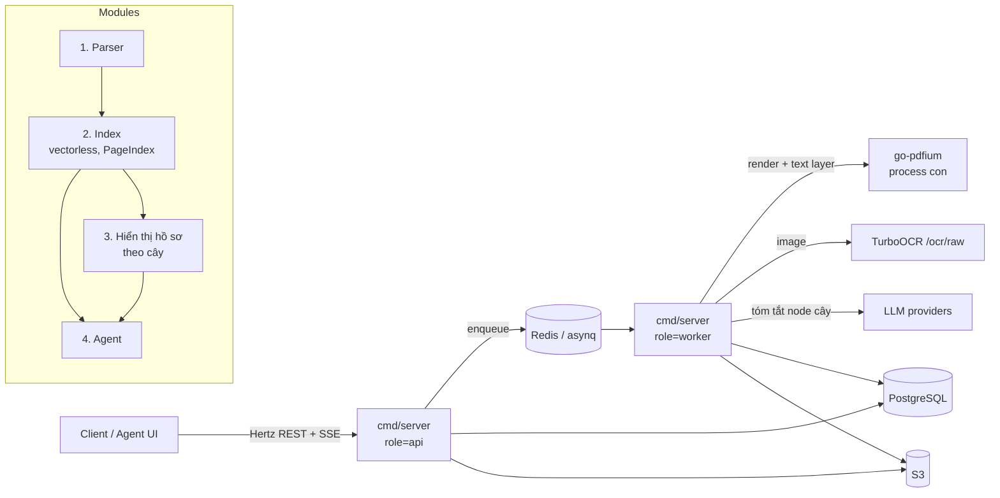
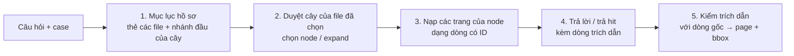
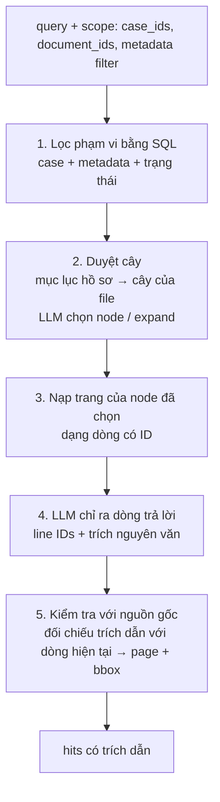

# BePaylot — Đặc tả kỹ thuật (Spec)

> Phiên bản: 0.12 · Ngày: 2026-09-28 · Trạng thái: đã triển khai P0–P2, P5 (case), P7 (đăng nhập/đăng ký + OIDC), P9 (gỡ LLM Wiki, search chỉ duyệt cây), P10 (VLM gom vùng qua agent, JSON trang trong Postgres); P8 (mô hình dữ liệu hồ sơ) mới có trong spec, xem §13, §15
>
> Phạm vi: nền tảng xử lý tài liệu, tìm kiếm và agent gồm bốn module:
> **Parser → Index (vectorless, kiểu PageIndex) → Hiển thị hồ sơ theo cây → Agent**. Mọi tài liệu thuộc một **case** (bộ hồ sơ theo một mã nghiệp vụ, ví dụ mã thanh toán `RT112233`), và case là phạm vi cứng khi agent tìm kiếm.
>
> **Luồng hỏi đáp:** câu hỏi → LLM duyệt cây mục lục (mục lục hồ sơ → cây của file) → chọn đúng trang → nạp các trang đó vào context → trả lời có trích dẫn dòng gốc (§6.6).
>
> Thay đổi so với 0.11 (U36): **VLM gom vùng, gọi qua agent; ảnh trang; JSON trang trong Postgres**
> - **Gom vùng cùng loại trên một trang:** các vùng cùng nhóm class (`text`, `abstract`, `content`… là nhóm `text`; chú thích; header/footer/footnote; công thức) được ghép thành **một ảnh có đánh số** và đọc bằng **một lần gọi** cho mỗi trang và nhóm. Tiêu đề (`doc_title`, `paragraph_title`) và bảng vẫn gọi riêng từng vùng. Con dấu (`seal`) được **gắn nhãn thẳng** từ layout, không gọi VLM (§5.3, §5.9).
> - **Gọi qua agent, dạng streaming:** engine không còn HTTP client riêng (đẩy prompt + tin nhắn lên `/chat/completions`). Mọi yêu cầu bóc tách đi qua `agent.Extract`, gọi model bằng `Stream` trên registry provider của agent (`llm.providers`, retry chung). Cấu hình `parser.engines.vlm.provider` thay cho `base_url`/`api_key`/`timeout` (§5.9, §11).
> - **Ảnh trang:** `GET /documents/:id/pages/:n/image` stream ảnh qua API. Trước đây API trả `302` tới presigned URL của MinIO/S3 khác origin; trình duyệt gọi bằng `fetch` + header xác thực nên bị chặn và báo lỗi không kết nối được. `302` chỉ còn khi client xin `?redirect=1` (§9.1, §10.2).
> - **JSON trang lưu Postgres:** raw JSON của engine (layout, các lần gọi VLM) và text layer của trang nằm ở cột `jsonb` của `document_pages` (`raw`, `text_layer`, migration `0017_page_json.sql`), không còn là object `ocr/*.json.gz`, `text/*.json.gz` trên S3 (§9.1, §9.2). Mô hình dữ liệu hồ sơ (P8) dời sang migration `0018`.
>
> Thay đổi của 0.11 (U35): **chỉ search theo cây, bỏ LLM Wiki**
> - Bỏ toàn bộ LLM Wiki (trang nguồn/entity/chủ đề, ingest, lint, index wiki, log, wiki schema, câu tổng hợp) vì đưa quá nhiều nội dung cho LLM, tốn token. LLM chỉ còn ở hai chỗ: tóm tắt node cây lúc index và duyệt cây + chỉ ra dòng trả lời lúc hỏi (§6.1, §16.2).
> - Search viết lại theo đúng luồng PageIndex (§6.6): lọc phạm vi → **mục lục hồ sơ** (thẻ các file + nhánh đầu của cây, dựng bằng code) → **cây nguyên khối** khi vừa ngân sách → nạp trang của node đã chọn → LLM chỉ ra dòng → kiểm trích dẫn.
> - Tool agent: bỏ `wiki_*`, thêm `kb_case_toc`; `kb_document_tree` trả cả cây khi vừa ngân sách (§8.2). API: bỏ §10.4–10.5 (wiki), thêm `GET /cases/:id/toc` (§10.3).
> - Module 3 thành **hiển thị hồ sơ theo cây** (case → file → node → trang gốc), không gọi LLM (§7).
> - Pool `wiki` → `enrich` (chỉ còn `document:classify` tuỳ chọn); bỏ trạng thái `enriching` (§4). Migration `0016_drop_wiki.sql` (§9.2); bỏ cấu hình `wiki.*`, thêm `search.case_toc_budget` (§11).
> - Đánh số lại: §6.6 luồng hỏi đáp, §6.7 full-text, §6.8 tìm trong file, §6.9 mô hình dữ liệu hồ sơ; §10.4 admin, §10.5 agent, §10.6 xác thực, §10.7 mô hình dữ liệu hồ sơ.
>
> Lịch sử (tóm tắt; chi tiết trong git):
> - 0.10: thử thêm lớp tổng hợp cho LLM Wiki (U34), bị thay bởi 0.11.
> - 0.9: Classification tuỳ chọn, mặc định tắt, chỉ dùng tiêu đề (U31); sửa mâu thuẫn mô hình dữ liệu (U32); thêm §16 Lưu ý khi code (U33).
> - 0.8: mô hình dữ liệu hồ sơ liên kết được (U30): bảng + ô, Extracted Field, Classification, evidence (§5.10, §6.9).
> - 0.7: đăng nhập/đăng ký như WeKnora, có OIDC (U28, §10.6).
> - 0.5–0.6: case làm phạm vi cứng (U18–U21, §6.2, §8.1); LLM Wiki theo case (U22–U27, đã gỡ ở 0.11).
> - 0.1–0.4: không embedding, search trên cây mục lục; go-pdfium; text layer/PDF/A; S3 + Postgres; metadata tuỳ chọn theo file.

---

## 0. Yêu cầu gốc của người dùng

Các yêu cầu dưới đây là nguồn của spec, ghi theo thứ tự đưa ra. Mọi thay đổi spec về sau phải giữ đúng các yêu cầu này. Nếu một yêu cầu sau **làm rõ hoặc thay** yêu cầu trước, cột "Hiệu lực" ghi rõ; khi hai yêu cầu khác nhau thì yêu cầu sau thắng.

| # | Yêu cầu (tóm tắt nội dung người dùng đưa ra) | Hiệu lực | Đáp ứng tại |
|---|---|---|---|
| U1 | Cấu trúc dự án bố trí giống WeKnora | còn hiệu lực | §3 |
| U2 | Xử lý job/task tương tự WeKnora, đặc biệt với file PDF nặng | còn hiệu lực | §4 |
| U3 | Các module phân tách độc lập, dễ maintain | còn hiệu lực | §3.3 (có test `internal/archtest`) |
| U4 | Dùng CloudWeGo Hertz để phát triển API | còn hiệu lực | §1.1, §10 |
| U5 | Cơ sở dữ liệu dùng Postgres (pgvector) | còn hiệu lực | §9 |
| U6 | **Module Parser:** engine mặc định built-in là TurboOCR, theo mẫu `spec/parser/ocr_curl.txt` và response `spec/parser/output_example.json`. Kết quả phải có đầy đủ nội dung trang, các line, thứ tự trang và nội dung markdown, sao cho tra ngược thông tin text về trang và vị trí được tường minh | còn hiệu lực, **được mở rộng bởi U30**: tra ngược được tới cả element và ô bảng | §5, §5.10 |
| U7 | **Module 2:** bộ chuyển đổi vectorless tạo nội dung cho hybrid search, lưu vào database, hỗ trợ tìm kiếm trên toàn bộ nội dung file theo trang | **được làm rõ bởi U35**: "nội dung cho search" là cây mục lục có tóm tắt (và section, full-text) lưu Postgres; tìm theo trang vẫn giữ. (Cách hiểu cũ U22/U24 — wiki của hồ sơ — đã bị thay) | §6.1, §6.5–6.8 |
| U8 | **Module 3:** chuyển nội dung đã parse thành graph kiểu wiki: xác định entity và quan hệ, cho phép cấu hình nhiều schema khác nhau, gọi LLM để trích xuất | **được thay bởi U23, U35**: không còn graph/entity/wiki schema; Module 3 là hiển thị hồ sơ theo cây (§7) | §7 |
| U9 | **Module cuối:** agent, như source code đang có | còn hiệu lực; phạm vi theo case (U21); từ U36 agent cũng là cửa gọi model cho bóc tách ảnh của parser (`agent.Extract`) | §8, §5.9 |
| U10 | Vectorless nghĩa là **không dùng embedding**. Search kiểu PageIndex: nạp context (cây mục lục) để LLM xác định nội dung nào cần tìm trong file | còn hiệu lực, **là cách làm duy nhất theo U35**: mục lục hồ sơ → cây của file (nguyên khối khi vừa ngân sách) → trang | §6.1, §6.5, §6.6 |
| U11 | Mỗi file có **metadata đi kèm, không bắt buộc**, và search được theo metadata. Ví dụ upload nhiều file cùng gán một mã hồ sơ thì phải tìm được theo mã hồ sơ đó | metadata vẫn giữ; **phần mã hồ sơ được thay bởi U18** (mã hồ sơ là case, không phải metadata) | §6.2, §6.3, §10.2 |
| U12 | Render PDF sang ảnh bằng **thư viện Go**, nhanh, kiểm soát được RAM/CPU | còn hiệu lực | §5.7 |
| U13 | Với PDF/A (và PDF có text), nếu lấy được nội dung text thì dùng để **bổ sung context** cho đúng | còn hiệu lực | §5.8 |
| U14 | Ngôn ngữ lập trình là Go | còn hiệu lực | toàn bộ |
| U15 | File lưu trên **S3 storage**, ảnh cũng vậy; metadata lưu **Postgres** | còn hiệu lực, **được làm rõ bởi U36**: JSON kết quả của trang (raw engine, text layer) là dữ liệu có cấu trúc nên lưu Postgres, không lưu S3 | §9.1 |
| U16 | Spec đặt tại `spec/spec.md`, viết tiếng Việt | còn hiệu lực | — |
| U17 | Parser OCR: gọi TurboOCR lấy layout, **cắt ảnh theo từng vùng** của trang, gọi **đồng thời** VLM (host theo chuẩn OpenAI, thử với `allenai/olmocr-2-7b` chạy local) để lấy text, rồi tổng hợp lại theo từng trang | còn hiệu lực, **được làm rõ bởi U36**: vùng cùng nhóm class trên một trang gom thành một lần gọi; tiêu đề và bảng gọi riêng; con dấu không gọi; mọi lần gọi đi qua agent (streaming) chứ không qua client HTTP riêng | §5.9 |
| U18 | Người dùng upload một loạt hồ sơ theo **một mã** (ví dụ mã thanh toán `RT112233`). Mã là khái niệm chung (**case**) để dùng cho nhiều bài toán khác (tín dụng doanh nghiệp…); không có khái niệm riêng của luồng thanh toán trong code, nhưng giữ đủ logic xử lý hồ sơ. Có **bảng case** | còn hiệu lực | §6.2, §9.2 |
| U19 | Parse bằng TurboOCR; nếu cấu hình VLM thì lấy text bằng VLM rồi gộp lại. TurboOCR vẫn luôn cung cấp text và **toạ độ** để hiển thị | còn hiệu lực (làm rõ U17) | §5.9 |
| U20 | Khi cần bóc tách trường thông tin hoặc kiểm tra tuân thủ một rule theo mã hồ sơ, người dùng chỉ việc hỏi agent. Agent tự tìm đúng tài liệu trong case bằng search vectorless, rồi bóc tách hoặc trả lời theo nội dung người dùng gửi | còn hiệu lực; search vectorless theo U35 (mục lục hồ sơ → cây → trang); **được làm rõ bởi U30**: kết quả bóc tách được lưu thành Extracted Field (value, confidence, evidence[]) gắn với document; danh sách trường vẫn nằm trong tin nhắn, không nằm trong server | §6.6, §6.9.3, §8 |
| U21 | Tìm kiếm **cứng trong đúng một case**, không bao giờ nhầm sang case khác: phiên agent gắn với `case_id` để lấy đúng dữ liệu vectorless (wiki + cây mục lục của case) mà search. `documents.case_id` chỉ cần NOT NULL, **không cần FK** | còn hiệu lực; dữ liệu vectorless của case là mục lục hồ sơ + cây mục lục của các file | §6.2, §8.1 |
| U22 | **Module 2:** dựng vectorless theo concept PageIndex. Tạo **một nội dung mô tả chung của hồ sơ** để search nhanh hơn, tiết kiệm token hơn: nạp nội dung này thay cho cả đống file | còn hiệu lực, **được làm rõ bởi U35**: "nội dung mô tả chung của hồ sơ" là mục lục hồ sơ (thẻ các file + nhánh đầu của cây) dựng bằng code, không phải wiki | §6.6 |
| U23 | **Module 3:** hiển thị dạng **wiki**, giống https://deepwiki.com nhưng theo mức **hồ sơ** (case) | **được làm rõ bởi U35**: hiển thị theo hồ sơ vẫn giữ, nhưng nội dung là mục lục hồ sơ + cây của từng file (không có wiki) | §7 |
| U24 | Vectorless viết rõ theo concept **LLM Wiki** (https://gist.github.com/karpathy/442a6bf555914893e9891c11519de94f): nguồn gốc bất biến → wiki do LLM duy trì → schema; các thao tác ingest / query / lint; có index và log. Khác gist: dữ liệu wiki **lưu ở Postgres**, không lưu file | **được thay bởi U35**: bỏ LLM Wiki | — |
| U25 | **Xoá dữ liệu graph/wiki cũ** để dựng lại theo cách mới | còn hiệu lực; từ U35 toàn bộ dữ liệu wiki cũng bị xoá (migration `0016`) | §9.2 (migration `0014`, `0016`) |
| U26 | Tối ưu LLM Wiki theo đúng concept của Karpathy và **giảm số lần gọi LLM**: cây mục lục đã có sau khi index thì dùng luôn để hiển thị wiki theo nội dung, không để LLM dựng lại; LLM chỉ trích xuất entity/quan hệ (JSON có cấu trúc, không viết văn xuôi), code gộp theo định danh, kiểm với dòng gốc và dựng trang; gỡ file hay làm mới trang không gọi LLM | **được thay bởi U35** (không còn wiki). Ý "dùng luôn cây mục lục đã có, không để LLM dựng lại" vẫn giữ: Module 3 hiển thị thẳng từ cây | §7 |
| U27 | Index và tóm tắt theo đúng `index.md` của LLM Wiki (catalog mọi trang: link, tóm tắt một dòng, metadata như ngày hoặc số nguồn, nhóm theo loại; đọc index trước rồi mới đi vào trang), tóm tắt được làm ngay khi ingest; **tối ưu token**, tránh token thừa; dữ liệu vẫn lưu Postgres | **được thay bởi U35**; ý "tối ưu token, đọc mục lục trước rồi mới vào trang" chuyển thành mục lục hồ sơ (§6.6) | §6.6 |
| U28 | Tạo **trang đăng nhập / đăng ký giống WeKnora**, hỗ trợ **OIDC**, để không phải lần nào cũng tạo user bằng `make seed`; **cơ chế xác thực giống WeKnora** | còn hiệu lực; thay câu "Auth giữ nguyên (`x-api-key`…)" của §10 bản 0.6 | §10.6, §9.2 (migration `0015`), §11, frontend `/login` |
| U29 | Viết **tài liệu vận hành** trong thư mục `spec` để bàn giao cho đội vận hành OPN: vận hành từng tính năng và các kiểm tra trạng thái dịch vụ | còn hiệu lực | [`spec/van-hanh.md`](van-hanh.md), `spec/van-hanh/healthcheck.sh`, `spec/van-hanh/kiem-tra.sql` |
| U30 | Tài liệu phải **liên kết được theo cấu trúc**: `Case → Document → {File metadata; Page → {Element (bbox, text, confidence, type); Table}; Extracted Field (value, confidence, evidence[]); Classification}` | còn hiệu lực; **thay** nguyên tắc "không phân loại lúc index" của bản 0.5 (§6.1): Classification có, nhưng theo dải trang, có confidence + evidence, sửa được và không bao giờ dùng để loại trừ khi search. **Được làm rõ bởi U31**: phân loại không chạy mặc định sau index | §5.10, §6.9, §9.2 (migration `0018`), §10.7 |
| U31 | Phân loại là **tuỳ chọn**, không nên luôn chạy. Nếu chạy sẵn (tự động) thì **chỉ lấy tiêu đề**, vì đưa từng trang đi phân loại tốn token mà độ chính xác không cao | còn hiệu lực | §4.2, §6.2, §6.9.4, §10.7, §11 |
| U32 | Rà lại spec, sửa các chỗ mâu thuẫn theo phương án tối ưu: giá trị hiện tại của field chỉ là bản đã xác nhận; evidence liên file không bị mồ côi; công duyệt giữ qua reparse; wiki và field không lệch âm thầm; bbox ô bảng ổn định với VLM; reparse ghi đúng hành vi; có service sở hữu mô hình dữ liệu | còn hiệu lực trừ ý "wiki và field không lệch âm thầm" (không còn wiki, U35); **làm rõ U20, U30** | §3.1, §4.7, §5.6, §5.10, §6.9, §8.2, §9.2 |
| U33 | **Xoá các phần mâu thuẫn** còn sót trong spec và **ghi lại lưu ý** để code rõ ràng | còn hiệu lực | toàn bộ; §16 (Lưu ý khi code) |
| U34 | bepaylot phải theo **đúng giải pháp vectorless** (PageIndex + LLM Wiki): sửa toàn bộ spec cho đúng | **được thay bởi U35** | — |
| U36 | Sửa bốn điểm: (1) **Layout:** các text box cùng class trên cùng một trang phải **gom lại gọi agent bóc tách một lần**, vì ảnh từng vùng rất nhỏ, gọi đi gọi lại tốn lần gọi và token; gom các nhãn cùng class và tương tự nhau, mỗi trang mỗi nhóm một lần gọi. **Title vẫn gọi riêng.** Layout là **con dấu thì gắn nhãn luôn, không gọi VLM**. (2) Yêu cầu bóc tách gọi sang **agent hiện có trong source code, dạng streaming**, không gọi riêng kiểu LLM base đẩy prompt + user message lên. (3) Sửa lỗi **xem ảnh trang báo không kết nối được**. (4) **Lưu JSON kết quả của trang vào database**, không lưu S3, vì đó là dữ liệu có cấu trúc | còn hiệu lực; **làm rõ U15, U17** | §0 (bản 0.12), §5.3, §5.9, §9.1, §9.2 (migration `0017`), §10.2, §11 |
| U35 | **Không đưa quá nhiều cho LLM vì tốn token; chỉ search theo index tree.** Luồng: cần hỏi thông tin thì duyệt index tree, tìm đúng trang, nạp trang vào context để trả lời. Xoá nội dung thừa trong spec (chỉ phần LLM Wiki); Module 3 hiển thị theo cây | còn hiệu lực; **thay U24, U26, U27, U34**, làm rõ U7, U8, U10, U22, U23 | §6.1, §6.5, §6.6, §7, §8.2, §9.2 (migration `0016`), §10.3, §11, §16 |

## 1. Yêu cầu chung

| # | Yêu cầu | Cách đáp ứng trong spec này |
|---|---|---|
| R1 | Cấu trúc dự án bố trí giống WeKnora | Phân lớp `types` / `types/interfaces` / `application/service` / `application/repository` / `handler` / `router` / `container` như WeKnora (§3) |
| R2 | Xử lý job/task tương tự WeKnora, nhất là file PDF nặng | Hàng đợi `asynq` + Redis, nhiều worker pool cô lập, fan-out theo **từng trang**, retry theo trang, dead-letter, khôi phục khi restart (§4) |
| R3 | Module phân tách độc lập, dễ maintain | Mỗi module chỉ giao tiếp qua interface trong `types/interfaces` và qua task; có quy tắc import bắt buộc (§3.3) |
| R4 | API dùng CloudWeGo **Hertz** | Toàn bộ HTTP qua Hertz, SSE qua `hertz-contrib/sse` (giữ nguyên từ code hiện tại) |
| R5 | CSDL là **PostgreSQL + pgvector** | Một Postgres duy nhất cho dữ liệu, metadata (JSONB), full-text, cây mục lục và mô hình dữ liệu hồ sơ (§9). Luồng tài liệu **không dùng vector**; pgvector chỉ còn phục vụ phần tìm skill sẵn có của agent |
| R6 | Search không dùng embedding, kiểu PageIndex | LLM duyệt **mục lục hồ sơ** (thẻ các file + nhánh đầu của cây), rồi **cây mục lục** của file được chọn (nạp nguyên khối khi vừa ngân sách), chọn node; các trang của node được nạp vào context dạng dòng có ID để LLM chỉ ra đúng dòng trả lời. Mọi hit được đối chiếu lại với dòng gốc (§6.1, §6.6) |
| R7 | Metadata tuỳ chọn theo file, tìm được theo metadata (trong case) | `documents.metadata` JSONB + GIN, gán khi upload đơn lẻ hoặc theo lô, lọc bằng toán tử `eq/in/prefix/range`; mã hồ sơ là case, không phải metadata (§6.2, §6.3) |
| R8 | Render PDF → ảnh bằng thư viện Go, nhanh, kiểm soát RAM/CPU; PDF/A có text thì dùng bổ sung | go-pdfium chạy multi-process, DPI thích ứng, tái chế process, timeout theo trang; text layer hợp nhất với OCR theo dòng (§5.7, §5.8) |
| R9 | Code bằng Go; file và ảnh lưu S3, metadata lưu Postgres | §9.1 |
| R10 | Layout TurboOCR + VLM đọc từng vùng đồng thời, tổng hợp theo trang | engine `turboocr_vlm`: cắt vùng, gom vùng cùng nhóm class của một trang thành một ảnh đánh số (một lần gọi), tiêu đề/bảng gọi riêng, con dấu gắn nhãn không gọi; gọi qua `agent.Extract` (streaming); fan-out có giới hạn, căn text VLM với dòng OCR để giữ bbox/offset (§5.9) |
| R11 | Tài liệu nhóm theo mã hồ sơ, agent chỉ tìm trong đúng hồ sơ, dùng được cho nhiều bài toán | Bảng `cases` + loại case trong YAML (§6.2); session agent gắn một `case_id` bất biến, mọi truy vấn của tool lọc `case_id` phía server (§8.1) |
| R12 | Hỏi đáp nhanh, rẻ token | Không có lớp biên soạn trước; LLM chỉ đọc mục lục/cây (tiêu đề, khoảng trang, tóm tắt) và đúng các trang cần thiết; ngân sách token cứng ở mọi bước (§6.6, §11) |
| R14 | Hiển thị hồ sơ để đọc hiểu cả bộ | Module 3: case → file → cây mục lục kèm tóm tắt, bấm node mở trang gốc + bbox, "Hỏi về hồ sơ"; không gọi LLM (§7) |
| R15 | Dữ liệu graph/wiki cũ bị xoá | Migration `0014` xoá graph bản 0.4; `0016` xoá LLM Wiki (§9.2) |
| R16 | Người dùng tự đăng ký / đăng nhập trên web, có OIDC, xác thực như WeKnora | `service/auth`: bcrypt + JWT access/refresh lưu vết trong `auth_tokens`, OIDC authorization code (backend đổi code, state ký + cookie nonce); middleware Bearer JWT → API key; trang `/login` hai cột; API key tự phục vụ (§10.6) |
| R17 | Dữ liệu hồ sơ liên kết được theo cây Case → Document → Page → Element/Table, cộng Extracted Field và Classification có evidence | Bảng `page_tables`, `table_cells`, `extracted_fields`, `document_segments`, `evidence_spans` (migration `0018`); mọi evidence giải được ra `(document, page, line/element/ô, bbox)`; API trả cả cây (§6.9, §10.7) |

### 1.1 Tech stack

| Thành phần | Lựa chọn | Ghi chú |
|---|---|---|
| Ngôn ngữ | Go 1.26 | giữ như `go.mod` hiện tại |
| HTTP | `cloudwego/hertz` | + `hertz-contrib/sse`, `hertz-contrib/swagger` |
| LLM / Agent | `cloudwego/eino` (+ eino-ext) | giữ nguyên module agent hiện có |
| DB | PostgreSQL 16 + `pg_trgm`, `unaccent`, `pgcrypto`, `citext` (+ `pgvector` cho skill của agent) | driver `jackc/pgx/v5`, migration `pressly/goose` (giữ như hiện tại) |
| Task queue | `hibiken/asynq` + Redis 7 | giống WeKnora |
| Object storage | **S3** (AWS S3 / MinIO / Ceph), `aws-sdk-go-v2` | file gốc, ảnh trang, JSON thô từ OCR/text layer, ảnh crop, markdown toàn văn (§9.1) |
| Render PDF | `klippa-app/go-pdfium` (PDFium), chế độ multi-process | render + encode JPEG trong process con, giới hạn CPU/RAM, lấy text layer có toạ độ (§5.7) |
| Ảnh | Go stdlib `image/*`, `golang.org/x/image` (tiff, draw) | file ảnh upload trực tiếp |
| OCR mặc định | TurboOCR (`POST /ocr/raw`) | engine built-in, cắm thêm engine khác qua interface |
| Xác thực | `golang-jwt/jwt/v5` (HS256), `golang.org/x/crypto/bcrypt`, `coreos/go-oidc/v3` + `golang.org/x/oauth2` | JWT access/refresh, mật khẩu, OIDC (§10.6) |
| OCR bằng VLM | model đọc ảnh cấu hình như một provider trong `llm.providers` (mặc định provider `vlm`, OpenAI-compatible, `allenai/olmocr-2-7b` qua vLLM/LM Studio), gọi qua agent (streaming) | engine `turboocr_vlm`: TurboOCR cho layout, VLM đọc text theo nhóm vùng (§5.9) |

---

## 2. Kiến trúc tổng thể


```mermaid
flowchart LR
  U[Client / Agent UI] -->|Hertz REST + SSE| API[cmd/server<br/>role=api]
  API -->|enqueue| R[(Redis / asynq)]
  API --> PG[(PostgreSQL)]
  API --> OS[(S3)]

  R --> W[cmd/server<br/>role=worker]
  W -->|render + text layer| PDF[go-pdfium<br/>process con]
  W -->|image| OCR[TurboOCR /ocr/raw]
  W -->|tóm tắt node cây| LLM[LLM providers]
  W --> PG
  W --> OS

  subgraph Modules
    M1[1. Parser] --> M2[2. Index<br/>vectorless, PageIndex]
    M2 --> M3[3. Hiển thị hồ sơ<br/>theo cây]
    M2 --> M4[4. Agent]
    M3 --> M4
  end
```

- **Một binary, nhiều vai trò**: `cmd/server --role=api|worker|all` (mặc định `all` cho dev). Production chạy API và worker thành deployment riêng để scale worker theo tải OCR.
- **Luồng dữ liệu**: case + file + metadata → trang → block/line (Parser) → cây mục lục có tóm tắt + section + chỉ mục full-text (Index) → hiển thị hồ sơ theo cây (Module 3) → tool cho Agent.
- **Luồng hỏi đáp**: câu hỏi → LLM duyệt cây mục lục (của hồ sơ, rồi của file) → chọn đúng trang → nạp các trang đó vào context → trả lời có trích dẫn (§6.6).
- **Mọi thứ đều truy vết được về nguồn**: section, kết quả search, câu trả lời của agent đều mang `source_spans` / `citation_id` trỏ về `(document_id, page_no, line_no, bbox)`.

---

## 3. Cấu trúc dự án

### 3.1 Cây thư mục

Phân lớp theo WeKnora. Mỗi module nghiệp vụ là **một package con** trong `service/` và `repository/`, thay vì để phẳng như WeKnora.

```
cmd/
  server/              main: --role=api|worker|all, -migrate-only
  pdfium-worker/       process con của go-pdfium (multi_threaded), do pool render sinh ra
  seed/                (tuỳ chọn) tạo user + API key cho script/CI; -password đặt mật khẩu đăng nhập
  skills-sync/         đồng bộ skills (giữ nguyên)
configs/
  config.yaml
  mcp.yaml
  case_types/          loại case (YAML, §6.2), nạp khi khởi động
migrations/
  postgres/            goose SQL migrations (chuyển từ internal/store/migrations)
internal/
  config/              nạp YAML + ${ENV}
  container/           wiring phụ thuộc, khởi tạo worker pool, khôi phục task khi restart
  router/
    router.go          đăng ký route Hertz theo nhóm
    routes_document.go
    routes_search.go
    routes_agent.go    (routes hiện có: /v1/messages, /v1/ag-ui, sessions, skills, mcp)
    task.go            đăng ký asynq handler + khởi tạo các server theo pool
  handler/             HTTP handler mỏng: bind → gọi service → trả DTO
    dto/
  middleware/          auth (Bearer JWT → API key), request-id, recover, CORS; asynq: dead-letter, tracing, background ctx
  types/               entity, enum, payload task, cấu hình queue
    interfaces/        interface của service & repository (hợp đồng giữa các module)
  application/
    service/
      auth/            đăng ký, đăng nhập, JWT access/refresh, đổi mật khẩu, OIDC (§10.6)
      cases/           case và loại case (§6.2); tên `cases` vì `case` là từ khoá Go
      document/        Module 1: điều phối parse (split → page → assemble)
      index/           Module 2: section, cây mục lục + tóm tắt (PageIndex), mục lục hồ sơ, FTS, metadata, search duyệt cây (§6.5–6.6)
      docmodel/        Module 2: mô hình dữ liệu hồ sơ (§6.9) — Extracted Field, Classification (`document:classify`), evidence; bộ giải/kiểm `citation_id` dùng chung (interface `CitationResolver`)
      agent/           Module 4: session, message, run (bọc internal/agent)
    repository/
      postgres/        repository thuần SQL (pgx)
      retriever/
        postgres/      lọc metadata + truy vấn FTS/trigram
  parser/              engine parse (không phụ thuộc DB)
    engine.go          interface Engine + registry
    turboocr/          client TurboOCR + ánh xạ response
    pdf/               go-pdfium: probe, render batch, text layer, bookmark
    textlayer/         kiểm tra chất lượng + hợp nhất text layer với OCR (§5.8)
    assemble/          layout + lines → page model → markdown
  storage/             ObjectStore trên S3 (aws-sdk-go-v2): upload/download stream, presign
  queue/               asynq client, topology queue/pool, helper enqueue
  agent/ llm/ tools/ skills/ mcp/ retrieval/    (giữ nguyên code hiện có)
  logging/
deploy/
  docker-compose.yml   postgres(pgvector, dùng cho skill) + redis + minio (S3) + turboocr(optional)
  Dockerfile           kèm libpdfium (version cố định) + binary pdfium-worker
docs/                  swagger (swaggo)
skills/
spec/                  tài liệu mẫu (parser/ocr_curl.txt, output_example.json)
```

### 3.2 Ánh xạ từ code hiện tại

| Hiện tại | Chuyển sang | Ghi chú |
|---|---|---|
| `internal/domain` | `internal/types` | entity dùng chung |
| `internal/store/*.go` | `internal/application/repository/postgres` | giữ pgx, không chuyển sang GORM |
| `internal/store/migrations` | `migrations/postgres` | giữ số thứ tự; migration mới bắt đầu từ `0006` |
| `internal/api` | `internal/handler` (+ `handler/dto`) | route giữ nguyên đường dẫn |
| `internal/server` | `internal/router` + `internal/middleware` | Hertz engine, SSE writer |
| `cmd/server/wire.go` | `internal/container` | wiring tay, không dùng `dig` |

Việc chuyển code là refactor thuần: **không đổi hành vi, không đổi API** của phần agent. Nên làm trong một PR riêng trước khi thêm module mới.

### 3.3 Quy tắc độc lập module (bắt buộc, có kiểm tra CI)

1. `service/<A>` **không import** `service/<B>`. Nếu cần gọi chéo thì phụ thuộc vào `types/interfaces.<B>Service`, được inject tại `container`.
2. `handler` chỉ phụ thuộc `types/interfaces`, không phụ thuộc repository.
3. `parser/*` là thư viện thuần: không biết DB, queue hay HTTP, nên test được bằng file mẫu.
4. Module sau **chỉ đọc** dữ liệu của module trước qua interface đọc (`DocumentReader`, `SectionReader`), không ghi chéo bảng.
   - Tool `kb_save_fields`/`kb_get_fields` của agent (Module 4) gọi `interfaces.DocModelService`, không ghi thẳng bảng. Search và tool giải citation qua `interfaces.CitationResolver` do `service/docmodel` cài đặt.
5. Chuyển giai đoạn luôn đi qua **task** (không gọi đồng bộ), để mỗi giai đoạn retry và scale độc lập.
6. CI chạy một test kiểm tra import graph (`go list -deps`) để chặn vi phạm quy tắc 1–3.

---

## 4. Hệ thống Job / Task (theo mô hình WeKnora)

### 4.1 Worker pool và queue

Mỗi pool là một `asynq.Server` riêng, nên concurrency được cô lập cứng: import hàng loạt không làm nghẽn các việc khác. Topology khai báo **một chỗ duy nhất** (`types/task.go`: `QueueDefinition{Name, Pool, Weight, TaskTypes}`) và được dùng cho cả khởi tạo server lẫn trang admin.

| Pool | Queue (weight) | Task type | Concurrency mặc định | Lý do |
|---|---|---|---|---|
| `core` | `default`(1), `interactive`(3) | `document:split`, `document:assemble` | 4 | việc nhẹ, cần độ trễ thấp |
| `render` | `render`(1), `render_interactive`(3) | `page:render` | `render.workers` (mặc định `min(NumCPU-1,4)`) | nặng CPU; số task song song = số process PDFium (§5.7) |
| `ocr` | `page`(1), `page_interactive`(3) | `page:ocr` | 8 (= năng lực TurboOCR) | nặng I/O, **nút thắt chính**; tách riêng để bảo vệ OCR |
| `index` | `index`(1), `index_interactive`(3) | `index:build`, `index:tree` | 6 | tách section, full-text, dựng cây + tóm tắt node (gọi LLM). Là điều kiện để search được |
| `enrich` | `enrich`(1) | `document:classify` | 4 | việc tuỳ chọn sau index (§6.9.4), không ai chờ trực tiếp, không chặn search |
| `maintenance` | `low`(1) | `document:delete`, `case:delete`, `kb:delete`, `document:reparse`, `housekeeping:sweep` | 2 | việc dài, chạy nền |

- Queue `*_interactive` dành cho file đính kèm trong chat (người dùng đang chờ). Queue này có weight cao hơn để không bị kẹt sau import hàng loạt, giống `QueueChatAttachment` của WeKnora.
- Concurrency cấu hình qua `config.yaml` hoặc env `BEPAYLOT_ASYNQ_<POOL>_CONCURRENCY`.
- Mọi handler được bọc middleware: `backgroundCtx` → `tracing` → `deadLetter` → `cancelGuard` (bỏ qua nếu document đã `cancelled`/`deleting`).

### 4.2 Pipeline xử lý một tài liệu

```mermaid
sequenceDiagram
  participant API
  participant Q as asynq
  participant S as document:split
  participant RD as page:render (batch)
  participant P as page:ocr (xN)
  participant A as document:assemble
  participant I as index:*

  API->>API: giải case (tạo nếu chưa có), stream upload → S3 (+ sha256, quét PDF/A), validate metadata, tạo documents(status=queued, case_id, metadata)
  API->>Q: document:split (TaskID=split:{doc})
  Q->>S: tải PDF về cache → pdfium Probe: page_count, kích thước, Info, bookmark → tạo N document_pages(pending)
  S->>Q: Advance(doc): enqueue các page:render batch đầu tiên
  Q->>RD: mở PDF 1 lần → mỗi trang: render JPEG + text layer → S3 → page rendered
  RD->>Q: enqueue page:ocr cho từng trang đã render; Advance(doc)
  Q->>P: stream ảnh S3 → TurboOCR → hợp nhất text layer → assemble trang → lưu page/blocks/lines
  P->>Q: Advance(doc): bù cửa sổ render/ocr
  P->>P: UPDATE documents SET pages_done=pages_done+1 RETURNING
  P->>Q: nếu done+failed = page_count → document:assemble (TaskID=assemble:{doc}:{gen})
  Q->>A: ghép markdown toàn văn + offset, status=indexing
  A->>Q: index:build
  Q->>I: section + FTS → index:tree (dựng cây, tóm tắt node bằng LLM)
  I->>I: status=completed (search được)
  I->>Q: document:classify mode=titles (chỉ khi loại case bật classification.auto, §6.9.4)
```

### 4.3 Xử lý file PDF nặng (vài trăm đến vài nghìn trang)

| Vấn đề | Cách xử lý |
|---|---|
| Upload file lớn | Stream thẳng từ multipart vào S3 (multipart upload, RAM ≤ 64 MB), không buffer toàn file. Giới hạn `upload.max_bytes` (mặc định 500 MB). Tính sha256 trong khi stream để chống trùng theo `(case_id, sha256)` (§6.2). |
| Render tốn RAM/CPU | go-pdfium chạy multi-process: số process = giới hạn CPU; bitmap nằm trong process con, chặn bởi `MaxPixels`; process được tái chế theo số trang và RSS; timeout mỗi trang thì kill process. Một batch mở PDF một lần. PDF gốc được cache trên đĩa local (LRU có giới hạn dung lượng). Chi tiết ở §5.7 |
| Tách render (CPU) khỏi OCR (I/O) | Hai pool riêng. Ảnh render xong nằm trên S3 nên OCR chạy song song với render các trang sau; lỗi OCR không bắt render lại |
| Một file chiếm hết render/OCR | **`Advance(doc)`**: hàm idempotent, khoá dòng `documents` (`FOR UPDATE`), đếm trang theo trạng thái rồi bù cửa sổ: ≤ `render_inflight_batches` batch render (mặc định 1) **và** ≤ `render_ahead_pages` trang đã render mà chưa OCR (mặc định 32, tạo backpressure); ≤ `ocr_inflight_pages` trang đang OCR (mặc định 8). Hàm được gọi sau mỗi task render/ocr và bởi `housekeeping:sweep`. Nhờ vậy nhiều file lớn chạy xen kẽ công bằng |
| Lỗi một trang làm hỏng cả file | Retry **theo trang** (`MaxRetry=3`, backoff mũ, `Timeout=15m`/trang để đủ cho engine `turboocr_vlm`, §5.9). Batch render lỗi thì các trang đã xong được giữ, chỉ retry phần còn lại. Trang OCR hết lượt retry mà có text layer đạt chất lượng thì dựng từ text layer (§5.8). Nếu không, trang được đánh dấu `failed` và ghi dead-letter; document vẫn assemble với trạng thái cuối `partial` kèm danh sách trang lỗi. Có thể reparse riêng trang đó. |
| Trùng lặp / chạy hai lần | Task ID xác định: `render:{doc}:{first_page}:{gen}`, `ocr:{doc}:{n}:{gen}`. Kết quả ghi bằng `UPSERT` theo `(document_id, page_no)`. `gen` tăng mỗi lần reparse để task cũ tự bỏ qua. |
| Đếm hoàn thành đúng khi chạy song song | `UPDATE documents SET pages_done = pages_done + 1 ... RETURNING pages_done, pages_failed, page_count`. Chỉ task nhìn thấy tổng = `page_count` mới enqueue `assemble`; task này còn có `TaskID` duy nhất để chống trùng. |
| OCR service quá tải hoặc sập | Concurrency của pool `ocr` = năng lực OCR. Client có circuit breaker: lỗi 5xx hoặc timeout liên tiếp thì mở mạch 30 giây, task trả lỗi retry thay vì dồn request. |
| Restart giữa chừng | Asynq giữ task trong Redis. `housekeeping:sweep` (chạy mỗi 5 phút) tìm trang `processing` quá `2 × timeout` mà không có task sống trong asynq, rồi đưa về `pending` và enqueue lại. Trang đã `rendered` không render lại, trang đã `done` **không bao giờ OCR lại**. |
| Theo dõi tiến độ | `documents.progress` (pages_done/page_count) và bảng `processing_spans` (giống `knowledge_processing_spans` của WeKnora). SSE `GET /v1/documents/:id/events` đẩy sự kiện thay đổi trạng thái. |
| Huỷ | `POST /cancel` đặt `status=cancelled`. Middleware `cancelGuard` bỏ qua các task còn lại; các trang đã xong vẫn được giữ. |
| Trang trắng / trang ảnh nhỏ | Trang có kết quả OCR rỗng được lưu `is_blank=true`, không tạo section. |

### 4.4 Tham số task mặc định

| Task | Queue | MaxRetry | Timeout | TaskID (dedup) |
|---|---|---|---|---|
| `document:split` | default / interactive | 3 | 5m | `split:{doc}:{gen}` |
| `page:render` | render / render_interactive | 3 | 10m (batch) | `render:{doc}:{first_page}:{gen}` |
| `page:ocr` | page / page_interactive | 3 | 15m (đủ cho `turboocr_vlm`, §5.9) | `ocr:{doc}:{n}:{gen}` |
| `document:assemble` | default | 3 | 10m | `assemble:{doc}:{gen}` |
| `index:build` | index | 3 | 30m | `index:{doc}:{gen}` |
| `index:tree` | index | 5 | 30m | `tree:{doc}:{gen}` |
| `document:classify` | enrich | 5 | 10m | `cls:{doc}:{gen}` (chạy lại bằng API: `cls:{doc}:{gen}:{n}`) |
| `document:delete` | low | 3 | 1h | `del:{doc}` |
| `case:delete` | low | 3 | 1h | `delcase:{case}` |

### 4.5 Dead-letter và pending ops (theo WeKnora)

- **`task_dead_letters`**: middleware asynq ghi một dòng khi task hết retry. Dòng gồm `task_type`, `scope`, `scope_id`, `related_id` (ví dụ `page_no`), `payload`, `last_error` và `fail_count`. Admin xem và retry qua API (§10.4).
- **`task_pending_ops`**: hàng đợi bền trong DB cho việc cần gom lô hoặc debounce. Dữ liệu sống qua restart và không bị TTL của Redis xoá.

### 4.6 Trạng thái document

```
queued → splitting → parsing → assembling → indexing → completed
                                   │                       ↑
                                   └──(có trang failed)─→ partial
bất kỳ ─→ failed | cancelled | deleting
```

- Lọc theo metadata và tìm full-text theo trang dùng được **ngay khi parse xong** (trước khi có cây). Search kiểu cây cần `index:tree` hoàn tất.
- Mỗi giai đoạn con có trạng thái riêng: `parse_status`, `index_status`, `classify_status` (§6.9.4). UI và agent nhờ đó biết chính xác phần nào đã sẵn sàng.
- `document:classify` là tuỳ chọn (§6.9.4): mặc định không chạy (`classify_status` = `skipped` hoặc `none`). Khi chạy, nó chạy sau index và **không** chặn trạng thái `completed`: document tới `completed` mà classification có thể vẫn `processing`.

### 4.7 Callback khi document hoàn thành (tuỳ chọn)

**Mục đích.** Hệ thống gọi upload không phải poll trạng thái. Họ truyền `callback_url` và bepaylot gửi `POST` tới URL đó khi document kết thúc.

**Khai báo.**
- Field form `callback_url` của `POST /kbs/:id/documents` là **tuỳ chọn** và áp cho mọi file của lần upload. Không truyền thì không có callback nào.
- Có thể đổi URL khi reparse: `callback_url` trong body `POST /documents/:id/reparse`.
- URL được lưu ở `documents.callback_url`.
- File trùng (cùng sha256 trong case): URL mới thay URL cũ. Nếu document đã kết thúc thì callback được gửi ngay.

**Khi nào gửi.** Khi document tới trạng thái cuối, sự kiện tương ứng được gửi:
- `completed` → `document.completed`;
- `partial` → `document.partial`;
- `failed` → `document.failed`;
- `cancelled` → `document.cancelled`.

Thêm một sự kiện không gắn với trạng thái document: `document.classified`, gửi khi `document:classify` (tuỳ chọn, §6.9.4) kết thúc với `classify_status` = `done` hoặc `failed`. Payload như trên, kèm `classify_status` và `links.classification`. Phân loại không chặn `completed`, nên bên nhận không phải poll để biết khi nào có nhãn. Lần giao được khoá theo `(document, gen, run, url, event)`.

Mỗi `(document, gen, run, url, event)` có đúng **một** lần giao (bảng `document_callbacks`), nên trạng thái bị ghi hai lần cũng không gửi hai lần. `run` tăng mỗi lần reparse theo trang (cùng gen), nên lần hoàn thành mới lại có callback. Mọi chỗ đổi trạng thái đi qua `document.Service.updateStatus`, và chính hàm này tạo lần giao.

**Request.** Luôn là `POST`, `Content-Type: application/json`. Header:

| Header | Ý nghĩa |
|---|---|
| `X-Bepaylot-Event` | `document.completed` … |
| `X-Bepaylot-Delivery` | id lần giao, **không đổi giữa các lần thử**; phía nhận dùng để chống trùng (giao ít nhất một lần) |
| `X-Bepaylot-Attempt` | lần thử thứ mấy (1, 2, …) |
| `X-Bepaylot-Timestamp` | unix giây lúc gửi |
| `X-Bepaylot-Signature` | `sha256=hex(HMAC_SHA256(secret, timestamp + "." + body))`, chỉ có khi cấu hình `callback.signing_secret` |

Body được cố định lúc tạo lần giao, nên mọi lần thử gửi cùng nội dung:

```json
{
  "event": "document.completed",
  "delivery_id": "…",
  "occurred_at": "2026-09-25T14:48:35Z",
  "document": {
    "id": "…", "kb_id": "…", "case_id": "…", "case_code": "RT112233", "batch_id": "…", "file_name": "…", "mime_type": "…", "size_bytes": 0,
    "gen": 1, "status": "completed", "parse_status": "done", "index_status": "done",
    "page_count": 1, "pages_done": 1, "pages_failed": 0, "metadata": {"loai_giay_to": "…"},
    "title": "…", "summary": "…", "error": "…(khi failed)", "created_at": "…", "updated_at": "…"
  },
  "links": {"document": "/v1/documents/…", "markdown": "/v1/documents/…/markdown", "pages": "/v1/documents/…/pages"}
}
```

**Thành công và retry.**
- Chỉ HTTP **2xx** là thành công. Redirect không được đi theo và bị tính là lỗi.
- Lỗi mạng, timeout (`callback.timeout`, mặc định 10 s) hoặc mã khác 2xx đều bị tính là lỗi. Lần thử đó được ghi lại, và lần sau được hẹn theo `callback.backoff` (mặc định 10s, 30s, 1m, 5m, 15m, 30m, 1h; giá trị cuối lặp lại).
- Hết `callback.max_attempts` lần (mặc định 8) thì lần giao chuyển `failed`.
- Retry do chính handler `document:callback` tự lên lịch (task mới với `ProcessIn`), không dựa vào retry của asynq, nên trạng thái trong DB luôn khớp số lần đã gửi.
- Queue `callback` thuộc pool `core`.

**Lưu trạng thái.**
- `document_callbacks`: `state` (`pending | succeeded | failed`), `attempts`, `max_attempts`, `last_status_code`, `last_error`, `last_attempt_at`, `next_attempt_at`, `delivered_at`, `payload`.
- `document_callback_attempts`: mỗi lần thử một dòng, gồm `status_code`, `error`, 1000 ký tự đầu của response và `duration_ms`.
- Xem bằng `GET /documents/:id/callbacks`.
- Gọi lại bằng `POST /documents/:id/callbacks/retry` (body tuỳ chọn `{callback_id}`): lần giao được mở lại thêm `max_attempts` lần thử và gửi ngay.

**Chống sót.** `housekeeping:sweep` tạo lần giao cho document đã kết thúc có `callback_url` mà chưa có bản ghi (process chết giữa lúc cập nhật trạng thái và lúc lên lịch). Nó cũng enqueue lại các lần giao `pending` đã quá hạn hơn 5 phút.

**An toàn (SSRF).**
- Chỉ nhận `http`/`https`, không nhận URL có user:password, độ dài tối đa 2048.
- Mặc định **chặn** đích là loopback, mạng riêng, link-local, CGNAT và multicast. Việc kiểm tra làm trên **IP đã phân giải lúc dial**, nên đổi DNS cũng không vượt qua được. Không dùng proxy.
- `callback.allow_private_networks: true` chỉ dùng cho dev (callback về `localhost`).
- URL sai bị từ chối ngay lúc upload (`422`), và các file của lần upload đó bị xoá.

**Cấu hình** (`callback`): `timeout, max_attempts, backoff, signing_secret (BEPAYLOT_CALLBACK_SECRET), allow_private_networks (BEPAYLOT_CALLBACK_ALLOW_PRIVATE)`.

---

## 5. Module 1 — Parser

### 5.1 Mục tiêu

Chuyển file (PDF, ảnh; giai đoạn 2 thêm DOCX/XLSX qua convert sang PDF) thành **mô hình trang có cấu trúc**:

- đầy đủ nội dung từng trang, giữ **thứ tự trang** và **thứ tự đọc** trong trang;
- đến cấp **line**: text, độ tin cậy, bounding box;
- nhóm theo **block** (layout region): tiêu đề, đoạn văn, bảng, ảnh, công thức, header;
- **markdown** theo trang và markdown toàn văn, mỗi line có **offset ký tự** trong cả hai;
- từ một đoạn text bất kỳ tra ngược ra được `trang → block → line → bbox`, và ngược lại.

### 5.2 Engine TurboOCR (mặc định, built-in)

Request (tham chiếu `spec/parser/ocr_curl.txt`):

```
POST {turboocr.base_url}/ocr/raw?layout=1&reading_order=1&tables=1&formulas=1
Content-Type: application/octet-stream
Body: <bytes ảnh trang, JPEG>
```

Response (tham chiếu `spec/parser/output_example.json`):

| Trường | Kiểu | Ý nghĩa | Cách dùng |
|---|---|---|---|
| `results[]` | `{id, text, confidence, bounding_box[4][2], layout_id}` | từng **line** OCR, bbox là tứ giác pixel (TL, TR, BR, BL) | → `page_lines` |
| `layout[]` | `{id, class, class_id, confidence, bounding_box[4][2]}` | vùng layout | → `page_blocks` |
| `reading_order[]` | `int[]` (id của `results`) | thứ tự đọc các line | → `line_no` |
| `tables[]` | `{layout_id, html, confidence, bounding_box}` | bảng dạng HTML, gắn với block `table` | → `page_blocks.html` + markdown bảng |
| `formulas[]` (khi bật) | `{layout_id, latex, ...}` | công thức | → `page_blocks.latex` |

Nhận xét từ file mẫu, bắt buộc xử lý:

1. **Block không có line**: 5/35 layout (ví dụ `header` 15, `image` 34) không có line nào. Vẫn lưu block, đặt `text=''`; với `image` thì lưu ảnh crop.
2. **Line nằm trong block `image`**: text trên con dấu ("PHÒNG / KINH T / NHA BỊCH") được gắn cho block `image`. Giữ line và đánh dấu `in_figure=true`. Mặc định line này không đưa vào nội dung gửi LLM tóm tắt node cây (§6.5) nhưng vẫn tìm kiếm được và vẫn có khi nạp trang để trả lời.
3. **`reading_order` có thể sai hình học**: line 17 "3. Ngành, nghề kinh doanh:" nằm **phía trên** bảng nhưng lại đứng sau mọi line của bảng. Assembler áp dụng bước sửa thứ tự: nếu block X nằm hoàn toàn phía trên block Y và hai block giao nhau theo trục ngang ≥ 30%, thì X phải đứng trước Y (bật/tắt bằng `parser.reading_order_fix`).
4. **Line OCR chất lượng thấp** (con dấu ngân hàng: "Ngày surta thhnng am ng Băm"): line có `confidence < parser.low_conf_threshold` (mặc định 0.6) được đánh dấu `low_confidence=true`. Không loại bỏ, nhưng được gắn hậu tố `(?)` khi nạp cho LLM (§5.8) để giảm mức tin cậy.
5. **`class_id` phụ thuộc model OCR**. Hệ thống **chỉ dựa vào `class` (tên)** và ánh xạ sang `BlockType` chuẩn qua bảng cấu hình, không hard-code id.
6. **Block `header`** trong mẫu chứa quốc hiệu và cơ quan ban hành, tức là **nội dung có giá trị**. Chỉ coi là "page furniture" (loại khỏi body) khi cùng text lặp lại ở ≥ 50% số trang (running header/footer), giống cơ chế lọc lặp lại theo trang của WeKnora.

### 5.3 BlockType chuẩn

| `class` của OCR | `BlockType` | Markdown |
|---|---|---|
| `doc_title` | `title` | `# …` |
| `paragraph_title` | `heading` | `## …` (cấp heading có thể suy từ cỡ bbox hoặc đánh số "1.", "I.") |
| `text`, `abstract`, `content`, `reference`, `aside_text` | `paragraph` | nối các line thành đoạn; line kết thúc bằng gạch nối thì ghép liền |
| `table` | `table` | HTML → GFM table nếu không có `rowspan`/`colspan`, ngược lại giữ HTML đã làm sạch |
| `formula`, `formula_number` | `formula` | `$$ latex $$` |
| `image`, `chart`, `header_image`, `footer_image` | `figure` | `` + text trong hình (nếu có) dạng `> ` |
| `seal` (con dấu) | `figure` (`raw_class = seal`) | ``: gắn nhãn thẳng từ layout, **không gọi VLM** (§5.9); search "con dấu" tìm được trang có dấu |
| `figure_title`, `table_title`, `chart_title` | `caption` | `*…*` |
| `header`, `footer`, `number`, `footnote` | `header` / `footer` / `page_number` / `footnote` | theo quy tắc lặp lại ở mục 5.2 (6) |
| (khác) | `unknown` | như `paragraph` |

### 5.4 Mô hình dữ liệu parse (Go)

```go
// internal/types/parse.go
type BBox struct { X0, Y0, X1, Y1 float64 }          // pixel trên ảnh trang
type Quad [4][2]float64                                // tứ giác gốc từ OCR

type ParsedPage struct {
    PageNo      int           // 1-based
    Width       int           // px ảnh đã render
    Height      int
    DPI         int           // để quy đổi về point PDF: pt = px * 72 / DPI
    Rotation    int
    Engine      string        // "turboocr"
    TextSource  string        // ocr | merged | layer_only (§5.8) | vlm (§5.9)
    TextQuality float64       // chất lượng text layer, 0 nếu không có
    IsBlank     bool
    Blocks      []ParsedBlock // đã sắp theo thứ tự đọc
    Lines       []ParsedLine  // đã sắp theo thứ tự đọc
    Tables      []ParsedTable // một phần tử cho mỗi element table (§5.10)
    Markdown    string        // markdown của riêng trang
    RawRef      string        // object key của JSON gốc từ OCR (để debug/reparse)
}

type ParsedBlock struct {
    BlockNo    int       // thứ tự đọc trong trang (0-based)
    SourceID   int       // layout.id gốc
    Type       BlockType
    RawClass   string
    Confidence float64
    BBox       BBox
    Text       string    // các line ghép lại
    HTML       string    // bảng
    LaTeX      string    // công thức
    AssetKey   string    // ảnh crop (figure)
    IsFurniture bool
    MdStart, MdEnd int   // offset (rune) trong ParsedPage.Markdown
}

type ParsedLine struct {
    LineNo     int       // thứ tự đọc trong trang (0-based)
    SourceID   int       // results.id gốc
    BlockNo    int       // -1 nếu không thuộc block nào
    Text       string
    Confidence float64
    Quad       Quad
    BBox       BBox
    InFigure, LowConfidence bool
    TextSource string    // ocr | layer | layer_only
    TextOCR    string    // text gốc từ OCR (khi đã thay bằng text layer)
    TextLayer  string    // text layer tương ứng (khi không dùng để thay)
    MdStart, MdEnd int   // offset trong markdown trang; -1 nếu không xuất hiện (vd line trong bảng)
}
```

- **Offset tính theo rune (ký tự Unicode)**, không theo byte, vì tiếng Việt có dấu.
- Line thuộc bảng không có offset riêng trong markdown (bảng render từ HTML). Line vẫn được lưu với `BlockNo` của bảng; vị trí trong bảng tra qua ô (`table_cells.line_nos`, `md_start/md_end` của ô, §5.10).
- **Markdown toàn văn** = nối markdown các trang, mỗi trang bắt đầu bằng marker `<!-- page:{n} -->`. Bảng `document_pages.doc_md_offset` lưu offset đầu trang trong toàn văn, nên `doc_offset = doc_md_offset[page] + page_offset`.

Ví dụ markdown trang từ file mẫu (sau khi sửa thứ tự đọc):

```markdown
<!-- page:1 -->
UBND XÃ NHA BÍCH
PHÒNG KINH TẾ

CỘNG HÒA XÃ HỘI CHỦ NGHĨA VIỆT NAM
Độc lập - Tự do - Hạnh phúc

# GIẤY CHỨNG NHẬN ĐĂNG KÝ HỘ KINH DOANH

Mã số hộ kinh doanh: 070082001498
...
3. Ngành, nghề kinh doanh:

| STT | Tên ngành | Mã ngành |
|---|---|---|
| 1 | Gia công cơ khí; xử lý và tráng phủ kim loại Chi tiết: Gia công tôn) | 2592 |
| 2 | Bán buôn vật liệu, thiết bị lắp đặt khác trong xây dựng (Chi tiết: …) | 4673 (Chính) |

4. Vốn kinh doanh:
...
```

### 5.5 Interface engine (cắm được engine khác)

```go
// internal/parser/engine.go
type PageImage struct {
    DocumentID string
    PageNo     int
    Image      []byte // JPEG
    Width, Height, DPI int
}

type Engine interface {
    Name() string
    // ParsePage nhận ảnh một trang, trả về dữ liệu thô đã chuẩn hoá (chưa ghép markdown).
    ParsePage(ctx context.Context, in PageImage, opt PageOptions) (*RawPage, error)
    Health(ctx context.Context) error
}

type PageOptions struct { Layout, ReadingOrder, Tables, Formulas bool }

// Registry: chọn engine theo KB config hoặc theo request reparse.
type Registry interface {
    Get(name string) (Engine, bool)
    Default() Engine
    List() []EngineInfo
}
```

- `parser/turboocr`: client HTTP (timeout, retry cho lỗi mạng, circuit breaker) cộng với ánh xạ response → `RawPage`.
- `parser/assemble`: nhận `RawPage` và trả `ParsedPage` (sắp thứ tự, gán line vào block, dựng markdown, tính offset, lọc furniture). Hàm thuần: có golden test với `spec/parser/output_example.json`.
- `parser/pdf`: go-pdfium, `Probe` + `RenderBatch` (§5.7).
- `parser/textlayer`: kiểm tra chất lượng + hợp nhất với OCR (§5.8). Hàm thuần, có golden test.
- Chế độ PDF: `parser.pdf_mode = ocr_all` (mặc định, mọi trang qua OCR nên dữ liệu line/bbox đồng nhất) hoặc `auto` (P4: trang có text layer đạt chất lượng thì bỏ qua OCR, §5.8 bước 7). Ở `ocr_all`, text layer vẫn được dùng để sửa và bổ sung OCR.

### 5.6 Tra cứu vị trí (locate)

| Truy vấn | Kết quả |
|---|---|
| `(doc, page, line_no)` | text + quad + bbox (px và pt) + block |
| `(doc, doc_md_start, doc_md_end)` | danh sách `(page, line_no, bbox)` giao với đoạn |
| `(doc, text, page?)` | tìm chuỗi (chuẩn hoá khoảng trắng, không phân biệt dấu nếu `fuzzy=true`, dùng `pg_trgm`) và trả các vị trí khớp |
| `citation_id` / `section_id` / evidence (`evidence_spans`) | `source_spans[]` → danh sách vị trí |
| `(doc, page, block_no)` (element) | text + type + bbox của element, cùng các dòng thuộc nó |
| `(doc, page, table block_no, row, col)` (ô bảng, §5.10) | text + bbox của ô (hoặc bbox của bảng khi ô không có bbox), cùng các dòng thuộc ô |

Kết quả `locate` đủ để UI tô sáng vùng trên ảnh trang: `GET /v1/documents/:id/pages/:n/image` cộng với bbox.

**Dạng `citation_id`** (một chuỗi trỏ về nguồn gốc, dùng chung cho search, agent, Extracted Field và Classification):

| Dạng | Trỏ tới |
|---|---|
| `doc:<id>:p<n>` | cả trang |
| `doc:<id>:p<n>:l<a>-<b>` (hoặc `l<a>`) | các dòng `a..b` (dạng gốc, giữ nguyên) |
| `doc:<id>:p<n>:b<k>` | element (block) `k` |
| `doc:<id>:p<n>:t<k>:r<i>c<j>` | ô hàng `i`, cột `j` (0-based, theo lưới đã mở span) của bảng là block `k`. Vị trí nằm trong một ô gộp được giải về ô gốc (góc trên trái) của ô đó |

`citation_id` không chứa `gen`: nó luôn được giải trên `gen` hiện tại. Bảng nào lưu citation (evidence) thì lưu thêm `gen` để phát hiện lỗi thời.

### 5.7 Render PDF bằng Go (pdfium) — nhanh và kiểm soát được RAM/CPU

**Chọn thư viện**

| Lựa chọn | Kết luận |
|---|---|
| **`github.com/klippa-app/go-pdfium`** (binding Go cho PDFium) | **Chọn.** PDFium là engine của Chrome: render nhanh, ổn định với PDF lỗi. Giấy phép BSD/Apache, dùng thương mại được. Một thư viện lo cả render, text layer có toạ độ, metadata Info và bookmark |
| `gen2brain/go-fitz` (MuPDF) | Loại: MuPDF là **AGPL**, cần license thương mại |
| `pdfcpu` (thuần Go) | Không render được. Chỉ dùng làm phương án dự phòng để đọc XMP/metadata khi cần |
| Gọi `pdftoppm` (poppler) qua subprocess | Loại: yêu cầu là dùng thư viện Go, và subprocess mỗi trang tốn chi phí khởi động |

**Chế độ chạy go-pdfium**

| Chế độ | Khi nào dùng | Cách kiểm soát tài nguyên |
|---|---|---|
| `multi_threaded` (**production**) | worker mặc định | Mỗi instance là **một process con** (`cmd/pdfium-worker`) chạy PDFium đơn luồng. Số process = số trang render song song = số core dùng cho render. Một PDF làm treo hoặc crash chỉ giết process con đó; pool tự sinh lại |
| `webassembly` (dev/CI) | máy dev, CI không có `libpdfium` | Thuần Go (wazero), không cần cgo. Chậm hơn nên không dùng cho production |
| `single_threaded` | không dùng | PDFium không thread-safe; chế độ này buộc tuần tự hoá toàn process |

Binary PDFium lấy từ bản build dựng sẵn (ví dụ `bblanchon/pdfium-binaries`), cố định version trong `Dockerfile`, build với `CGO_ENABLED=1` và tag `pdfium_experimental` nếu cần API thử nghiệm.

**Package `internal/parser/pdf`**

```go
type Renderer interface {
    // Probe: số trang, kích thước từng trang (pt), Info dict, bookmark, dấu hiệu PDF/A.
    Probe(ctx context.Context, path string) (*DocInfo, error)
    // RenderBatch mở document MỘT lần rồi xử lý một dải trang liên tiếp.
    // Mỗi trang gọi emit ngay khi xong, để upload S3 song song với việc render trang tiếp theo.
    RenderBatch(ctx context.Context, path string, pages []int, opt RenderOptions,
        emit func(PageRender) error) error
}

type RenderOptions struct {
    DPI          int  // mặc định 300
    MaxLongSide  int  // px, mặc định 4000: chặn trang khổ lớn (A0, bản vẽ)
    MaxPixels    int  // mặc định 16_000_000 (RGBA ≈ 64 MB)
    JPEGQuality  int  // mặc định 85
    ExtractText  bool // lấy text layer kèm toạ độ pixel (§5.8)
}

type PageRender struct {
    PageNo        int
    JPEG          []byte   // đã encode trong process con
    Width, Height int      // px
    DPI           float64  // DPI thực tế sau khi áp MaxLongSide/MaxPixels
    WidthPt, HeightPt float64
    Rotation      int
    Text          *TextLayer // nil nếu không có text layer
    RenderMs, TextMs int
}
```

Cách gọi PDFium (tên API theo go-pdfium hiện hành, cần xác nhận khi code):
- `OpenDocument{FilePath}`: mở từ **file trên đĩa**. PDFium đọc lazy theo xref, không nạp cả file vào RAM.
- `RenderToFile{RenderPageInDPI | RenderPageInPixels, OutputFormat: JPG, OutputQuality, OutputTarget: Bytes}`: render **và encode JPEG ngay trong process con**. Chỉ khoảng 0,5–2 MB JPEG đi qua RPC về process chính, bitmap RGBA lớn không bao giờ rời process con.
- `GetPageTextStructured{Mode: Rects, PixelPositions: {Calculate, Width, Height}}`: text layer có toạ độ **pixel khớp đúng ảnh vừa render**, nên không phải tự quy đổi toạ độ hay xử lý xoay trang.
- `FPDF_GetMetaText` (Title, Author, Subject, Keywords, Creator, Producer, CreationDate), `GetBookmarks` (mục lục/outline).

**DPI thích ứng**

DPI thực tế = `min(DPI, MaxLongSide / cạnh_dài_inch, sqrt(MaxPixels / diện_tích_inch²))`. Trang A4 ở 300 DPI (2480×3508 ≈ 8,7 MP) giữ nguyên. Trang A0 tự hạ DPI, nên không bao giờ sinh bitmap hàng GB. DPI thực tế được lưu vào `document_pages.dpi` để quy đổi toạ độ về sau.

**Kiểm soát RAM/CPU**

| Cơ chế | Chi tiết |
|---|---|
| Giới hạn CPU | `render.workers` process con (mặc định `min(NumCPU-1, 4)`); mỗi process PDFium đơn luồng, nên CPU tối đa ≈ `render.workers` core. Pool asynq `render` có concurrency đúng bằng số này |
| Giới hạn RAM mỗi trang | `MaxPixels` chặn kích thước bitmap; bitmap sống trong process con và được giải phóng ngay sau khi encode (`Cleanup()`) |
| Tái chế process | Process con bị kill và sinh lại sau `render.recycle_after_pages` trang (mặc định 500), hoặc khi RSS > `render.max_worker_rss_mb` (mặc định 1024, đọc `/proc/<pid>/status`). Cách này chặn rò rỉ bộ nhớ tích luỹ của PDFium |
| Timeout mỗi trang | `render.page_timeout` (mặc định 30s). Quá hạn thì kill process con; trang đó được retry, sau đó đánh dấu `failed` (PDF độc hại hoặc lỗi) |
| Mở document một lần mỗi batch | `page:render` xử lý `render.batch_pages` trang liên tiếp (mặc định 8) trên một lần `OpenDocument`, rồi `FPDF_CloseDocument` |
| Pipeline trong batch | Render trang *n+1* chạy song song với upload S3 trang *n* (kênh có buffer 2) nên RAM phía Go ≤ ~3 JPEG mỗi worker |
| File nguồn trên đĩa local | Worker tải PDF gốc từ S3 về `render.cache_dir` (tải song song theo range). Cache LRU giới hạn `render.cache_max_bytes` (mặc định 20 GB); file đang dùng được pin, không bị xoá |
| Giới hạn container | Deployment worker đặt `resources.limits` (cgroup), với `GOMEMLIMIT` ≈ 70% limit cho process Go chính |

**File ảnh (không phải PDF)**: JPEG/PNG/TIFF được decode bằng thư viện chuẩn Go và `golang.org/x/image/tiff`, xoay theo EXIF orientation, thu nhỏ bằng `golang.org/x/image/draw` nếu vượt `MaxPixels`, rồi coi như PDF một trang. TIFF nhiều trang để P4, vì `x/image/tiff` chỉ đọc trang đầu.

**Mục tiêu hiệu năng** (đo bằng benchmark `make bench-render` trên máy tham chiếu 4 vCPU, là cổng nghiệm thu của P1):
- A4 ở 300 DPI, render + encode JPEG: ≤ 300 ms/trang/worker (p95).
- Throughput với 4 worker: ≥ 12 trang/giây.
- RSS process chính ≤ 300 MB; mỗi process con ≤ `max_worker_rss_mb`.

### 5.8 Text layer và PDF/A — bổ sung cho OCR

**Mục đích.** Với PDF có text layer (đặc biệt PDF/A), text layer cho **đúng từng ký tự**: dấu tiếng Việt, chữ số, mã số, số tiền. OCR thì có thể sai ở đúng những chỗ này (ví dụ "BỊCH" thay cho "BÍCH"). Hệ thống vẫn dùng OCR để lấy layout, block, thứ tự đọc và bảng; text layer được dùng để **sửa và bổ sung nội dung**, và để làm giàu context cho LLM.

**Nhận diện PDF/A**
- Quét luồng byte **ngay khi upload** (cùng lúc tính sha256, không đọc file thêm lần nào) để tìm `pdfaid:part` và `pdfaid:conformance` trong XMP. PDF/A yêu cầu metadata stream không nén, nên quét byte là đủ. Dự phòng: đọc bằng `pdfcpu` khi quét không kết luận được.
- Lưu `documents.pdfa_part` (1–4) và `documents.pdfa_conformance` (`a`/`b`/`u`/`e`/`f`).
  - `a` và `u` bảo đảm ánh xạ Unicode, nên text layer **được tin cậy cao**.
  - `b` chỉ bảo đảm hiển thị: vẫn lấy text layer nhưng phải qua kiểm tra chất lượng như PDF thường.

**Áp dụng cho PDF nào**: cấu hình `parser.text_layer.enabled = all | pdfa_only | off` (mặc định `all`). PDF sinh từ Word/Excel cũng có text layer tốt; PDF/A chỉ làm tăng mức tin cậy.

**Kiểm tra chất lượng text layer theo trang** (`text_quality` ∈ [0,1]):
- đủ ký tự (≥ `min_chars`, mặc định 20);
- tỉ lệ ký tự lỗi (U+FFFD, Private Use Area, ký tự điều khiển) < 2%;
- tỉ lệ chữ tiếng Việt hoặc Latin hợp lệ trên tổng chữ cái;
- **độ khớp với OCR**: độ tương đồng Levenshtein chuẩn hoá giữa text layer và text OCR, sau khi bỏ dấu.

Kiểm tra này chặn trường hợp "text layer rác": font không có ToUnicode, hoặc lớp OCR ẩn chất lượng kém do phần mềm scan tạo ra.

**Thuật toán hợp nhất theo dòng** (chạy trong `page:ocr`, sau khi có kết quả OCR):

1. Text layer (các rect có toạ độ pixel) được gom thành từ.
2. Với mỗi line OCR: lấy các từ của text layer có tâm nằm trong bbox của line (nới rộng 15% chiều cao dòng) và chưa được gán cho line nào, sắp theo x, rồi ghép lại.
3. `sim = similarity(unaccent(ocr), unaccent(layer))`:
   - nếu `sim ≥ merge_min_similarity` (mặc định 0.6) và trang đạt chất lượng: `text = text layer`, `text_source = layer`, giữ `text_ocr` để đối chiếu;
   - nếu không: giữ OCR và lưu text layer vào `text_layer` để tham khảo.
4. **Từ của text layer không thuộc line OCR nào** (OCR bỏ sót): gom thành dòng theo trục y và thêm làm line mới (`text_source = layer_only`). Line mới được gán vào block chứa nó; nếu không có block nào chứa thì tạo block `paragraph` mới, chèn vào thứ tự đọc theo vị trí.
5. **Bảng**: với line OCR thuộc bảng đã được thay text, thay chuỗi tương ứng trong HTML của ô (khớp chính xác chuỗi OCR, best-effort).
6. **Dự phòng khi OCR hỏng**: trang có text layer đạt chất lượng mà OCR thất bại hết lượt retry thì **không đánh dấu `failed`**. Trang được dựng từ text layer (dòng theo toạ độ, không có layout), với `text_source = layer_only` và `status = done`.
7. `pdf_mode = auto` (P4): trang có text layer đạt chất lượng và không bị ảnh phủ (tỉ lệ diện tích ảnh < 0,5, như WeKnora) được **bỏ qua OCR**, dựng layout từ text layer.

**Bổ sung context cho LLM và search**
- Info dict và XMP (`dc:title`, `dc:description`, `dc:subject`) được lưu vào `documents.pdf_info` (JSONB, **tách biệt** với metadata người dùng nhập). Các trường này được đưa vào thẻ tài liệu (§6.5) và `meta_tsv`.
- **Bookmark/outline** của PDF là nguồn khung cây ưu tiên cao nhất khi dựng cây mục lục (§6.5).
- Khi nạp trang cho LLM (§6.6, bước 4), dòng đã hợp nhất được dùng. Dòng có `text_source = ocr` và `low_confidence` có thêm hậu tố `(?)` để LLM biết độ tin cậy thấp.
- Chỉ số `pages_text_layer` / `page_count` được hiển thị trên UI để biết file có "text thật" hay không.

Golden test: một PDF/A-2u mẫu gồm một trang sinh từ Word và một trang scan có lớp OCR ẩn kém. Kết quả mong đợi: trang 1 lấy text layer (dấu và số đúng), trang 2 giữ OCR (`sim` thấp).

### 5.9 Engine `turboocr_vlm` — layout TurboOCR + VLM đọc theo nhóm vùng, gọi qua agent

**Mục đích.** TurboOCR cho layout, dòng và bbox tốt, nhưng text có thể sai dấu, sai số hoặc dính chữ trên bản scan xấu. Một VLM chuyên OCR (mặc định `allenai/olmocr-2-7b`) đọc text chính xác hơn nhưng không trả về vị trí. Engine `turboocr_vlm` kết hợp cả hai: **vị trí lấy từ TurboOCR, nội dung lấy từ VLM**, và vẫn giữ tra cứu tường minh theo trang/dòng/bbox (§5.6).

**Nguyên tắc chi phí (U36).** Ảnh của từng vùng rất nhỏ, nên gọi VLM cho từng vùng tốn nhiều lần gọi và token (mỗi ảnh có chi phí cố định, prompt lặp lại). Vì vậy:
- vùng **cùng nhóm class trên cùng một trang** được ghép thành **một ảnh** và đọc bằng **một lần gọi**;
- **tiêu đề** (`doc_title`, `paragraph_title`) và **bảng** vẫn gọi riêng từng vùng (tiêu đề ngắn nhưng quyết định cây mục lục; bảng lớn và cần HTML riêng);
- **con dấu** (`seal`) được **gắn nhãn thẳng** từ layout, không gọi VLM.

**Luồng một trang** (task `page:ocr`, package `internal/parser/vlm`):

```
ảnh trang (S3) ──► TurboOCR /ocr/raw?layout=1&reading_order=1&tables=1
                     │  lines + regions (layout) + reading_order
                     ▼
               chọn vùng cần đọc; seal → gắn nhãn, không gọi
                     │
                     ▼  lập kế hoạch gọi
               nhóm text / caption / furniture / formula:
                   các vùng của trang, xếp trên → dưới, ghép 1 ảnh
                   (thanh đen đánh số [1], [2]… trên mỗi vùng) → 1 lần gọi
               doc_title, paragraph_title, table: 1 vùng → 1 lần gọi
                     │
                     ▼  đồng thời, giới hạn max_concurrency lần gọi/process
               vlm.Transcriber ──► agent.Extract (streaming, llm.providers)
                     │  lô: tách theo marker <<<k>>> → text của từng vùng
                     │  vùng thiếu trong câu trả lời lô → đọc lại riêng vùng đó
                     ▼
               RawRegion.Text / .HTML (bảng) / .LaTeX (công thức)
                     ▼
               assemble.Build: căn text VLM với các dòng OCR của từng block
                     ▼
               assemble.Render: markdown trang (text VLM nguyên văn) + offset từng dòng
```

**Chọn vùng.**
- Chỉ đọc các lớp dạng text: `doc_title, paragraph_title, text, abstract, content, reference, aside_text, algorithm, table, formula, figure_title, table_title, chart_title, header, footer, footnote` (cấu hình `classes`). Ảnh và số trang để lại cho OCR.
- Lớp trong `tag_classes` (mặc định `[seal]`) được gắn nhãn: raw ghi `tagged: true`, block là `figure` với `raw_class = seal`, markdown `![con dấu …]` (§5.3). Không gọi VLM.
- Vùng nhỏ hơn `min_side` px bị bỏ.
- **Vùng lồng nhau:** model layout hay trả vùng "container" bao vùng con, hoặc vùng con nằm trong vùng khác. Một vùng **không có dòng OCR nào** mà chồng ≥ 80% (theo diện tích vùng nhỏ hơn) với một vùng có dòng thì bị bỏ qua, vì nếu đọc sẽ nhân đôi text.
- Trang không có vùng nào (layout tắt hoặc rỗng) mà có dòng: gửi cả vùng bao các dòng (`full_page`).

**Gom nhóm** (`groups`, mặc định):

| Nhóm | Class | Gọi |
|---|---|---|
| `text` | `text, abstract, content, reference, aside_text, algorithm` | 1 lần / trang (chia lô nếu vượt giới hạn) |
| `caption` | `figure_title, table_title, chart_title` | 1 lần / trang |
| `furniture` | `header, footer, footnote` | 1 lần / trang |
| `formula` | `formula` | 1 lần / trang |
| (không nhóm) | `doc_title, paragraph_title, table` | 1 lần / vùng |
| (gắn nhãn) | `seal` | 0 |

- Vùng của một nhóm được xếp theo vị trí (trên → dưới, trái → phải), cắt kèm `padding`, rồi **ghép dọc** trên nền trắng. Trên mỗi vùng có một thanh đen cao 34 px ghi số `[k]` màu trắng. Ảnh ghép thu về `max_side` như ảnh đơn.
- Một lô bị cắt khi đủ `batch_max_regions` vùng (mặc định 20) hoặc chiều cao ảnh ghép vượt `batch_max_height` px (mặc định 2400, trước khi thu nhỏ), để chữ không bị thu quá nhỏ. Vùng cao hơn giới hạn đi một mình.
- Prompt lô (`batch_prompt`, mặc định built-in, có `%d` = số vùng) yêu cầu chép từng vùng theo thứ tự, mở đầu bằng marker `<<<k>>>` trên dòng riêng; bảng HTML, công thức LaTeX; không front matter, không chép thanh số. Câu trả lời được tách theo marker (chấp nhận cả dòng chỉ có `[k]`).
- **Không mất text vì model bỏ marker:** vùng nào không có marker trong câu trả lời lô thì được **đọc lại riêng** bằng prompt một vùng. Model không theo marker chỉ tốn thêm lần gọi, không mất nội dung.
- `groups: {}` tắt gom nhóm (mỗi vùng một lần gọi như bản ≤ 0.11).

**Gọi VLM qua agent (streaming).** Engine không có HTTP client riêng. `vlm.Transcriber` được container nối vào `agent.Extract` (`internal/agent/extract.go`, adapter `internal/container/vlm.go`):
- provider và model lấy từ `parser.engines.vlm.provider`/`model` trong **registry provider của agent** (`llm.providers`); model rỗng = `llm.default_model`;
- một tin nhắn user gồm prompt + ảnh JPEG (`UserInputMultiContent`, base64); không có session, lịch sử, skill hay tool, nên token chỉ gồm prompt và ảnh;
- gọi bằng `Stream` của chat model; các chunk được nối lại (có callback `OnDelta` cho ai cần theo dõi); `<think>…</think>` bị bỏ; `finish_reason` = `length`/`max_tokens` → `truncated`; usage ghi vào raw;
- retry mạng/5xx do lớp `llm` (`withRetry`, 2 lần) lo; `retries` của engine (mặc định 0) là số lần thử thêm bên ngoài; lỗi 4xx (trừ 429) không retry.

Prompt một vùng mặc định là prompt v4 của olmOCR: bảng dạng HTML, công thức dạng LaTeX, front matter YAML (bị bỏ). Tất cả lần gọi của trang chạy song song; semaphore chung của process giới hạn `max_concurrency`. Vùng vẫn lỗi thì:
- `on_error: fallback` (mặc định): giữ text OCR của vùng đó, ghi cảnh báo;
- `on_error: fail`: trang lỗi, task retry cả trang.
Nếu chính lần gọi lô lỗi thì mọi vùng của lô theo `on_error` (không gọi lại từng vùng, tránh nhân số lần gọi khi provider đang lỗi).

Kết quả gán theo loại vùng:
- `table`: nếu có `<table>` thì HTML của VLM thành `page_blocks.html` và dùng để render markdown (GFM hoặc HTML sạch như §5.2); nếu là bảng markdown thì dùng nguyên văn. HTML bảng của TurboOCR **không bị bỏ**: nó nằm trong raw (`layout.tables`) và là khung lưới để dựng ô (§5.10).
- `formula`: bỏ dấu `$$`, `\[ \]` rồi lưu vào LaTeX.
- Các loại còn lại: lưu vào `RawRegion.Text`.

**Căn text VLM với dòng OCR** (`assemble/refine.go`, hàm thuần):
1. Tách từ của text VLM và của các dòng OCR trong block. So sánh theo dạng bỏ dấu, bỏ dấu câu ở hai đầu. Căn đơn điệu bằng quy hoạch động kiểu edit distance: thay thế tốn `1 − similarity` (hoặc 1 nếu khác hẳn), khoảng trống tốn 0,7.
2. **Chống bịa:** nếu số từ OCR khớp tốt (chi phí ≤ 0,5) ít hơn `min_coverage` (mặc định 0,3), hoặc text VLM dài hơn 4 × số từ OCR + 20, thì bỏ kết quả VLM và giữ OCR cho block đó. Bước này cũng chặn trường hợp model lô gán nhầm text của vùng này cho marker của vùng khác.
3. **Cắt phần tràn:** chỉ giữ đoạn text VLM từ từ khớp tốt đầu tiên tới từ khớp tốt cuối cùng; ký hiệu markdown sát hai đầu được giữ. Chữ của vùng bên cạnh lọt vào do padding hoặc lồng vùng bị loại.
4. Mỗi dòng OCR nhận `text` = đoạn text VLM mà các từ của nó căn tới, `text_ocr` = text OCR gốc, `text_source = vlm`, và bỏ cờ `low_confidence`. Dòng không căn được giữ text OCR và không có offset.
5. Block nhận `text` = text VLM đã cắt và `text_source = vlm` (cột `page_blocks.text_source`, migration `0011`). Block không có dòng OCR nào nhưng có text VLM được tạo **dòng tổng hợp**: mỗi dòng text một dòng, chia đều theo chiều cao bbox của vùng.
6. `Render` ghi text VLM **nguyên văn** làm markdown của block (tiêu đề: một dòng, thêm `#`/`##`), rồi tìm lần lượt từng dòng VLM trong đó để đặt `md_start/md_end`. Vì vậy `markdown[md_start:md_end] == line.text` luôn đúng, và từ bất kỳ đoạn text nào vẫn tra ngược được trang + bbox. Render lại (đánh dấu header/footer lặp, §5.2) cho cùng kết quả vì block lưu `text_source`.
7. `PlainText` (FTS trang) dùng toàn bộ text VLM của block, kể cả từ không có dòng OCR tương ứng. `page.text_source = vlm` khi trang có ít nhất một block được refine.

**Không có layout → gửi cả trang** (`full_page: true`, mặc định). Khi TurboOCR lỗi (không kết nối được, timeout, circuit breaker mở), hoặc trả về trang không có vùng và không có dòng, thì cả ảnh trang (thu nhỏ về `max_side`) được gửi cho VLM trong **một** lần gọi (cũng qua agent). Nếu VLM cũng lỗi, trang lỗi và task retry. `SplitMarkdown` tách markdown trả về thành các vùng theo thứ tự đọc:
- `#`… → `doc_title` / `paragraph_title`;
- dòng thường khớp cấu trúc văn bản hành chính (`Điều N`, `Chương`, `Mục`, `Phần`) → `paragraph_title`;
- dòng VIẾT HOA bắt đầu bằng loại văn bản (`GIẤY`, `HỢP ĐỒNG`, `QUYẾT ĐỊNH`, `BIÊN BẢN`, `THÔNG BÁO`…) → `doc_title`;
- `<table>…</table>` / bảng `|` → `table`; `$$`/`\[` → `formula`;
- `` → `figure`, với bbox thật do model báo, quy đổi về pixel trang;
- còn lại là đoạn văn, tách theo dòng trống.

Vì không có OCR, bbox của vùng là **dải dọc xấp xỉ** tỉ lệ với độ dài text (confidence 0), và assemble tạo dòng tổng hợp trong dải đó. Tra cứu theo trang vẫn đúng; bbox chỉ gần đúng. Bảng không có dòng OCR thì mỗi hàng thành một dòng tổng hợp `ô | ô | ô`, được định vị trong bảng GFM, nên search/locate tới được từng ô. Chế độ này vẫn áp dụng khi pipeline tắt `Refine` (trang có text layer), vì khi layout lỗi thì VLM là nguồn text duy nhất của engine. Client TurboOCR có dial timeout 5 s, nên host không phản hồi chỉ giữ trang vài giây trước khi chuyển sang VLM. Raw lưu `mode: "full_page"` và `layout_error`.

**Quan hệ với text layer (§5.8).** Trang PDF có text layer đạt chất lượng thì **không gọi VLM** (`skip_with_text_layer: true`): text layer đúng từng ký tự và không tốn GPU. Trang đã refine bằng VLM thì không merge text layer nữa, vì merge theo dòng sẽ làm lệch markdown nguyên văn của block.

**Raw.** Cột `document_pages.raw` (jsonb, §9.2) lưu `{"engine":"turboocr_vlm","model":…,"mode":"regions"|"full_page","layout":<JSON TurboOCR>,"regions":[{layout_id,class,bbox,call,tagged,text,meta,truncated,error}],"calls":[{group,regions,ms,prompt_tokens,completion_tokens,truncated,error}],"ms":…}`. `regions[].call` trỏ vào `calls` (−1 với vùng gắn nhãn), nên đo được số lần gọi và token của từng trang, từng nhóm.

**Chọn engine.** Engine chỉ được đăng ký khi có `parser.engines.vlm.provider`. Nếu để trống mà provider `vlm` trong `llm.providers` có `base_url` (`VLM_BASE_URL`) thì provider là `vlm`, và model mặc định là `allenai/olmocr-2-7b`. Thứ tự ưu tiên chọn engine: `engine` khi reparse document → `parser.engine` của loại case (§6.2) → `parser_engine` trong config của KB → `parser.default_engine` (`BEPAYLOT_OCR_ENGINE=turboocr_vlm`). Không cấu hình VLM thì engine này không đăng ký và mọi case dùng `turboocr` (text + toạ độ từ TurboOCR). `GET /v1/parser/engines` báo engine khả dụng khi TurboOCR sống (hoặc `full_page` bật) và provider có trong registry.

**Timeout.** Trước U36 một trang 30–50 vùng tốn 30–50 lần gọi. Với gom nhóm, trang văn bản thường còn 3–8 lần gọi (1–2 lô `text`, 1 `furniture`, mỗi tiêu đề/bảng một lần). Mỗi lần gọi lô lâu hơn một lần gọi đơn, nên `page:ocr` vẫn giữ `Timeout = 15m`; timeout từng lần gọi là `llm.request_timeout`.

**Cấu hình** (`parser.engines.vlm`, §11): `provider, model, prompt, batch_prompt, max_tokens, temperature, max_concurrency, classes, groups, tag_classes, batch_max_regions (20), batch_max_height (2400), padding (12), max_side (1288), min_side, jpeg_quality (90), retries (0), on_error, full_page, min_coverage (0,3), skip_with_text_layer`. Bỏ `base_url`, `api_key`, `timeout` (nằm ở provider trong `llm.providers`).

**Kiểm thử.**
- Unit: gom nhóm (một lần gọi mỗi nhóm, tiêu đề/bảng riêng), con dấu gắn nhãn không gọi, cắt lô theo `batch_max_regions`, tách marker, vùng thiếu marker được đọc lại riêng, model bỏ hết marker không mất text, bố cục ảnh ghép; căn dòng khi VLM nối đoạn, chống bịa, cắt text tràn, dòng tổng hợp, render lại ổn định, fan-out đồng thời có giới hạn, bỏ vùng lồng, `on_error`.
- Live: `VLM_BASE_URL=http://localhost:1234/v1 VLM_TEST_IMAGE=<ảnh> go test -run TestLiveVLM ./internal/parser/vlm`, dùng layout mẫu `spec/parser/output_example.json` (client HTTP tối giản chỉ có trong test).

### 5.10 Bảng có cấu trúc (Table)

**Vì sao.** Trước 0.8, bảng chỉ là một element `type=table` với `html`. Ô bảng không có bbox hay confidence riêng, và các dòng trong ô có `md_start = -1`. Vì vậy một giá trị lấy từ ô bảng (số tiền, mã ngành) chỉ trích dẫn được theo dòng, không theo ô. Từ 0.8, mỗi element `table` có thêm một dòng `page_tables` và các dòng `table_cells`.

**Mô hình (Go, `internal/types/parse.go`)**

```go
type ParsedTable struct {
    BlockNo     int          // = ParsedBlock.BlockNo của element table
    Rows, Cols  int          // sau khi mở rowspan/colspan
    HeaderRows  int          // số hàng tiêu đề (<th> hoặc <thead>; không có thì 0)
    CaptionBlockNo int       // element caption gần nhất phía trên/dưới, -1 nếu không có
    ContinuesFrom *TableRef  // bảng ở trang trước mà bảng này nối tiếp (§6.4), nil nếu không có
    Cells       []ParsedCell
}

type TableRef struct{ PageNo, BlockNo int }

type ParsedCell struct {
    Row, Col         int      // 0-based, ô gốc (ô bị gộp chỉ lưu một lần)
    RowSpan, ColSpan int      // ≥ 1
    IsHeader         bool
    Text             string   // text của ô sau khi làm sạch HTML
    BBox             BBox     // hợp các bbox của dòng thuộc ô; rỗng nếu không khớp dòng nào
    BBoxSource       string   // lines | none
    Confidence       float64  // nhỏ nhất trong các dòng thuộc ô; 0 nếu không có dòng
    LineNos          []int    // các ParsedLine thuộc ô
    MdStart, MdEnd   int      // offset text của ô trong markdown trang (bảng GFM); -1 nếu bảng giữ HTML
}
```

**Dựng bảng (`parser/assemble`, hàm thuần)**
1. Phân tích `html` của element (hàm `TableRows`/`TableCells` hiện có) thành lưới, mở `rowspan`/`colspan`.
   - **Engine `turboocr_vlm` (có layout):** lưới lấy từ HTML **của TurboOCR** (đọc từ raw, §5.9; khung vị trí, gần với dòng OCR), không lấy từ `page_blocks.html` (HTML của VLM). Nếu lưới VLM có cùng số hàng và số cột thì text của từng ô được thay bằng text ô tương ứng của VLM (`Text` là text VLM, việc gán dòng ở bước 2 so với text OCR gốc của ô). Lưới khác kích thước thì dùng lưới VLM và gán dòng như bước 2 (nhiều ô có thể không có bbox).
2. **Gán dòng vào ô.** TurboOCR không trả bbox của ô, nên bbox được suy từ các dòng OCR của element (`ParsedLine.BlockNo = k`). Duyệt các ô theo thứ tự đọc (hàng rồi cột) và các dòng theo thứ tự đọc; mỗi dòng được gán cho ô đầu tiên còn chưa đủ text mà text ô (đã chuẩn hoá khoảng trắng, không dấu) chứa text dòng. Dòng không gán được thì giữ `BlockNo` của bảng nhưng không thuộc ô nào.
3. Ô có ít nhất một dòng: `BBox` = hợp bbox các dòng, `BBoxSource=lines`. Ô không có dòng (ô trống, hoặc lưới VLM khác kích thước và text không khớp dòng OCR): `BBoxSource=none`, khi locate trả bbox của cả bảng.
4. Khi bảng render ra GFM, `MdStart/MdEnd` của ô là vị trí text ô trong markdown trang, nên search theo offset tới được ô.
5. **Bảng nối trang.** Bảng đầu trang `n+1` có cùng số cột với bảng cuối trang `n` và không có hàng tiêu đề mới (hoặc hàng tiêu đề lặp lại y hệt) thì `ContinuesFrom` trỏ về bảng trang `n`. Việc này làm ở `document:assemble`, vì cần hai trang.

- Engine `turboocr_vlm` chế độ cả trang (§5.9): bảng không có dòng OCR, mỗi hàng là một dòng tổng hợp. Ô được gán theo vị trí trong dòng tổng hợp; bbox là dải của dòng đó (`BBoxSource=lines`, gần đúng).
- Element và dòng của bảng vẫn giữ nguyên như trước, nên code đang đọc `page_blocks.html` và `page_lines` không phải sửa.

---

## 6. Module 2 — Index (vectorless, kiểu PageIndex)

### 6.1 Nguyên tắc

**Không dùng embedding, không dùng vector search, không có lớp tri thức biên soạn trước (wiki).** Tìm kiếm theo đúng cách của [PageIndex](https://github.com/VectifyAI/PageIndex): mỗi file có một **cây mục lục kèm tóm tắt** (§6.5); để trả lời một câu hỏi, LLM **duyệt cây** như người đọc tra mục lục, chọn đúng các trang, rồi các trang đó được **nạp vào context** để trả lời.

**Luồng hỏi đáp**


```mermaid
flowchart LR
  Q[Câu hỏi + case] --> C[1. Mục lục hồ sơ<br/>thẻ các file + nhánh đầu của cây]
  C --> T[2. Duyệt cây của file đã chọn<br/>chọn node / expand]
  T --> P[3. Nạp các trang của node<br/>dạng dòng có ID]
  P --> A[4. Trả lời / trả hit<br/>kèm dòng trích dẫn]
  A --> V[5. Kiểm trích dẫn<br/>với dòng gốc → page + bbox]
```

**Vì sao chỉ duyệt cây.** Chi phí token là ràng buộc chính. Một hồ sơ vài chục file, vài trăm trang có thể lên tới hàng trăm nghìn token. Cây mục lục chỉ gồm tiêu đề, khoảng trang và tóm tắt ngắn, nên nhỏ hơn toàn văn hàng chục lần. LLM chỉ đọc cây rồi đọc đúng vài trang cần thiết. Lúc index, mỗi file chỉ tốn các lần gọi tóm tắt node (§6.5); ngoài ra không có bước LLM nào khác chạy nền trên toàn bộ file.

**Ví dụ chi phí.** Case 20 file, 400 trang, toàn văn khoảng 300.000 token.
- Mục lục hồ sơ (thẻ 20 file + nhánh đầu của cây): khoảng 2–4 nghìn token.
- Cây của một file được chọn: khoảng 0,5–3 nghìn token.
- Trang được nạp để trả lời: thường 2–6 trang, khoảng 3–10 nghìn token.
- Tổng một câu hỏi: khoảng 6–15 nghìn token, 2–3 lần gọi LLM.

**Nguyên tắc bắt buộc**
- **Nguồn gốc là sự thật.** Câu trả lời chỉ dựa trên nội dung trang đã nạp. Mọi hit và mọi trích dẫn trỏ về **dòng gốc** (`citation_id`) và được đối chiếu lại với text hiện tại (§6.6 bước 5).
- **Không loại trừ.** Mọi file đã index của case đều có mặt trong mục lục hồ sơ. Classification (§6.9.4) chỉ là gợi ý: không có bộ lọc theo nhãn, nhãn không vào mục lục hồ sơ hay cây. Lọc cứng theo loại giấy tờ chỉ bằng metadata do người dùng gán (§6.3).
- **Không kết luận nghiệp vụ** ở tầng index/search. Kiểm tra tuân thủ là việc của agent theo yêu cầu người dùng (§8.3).
- **Phạm vi là case** (§6.2): mục lục hồ sơ, cây, trang và mọi bước search đều nằm trong một case.
- Các tín hiệu **rẻ, xác định** (case và metadata qua SQL; full-text qua Postgres FTS + trigram) dùng để thu hẹp phạm vi hoặc làm gợi ý bên cạnh node cây. Chúng không thay thế suy luận của LLM trên cây.

**Module này tạo ra:**

| Thành phần | Phạm vi | Mục đích |
|---|---|---|
| **Metadata** (tuỳ chọn) | file | mô tả và lọc file trong case (§6.3) |
| **Section** (`sections`) | file | đơn vị nội dung ở lá của cây, dùng cho full-text và trích dẫn (§6.4) |
| **Cây tài liệu** (`doc_tree_nodes`) | file | mục lục có tóm tắt để duyệt kiểu PageIndex (§6.5) |
| **Mục lục hồ sơ** | case | thẻ các file + nhánh đầu của cây, **dựng bằng code** khi đọc, không lưu riêng, không gọi LLM (§6.6) |
| **Chỉ mục full-text** trang gốc, section | file | gợi ý từ khoá, tìm trong file theo trang (§6.7) |
| **Classification** (`document_segments`, tuỳ chọn) | dải trang của file | nhãn loại giấy tờ gợi ý, có confidence + evidence; chỉ có khi loại case bật tự động hoặc có người yêu cầu (§6.9.4) |
| **Extracted Field** (`extracted_fields`) | file | giá trị đã bóc tách, có confidence + evidence; do agent hoặc người dùng ghi (§6.9.3) |

### 6.2 Case (bộ hồ sơ theo một mã) — phạm vi cứng

**Khái niệm.** Case là một bộ hồ sơ của một nghiệp vụ, định danh bằng mã do nghiệp vụ cấp: mã thanh toán `RT112233`, mã hồ sơ tín dụng doanh nghiệp, mã khoản vay… Code lõi chỉ biết "case", không có khái niệm riêng của luồng thanh toán. Bài toán mới chỉ cần một **loại case** (`case_type`) mới trong config, không sửa code. Các logic xử lý hồ sơ (parse, cây mục lục, search, locate, citation, agent) giữ nguyên cho mọi loại case.

**Quy tắc**
- Case thuộc một KB. Mã case là duy nhất trong KB (`UNIQUE (kb_id, code)` trên các case chưa xoá) và được lưu ở dạng đã chuẩn hoá theo loại case.
- Mỗi document thuộc **đúng một** case: `documents.case_id NOT NULL`. **Không có FK**; toàn vẹn do tầng service đảm bảo:
  - upload chỉ gắn file vào case đã tồn tại, cùng KB, chưa xoá, trạng thái `open`;
  - xoá case thì task `case:delete` xoá các document của case (không dựa vào `ON DELETE`);
  - `housekeeping:sweep` báo lỗi (log + dead-letter `scope=case`) nếu gặp document có `case_id` không trỏ tới case nào.
- `case_id` của document **không đổi** sau khi upload. Muốn chuyển file sang case khác thì xoá rồi upload lại, để việc chuyển luôn có vết.
- **Chống trùng theo `(case_id, sha256)`**, không theo KB. Cùng một file (ví dụ CCCD) được phép nằm ở hai case, và upload trùng không bao giờ trả về document của case khác.
- Metadata theo file (§6.3) vẫn giữ, nhưng chỉ dùng để mô tả và lọc **bên trong** case (loại giấy tờ, ngày nộp…). Metadata không còn là cách xác định hồ sơ.

**Loại case** (`configs/case_types/*.yaml`, nạp khi khởi động, không bắt buộc)

```yaml
# configs/case_types/thanh_toan.yaml
name: thanh_toan
title: Hồ sơ thanh toán
code:
  pattern: '^RT\d{6}$'         # mã không khớp → 422
  normalize: upper_trim         # " rt112233" → "RT112233"
case_metadata_schema:           # metadata của chính case (cùng cú pháp metadata_schema §6.3)
  fields:
    - { key: so_tien,  type: number }
    - { key: don_vi,   type: string }
metadata_schema:                # metadata của document trong case; thay cho metadata_schema của KB
  fields:
    - { key: loai_giay_to, type: string }
parser:
  engine: turboocr_vlm          # ghi đè engine của KB và parser.default_engine
classification:                 # §6.9.4; tuỳ chọn. Không có labels thì không bao giờ phân loại
  auto: false                   # mặc định false: chỉ phân loại khi gọi API. true: chạy sau index:tree, chỉ dùng tiêu đề (mode=titles)
  labels:
    - { name: hoa_don,      title: Hoá đơn GTGT }
    - { name: hop_dong,     title: Hợp đồng }
    - { name: uy_nhiem_chi, title: Uỷ nhiệm chi, description: "lệnh chuyển tiền do ngân hàng xác nhận" }
    - { name: cccd,         title: Căn cước công dân }
  min_confidence: 0.6           # dưới ngưỡng thì đoạn mang nhãn unknown
```

```yaml
# configs/case_types/tin_dung_dn.yaml
name: tin_dung_dn
title: Hồ sơ tín dụng doanh nghiệp
code: { pattern: '^TD-\d{4}-\d{6}$', normalize: upper_trim }
parser: { engine: turboocr }
```

- Case không ghi loại thì thuộc loại `default`: mã tự do, chỉ `trim`, không kiểm tra thêm.
- Engine parse được chọn theo thứ tự: `engine` khi reparse → loại case → config KB → `parser.default_engine` (§5.9).
- Loại case **không** chứa workflow, prompt, danh sách trường cần bóc tách hay danh sách rule. Những thứ đó là nội dung người dùng gửi cho agent (§8.1). Danh sách nhãn `classification.labels` là dữ liệu (tập giá trị cho phép), không phải workflow.
- Đổi file YAML chỉ ảnh hưởng case và upload **mới**. Case cũ giữ `case_type`; mã đã lưu không bị chuẩn hoá lại.

**Vòng đời:** `open` → `closed` → xoá.
- Case `closed` không nhận upload mới, nhưng vẫn đọc, search, chat và xem hồ sơ được.
- Xoá case là xoá mềm (`deleted_at`), sau đó task `case:delete` (pool `maintenance`) xoá từng document như `document:delete`. Session gắn với case đã xoá thì các tool tài liệu bị từ chối.

**Tạo case**
- Tạo trước bằng `POST /kbs/:id/cases`, hoặc tự tạo khi upload với `case_code` chưa tồn tại (§10.2).
- Hai upload đồng thời cùng mã phải ra cùng một case: `INSERT … ON CONFLICT (kb_id, code) DO NOTHING` rồi đọc lại.

**Phạm vi cứng**
- Mọi đường đọc tài liệu đều đi qua `case_id`: lọc ứng viên search, đọc mục lục hồ sơ, duyệt cây mục lục, đọc trang, tìm trong file, locate, giải citation.
- Điều kiện luôn là `documents.case_id = $case AND documents.deleted_at IS NULL`, với `$case` lấy từ phía server (session agent, §8.1, hoặc tham số API đã kiểm quyền), không bao giờ lấy từ tham số model.
- Các bảng con (`document_pages`, `sections`, `doc_tree_nodes`, `page_lines`) không cần cột `case_id`, vì luôn được truy cập qua `document_id` đã kiểm phạm vi.

### 6.3 Metadata theo file

**Gán metadata**

- Mỗi file có `metadata` là một JSON object, **không bắt buộc**. Metadata dùng để mô tả và lọc file **trong** case, không dùng để xác định hồ sơ (§6.2). Ví dụ:
  ```json
  {"loai_giay_to": "GCN_HKD", "chi_nhanh": "Binh Phuoc", "ngay_nop": "2026-09-20"}
  ```
- **Upload nhiều file một lần**: request có `metadata` dùng chung cho cả lô, cộng `files_metadata` để ghi đè cho từng file (khớp theo tên field multipart hoặc theo chỉ số). Metadata cuối của một file = chung ⊕ riêng, trong đó riêng thắng. Mỗi lô có một `batch_id`, được lưu vào `documents.batch_id` để truy vết.
- Sửa được sau khi upload: `PATCH /v1/documents/:id/metadata` (merge hoặc replace), hoặc sửa hàng loạt theo bộ lọc (`POST /v1/kbs/:id/documents/metadata/bulk-update`). Sửa metadata **không** làm parse lại file.

**Metadata schema của KB (tuỳ chọn)**

KB có thể khai báo `metadata_schema` để kiểm tra dữ liệu và để LLM/agent biết có những field nào. Loại case có `metadata_schema` riêng thì schema đó được dùng cho document của case thay cho schema của KB (§6.2). Nếu không có schema nào thì metadata là JSON tự do (key dạng `snake_case`, value là string/number/bool/date hoặc mảng các kiểu đó).

```yaml
metadata_schema:
  fields:
    - { key: chi_nhanh,    type: string, required: false, description: "Chi nhánh tiếp nhận", normalize: upper_trim }
    - { key: loai_giay_to, type: enum,   values: [GCN_HKD, BCTC, HOP_DONG, CCCD, KHAC] }
    - { key: ngay_nop,     type: date }
    - { key: so_tien,      type: number }
  strict: false            # true = từ chối key không khai báo
```

- `normalize` (`upper_trim`, `lower_trim`, `none`) áp dụng **khi ghi** để lọc chính xác: "binh phuoc " được lưu thành "BINH PHUOC".
- Lỗi validate khi upload trả `422`, kèm tên file và field lỗi. Trong upload theo lô, file lỗi bị từ chối còn file hợp lệ vẫn được nhận (response liệt kê từng file).

**Tìm kiếm theo metadata**

Mọi API list/search nhận chung một bộ lọc `metadata`. Bộ lọc luôn được AND với phạm vi case (§6.2), không bao giờ mở rộng phạm vi:

```json
{
  "metadata": {
    "loai_giay_to": {"in": ["GCN_HKD", "CCCD"]},
    "ngay_nop": {"gte": "2026-01-01", "lt": "2026-07-01"},
    "chi_nhanh": {"prefix": "Binh"},
    "ghi_chu": {"exists": true}
  }
}
```

| Toán tử | SQL (tóm tắt) | Index |
|---|---|---|
| giá trị trực tiếp / `eq` | `metadata @> '{"k": v}'` | GIN `jsonb_path_ops` |
| `in` | `metadata @> ANY(...)` hoặc `metadata->>'k' = ANY($1)` | GIN / expression index |
| `gte/gt/lte/lt` | `(metadata->>'k')::<type>` so sánh (kiểu lấy theo schema) | expression index cho field hay dùng |
| `prefix` | `metadata->>'k' LIKE $1 || '%'` | expression index `text_pattern_ops` |
| `exists` | `metadata ? 'k'` | GIN |

- Field khai báo `indexed: true` trong `metadata_schema` sẽ được tạo expression index riêng (task `maintenance`), ví dụ `loai_giay_to` nếu hay lọc theo field này.
- **Tìm tự do theo giá trị metadata**: giá trị metadata được đưa vào `documents.meta_tsv` (full-text). Gõ "GCN_HKD" vào ô tìm kiếm trong case vẫn ra các file có giá trị đó, kể cả khi không dùng bộ lọc có cấu trúc. Tìm hồ sơ theo mã thì dùng danh sách case (`GET /kbs/:id/cases?q=`), không dùng metadata.
- **Liệt kê theo metadata**: `GET /v1/cases/:id/documents?metadata=<json>` trả các file của case khớp bộ lọc, kèm trạng thái xử lý.
- **Gom nhóm**: `GET /v1/kbs/:id/metadata/values?key=loai_giay_to&case_id=` trả các giá trị khác nhau và số file tương ứng (trong một case nếu truyền `case_id`). Tool agent tương ứng chỉ đếm trong case của session.
- Metadata **được đưa vào context LLM** trong mục lục hồ sơ và cây (§6.6), để LLM biết mỗi file là loại giấy tờ gì.

### 6.4 Section

- Section là **lá của cây tài liệu**: một chuỗi block liên tiếp theo thứ tự đọc (bỏ furniture), giới hạn bởi heading và độ dài (`index.section.max_tokens`, mặc định 1.500).
- **Bảng là section riêng**. Bảng dài thì tách theo hàng và lặp lại dòng tiêu đề.
- Section được phép vượt ranh giới trang, luôn ghi `page_start/page_end`, `line_from/line_to` theo `(page, line_no)` và `source_spans`.
- Section là đơn vị cho full-text và trích dẫn.

### 6.5 Dựng cây tài liệu (`index:tree`)

0. **Bookmark/outline của PDF** (nếu có, §5.8): dùng làm khung cây ưu tiên cao nhất (tiêu đề + trang đích).
1. **Khung từ cấu trúc**: các block `title`/`heading` theo thứ tự đọc tạo thành cây. Cấp heading suy từ kiểu đánh số ("I.", "1.", "1.1", "a)") và kích thước bbox.
2. **Mục lục trong file**: nếu phát hiện trang "Mục lục" (bảng hoặc danh sách có số trang), dùng nó để hiệu chỉnh tên node và khoảng trang.
3. **Không có heading rõ** (giấy tờ scan, file vài trang): LLM nhận tóm tắt ngắn của từng nhóm trang và đề xuất cây. Với file ≤ `index.tree.flat_max_pages` (mặc định 5), cây chỉ có một cấp: **mỗi trang là một node**.
4. **Ràng buộc**: `page_start ≤ page_end` và nằm trong file; các node con phủ kín node cha, không chồng lấn. Cây LLM đề xuất mà vi phạm thì được sửa tự động hoặc bị loại, khi đó dùng lại khung ở bước 1.
5. **Tóm tắt node** (bottom-up, LLM): lá được tóm tắt từ nội dung section, node cha từ tóm tắt của con. Tóm tắt dài ≤ `index.tree.summary_words` (mặc định 60 từ), ưu tiên giữ **thực thể, số hiệu, ngày tháng, số tiền** (thứ người dùng hay hỏi). Tóm tắt là thứ LLM dựa vào để suy luận khi duyệt cây, nên đây là phần **bắt buộc** của PageIndex. `index.tree.llm: false` chỉ dành cho dev/test: khi đó tóm tắt là vài dòng đầu của node (trích nguyên văn), và search kém chính xác hơn.
6. **Thẻ tài liệu** (document card, node gốc): `title`, `summary` ≤ 120 từ (mô tả nội dung theo khoảng trang nếu file gộp nhiều giấy tờ), `page_count` và metadata. Thẻ không có `doc_type`: loại giấy tờ là Classification theo dải trang, chạy ở task riêng sau cây (§6.9.4), và không đưa vào thẻ hay mục lục hồ sơ. Thẻ là dòng của file trong mục lục hồ sơ (§6.6).
7. Ghi `token_count` cho từng node (nội dung) và `tree_tokens` cho cây dạng mục lục (tiêu đề + tóm tắt của mọi node), để search và tool biết có nạp **nguyên cây** vào context được không (§6.6 bước 2, §8.2).

**Dạng cây đưa cho LLM** (dùng chung cho search bước 2, `kb_document_tree` và nhánh cây trong mục lục hồ sơ):

```
<tree doc="d1" file="BCTC_2025.pdf" pages="42" tokens="1830">
[n1] I. Thông tin chung (tr. 1–3) — Công ty CP X, MST 0101234567, kỳ kế toán 2025.
[n3] II. Báo cáo tình hình tài chính (tr. 7–8) — Tổng tài sản 655,1 tỷ; tiền 26,5 tỷ…
  [n4] A. Tài sản ngắn hạn (tr. 7) — …
  [n5] B. Tài sản dài hạn (tr. 8) — …   (+6 mục, expand n5)
</tree>
```

- Mặc định in **cả cây**. Chỉ khi `tree_tokens` vượt ngân sách của lần gọi thì cắt từ cấp sâu nhất lên: node bị lược con in `(+k mục, expand nX)`, để LLM mở tiếp.
- ID node ngắn (`n<k>`) cố định theo `(document_id, gen)`; server ánh xạ về `doc_tree_nodes.id`.

### 6.6 Luồng hỏi đáp và search (`POST /v1/search`)


```mermaid
flowchart TD
  Q[query + scope: case_ids, document_ids, metadata filter] --> S1[1. Lọc phạm vi bằng SQL<br/>case + metadata + trạng thái]
  S1 --> S2[2. Duyệt cây<br/>mục lục hồ sơ → cây của file<br/>LLM chọn node / expand]
  S2 --> S3[3. Nạp trang của node đã chọn<br/>dạng dòng có ID]
  S3 --> S4[4. LLM chỉ ra dòng trả lời<br/>line IDs + trích nguyên văn]
  S4 --> S5[5. Kiểm tra với nguồn gốc<br/>đối chiếu trích dẫn với dòng hiện tại → page + bbox]
  S5 --> R[hits có trích dẫn]
```

Agent đi đúng luồng này bằng tool (§8.2): `kb_case_toc` → `kb_document_tree` → `kb_read_pages` → trả lời với `citation_id`. `POST /v1/search` chạy cùng luồng phía server và trả hit.

**Bước 1: lọc phạm vi (SQL, không gọi LLM).** Áp dụng `case_id` (bắt buộc với agent: đúng case của session; với API: `case_ids` hoặc `kb_ids`, ít nhất một), `document_ids` (chỉ giữ file thuộc phạm vi đó, file ngoài phạm vi bị bỏ im lặng), bộ lọc `metadata` (§6.3) và `status ∈ {completed, partial}`. Nếu phạm vi rỗng thì trả kết quả rỗng ngay. Các bước 2–5 chỉ thấy các file còn lại sau bước này, nên LLM không thể chọn, duyệt cây hay đọc trang của case khác.

**Bước 2: duyệt cây** (thường 1 lần gọi LLM, tối đa `search.max_hops` lần mở thêm)

*Mục lục hồ sơ* (case TOC): dựng bằng code từ thẻ tài liệu và cây của các file còn lại sau bước 1, không lưu riêng, không gọi LLM. Mỗi file một dòng, kèm các nhánh cấp đầu của cây:

```
<case code="RT112233" title="Hồ sơ thanh toán" files="4">
[d1] HopDong_15-2026.pdf (18 tr.) {loai_giay_to: HOP_DONG} — HĐ thi công 15/2026/HĐ, giá trị 5,2 tỷ, thanh toán 4 đợt.
  [d1.n2] Điều 1–3. Đối tượng, giá trị (tr. 2–4)   [d1.n5] Điều 7. Thanh toán (tr. 8–9)
[d2] UNC_dot2.pdf (1 tr.) — Công ty A chuyển 1.250.000.000 đ cho Công ty B ngày 20/09/2026.
[d3] HoSoGop.pdf (12 tr.) — tr. 1–2 CCCD ông Nguyễn Văn A; tr. 3–7 biên bản nghiệm thu đợt 2; tr. 8–12 hoá đơn GTGT 0000123.
</case>
```

- Ngân sách `search.case_toc_budget` (mặc định 6.000 token). Vượt thì bỏ nhánh cây → rút ngắn tóm tắt thẻ → chỉ còn tên file + số trang. Phần bị lược mở lại bằng `expand: ["d3"]`.
- **Đường tắt**: nếu cả cây của mọi file trong phạm vi vừa `search.tree_token_budget` (mặc định 8.000 token), bỏ mục lục hồ sơ và đưa thẳng các cây nguyên khối (§6.5). Case ít file đi đường này.
- Tín hiệu full-text rẻ (FTS + trigram trên trang gốc và section, §6.7) được gắn **dạng gợi ý** cạnh dòng tương ứng, ví dụ `(khớp: tr. 8, 9)`. Gợi ý không loại bỏ dòng nào.

LLM trả JSON:
```json
{"select": [{"node": "d1.n5"}, {"node": "d2"}], "expand": ["d3"]}
```
- `select`: node (hoặc cả file nhỏ) cần đọc. Tối đa `search.max_docs_selected` file (mặc định 5) trong một request.
- `expand`: mở **cả cây** (hoặc cây con) của file/node theo dạng §6.5, nguyên khối khi vừa `search.tree_token_budget`, cắt từ cấp sâu nhất khi vượt. Nhiều cây được mở cùng lúc thì gộp vào một lần gọi. Tổng số lần mở tối đa `search.max_hops` (mặc định 3).
- **Search nhiều case qua API** (`kb_ids`, không áp cho agent): nếu tổng mục lục vượt `search.map_token_budget` (mặc định 12.000 token), tầng trên cùng là danh sách case (mã, loại case, số file, metadata của case). LLM chọn case trước.

**Bước 3: nạp trang** (không gọi LLM)
- Node có `token_count` ≤ `search.node_read_budget` (mặc định 6.000 token) được đọc cả node; node lớn hơn phải được `expand` tiếp ở bước 2.
- **Đường tắt**: file ≤ `search.full_doc_token_budget` (mặc định 12.000 token) được nạp toàn văn khi được chọn.
- Nội dung các trang của node, **dạng dòng có ID**. Bảng giữ dạng markdown và có ID theo hàng.
  ```
  <page n="1" doc="d1">
  [L4] # GIẤY CHỨNG NHẬN ĐĂNG KÝ HỘ KINH DOANH
  [L5] Mã số hộ kinh doanh: 070082001498
  ...
  ```
- Ngân sách mỗi lần gọi là `search.page_token_budget` (mặc định 24.000 token). Vượt ngân sách thì chia lô và gọi song song (giới hạn `search.parallel_docs`).

**Bước 4: chỉ ra dòng trả lời** (1 lần gọi LLM mỗi lô trang)
- LLM trả: `{"hits": [{"doc": "d1", "page": 1, "lines": [5], "quote": "Mã số hộ kinh doanh: 070082001498", "relevance": 0.95}], "not_found": false}`.
- `not_found: true` với mọi lô thì được phép quay lại bước 2 một lần (tính vào `max_hops`) với các node chưa đọc.
- **Không có trường `reason`** trong mọi JSON của search: lý do chỉ là token đầu ra mà không bước nào dùng. `reason` của hit để trống.

**Bước 5: kiểm tra với nguồn gốc và đổi ra vị trí** (không gọi LLM):
- `quote` phải khớp (sau khi chuẩn hoá khoảng trắng; `pg_trgm similarity ≥ search.quote_min_similarity`, mặc định 0,8) với text **hiện tại** của các dòng được nêu, thuộc `gen` hiện tại của file. Hit không khớp bị loại, để chặn hallucination.
- Dòng được đổi thành `page_no + bbox` (và `doc_md_start/end`) nhờ dữ liệu Parser (§5.6).
- Sắp kết quả theo `relevance`, sau đó theo thứ tự file/trang.

**Kết quả trả về** (mỗi hit):

```json
{
  "document_id": "…", "file_name": "GCN_HKD.pdf",
  "case_id": "…", "case_code": "RT112233",
  "metadata": {"loai_giay_to": "GCN_HKD"},
  "page_no": 1, "lines": [5], "node_id": "…", "node_path": ["Giấy chứng nhận"],
  "quote": "Mã số hộ kinh doanh: 070082001498",
  "relevance": 0.95,
  "citation_id": "doc:…:p1:l5-5",
  "bboxes": [[x0, y0, x1, y1]]
}
```

Response còn có `trace`: file và node đã chọn ở từng bước, các lần `expand`, trang đã nạp, số lần gọi LLM, token và thời gian. Trace giúp debug và giải thích vì sao ra kết quả.

**Chế độ (`mode`)**

| `mode` | Dùng LLM | Mô tả |
|---|---|---|
| `reasoning` (mặc định) | có | đủ 5 bước ở trên: mục lục hồ sơ → cây → trang → dòng |
| `keyword` | không | full-text + trigram trên section/trang, trả trang + dòng khớp. Dùng khi cần nhanh và rẻ, tìm mã số/số tiền chính xác, hoặc khi LLM không khả dụng |
| `metadata` | không | chỉ bước 1, trả danh sách file |

`reasoning` tự rơi về `keyword` (có ghi `trace.fallback`) khi LLM lỗi hoặc timeout.

**Chi phí và độ trễ**
- Dùng **prompt caching** của provider: mục lục hồ sơ là prefix ổn định theo `(case_id, gen của các file)`; cây/trang của một file ổn định theo `(document_id, gen)`. Câu hỏi tiếp theo trên cùng hồ sơ nhờ vậy rẻ và nhanh hơn.
- Cache kết quả theo `(hash(query + scope), gen của các file)`; scope luôn gồm `case_id`, nên hai case không bao giờ dùng chung kết quả cache trong Redis, TTL `search.cache_ttl` (mặc định 10 phút).
- Model cho search cấu hình riêng (`search.model`). Nên chọn model nhanh; nếu không cấu hình thì dùng `llm.default_model`.
- Giới hạn cứng mỗi request: `search.max_llm_calls` (mặc định 8). Chạm giới hạn thì trả những gì đã có, kèm `trace.truncated=true`.

### 6.7 Full-text tiếng Việt trên Postgres (tín hiệu lọc)

Postgres không có dictionary tiếng Việt, nên dùng:

| Cột | Cách tạo | Dùng cho |
|---|---|---|
| `tsv` | `to_tsvector('simple', unaccent_vi(text))` | không phân biệt dấu, xếp hạng `ts_rank_cd` |
| `tsv_exact` | `to_tsvector('simple', lower(text))` | tăng điểm khi khớp đúng dấu |
| text + GIN `gin_trgm_ops` | `pg_trgm` | mã số, số tiền, từ gõ sai, chuỗi con ("0101021398", "RT1122") |

- `unaccent_vi` là hàm `IMMUTABLE` bọc `unaccent` (cần để tạo generated column/index). Hàm này xử lý `đ → d`.
- Truy vấn: `websearch_to_tsquery('simple', unaccent_vi($q))`.
- Có trên ba đối tượng: `document_pages` (tìm trong file theo trang), `sections` và `documents.meta_tsv` (title + thẻ tài liệu + giá trị metadata).

### 6.8 Tìm trong một file theo trang

`POST /v1/documents/:id/search` (`{query, mode?, page_from?, page_to?}`) trả kết quả **nhóm theo trang**: `[{page_no, hits:[{line_no, snippet, bbox}], score}]`.
- `mode=keyword` (mặc định): "Ctrl+F" trên PDF scan, không dấu vẫn khớp.
- `mode=reasoning`: chạy bước 2–5 của §6.6 trên cây của đúng file đó.

Endpoint phục vụ UI xem file và tool `kb_find_in_document` của agent.

### 6.9 Mô hình dữ liệu hồ sơ (U30)

#### 6.9.1 Cây liên kết

```
Case                                   cases
 └── Document                          documents (case_id)
      ├── File metadata                documents: file_name, mime_type, size_bytes, sha256, page_count,
      │                                pdf_info, metadata (người dùng), title, summary, trạng thái
      ├── Page                         document_pages (document_id, page_no)
      │    ├── Element                 page_blocks (…, block_no): type, bbox, text, confidence, raw_class
      │    │    └── Line               page_lines (…, line_no, block_no): text, quad, bbox, confidence
      │    └── Table                   page_tables (…, block_no) — element type=table (§5.10)
      │         └── Cell               table_cells (…, block_no, row_no, col_no): text, bbox, confidence, line_nos
      ├── Extracted Field              extracted_fields (document_id): key, value, confidence, status
      │    └── evidence[]              evidence_spans (owner=field) → page + line/element/ô + bbox + quote
      └── Classification               document_segments (document_id): page_start..page_end, label, confidence
           └── evidence[]              evidence_spans (owner=segment)
```

| Nút | Khoá | Liên kết lên cha | Ghi chú |
|---|---|---|---|
| Case | `cases.id` | — | §6.2 |
| Document | `documents.id` | `case_id` (NOT NULL, không FK, U21) | |
| File metadata | (cột của `documents`) | — | `metadata` do người dùng gán (§6.3); `pdf_info` từ file |
| Page | `(document_id, page_no)` | FK `documents` | |
| Element | `(document_id, page_no, block_no)` | FK `document_pages` | = `ParsedBlock`; `type` theo §5.3 |
| Line | `(document_id, page_no, line_no)` | FK `document_pages`; `block_no` trỏ về element | đơn vị trích dẫn nhỏ nhất |
| Table | `(document_id, page_no, block_no)` | FK `page_blocks` (element `table`) | §5.10 |
| Cell | `(document_id, page_no, block_no, row_no, col_no)` | FK `page_tables` | `line_nos[]` trỏ về line |
| Extracted Field | `extracted_fields.id` | `document_id` (FK) + `case_id` | §6.9.3 |
| Classification | `document_segments.id` | `document_id` (FK) + `case_id` | §6.9.4 |
| Evidence | `evidence_spans.id` | `(owner_type, owner_id)` | trỏ xuống page/line/element/ô, §6.9.2 |

- Page, element, line, table, cell luôn là của `gen` hiện tại của document (`documents.gen`); khoá của chúng không có `gen`. Reparse toàn bộ ghi đè dữ liệu của file, và trong lúc đó file không search được (§9.2).
- Extracted Field, Classification và evidence ghi `gen` mà chúng đang khớp. Khi `gen` đổi, evidence được đối chiếu lại với `gen` mới (§6.9.2): khớp thì cập nhật `gen`, không khớp thì `stale`. Segment `source=pipeline` của `gen` cũ luôn `stale` vì được tính lại (§6.9.4).
- `extracted_fields` và `document_segments` có cột `case_id` (sao từ document lúc ghi) để lọc theo case mà không phải join, nhưng mọi truy vấn vẫn kiểm `documents.case_id` như §6.2.

#### 6.9.2 Evidence

Một evidence là **một vị trí trong nguồn gốc** chứng minh cho một field hoặc một nhãn. Field và Classification dùng chung bảng `evidence_spans`.

| Trường | Ý nghĩa |
|---|---|
| `owner_type`, `owner_id`, `n` | `field` / `segment`, id của chủ, thứ tự (1-based) |
| `document_id`, `gen`, `page_no` | trang gốc, cùng case với chủ |
| `anchor` | `lines` \| `element` \| `cell` \| `page` |
| `line_from`, `line_to` | khi `anchor=lines` (hoặc các dòng của element/ô, do server điền) |
| `block_no` | khi `anchor=element` hoặc `cell` |
| `row_no`, `col_no` | khi `anchor=cell` |
| `bbox` | do **server** tính: hợp bbox các dòng, bbox element, bbox ô (hoặc của bảng nếu ô không có) |
| `quote` | nguyên văn text gốc tại vị trí (server lấy, không dùng text do LLM chép) |
| `citation_id` | §5.6 |
| `status` | `valid` \| `stale` |

**Quy tắc**
- Evidence luôn được tạo từ một `citation_id`. Server giải citation, kiểm nó **thuộc cùng case** với chủ (file ngoài case bị từ chối như file không tồn tại), rồi tự điền `gen`, `quote`, `bbox`, các dòng.
- Field hoặc segment do agent/pipeline ghi phải có **ít nhất một evidence hợp lệ**. Field và segment do người dùng ghi (`source=user`) được phép không có evidence; UI đánh dấu "không có nguồn", và quy tắc lỗi thời dưới đây không áp cho chủ không có evidence nào.
- **Kiểm giá trị với evidence** (field): giá trị phải xuất hiện trong `quote` của ít nhất một evidence, theo quy tắc so khớp chung (so không dấu; số so theo chữ số, nên `0101-234-567` khớp `0101234567`). Không khớp thì field vẫn được ghi nhưng `value_matched=false`, và UI hiện cảnh báo. Giá trị suy ra (tổng, kết luận) được phép, vì agent có thể tính toán; cờ này giúp người duyệt biết giá trị nào là chép thẳng.
- **Lỗi thời.** Reparse theo trang (cùng `gen`): evidence trên các trang đó được đối chiếu lại (quote so với text mới, trigram ≥ `search.quote_min_similarity`); không khớp thì `status=stale`. Reparse toàn bộ (`gen` mới): mọi evidence của `gen` cũ được đối chiếu lại với `gen` mới theo cùng `citation_id`; khớp thì cập nhật `gen`, `bbox`, còn không thì `stale`.
- **Chủ chỉ `stale` khi không còn evidence `valid` nào.** Một field có hai evidence mà một cái lỗi thời thì vẫn dùng được, kèm cờ `partial_evidence`.
- **Evidence liên file.** Evidence có thể nằm ở file khác trong cùng case (Q23). Khi xoá một file, trước khi cascade, `document:delete` (hoặc `case:delete`) tìm các chủ ở file khác có evidence trỏ tới file đó, xoá các evidence đó và đánh giá lại chủ theo quy tắc trên, trong cùng transaction. Reparse file đó cũng đánh giá lại các chủ ở file khác như vậy.

#### 6.9.3 Extracted Field

**Ai ghi.** Theo U20, danh sách trường cần bóc tách nằm trong tin nhắn người dùng gửi agent, không nằm trong server hay loại case. Field được ghi từ hai nguồn:
- **Agent** (`source=agent`): khi người dùng yêu cầu bóc tách, agent gọi tool `kb_save_fields` (§8.2) với các giá trị đã tìm được và `citation_id` làm evidence. Field ở trạng thái `proposed`.
- **Người dùng** (`source=user`): nhập, sửa, xác nhận hoặc bác bỏ trên UI/API (§10.7).

Không có bước pipeline tự bóc tách field (xem Q21).

**Dữ liệu**

| Trường | Ý nghĩa |
|---|---|
| `key` | tên trường do người dùng/agent đặt, `snake_case` (ví dụ `so_hop_dong`, `so_tien`) |
| `ord` | thứ tự khi một trường có nhiều giá trị (mỗi hàng của danh sách là một field), mặc định 0 |
| `value` | JSON: string, number, bool, date (`YYYY-MM-DD`), hoặc object/array nhỏ |
| `value_type` | `string \| number \| money \| date \| bool \| json`; `value_text` là dạng chuỗi để tìm |
| `confidence` | 0–1 do bên ghi báo (agent tự đánh giá; người dùng xác nhận = 1) |
| `value_matched` | giá trị có trong quote của evidence (§6.9.2) |
| `status` | `proposed \| confirmed \| rejected \| superseded \| stale` |
| `source`, `session_id`, `created_by` | truy vết ai/phiên nào ghi |

**Vòng đời**
- Ghi field mới cho cùng `(document_id, key, ord)` thì field `proposed` đang có chuyển `superseded`, và field mới trỏ về nó qua `supersedes`. Lịch sử của một trường là chuỗi `supersedes`. Việc ghi khoá các dòng của `(document_id, key, ord)` (`SELECT … FOR UPDATE`); DB có unique index riêng phần cho `proposed` và cho `confirmed`, nên mỗi trường có tối đa một field ở mỗi trạng thái đó.
- Người dùng `confirm` → `confirmed` (confidence = 1, ghi `reviewed_by`, `reviewed_at`); field `confirmed` cũ của cùng trường chuyển `superseded`. Agent ghi đè field `confirmed` thì field mới vẫn `proposed` và field cũ **giữ** `confirmed` cho tới khi người dùng chọn.
- **Giá trị hiện tại của một trường chỉ là field `confirmed`.** Field `proposed` là đề xuất chưa duyệt: API và tool trả nó ở mục riêng, gắn cờ `unreviewed`, và không bao giờ coi nó là giá trị hiện tại (cùng lý do Q17: kết luận chưa kiểm không vào lớp dữ liệu dùng chung). Phiên agent sau đọc được đề xuất cũ nhưng biết đó là chưa duyệt.
- Field có `value_matched=false` (giá trị suy ra: tổng, quy đổi) phải có `note` nêu cách tính; thiếu `note` thì `kb_save_fields` từ chối field đó.
- Field hết evidence `valid` → `stale` (§6.9.2). Field `stale` vẫn đọc được (kèm cờ) nhưng không được coi là giá trị hiện tại; agent bóc tách lại thì tạo field mới.
- **Reparse toàn bộ giữ công duyệt.** Field `confirmed` được giữ nếu evidence của nó còn khớp sau khi đối chiếu với `gen` mới (§6.9.2, cập nhật `gen`); không khớp thì `stale` + `needs_review=true`, người duyệt xem lại. Field `proposed` chỉ đối chiếu lại evidence như thường.
- Xoá document thì xoá field và evidence của nó (FK cascade).

#### 6.9.4 Classification

**Đơn vị là dải trang (segment), không phải cả file.** Một file gộp CCCD (tr. 1) + hợp đồng (tr. 2–9) + uỷ nhiệm chi (tr. 10) có ba segment. Trang không có segment nào là chưa phân loại.

**Nhãn.** Tập nhãn lấy từ `classification.labels` của loại case (§6.2), cộng hai nhãn có sẵn: `unknown` (không đủ tin cậy) và `other` (không thuộc nhãn nào). Loại case không có `labels` thì không bao giờ phân loại (`documents.classify_status=skipped`).

**Tuỳ chọn, mặc định không chạy (U31).** Đọc nội dung từng trang để phân loại tốn token mà độ chính xác không cao, nên pipeline không tự phân loại. Loại case có `labels` thì document ở `classify_status=none` (chưa ai yêu cầu). Task `document:classify` chỉ chạy khi:
- loại case bật `classification.auto: true`: chạy sau `index:tree`, **luôn ở chế độ `titles`**;
- người dùng hoặc client yêu cầu: `POST /documents/:id/classify` hoặc `POST /cases/:id/classify` (mọi file của case), với `mode` = `titles` (mặc định) hoặc `pages` (§10.7).

Agent không có tool chạy phân loại.

| Chế độ | Đầu vào gửi LLM | Khi nào |
|---|---|---|
| `titles` (mặc định) | chỉ **tiêu đề**: tối đa `classify.titles_per_page` element `title`/`heading` mỗi trang, dạng `[p<trang>:L<dòng>] text`, cộng tiêu đề node của cây mục lục kèm khoảng trang (không có tóm tắt). Trang không có tiêu đề không được gửi | tự động (`auto: true`) hoặc gọi API |
| `pages` | như `titles`, cộng tối đa `classify.lines_per_page` dòng đầu của **mọi** trang. File lớn hơn `classify.doc_token_budget` thì rơi về `titles` | chỉ khi gọi API với `mode=pages` |

**Task `document:classify`** (pool `enrich`, không chặn search, 1 lần gọi LLM mỗi file)
1. **Đầu vào (code):** danh sách nhãn (`name`, `title`, `description`) và phần đầu vào theo chế độ ở bảng trên. Ở chế độ `titles`, file không có tiêu đề nào thì **không gọi LLM**: `classify_status=done`, không có segment (mọi trang chưa phân loại).
2. **LLM trả JSON:** `{"segments":[{"pages":"2-9","label":"hop_dong","confidence":0.92,"at":["p2:L1"]}]}`. Ở chế độ `titles`, một segment bắt đầu ở trang có tiêu đề mở đầu giấy tờ và kéo dài tới trước tiêu đề mở đầu giấy tờ kế tiếp; `at` là dòng tiêu đề.
3. **Kiểm (code):** nhãn phải có trong tập; khoảng trang nằm trong file, không chồng nhau (chồng thì cắt theo thứ tự confidence); mỗi `at` phải là dòng có thật **trong đầu vào đã gửi** (ở `titles`: một dòng tiêu đề), quote lấy nguyên văn dòng gốc; segment không còn evidence hợp lệ thì bỏ. `confidence < min_confidence` thì nhãn thành `unknown` (giữ nhãn LLM đề xuất ở `proposed_label`).
4. **Ghi (một transaction):** các segment `source=pipeline` của `gen` hiện tại được thay; segment `source=user` giữ nguyên. Mỗi segment ghi `mode`. Đặt `classify_status=done` (LLM lỗi hết retry thì `failed`, document vẫn bình thường).

**Người dùng sửa.** `PUT /documents/:id/classification` thay toàn bộ segment bằng danh sách do người dùng đưa (`source=user`, confidence 1, evidence tuỳ chọn). Khi chạy lại `document:classify`, segment `source=user` được giữ và LLM chỉ phân loại các trang chưa có segment của người dùng.

**Reparse.** `gen` mới: segment của `gen` cũ chuyển `stale`. Task chỉ chạy lại khi loại case bật `auto` (chế độ `titles`) hoặc `gen` cũ đã có segment `source=pipeline` (chạy lại đúng `mode` đã dùng); nếu không, document về `classify_status=none`. Segment `source=user` được giữ và cập nhật `gen` nếu các trang vẫn tồn tại; evidence của nó được đối chiếu lại (không khớp → segment giữ nhưng `needs_review=true`). Reparse theo trang: kiểm lại evidence trên các trang đó như §6.9.2.

**Quan hệ với thẻ tài liệu.** Tóm tắt của thẻ tài liệu (§6.5) có thể mô tả nội dung theo khoảng trang bằng lời; đó là văn bản để đọc và để search, không phải nhãn. Segment là dữ liệu có cấu trúc, chỉ để hiển thị và gợi ý. Hai thứ không đồng bộ với nhau, và UI chỉ hiển thị dải nhãn từ segment.

**Nhãn của cả file** (không lưu, tính khi đọc): một segment phủ mọi trang → nhãn đó; nhiều nhãn → `mixed` kèm danh sách; không có segment → `null`.

**Dùng ở đâu** — chỉ để hiển thị và gợi ý, không để lọc:
- `kb_list_documents` và `kb_page_overview` trả segment (nhãn, trang, confidence) để agent tự quyết định đọc trang nào (vẫn qua `page_from`/`page_to`).
- UI hiển thị dải nhãn trên trình xem file, bấm vào mở evidence.
- **Không** có tham số lọc theo nhãn ở `kb_search` hay `POST /search`; nhãn không vào mục lục hồ sơ, cây hay thẻ tài liệu. Muốn lọc cứng theo loại giấy tờ thì dùng metadata do người dùng gán (§6.3), không dùng nhãn do LLM đoán.

#### 6.9.5 Đọc cả cây

- `GET /documents/:id/model` trả cây của một document như §6.9.1 (JSON lồng nhau), chọn phần bằng `include=pages,elements,lines,tables,fields,classification` và `pages=1-5` (mặc định: không có `lines`, mọi trang). Mỗi nút có `citation_id` của nó để UI và agent trỏ lại.
- `GET /cases/:id/model` trả `Case` + danh sách `Document` (file metadata, nhãn của file, segment, field hiện tại), không kèm page/element.
- Ví dụ rút gọn:

```json
{
  "case": {"id": "…", "code": "RT112233", "case_type": "thanh_toan"},
  "document": {
    "id": "d1", "file_name": "UNC_dot2.pdf", "mime_type": "application/pdf", "page_count": 10,
    "metadata": {"ngay_nop": "2026-09-20"},
    "classification": {"label": "mixed", "segments": [
      {"pages": [2, 9], "label": "hop_dong", "confidence": 0.92, "source": "pipeline",
       "evidence": [{"citation_id": "doc:d1:p2:l0-1", "quote": "HỢP ĐỒNG THI CÔNG", "bbox": [120, 88, 980, 140]}]}]},
    "fields": [
      {"key": "so_tien", "value": 1250000000, "value_type": "money", "confidence": 0.9, "status": "proposed",
       "value_matched": true, "evidence": [{"citation_id": "doc:d1:p10:t4:r3c2", "anchor": "cell",
       "quote": "1.250.000.000", "bbox": [610, 1422, 820, 1460]}]}],
    "pages": [{"page_no": 10, "width": 2480, "height": 3508,
      "elements": [{"block_no": 4, "type": "table", "bbox": [90, 1200, 2390, 1900], "confidence": 0.97, "text": "…"}],
      "tables": [{"block_no": 4, "rows": 5, "cols": 3, "header_rows": 1,
        "cells": [{"row": 3, "col": 2, "text": "1.250.000.000", "bbox": [610, 1422, 820, 1460], "confidence": 0.95}]}]}]
  }
}
```

---

## 7. Module 3 — Hiển thị hồ sơ theo cây

### 7.1 Mục tiêu

Module 3 cho người dùng **đọc hiểu cả bộ hồ sơ** mà không phải mở từng file, bằng chính dữ liệu Module 2 đã có: **mục lục hồ sơ** (thẻ các file) và **cây mục lục có tóm tắt** của từng file (§6.5, §6.6). Module 3 không gọi LLM và không sinh nội dung mới; mọi thứ hiển thị đều đọc thẳng từ Postgres và bấm được tới trang gốc.

### 7.2 Cấu trúc hiển thị

- **Header**: mã case, loại case, metadata của case, số file và trạng thái xử lý (ví dụ "18/20 file đã index").
- **Cột trái (mục lục)**: cây ba tầng **case → file → node của cây**. Mỗi file là một mục (tên file, số trang, metadata), mở ra thành cây của file; file chưa index xong hiện mờ kèm trạng thái.
- **Cột giữa**:
  - Chọn **file**: thẻ tài liệu (tiêu đề, tóm tắt, số trang, metadata), mục lục các nhánh đầu kèm khoảng trang và tóm tắt.
  - Chọn **node**: tiêu đề, khoảng trang, tóm tắt, các node con; bên dưới là **trình xem trang gốc** của khoảng trang đó (ảnh trang + lớp text, tô được bbox).
- **Cột phải**: thông tin phụ của file đang xem: dải nhãn Classification theo trang (nếu có, §6.9.4) và bảng Extracted Field (§6.9.3).

### 7.3 Trích dẫn và điều hướng

- Bấm một `citation_id` (từ câu trả lời của agent, hit search hoặc evidence) mở trình xem tại đúng trang, tô sáng dòng, element hoặc ô bảng (qua `GET /citations?id=`, §10.3). Cột trái tự mở tới node chứa trang đó.
- **Tìm trong hồ sơ**: ô tìm kiếm chạy `POST /search` với `case_ids=[case]`, mặc định `mode=keyword` (không tốn LLM); người dùng bật `reasoning` khi cần.
- **Tìm trong file**: `POST /documents/:id/search` (§6.8), kết quả nhóm theo trang.
- **Trình xem file**: người duyệt xác nhận, sửa hoặc bác bỏ field ngay trên trang; bấm một evidence thì tô sáng vị trí (§10.7).

### 7.4 Tương tác với agent

- Ô **"Hỏi về hồ sơ"** mở (hoặc tiếp tục) phiên agent gắn `case_id` (§8.1). File/node đang xem được gửi kèm làm ngữ cảnh hiển thị, không làm phạm vi.
- Câu trả lời hiện trích dẫn bấm được (§7.3), và trace cho biết agent đã duyệt những node và trang nào.

### 7.5 Realtime

- SSE `GET /documents/:id/events` (§10.2) cập nhật trạng thái từng file; mục lục thêm cây của file ngay khi `index:tree` xong.

---

## 8. Module 4 — Agent

Giữ nguyên source code hiện có (`internal/agent`, `llm`, `tools`, `skills`, `mcp`, API tương thích Anthropic Messages, AG-UI, sessions). Phần bổ sung:

### 8.1 Phiên agent theo case

Một phiên agent (session) làm việc với **đúng một case**. Đây là cơ chế đáp ứng U21: agent chỉ đọc dữ liệu vectorless (mục lục hồ sơ, cây mục lục) và nội dung của tài liệu trong case đó.

**Gắn case vào session**
- Gắn bằng `metadata.case_id` trong `POST /messages` / `POST /ag-ui/run`, hoặc khi tạo session (`POST /sessions {case_id}`). Có thể truyền `metadata.case: {kb_id, code}` thay cho `case_id`; server tự giải ra `case_id` (mã được chuẩn hoá theo loại case).
- Server kiểm tra case tồn tại, chưa xoá và người gọi có quyền trên KB của case, rồi lưu vào cột `sessions.case_id`.
- `case_id` của session **bất biến**. Gửi `case_id` khác cho session đã gắn case thì trả `409`. Muốn làm việc với case khác thì mở session mới.
- Session không có case vẫn chat được, nhưng không có tool tài liệu nào được bind.
- Bỏ `metadata.kb_ids` và `metadata.kb_filter` của phiên bản trước. Server trả `422` nếu vẫn nhận các field này, để client cũ không tưởng là mình đang được giới hạn phạm vi.

**Thực thi phạm vi (phía server, không phụ thuộc model)**
- Khi chạy một lượt, agent đọc `sessions.case_id` và đưa vào context của tool (`tools.CaseScope{Owner, CaseID, KBID}`). Tool **không có tham số chọn case hay KB**, nên model không có cách nào yêu cầu tìm ở case khác.
- `kb_case_toc`, `kb_search`, `kb_list_documents`, `kb_metadata_values`: truy vấn luôn có `documents.case_id = scope.CaseID`. Bộ lọc `metadata` model truyền chỉ AND thêm vào, không bao giờ mở rộng phạm vi. `document_ids` ngoài case bị bỏ.
- `kb_read_pages`, `kb_document_tree`, `kb_page_overview`, `kb_find_in_document`, `kb_locate`: trước khi đọc, gọi `Searcher.DocumentInCase(owner, document_id, case_id)`. File ngoài case bị từ chối với cùng một thông báo như file không tồn tại, kể cả khi model đoán đúng `document_id`, để không lộ file của case khác.
- `kb_locate` và bước kiểm tra citation giải `citation_id` ra `document_id` rồi kiểm tra như trên.
- Nếu case bị xoá trong lúc session đang mở, mọi tool tài liệu trả lỗi "case không còn tồn tại".

**Prompt.** Thay section `<knowledge_bases>` bằng `<case>`, gồm: mã case, loại case (`title`), metadata của case, số file và trạng thái xử lý, các field metadata của file (từ `metadata_schema` của loại case/KB, hoặc các key đang có). Section chỉ mô tả dữ liệu, **không** chứa workflow (xem dưới).

### 8.2 Tool tài liệu (built-in, đăng ký qua `tools.Registry`)

| Tool | Tham số chính | Trả về |
|---|---|---|
| `kb_case_toc` | `metadata?`, `expand?` (ID ngắn, ví dụ `d3`) | mục lục hồ sơ (§6.6 bước 2): mỗi file một dòng (thẻ tài liệu, số trang, metadata) kèm nhánh cấp đầu của cây; `expand` trả phần bị lược. Là điểm vào của luồng hỏi đáp |
| `kb_search` | `query, document_ids?, metadata?, mode?, page_from?, page_to?, top_k?` | hit có `citation_id`, trang, trích dẫn, metadata của file (§6.6), chỉ trong case của session |
| `kb_list_documents` | `metadata?, status?, limit?` | các file của case (lọc thêm theo metadata), kèm trạng thái, số trang và segment phân loại (nhãn, trang, confidence; §6.9.4) |
| `kb_metadata_values` | `key` | các giá trị metadata khác nhau + số file, chỉ đếm trong case |
| `kb_find_in_document` | `document_id, query, page_from?, page_to?` | các trang và line khớp (§6.8) |
| `kb_page_overview` | `document_id, page_from?, page_to?` (mặc định mọi trang) | từng trang: tiêu đề layout, đoạn đầu, số dòng, số bảng, nhánh cây chứa trang, nhãn segment chứa trang |
| `kb_read_pages` | `document_id, page_from, page_to` (tối đa 10 trang/lần) | markdown các trang, có marker trang |
| `kb_document_tree` | `document_id, node_id?` | cây mục lục của file kiểu PageIndex (§6.5): **cả cây** (hoặc cả cây con của `node_id`) kèm tóm tắt và khoảng trang của từng node, khi vừa `search.tree_token_budget`; vượt thì cắt từ cấp sâu nhất, node bị lược ghi `(+k mục, expand nX)` để gọi lại với `node_id` |
| `kb_locate` | `citation_id` hoặc `(document_id, text)` | trang + bbox (citation dòng, element hoặc ô bảng, §5.6) |
| `kb_read_table` | `document_id, page, block_no` | bảng dạng lưới: mỗi ô có `citation_id` dạng `…:t<k>:r<i>c<j>`, text, confidence; kèm bảng nối trang (`continues_from`) |
| `kb_save_fields` | `document_id, fields: [{key, ord?, value, value_type?, confidence, evidence: [citation_id…], note?}]` (`note` bắt buộc khi giá trị không có trong quote) | với mỗi field: `id`, `status=proposed`, `value_matched`, evidence đã giải (quote, bbox); field không có evidence hợp lệ bị từ chối kèm lý do (§6.9.3) |
| `kb_get_fields` | `document_id?, key?, include_history?` | `current`: giá trị hiện tại (chỉ field `confirmed`); `unreviewed`: đề xuất `proposed` chưa duyệt; mỗi field kèm evidence và trạng thái |

- Tên tool giữ tiền tố `kb_` để không đổi hợp đồng với client và skill hiện có; phạm vi thực tế là case.
- Các tool là **built-in** (luôn bind, không deferred) khi session có case.
- **Luồng mặc định là duyệt cây** (§6.6): `kb_case_toc` → `kb_document_tree` (chọn node) → `kb_read_pages` (đúng khoảng trang của node) → trả lời. Mô tả của các tool nêu luồng này (đây là cách dùng tool, không phải workflow nghiệp vụ) để agent không đọc cả file khi không cần. Agent vẫn được chọn cách khác trong phạm vi case: `kb_find_in_document` khi tìm mã số/số tiền chính xác, `kb_search` khi muốn server tự chạy cả luồng, hoặc đọc thẳng file nhỏ. Chỉ phạm vi là cố định.
- **Tiết kiệm context.** `kb_read_pages` tối đa 10 trang/lần; agent đọc theo node đã chọn, không đọc tuần tự cả file. `kb_document_tree` và `kb_case_toc` chỉ trả tiêu đề, khoảng trang và tóm tắt, không trả nội dung trang.
- **Trích dẫn dòng gốc.** Câu trả lời cho người dùng trích dẫn `citation_id` của dòng gốc trên các trang đã đọc (§6.1).
- **Tool theo trang**: `page_from`/`page_to` của `kb_search`, `kb_find_in_document`, `kb_page_overview` là tuỳ chọn; không truyền thì lấy cả file. File gộp CCCD + giấy chứng nhận + hợp đồng… vẫn là một file. Segment phân loại (§6.9.4) chỉ được **trả về** để agent tham khảo; không tool nào nhận tham số lọc theo nhãn.
- **Ghi field.** `kb_save_fields` là tool duy nhất agent dùng để ghi dữ liệu có cấu trúc, và chỉ ghi vào `extracted_fields` của file trong case (không ghi vào cây hay dữ liệu index). Mô tả tool chỉ nói tool làm gì; việc có lưu hay không do tin nhắn người dùng quyết định.
- **Không có workflow trong system prompt.** Việc cần làm — bóc tách những trường nào, kiểm tra rule nào, trả lời theo định dạng nào — do người dùng (hoặc client/skill) viết trong tin nhắn gửi agent. Server chỉ cung cấp tool và phạm vi.
- So sánh bằng (`eq`) trong bộ lọc metadata chịu lệch kiểu số/chuỗi: `"123"` khớp giá trị lưu `123` và ngược lại (không áp cho chuỗi như `"0123"`).
- **Trích dẫn**: mọi hit trả `citation_id` dạng `doc:{id}:p{n}:l{a}-{b}`; `kb_read_table`, `kb_locate` và evidence còn dùng dạng element `…:b<k>` và ô bảng `…:t<k>:r<i>c<j>` (§5.6). Prompt section `<citations>` yêu cầu model trích dẫn theo id này. Server kiểm tra mỗi citation trong câu trả lời **tồn tại và thuộc case của session** trước khi stream (tương tự cơ chế giữ JSON hiện có). Citation không hợp lệ bị đánh dấu `invalid` trong event gửi client. Client dùng `kb_locate` để tô sáng vùng trên trang.
- **File đính kèm trong chat**: file được upload **vào case của session** (queue `*_interactive`), không còn KB tạm. Session không có case thì không nhận file đính kèm (`409`). Agent được báo tiến độ và dùng được các trang đã xong ngay cả khi file chưa parse hết.

### 8.3 Ví dụ nghiệp vụ

**Case thanh toán `RT112233`** (loại `thanh_toan`):
1. Client tạo case `RT112233`, upload các file (hoá đơn, hợp đồng, uỷ nhiệm chi…) vào case. Parser chạy `turboocr_vlm` theo loại case; mỗi file có cây mục lục riêng kèm tóm tắt node.
2. Client mở session với `case_id` của `RT112233`.
3. **Bóc tách trường.** Người dùng gửi ví dụ: "Lấy số hợp đồng, bên thụ hưởng, số tài khoản thụ hưởng, số tiền. Trả JSON, mỗi trường có `value`, `citation_id`, `confidence`, `needs_review`." Agent tự tìm trong case (mục lục hồ sơ → cây của hợp đồng và uỷ nhiệm chi → đọc đúng các trang), rồi trả kết quả có trích dẫn dòng gốc. Nếu tin nhắn yêu cầu lưu kết quả, agent gọi `kb_save_fields`: mỗi trường thành một Extracted Field `proposed` có evidence (số tiền trong bảng trỏ đúng ô `…:t4:r3c2`). Người duyệt xác nhận hoặc sửa trên UI (§6.9.3).
4. **Kiểm tra rule.** Người dùng gửi ví dụ: "Kiểm tra: số tiền trên uỷ nhiệm chi không vượt giá trị hợp đồng. Trả `pass | fail | insufficient_evidence`, lý do và citation." Agent tìm hai con số trong case, so sánh và trả lời. Rule và định dạng kết quả nằm trong tin nhắn, không nằm trong server.
5. **Đọc hồ sơ.** Người dùng mở hồ sơ `RT112233` (§7): mục lục các file, cây của từng file kèm tóm tắt, bấm node để xem trang gốc. Ô "Hỏi về hồ sơ" mở đúng phiên agent của case.

Dù người dùng gõ nhầm mã hồ sơ khác trong câu hỏi, agent vẫn chỉ thấy tài liệu của `RT112233`.

Luồng tín dụng doanh nghiệp dùng đúng các bước trên với loại case `tin_dung_dn`; chỉ khác file YAML loại case và nội dung tin nhắn.

Skill `tham-dinh-phuong-an` và các file trong `compare/` (trích xuất báo cáo tài chính có `pageNumber`, `confidence`, `needs_review`) là use case trực tiếp. Agent đọc trang bằng `kb_read_pages`, trích số liệu, và mỗi trường có `citation_id`. `fields_to_verify` nhờ đó tô sáng được đúng ô trên trang gốc.

---

## 9. Cơ sở dữ liệu (PostgreSQL) và lưu trữ (S3)

### 9.1 Phân chia lưu trữ: S3 và Postgres

| Dữ liệu | Nơi lưu | Ghi chú |
|---|---|---|
| File gốc | **S3** | không lưu blob trong Postgres |
| Ảnh trang đã render (JPEG) | **S3** | cần cho OCR, highlight bbox, reparse |
| JSON kết quả của trang: raw engine (layout TurboOCR, các lần gọi VLM), text layer thô | **Postgres** (`document_pages.raw`, `document_pages.text_layer`, jsonb) | dữ liệu có cấu trúc (U36): truy vấn, debug và hợp nhất lại mà không phải OCR lại. Trang parse trước migration `0017` còn object `ocr/`, `text/` trên S3 (đọc được qua `raw_key`, `text_layer_key`) |
| Ảnh crop của figure | **S3** | |
| Markdown toàn văn | **S3** | markdown từng trang nằm ở Postgres để truy vấn nhanh |
| Metadata: case, document, page, block, line, bảng + ô, section, cây, metadata người dùng, `pdf_info`, extracted field, classification, evidence, task | **Postgres** | với file và ảnh chỉ lưu **object key** + `size`, `etag`, `content_type` |

**Bố cục key** (bucket `storage.s3.bucket`, tiền tố `storage.s3.prefix`):

```
{prefix}/kb/{kb_id}/doc/{doc_id}/source/original.{ext}
{prefix}/kb/{kb_id}/doc/{doc_id}/g{gen}/pages/{page:05d}.jpg
{prefix}/kb/{kb_id}/doc/{doc_id}/g{gen}/figures/p{page}-b{block}.jpg
{prefix}/kb/{kb_id}/doc/{doc_id}/g{gen}/document.md
```

**Quy tắc**
- **Upload**: request multipart được stream thẳng vào `aws-sdk-go-v2/feature/s3/manager.Uploader` (`PartSize` 16 MB, `Concurrency` 4 → RAM ≤ 64 MB mỗi upload). Trên đường stream có `io.TeeReader` → sha256 + bộ quét PDF/A. Key đặt theo `doc_id`, không theo sha256. Nếu sau khi upload phát hiện trùng `(case_id, sha256)`, object mới bị xoá và API trả document đã có (`200`, `duplicate: true`).
- **Worker đọc file gốc**: `manager.Downloader` tải song song theo range về cache đĩa local (§5.7). PDFium cần truy cập ngẫu nhiên nên không đọc trực tiếp từ S3.
- **Gửi ảnh cho OCR**: body của `GetObject` được stream thẳng vào request `POST /ocr/raw` (đặt `Content-Length` từ S3), không đệm ảnh trong RAM.
- **Phục vụ ảnh cho client**: `GET /documents/:id/pages/:n/image` **stream ảnh qua API** (`Cache-Control: private, max-age=3600`; ảnh của một `gen` không đổi). Web app tải ảnh bằng `fetch` kèm header xác thực; nếu API trả `302` tới presigned URL của S3/MinIO (origin khác) thì trình duyệt coi là request cross-origin, S3 không có CORS nên bị chặn và báo lỗi không kết nối được (lỗi trước U36). Client ngoài có thể xin `?redirect=1` để nhận `302` tới presigned URL (TTL `storage.presign_ttl`, mặc định 15 phút), chỉ khi `storage.presign=true`.
- **Xoá và reparse**: object của `gen` cũ được xoá bằng `DeleteObjects` theo lô 1.000 key trong task `maintenance`. Upload dang dở (multipart chưa hoàn tất) được dọn bằng lifecycle rule `AbortIncompleteMultipartUpload` sau 1 ngày.
- Tương thích S3 API: AWS S3, MinIO (dev và on-prem), Ceph RGW. Cấu hình `use_path_style` cho MinIO.
- Tuỳ chọn mã hoá phía server (`SSE-S3`/`SSE-KMS`) qua `storage.s3.sse`.

### 9.2 DDL

Migration mới đặt trong `migrations/postgres`, tiếp nối `0005`. Case được thêm ở `0013_cases.sql`, đăng nhập ở `0015_auth.sql`, gỡ LLM Wiki ở `0016_drop_wiki.sql`, JSON trang (raw engine, text layer) chuyển từ S3 vào `document_pages` ở `0017_page_json.sql`, mô hình dữ liệu hồ sơ ở `0018_document_model.sql` (cuối khối DDL, chưa có trong code); bảng `documents` dưới đây đã ghi cột `case_id` cho dễ đọc. Bảng và cột đã bị xoá (graph bản 0.4, LLM Wiki bản 0.5–0.10) không ghi lại ở đây. Dưới đây là DDL rút gọn: đã bỏ bớt cột audit `created_at`/`updated_at`, còn các cột chính thì giữ đủ.

```sql
-- 0006_extensions.sql
CREATE EXTENSION IF NOT EXISTS pg_trgm;
CREATE EXTENSION IF NOT EXISTS unaccent;
CREATE OR REPLACE FUNCTION unaccent_vi(text) RETURNS text
  LANGUAGE sql IMMUTABLE PARALLEL SAFE AS
  $$ SELECT lower(public.unaccent('public.unaccent'::regdictionary, replace(replace($1,'đ','d'),'Đ','D'))) $$;

-- 0007_knowledge.sql
CREATE TABLE knowledge_bases (
  id uuid PRIMARY KEY DEFAULT gen_random_uuid(),
  owner_id uuid NOT NULL REFERENCES users(id),
  name text NOT NULL,
  config jsonb NOT NULL DEFAULT '{}',        -- parser engine, section, tree, search...
  metadata_schema jsonb,                      -- tuỳ chọn (§6.3)
  is_temporary boolean NOT NULL DEFAULT false, -- KB tạm của session chat (không tạo mới từ 0.5, §8.2)
  created_at timestamptz NOT NULL DEFAULT now(),
  deleted_at timestamptz
);

CREATE TABLE upload_batches (
  id uuid PRIMARY KEY DEFAULT gen_random_uuid(),
  kb_id uuid NOT NULL REFERENCES knowledge_bases(id),
  created_by uuid NOT NULL REFERENCES users(id),
  metadata jsonb NOT NULL DEFAULT '{}',       -- metadata chung của lô
  file_count int NOT NULL,
  accepted int NOT NULL, rejected int NOT NULL,
  created_at timestamptz NOT NULL DEFAULT now()
);

CREATE TABLE documents (
  id uuid PRIMARY KEY DEFAULT gen_random_uuid(),
  kb_id uuid NOT NULL REFERENCES knowledge_bases(id),
  case_id uuid NOT NULL,                      -- thêm ở 0013 (§6.2); không FK, service đảm bảo case tồn tại và cùng KB
  file_name text NOT NULL,
  mime_type text NOT NULL,
  size_bytes bigint NOT NULL,
  sha256 text NOT NULL,
  storage_key text NOT NULL,
  page_count int,
  gen int NOT NULL DEFAULT 1,                 -- tăng khi reparse toàn bộ
  status text NOT NULL,                       -- queued|splitting|parsing|assembling|indexing|completed|partial|failed|cancelled|deleting
  parse_status text NOT NULL DEFAULT 'pending',
  index_status text NOT NULL DEFAULT 'pending',
  pages_done int NOT NULL DEFAULT 0,
  pages_failed int NOT NULL DEFAULT 0,
  pages_text_layer int NOT NULL DEFAULT 0,   -- số trang có text layer đạt chất lượng
  pdfa_part int,                              -- 1..4, NULL nếu không phải PDF/A
  pdfa_conformance text,                      -- a|b|u|e|f
  pdf_info jsonb NOT NULL DEFAULT '{}',       -- Info dict + XMP + bookmark (tách biệt metadata người dùng)
  engine text NOT NULL DEFAULT 'turboocr',
  markdown_key text,                          -- object key markdown toàn văn
  error text,
  batch_id uuid REFERENCES upload_batches(id),
  metadata jsonb NOT NULL DEFAULT '{}',       -- metadata tuỳ chọn của file (§6.3), đã validate/normalize
  title text,                                 -- thẻ tài liệu (sinh ở index:tree)
  summary text,
  meta_tsv tsvector,                          -- title + summary + giá trị metadata; cập nhật khi đổi metadata/thẻ
  created_at timestamptz NOT NULL DEFAULT now(),
  updated_at timestamptz NOT NULL DEFAULT now(),
  deleted_at timestamptz
);
CREATE UNIQUE INDEX documents_kb_sha_uq ON documents (kb_id, sha256) WHERE deleted_at IS NULL;  -- thay bằng (case_id, sha256) ở 0013
CREATE INDEX documents_metadata_gin ON documents USING gin (metadata jsonb_path_ops);
CREATE INDEX documents_meta_tsv_idx ON documents USING gin (meta_tsv);
CREATE INDEX documents_kb_created_idx ON documents (kb_id, created_at DESC) WHERE deleted_at IS NULL;
-- Field metadata khai báo indexed: true có expression index riêng, do task maintenance tạo, ví dụ:
-- CREATE INDEX documents_md_loai_giay_to ON documents (kb_id, (metadata->>'loai_giay_to')) WHERE deleted_at IS NULL;

CREATE TABLE document_pages (
  document_id uuid NOT NULL REFERENCES documents(id) ON DELETE CASCADE,
  page_no int NOT NULL,
  gen int NOT NULL,
  status text NOT NULL,                       -- pending|rendering|rendered|ocr|done|failed
  attempts int NOT NULL DEFAULT 0,
  width int, height int, dpi int, rotation int DEFAULT 0,
  image_key text,                             -- ảnh trang đã render (S3)
  raw jsonb,                                  -- JSON gốc của engine: layout, các lần gọi VLM (0017, §5.9)
  text_layer jsonb,                           -- text layer thô của trang PDF (0017, §5.8)
  raw_key text,                               -- trang parse trước 0017: JSON gốc trên S3; mới = ''
  text_layer_key text,                        -- trang parse trước 0017: text layer trên S3; mới = 
  text_source text,                           -- ocr|merged|layer_only
  text_quality real,
  render_ms int, ocr_ms int,
  engine text,
  markdown text,
  text_plain text,                            -- để FTS theo trang
  doc_md_offset int,                          -- offset đầu trang trong markdown toàn văn
  is_blank boolean NOT NULL DEFAULT false,
  error text,
  started_at timestamptz, finished_at timestamptz,
  tsv tsvector GENERATED ALWAYS AS (to_tsvector('simple', unaccent_vi(coalesce(text_plain,'')))) STORED,
  PRIMARY KEY (document_id, page_no)
);
CREATE INDEX document_pages_pending_idx ON document_pages (document_id, page_no) WHERE status = 'pending';
CREATE INDEX document_pages_tsv_idx ON document_pages USING gin (tsv);

CREATE TABLE page_blocks (
  document_id uuid NOT NULL,
  page_no int NOT NULL,
  block_no int NOT NULL,
  source_id int,
  type text NOT NULL,
  raw_class text,
  confidence real,
  bbox real[4] NOT NULL,                      -- x0,y0,x1,y1 (px)
  text text, html text, latex text, asset_key text,
  is_furniture boolean NOT NULL DEFAULT false,
  md_start int, md_end int,
  PRIMARY KEY (document_id, page_no, block_no),
  FOREIGN KEY (document_id, page_no) REFERENCES document_pages ON DELETE CASCADE
);

CREATE TABLE page_lines (
  document_id uuid NOT NULL,
  page_no int NOT NULL,
  line_no int NOT NULL,
  source_id int,
  block_no int,                               -- -1 nếu không thuộc block
  text text NOT NULL,                         -- text cuối cùng (đã hợp nhất)
  text_ocr text, text_layer text,
  text_source text NOT NULL DEFAULT 'ocr',     -- ocr|layer|layer_only
  confidence real,
  quad real[8] NOT NULL,
  bbox real[4] NOT NULL,
  in_figure boolean NOT NULL DEFAULT false,
  low_confidence boolean NOT NULL DEFAULT false,
  md_start int, md_end int,
  PRIMARY KEY (document_id, page_no, line_no),
  FOREIGN KEY (document_id, page_no) REFERENCES document_pages ON DELETE CASCADE
);
CREATE INDEX page_lines_trgm_idx ON page_lines USING gin (unaccent_vi(text) gin_trgm_ops);

-- 0008_index.sql
CREATE TABLE sections (
  id uuid PRIMARY KEY DEFAULT gen_random_uuid(),
  document_id uuid NOT NULL REFERENCES documents(id) ON DELETE CASCADE,
  kb_id uuid NOT NULL,
  gen int NOT NULL,
  seq int NOT NULL,
  kind text NOT NULL,                         -- text|table|figure
  content text NOT NULL,                      -- markdown
  heading_path text[] NOT NULL DEFAULT '{}',  -- breadcrumb heading
  heading_text text NOT NULL DEFAULT '',      -- heading_path nối sẵn (generated column cần hàm IMMUTABLE)
  page_start int NOT NULL, page_end int NOT NULL,
  line_from int NOT NULL, line_to int NOT NULL, -- line_no trên page_start / page_end
  doc_md_start int, doc_md_end int,
  source_spans jsonb NOT NULL,                -- [{page,line_from,line_to,block_nos,bbox}]
  token_count int NOT NULL,
  tsv tsvector GENERATED ALWAYS AS (to_tsvector('simple', unaccent_vi(heading_text || ' ' || content))) STORED,
  tsv_exact tsvector GENERATED ALWAYS AS (to_tsvector('simple', lower(content))) STORED
);
CREATE INDEX sections_doc_idx ON sections (document_id, gen, seq);
CREATE INDEX sections_kb_idx ON sections (kb_id);
CREATE INDEX sections_tsv_idx ON sections USING gin (tsv);
CREATE INDEX sections_tsv_exact_idx ON sections USING gin (tsv_exact);
CREATE INDEX sections_trgm_idx ON sections USING gin (content gin_trgm_ops);

CREATE TABLE doc_tree_nodes (
  id uuid PRIMARY KEY DEFAULT gen_random_uuid(),
  document_id uuid NOT NULL REFERENCES documents(id) ON DELETE CASCADE,
  gen int NOT NULL,
  parent_id uuid REFERENCES doc_tree_nodes(id) ON DELETE CASCADE,  -- NULL = node gốc (thẻ tài liệu)
  short_id text NOT NULL,                     -- "n3": ID ngắn đưa vào prompt, duy nhất trong (document_id, gen)
  ord int NOT NULL,
  level int NOT NULL,
  title text NOT NULL,
  origin text NOT NULL,                       -- heading|toc|llm|page
  page_start int NOT NULL, page_end int NOT NULL,
  summary text,
  section_ids uuid[] NOT NULL DEFAULT '{}',   -- chỉ lá
  token_count int NOT NULL,                   -- token nội dung dưới node
  UNIQUE (document_id, gen, short_id)
);
CREATE INDEX doc_tree_nodes_doc_idx ON doc_tree_nodes (document_id, gen, parent_id, ord);

-- 0010_tasks.sql
CREATE TABLE task_dead_letters (
  id bigserial PRIMARY KEY,
  task_type text NOT NULL, scope text NOT NULL, scope_id text NOT NULL,
  related_id text NOT NULL DEFAULT '',
  payload jsonb NOT NULL, last_error text NOT NULL DEFAULT '',
  fail_count int NOT NULL, failed_at timestamptz NOT NULL DEFAULT now()
);
CREATE TABLE task_pending_ops (
  id bigserial PRIMARY KEY,
  task_type text NOT NULL, scope text NOT NULL, scope_id text NOT NULL,
  op text NOT NULL, dedup_key text NOT NULL DEFAULT '',
  payload jsonb NOT NULL DEFAULT '{}',
  fail_count int NOT NULL DEFAULT 0,
  enqueued_at timestamptz NOT NULL DEFAULT now()
);
CREATE INDEX task_pending_ops_scope ON task_pending_ops (task_type, scope, scope_id, id);
CREATE TABLE processing_spans (
  id bigserial PRIMARY KEY,
  document_id uuid NOT NULL REFERENCES documents(id) ON DELETE CASCADE,
  gen int NOT NULL,
  stage text NOT NULL,                        -- split|page|assemble|index|tree|classify
  ref text,                                   -- vd page_no
  status text NOT NULL, error text,
  started_at timestamptz NOT NULL, finished_at timestamptz
);

-- 0013_cases.sql (§6.2)
CREATE TABLE cases (
  id uuid PRIMARY KEY DEFAULT gen_random_uuid(),
  kb_id uuid NOT NULL REFERENCES knowledge_bases(id),
  code text NOT NULL,                         -- mã đã chuẩn hoá theo loại case, vd RT112233
  case_type text NOT NULL DEFAULT 'default',  -- tên file trong configs/case_types
  title text,
  status text NOT NULL DEFAULT 'open',        -- open|closed
  metadata jsonb NOT NULL DEFAULT '{}',       -- metadata của case, validate theo case_metadata_schema
  created_by uuid NOT NULL,
  created_at timestamptz NOT NULL DEFAULT now(),
  updated_at timestamptz NOT NULL DEFAULT now(),
  deleted_at timestamptz
);
CREATE UNIQUE INDEX cases_kb_code_uq ON cases (kb_id, code) WHERE deleted_at IS NULL;
CREATE INDEX cases_kb_created_idx ON cases (kb_id, created_at DESC) WHERE deleted_at IS NULL;
CREATE INDEX cases_code_trgm_idx ON cases USING gin (code gin_trgm_ops);   -- tìm case theo một phần mã
CREATE INDEX cases_metadata_gin ON cases USING gin (metadata jsonb_path_ops);

ALTER TABLE documents ADD COLUMN case_id uuid;
-- Chuyển dữ liệu cũ: mỗi giá trị metadata->>'ma_ho_so' (đã trim/upper) trong một KB thành một case;
-- document còn lại của mỗi KB vào case '_UNASSIGNED' (loại default) để người dùng chuyển sau (xoá + upload lại).
-- ... INSERT INTO cases ... ; UPDATE documents SET case_id = ... ;
ALTER TABLE documents ALTER COLUMN case_id SET NOT NULL;
DROP INDEX documents_kb_sha_uq;
CREATE UNIQUE INDEX documents_case_sha_uq ON documents (case_id, sha256) WHERE deleted_at IS NULL;
CREATE INDEX documents_case_created_idx ON documents (case_id, created_at DESC) WHERE deleted_at IS NULL;

ALTER TABLE sessions ADD COLUMN case_id uuid;  -- NULL = session không gắn case; không FK
CREATE INDEX sessions_case_idx ON sessions (case_id) WHERE case_id IS NOT NULL;
-- Xoá kb_ids / kb_filter khỏi sessions.metadata. KB tạm của session (is_temporary) không còn được tạo mới.

-- 0015_auth.sql (§10.6): đăng nhập như WeKnora
ALTER TABLE users
  ADD COLUMN password_hash text NOT NULL DEFAULT '',   -- bcrypt; '' = không có mật khẩu (OIDC, seed)
  ADD COLUMN auth_provider text NOT NULL DEFAULT 'local',  -- local | tên provider OIDC (auth.oidc.provider)
  ADD COLUMN oidc_subject  text,                       -- claim sub của ID token
  ADD COLUMN is_active     boolean NOT NULL DEFAULT true,
  ADD COLUMN last_login_at timestamptz,
  ADD COLUMN updated_at    timestamptz NOT NULL DEFAULT now();
CREATE UNIQUE INDEX users_oidc_subject_idx ON users (auth_provider, oidc_subject) WHERE oidc_subject IS NOT NULL;

CREATE TABLE auth_tokens (                              -- mọi JWT đã cấp; token chỉ hợp lệ khi dòng còn sống
  id uuid PRIMARY KEY DEFAULT gen_random_uuid(),
  user_id uuid NOT NULL REFERENCES users(id) ON DELETE CASCADE,
  token_hash bytea NOT NULL UNIQUE,                     -- sha256(JWT); không lưu JWT (WeKnora lưu nguyên văn)
  token_type text NOT NULL CHECK (token_type IN ('access','refresh')),
  expires_at timestamptz NOT NULL,
  revoked_at timestamptz
);

CREATE TABLE app_secrets (name text PRIMARY KEY, value text NOT NULL);  -- khoá ký JWT khi auth.jwt_secret rỗng

-- 0016_drop_wiki.sql (U35): gỡ LLM Wiki, chỉ còn search duyệt cây (§6.6)
DROP TABLE IF EXISTS wiki_lint_issues, wiki_log, wiki_index, wiki_page_revisions,
                     wiki_links, wiki_footnotes, wiki_pages, wiki_schemas CASCADE;
ALTER TABLE cases
  DROP COLUMN IF EXISTS wiki_schema, DROP COLUMN IF EXISTS wiki_status, DROP COLUMN IF EXISTS wiki_version,
  DROP COLUMN IF EXISTS wiki_built_at, DROP COLUMN IF EXISTS wiki_docs_covered;
ALTER TABLE documents DROP COLUMN IF EXISTS wiki_status;
UPDATE documents SET status = CASE WHEN parse_status = 'partial' THEN 'partial' ELSE 'completed' END WHERE status = 'enriching';
DELETE FROM task_pending_ops WHERE task_type LIKE 'wiki:%';
DELETE FROM task_dead_letters WHERE task_type LIKE 'wiki:%';
ALTER TABLE doc_tree_nodes ADD COLUMN tree_tokens int;    -- token của cây con dạng mục lục (§6.5 bước 7); NULL với cây dựng trước 0016 thì tính lúc đọc

-- 0018_document_model.sql (§5.10, §6.9): bảng, field, phân loại, evidence
CREATE EXTENSION IF NOT EXISTS btree_gist;                -- EXCLUDE theo document_id + khoảng trang
ALTER TABLE documents
  ADD COLUMN classify_status text NOT NULL DEFAULT 'skipped';  -- skipped (không có labels) | none (có labels, chưa ai yêu cầu) | pending|processing|done|failed

CREATE TABLE page_tables (
  document_id uuid NOT NULL,
  page_no int NOT NULL,
  block_no int NOT NULL,                                  -- element type=table
  n_rows int NOT NULL,
  n_cols int NOT NULL,
  header_rows int NOT NULL DEFAULT 0,
  caption_block_no int NOT NULL DEFAULT -1,
  continues_page int, continues_block int,                -- bảng ở trang trước mà bảng này nối tiếp
  PRIMARY KEY (document_id, page_no, block_no),
  FOREIGN KEY (document_id, page_no, block_no) REFERENCES page_blocks ON DELETE CASCADE
);

CREATE TABLE table_cells (
  document_id uuid NOT NULL,
  page_no int NOT NULL,
  block_no int NOT NULL,
  row_no int NOT NULL,                                    -- 0-based
  col_no int NOT NULL,
  row_span int NOT NULL DEFAULT 1,
  col_span int NOT NULL DEFAULT 1,
  is_header boolean NOT NULL DEFAULT false,
  text text NOT NULL DEFAULT '',
  bbox real[4],                                           -- NULL khi bbox_source = none
  bbox_source text NOT NULL DEFAULT 'none',               -- lines|none
  confidence real NOT NULL DEFAULT 0,
  line_nos int[] NOT NULL DEFAULT '{}',
  md_start int NOT NULL DEFAULT -1, md_end int NOT NULL DEFAULT -1,
  PRIMARY KEY (document_id, page_no, block_no, row_no, col_no),
  FOREIGN KEY (document_id, page_no, block_no) REFERENCES page_tables ON DELETE CASCADE
);
CREATE INDEX table_cells_trgm_idx ON table_cells USING gin (unaccent_vi(text) gin_trgm_ops);

CREATE TABLE extracted_fields (
  id uuid PRIMARY KEY DEFAULT gen_random_uuid(),
  case_id uuid NOT NULL,                                  -- sao từ documents.case_id lúc ghi (không FK, U21)
  document_id uuid NOT NULL REFERENCES documents(id) ON DELETE CASCADE,
  gen int NOT NULL,
  key text NOT NULL,                                      -- snake_case
  ord int NOT NULL DEFAULT 0,
  value jsonb NOT NULL,
  value_type text NOT NULL DEFAULT 'string',              -- string|number|money|date|bool|json
  value_text text NOT NULL DEFAULT '',
  value_matched boolean NOT NULL DEFAULT false,
  confidence real NOT NULL DEFAULT 0,
  status text NOT NULL DEFAULT 'proposed',                -- proposed|confirmed|rejected|superseded|stale
  source text NOT NULL,                                   -- agent|user
  supersedes uuid REFERENCES extracted_fields(id) ON DELETE SET NULL,
  session_id uuid,
  created_by uuid,
  reviewed_by uuid, reviewed_at timestamptz,
  needs_review boolean NOT NULL DEFAULT false,           -- confirmed nhưng evidence không còn khớp sau reparse
  note text NOT NULL DEFAULT '',
  created_at timestamptz NOT NULL DEFAULT now(),
  updated_at timestamptz NOT NULL DEFAULT now()
);
CREATE INDEX extracted_fields_doc_key_idx ON extracted_fields (document_id, key, ord, created_at DESC);
CREATE UNIQUE INDEX extracted_fields_one_proposed ON extracted_fields (document_id, key, ord) WHERE status = 'proposed';
CREATE UNIQUE INDEX extracted_fields_one_confirmed ON extracted_fields (document_id, key, ord) WHERE status = 'confirmed';
CREATE INDEX extracted_fields_case_key_idx ON extracted_fields (case_id, key) WHERE status IN ('proposed','confirmed');

CREATE TABLE document_segments (
  id uuid PRIMARY KEY DEFAULT gen_random_uuid(),
  case_id uuid NOT NULL,
  document_id uuid NOT NULL REFERENCES documents(id) ON DELETE CASCADE,
  gen int NOT NULL,
  page_start int NOT NULL,
  page_end int NOT NULL,
  label text NOT NULL,                                    -- tên trong classification.labels | unknown | other
  proposed_label text NOT NULL DEFAULT '',                -- nhãn LLM đề xuất khi bị hạ thành unknown
  confidence real NOT NULL DEFAULT 0,
  source text NOT NULL,                                   -- pipeline|user
  status text NOT NULL DEFAULT 'active',                  -- active|stale
  needs_review boolean NOT NULL DEFAULT false,
  mode text NOT NULL DEFAULT '',                          -- titles|pages (source=pipeline); '' khi source=user
  model text NOT NULL DEFAULT '',
  created_by uuid,
  created_at timestamptz NOT NULL DEFAULT now(),
  CHECK (page_start >= 1 AND page_start <= page_end),
  EXCLUDE USING gist (document_id WITH =, gen WITH =, int4range(page_start, page_end, '[]') WITH &&) WHERE (status = 'active')
);
CREATE INDEX document_segments_doc_idx ON document_segments (document_id, gen, page_start);

CREATE TABLE evidence_spans (
  id bigserial PRIMARY KEY,
  owner_type text NOT NULL CHECK (owner_type IN ('field','segment')),
  owner_id uuid NOT NULL,                                 -- extracted_fields.id | document_segments.id (xoá theo chủ ở tầng service)
  n int NOT NULL,
  document_id uuid NOT NULL REFERENCES documents(id) ON DELETE CASCADE,
  gen int NOT NULL,
  page_no int NOT NULL,
  anchor text NOT NULL,                                   -- lines|element|cell|page
  line_from int, line_to int,
  block_no int, row_no int, col_no int,
  bbox real[4],
  quote text NOT NULL DEFAULT '',
  citation_id text NOT NULL,                              -- §5.6
  status text NOT NULL DEFAULT 'valid',                   -- valid|stale
  checked_at timestamptz NOT NULL DEFAULT now(),
  UNIQUE (owner_type, owner_id, n)
);
CREATE INDEX evidence_spans_doc_idx ON evidence_spans (document_id, gen, page_no);
CREATE INDEX evidence_spans_owner_idx ON evidence_spans (owner_type, owner_id);

```

Ghi chú:

- Khoá của các bảng con (`document_pages`, `page_blocks`, `page_lines`, `page_tables`, `table_cells`) không có `gen`. Reparse toàn bộ tăng `documents.gen` rồi ghi đè theo trang; object S3 của `gen` cũ được xoá trong task `maintenance`. Trong lúc reparse, document **không search được** cho tới khi `gen` mới index xong (chấp nhận được vì reparse toàn bộ hiếm). Nếu sau này cần đổi `gen` mà không gián đoạn thì thêm `gen` vào khoá của các bảng này.
- `evidence_spans.owner_id` không có FK (trỏ tới hai bảng khác nhau): xoá field hoặc segment thì service xoá evidence của nó trong cùng transaction; xoá document thì service đánh giá lại các chủ ở file khác có evidence trỏ tới file đó (§6.9.2) trước khi cascade theo `document_id`.
- Luồng tài liệu không có cột vector nào. Extension `vector` chỉ còn phục vụ bảng `skills` hiện có.
- Đổi metadata chỉ cập nhật `documents.metadata` và `meta_tsv`; không đụng tới trang, section hay cây.
- `documents.case_id` và `sessions.case_id` cố ý **không có FK** (yêu cầu U21): chỉ `NOT NULL` trên document. Mọi truy vấn đọc tài liệu vẫn kiểm `cases.deleted_at IS NULL` qua join hoặc qua bước giải case của session.

---

## 10. API (Hertz, prefix `/v1`)

Mọi route `/v1/*` cần xác thực (§10.6): `Authorization: Bearer <access token JWT>` từ đăng nhập, hoặc API key (`x-api-key`, hay API key làm giá trị Bearer). Riêng các route đăng nhập công khai của §10.6 không cần. Lỗi trả theo dạng hiện có. Mọi endpoint đều có annotation swag (`make test` đang chặn route thiếu annotation).

### 10.1 Knowledge base và case

| Method | Path | Mô tả |
|---|---|---|
| POST | `/kbs` | tạo KB (`name`, `config`) |
| GET | `/kbs` | danh sách KB |
| GET / PATCH / DELETE | `/kbs/:id` | chi tiết, cập nhật config, xoá (async) |
| GET | `/case-types` | các loại case đã nạp (`name, title, code.pattern`, metadata schema, engine parse, nhãn phân loại) |
| POST | `/kbs/:id/cases` | tạo case `{code, case_type?, title?, metadata?}` → `201`; mã đã tồn tại → `409` kèm case hiện có; mã sai `pattern` → `422` |
| GET | `/kbs/:id/cases` | danh sách case, lọc `q` (một phần mã/tiêu đề), `case_type`, `status`, `metadata` (JSON); kèm số file theo trạng thái |
| GET | `/kbs/:id/cases/by-code/:code` | tra case theo mã (mã được chuẩn hoá trước khi tra) |
| GET | `/cases/:id` | chi tiết case + tiến độ xử lý các file (số file đã index) |
| PATCH | `/cases/:id` | sửa `title`, `status` (`open`/`closed`), `metadata`; `code`, `case_type`, `kb_id` không đổi được |
| DELETE | `/cases/:id` | xoá mềm + task `case:delete` xoá các document của case (async) |
| GET | `/cases/:id/documents` | các file của case, lọc `status`, `batch_id`, `metadata`, `q` |
| POST | `/cases/:id/documents` | upload vào case; cùng field như `POST /kbs/:id/documents` nhưng không cần `case_code` |
| POST | `/cases/:id/search` | như `POST /search` với phạm vi là case này |

### 10.2 Document và parse

| Method | Path | Mô tả |
|---|---|---|
| POST | `/kbs/:id/documents` | upload **một hoặc nhiều** file multipart (stream) vào **một case**. Field `case_code` **bắt buộc** (hoặc `case_id`); case chưa có thì được tạo với `case_type` (tuỳ chọn, mặc định `default`); case đã có mà `case_type` khác → `422`; case `closed` → `409`. Field `metadata` (JSON, chung cho cả lô), `files_metadata` (JSON `{"<tên file hoặc chỉ số>": {...}}`, ghi đè từng file) và `callback_url` (POST khi mỗi document kết thúc, §4.7) đều tuỳ chọn. Trả `202 {batch_id, case:{id, code, created}, documents:[{document_id, file_name, status, callback_url?}], rejected:[{file_name, errors}]}`. `?interactive=1` cho chat |
| GET | `/kbs/:id/documents` | danh sách, lọc theo `case_id`, `status`, `batch_id`, `metadata` (JSON, §6.3), `q` (full-text trên tên file + metadata) |
| PATCH | `/documents/:id/metadata` | `{metadata, mode: merge\|replace}` |
| POST | `/kbs/:id/documents/metadata/bulk-update` | `{filter: {case_id, metadata, document_ids, batch_id}, set: {...}, unset: [keys]}` |
| GET | `/kbs/:id/metadata/values` | `?key=loai_giay_to&prefix=&case_id=` → giá trị khác nhau + số file |
| GET / PUT | `/kbs/:id/metadata-schema` | đọc / cập nhật `metadata_schema` (§6.3) |
| GET | `/documents/:id` | metadata + trạng thái + tiến độ + trang lỗi |
| GET | `/documents/:id/events` | SSE: sự kiện `status` (status, các stage, `pages_done`, `pages_failed`, `progress`) mỗi khi có thay đổi, `ping` giữ kết nối; kết thúc khi document tới trạng thái cuối |
| POST | `/documents/:id/cancel` | huỷ |
| GET | `/documents/:id/callbacks` | các lần giao callback (mới nhất trước), mỗi lần kèm `history` từng lần thử (§4.7) |
| POST | `/documents/:id/callbacks/retry` | `{callback_id?}`: gửi lại ngay lần giao (mặc định lần mới nhất), thêm `max_attempts` lần thử |
| POST | `/documents/:id/reparse` | `{pages?: [n…], engine?: string, callback_url?: string}`: không có `pages` thì parse lại toàn bộ (gen mới, dựng lại cây); có `pages` thì OCR + assemble lại các trang đó của gen hiện tại, dựng lại cây và đối chiếu lại evidence trên các trang đó (§6.9.2) |
| DELETE | `/documents/:id` | xoá (async); đánh giá lại evidence của file khác trỏ tới file này (§6.9.2) |
| GET | `/documents/:id/file` | tải file gốc |
| GET | `/documents/:id/markdown` | markdown toàn văn (`?pages=1-5`) |
| GET | `/documents/:id/pages` | danh sách trang (`status`, `is_blank`, `width/height`) |
| GET | `/documents/:id/pages/:n` | `{markdown, blocks[], lines[], tables[]}` của trang (`tables[].cells[]`, §5.10) |
| GET | `/documents/:id/pages/:n/image` | ảnh trang, stream qua API; `?redirect=1` (và `storage.presign=true`) → `302` tới presigned URL S3 |
| POST | `/documents/:id/locate` | `{line}` \| `{md_start, md_end}` \| `{text, page?, fuzzy?}` \| `{page, block_no, row?, col?}` → vị trí + bbox |
| GET | `/parser/engines` | engine đang đăng ký + health |
| POST | `/sessions/:id/attachments` | upload file đính kèm chat vào **case của session** (lane `interactive`); session chưa gắn case → `409` |

### 10.3 Search

| Method | Path | Mô tả |
|---|---|---|
| POST | `/search` | `{query, case_ids?, kb_ids?, document_ids?, metadata?, page_from?, page_to?, mode: reasoning\|keyword\|metadata, top_k}` → `{hits, trace}` (§6.6). Cần ít nhất `case_ids` hoặc `kb_ids`; `kb_ids` (tìm trên nhiều case) chỉ dành cho API/UI, agent không dùng được |
| POST | `/documents/:id/search` | tìm trong file, nhóm theo trang (§6.8) |
| GET | `/cases/:id/toc` | mục lục hồ sơ (§6.6 bước 2): JSON (thẻ các file + nhánh đầu của cây) hoặc `?format=text` đúng như đưa cho LLM; lọc `?metadata=`; dùng cho Module 3 và tool `kb_case_toc` |
| GET | `/documents/:id/tree` | cây mục lục + thẻ tài liệu (`?node_id=` để lấy nhánh; `?format=text` như đưa cho LLM, §6.5) |
| GET | `/citations?id=doc:<id>:p<n>:l<a>-<b>` | giải một citation ra text + bbox (chấp nhận cả `l<a>` = `l<a>-<a>`, `doc:<id>:p<n>` = cả trang, `…:b<k>` = element, `…:t<k>:r<i>c<j>` = ô bảng; §5.6) |

### 10.4 Admin / vận hành

Chỉ user có email nằm trong `http.admin_emails` (đặt bằng `BEPAYLOT_ADMIN_EMAILS`, phân cách dấu phẩy) được gọi (rỗng = tắt, trả `403`). Cách dùng khi vận hành: [van-hanh.md](van-hanh.md) §4, §6.

| Method | Path | Mô tả |
|---|---|---|
| GET | `/admin/queues` | độ sâu queue theo pool (từ asynq Inspector) |
| GET | `/admin/dead-letters` | lọc theo `task_type`, `scope_id` |
| POST | `/admin/dead-letters/:id/retry` | enqueue lại |

### 10.5 Agent

`POST /messages`, `POST /ag-ui/run`, `/sessions*`, `/skills*`, `/mcp/servers*` giữ nguyên, với thay đổi sau (§8.1):
- `POST /sessions` nhận `case_id`. `POST /messages` và `POST /ag-ui/run` nhận `metadata.case_id` hoặc `metadata.case: {kb_id, code}`, gắn case cho session nếu session chưa có case.
- Session đã gắn case mà nhận `case_id` khác → `409`. `PATCH /sessions/:id` không đổi được `case_id`.
- `metadata.kb_ids` và `metadata.kb_filter` bị bỏ; gửi lên → `422`.
- `GET /sessions?case_id=` liệt kê các session của một case.

Các module tài liệu (§10.1–10.6) trả `503` nếu server chưa cấu hình được chúng (thiếu S3 hoặc Redis ở môi trường không phải development).

### 10.6 Xác thực và tài khoản (theo WeKnora)

Mục tiêu (U28): người dùng tự đăng ký và đăng nhập trên web, hoặc đăng nhập qua OIDC, thay cho việc tạo user + API key bằng `make seed`. Cơ chế bám theo WeKnora (`internal/application/service/user.go`, `internal/handler/auth.go`, `frontend/src/views/auth/Login.vue` của WeKnora).

**Cơ chế** (`internal/application/service/auth`):

- **Tài khoản local:** email (chuẩn hoá chữ thường, là định danh đăng nhập) + mật khẩu bcrypt, dài `auth.password_min_length`–72 byte. Đăng ký tắt được (`auth.registration: closed`). Sai email và sai mật khẩu trả cùng một thông báo, cùng thời gian xử lý.
- **Token:** đăng ký, đăng nhập, refresh, đổi mật khẩu và OIDC đều trả một cặp JWT HS256: access token (`typ=access`, mặc định 24h) và refresh token (`typ=refresh`, mặc định 7 ngày). Claim `sub` = user id, `jti` ngẫu nhiên. Khoá ký là `auth.jwt_secret`; để trống thì server sinh một lần và giữ trong `app_secrets`, nên phiên không mất khi restart và mọi replica API dùng chung.
- **Thu hồi:** mọi token đã cấp được ghi `sha256` vào `auth_tokens`. Token chỉ được chấp nhận khi chữ ký, hạn, `typ` đúng **và** dòng còn sống. Refresh token dùng một lần (xoay vòng). Đăng xuất thu hồi **mọi** token của user (như WeKnora), chấp nhận cả token đã hết hạn. Đổi mật khẩu thu hồi mọi token rồi cấp cặp mới cho phiên hiện tại. Token hết hạn quá một ngày bị dọn khi có người đăng nhập.
- **Middleware:** `Authorization: Bearer` có dạng JWT → kiểm access token; không có thì dùng API key (`x-api-key`, hoặc API key làm giá trị Bearer). User bị khoá (`is_active=false`) bị từ chối. `http.auth_bypass` (dev) giữ nguyên.
- **API key:** mỗi user tự tạo/thu hồi API key cho script (`sk-bepaylot-…`, lưu hash, plaintext chỉ trả một lần). WeKnora gắn API key theo tenant; bepaylot không có tenant nên gắn theo user (§15.2).
- **OIDC** (authorization code, backend đổi code, như WeKnora):
  1. Trang login điều hướng tới `GET /v1/auth/oidc/start?return_to=<origin>/login`. Server sinh nonce, đặt cookie `bp_oidc_nonce` (HttpOnly, SameSite=Lax, 10 phút, path `/v1/auth/oidc`) và `state = base64url(JSON{nonce, redirect_uri, return_to, iat}) "." HMAC-SHA256`, rồi `302` tới provider (scope mặc định `openid email profile`, kèm `nonce`).
  2. Provider gọi `GET /v1/auth/oidc/callback?code&state`. Server kiểm chữ ký và tuổi của state (≤ 10 phút), so nonce với cookie (chặn chèn code của người khác), xoá cookie, đổi code, kiểm ID token (issuer, audience, chữ ký JWKS, nonce). Email lấy từ ID token, thiếu thì từ userinfo; `email_verified=false` bị từ chối.
  3. User được tìm theo `(auth_provider, oidc_subject)`, rồi theo email (gắn subject vào tài khoản có sẵn), chưa có thì tạo mới không mật khẩu. OIDC luôn tạo được tài khoản kể cả khi `registration: closed` (như WeKnora; provider quyết định ai được vào).
  4. Trình duyệt về `return_to` (hoặc `auth.oidc.frontend_url`, mặc định `/login`) với `#oidc_result=<base64url JSON giống /auth/login>` hoặc `#oidc_error=<mã>&oidc_error_description=…`. `return_to` chỉ được nhận khi cùng origin với request, nằm trong `http.cors_origins`, trùng `frontend_url`, hoặc là localhost ở môi trường development với `cors_origins` rỗng, để token không lộ ra site khác.
  - Callback URL đăng ký ở provider là `auth.oidc.redirect_url`, rỗng thì suy từ `X-Forwarded-Proto/Host` (hoặc `Host`) của request. Khi dev, Vite proxy gửi `X-Forwarded-Host`, nên URL là `http://localhost:5174/v1/auth/oidc/callback`.

**API** (không cần xác thực):

| Method | Path | Mô tả |
|---|---|---|
| GET | `/auth/config` | `{registration_enabled, password_min_length, oidc: {enabled, display_name}, auth_bypass}` cho trang login |
| POST | `/auth/register` | `{email, name?, password}` → `201` cặp token + `user` (`is_new_user=true`); email trùng → `409`; đăng ký tắt → `403`; mật khẩu ngắn/email sai → `400` |
| POST | `/auth/login` | `{email, password}` → `{access_token, refresh_token, token_type: "Bearer", expires_at, user}`; sai → `401`; tài khoản khoá → `403` |
| POST | `/auth/refresh` | `{refresh_token}` → cặp mới; token cũ bị thu hồi; dùng lại → `401` |
| POST | `/auth/logout` | Bearer access token hoặc `{refresh_token}` → thu hồi mọi token của user |
| GET | `/auth/oidc/start` | `?return_to=` → `302` tới provider; OIDC tắt → `404`; `return_to` không tin cậy → `400` |
| GET | `/auth/oidc/callback` | `302` về frontend với `#oidc_result=` / `#oidc_error=` |

**API** (cần xác thực):

| Method | Path | Mô tả |
|---|---|---|
| GET | `/auth/me` | user hiện tại (`id, email, name, auth_provider, has_password, is_admin, last_login_at`) |
| POST | `/auth/change-password` | `{current_password, new_password}`; tài khoản chưa có mật khẩu (OIDC, seed) để trống `current_password` để đặt mật khẩu → cặp token mới |
| GET / POST | `/auth/api-keys` | danh sách key (không có plaintext) / tạo key `{name}` → `201 {key, api_key}` |
| DELETE | `/auth/api-keys/:id` | thu hồi key của chính user; key của người khác → `404` |

**Frontend** (`frontend/src/pages/auth/LoginPage.tsx`, `components/AuthContext.tsx`, `api/client.ts`):

- Bố cục như trang login của WeKnora, theo phong cách Material 3 của app: nền có các nút tri thức trôi và đường nối; cột trái giới thiệu sản phẩm (tiêu đề, mô tả, thẻ tính năng, carousel tự chạy); cột phải là thẻ form chuyển giữa **Đăng nhập** và **Tạo tài khoản** (họ tên, email, mật khẩu, nhập lại), nút "Tạo tài khoản" (khi đăng ký mở), nút "Đăng nhập bằng <display_name>" (khi bật OIDC), danh sách tính năng. Màn hình hẹp chỉ còn thẻ form. Góc phải có nút đổi địa chỉ máy chủ API.
- Token và user lưu ở `localStorage` (`bp.token`, `bp.refresh`, `bp.user`), gửi `Authorization: Bearer`. Gặp `401` thì gọi `/auth/refresh` một lần (các request song song chờ chung một lần refresh vì refresh token dùng một lần) rồi gửi lại; refresh hỏng thì xoá phiên và về `/login`, sau khi đăng nhập quay lại trang đang xem.
- Mọi route trừ `/login` nằm sau `RequireAuth`; knowledge base chỉ được tải sau khi đăng nhập. Server chạy `auth_bypass` thì bỏ qua trang login.
- Avatar góc phải: menu Tài khoản / Đăng xuất. Hộp thoại **Tài khoản**: thông tin user, đổi/đặt mật khẩu, tạo/thu hồi API key (plaintext hiện một lần, có nút sao chép), địa chỉ máy chủ API.
- Tài khoản tạo trước khi có trang login (ví dụ `dev@bepaylot.local` của `make seed`) chưa có mật khẩu: đặt bằng `make seed EMAIL=… PASSWORD=…` để đăng nhập và giữ dữ liệu cũ.

### 10.7 Mô hình dữ liệu hồ sơ (§6.9)

| Method | Path | Mô tả |
|---|---|---|
| GET | `/documents/:id/model` | cây của document (§6.9.5); `?include=pages,elements,lines,tables,fields,classification&pages=1-5` |
| GET | `/cases/:id/model` | case + các document (file metadata, nhãn của file, segment, field hiện tại), không kèm page/element |
| GET | `/documents/:id/tables` | các bảng của file (`?page=`), mỗi bảng kèm ô |
| GET | `/documents/:id/classification` | segment của `gen` hiện tại (và `stale` nếu `?all=1`), kèm evidence; `classify_status` |
| PUT | `/documents/:id/classification` | `{segments: [{page_start, page_end, label, evidence?: [citation_id]}]}`: người dùng thay toàn bộ segment (`source=user`); nhãn ngoài tập → `422` |
| POST | `/documents/:id/classify` | chạy `document:classify` theo yêu cầu, body `{mode?: titles \| pages}` (mặc định `titles`), giữ segment của người dùng → `202`; loại case không có `labels` → `422` |
| POST | `/cases/:id/classify` | như trên cho mọi file đã index của case (`{mode?, document_ids?}`) → `202` |
| GET | `/documents/:id/fields` | `current` (chỉ field `confirmed`) và `unreviewed` (field `proposed`) của các trường; `?key=`, `?status=`, `?history=1` (cả chuỗi `supersedes`) |
| GET | `/cases/:id/fields` | `current` và `unreviewed` của mọi file trong case; `?key=` (ví dụ so `so_tien` giữa các file) |
| POST | `/documents/:id/fields` | người dùng tạo field `{key, ord?, value, value_type?, evidence?: [citation_id], note?}` (`source=user`) |
| PATCH | `/fields/:id` | `{action: confirm \| reject}` hoặc `{value, evidence?, note?}` (sửa = tạo field mới `source=user` thay field cũ) |
| DELETE | `/fields/:id` | xoá field (chỉ field `source=user` chưa được dùng; field của agent thì `reject`) |

- Mọi route kiểm quyền theo KB của case; `citation_id` trong `evidence` phải thuộc cùng case (`422` nếu không, cùng thông báo như file không tồn tại).
- Callback hoàn thành document (§4.7) thêm `classify_status` vào payload; khi phân loại kết thúc có thêm sự kiện `document.classified`; field không có trong callback vì field được ghi sau, theo yêu cầu.

---

## 11. Cấu hình (`configs/config.yaml`, phần bổ sung)

Ngoài các khoá dưới đây, `http.admin_emails` (danh sách email, hoặc biến `BEPAYLOT_ADMIN_EMAILS` phân cách dấu phẩy) mở quyền gọi API admin §10.4. Mọi giá trị đều ghi đè được bằng biến môi trường `${...}` (xem `.env.example`).

```yaml
auth:                               # đăng nhập (§10.6)
  jwt_secret: ${BEPAYLOT_JWT_SECRET}        # rỗng = sinh một lần, lưu app_secrets
  access_ttl: 24h
  refresh_ttl: 168h
  registration: ${BEPAYLOT_REGISTRATION}    # open (mặc định) | closed
  password_min_length: 8
  oidc:
    enabled: ${BEPAYLOT_OIDC_ENABLED}
    provider: oidc                          # ghi vào users.auth_provider
    display_name: ${BEPAYLOT_OIDC_DISPLAY_NAME}   # nhãn nút, mặc định SSO
    issuer_url: ${BEPAYLOT_OIDC_ISSUER_URL}       # discovery: <issuer>/.well-known/openid-configuration
    client_id: ${BEPAYLOT_OIDC_CLIENT_ID}
    client_secret: ${BEPAYLOT_OIDC_CLIENT_SECRET}
    scopes: [openid, email, profile]        # BEPAYLOT_OIDC_SCOPES (phân cách dấu phẩy) ghi đè
    redirect_url: ${BEPAYLOT_OIDC_REDIRECT_URL}   # rỗng = <origin của request>/v1/auth/oidc/callback
    frontend_url: ${BEPAYLOT_OIDC_FRONTEND_URL}   # rỗng = /login cùng origin

redis:
  addr: ${REDIS_ADDR}
  username: ${REDIS_USERNAME}     # ACL user; rỗng = "default"
  password: ${REDIS_PASSWORD}     # env REDIS_USERNAME/REDIS_PASSWORD/REDIS_DB ghi đè
  db: 0

storage:                          # S3 (bắt buộc; dev dùng MinIO)
  s3:
    endpoint: ${S3_ENDPOINT}
    region: ${S3_REGION}
    bucket: ${S3_BUCKET}
    prefix: bepaylot
    access_key: ${S3_ACCESS_KEY}
    secret_key: ${S3_SECRET_KEY}
    use_path_style: true            # MinIO
    create_bucket: true             # tạo bucket nếu chưa có (dev)
    sse: ""                         # "" | AES256 | aws:kms
    part_size_mb: 16
    upload_concurrency: 4
  presign: true
  presign_ttl: 15m

cases:
  types_dir: configs/case_types     # mỗi file YAML là một loại case (§6.2)
  default_type: default             # loại dùng khi upload/tạo case không ghi case_type
  auto_create_on_upload: true       # false = case phải được tạo trước bằng POST /kbs/:id/cases

upload:
  max_bytes: 524288000              # 500 MB mỗi file
  max_files: 100                    # mỗi request
  allowed_types: [application/pdf, image/jpeg, image/png, image/tiff]

workers:
  role: ${BEPAYLOT_ROLE}             # api | worker | all
  concurrency: { core: 4, ocr: 8, index: 6, enrich: 4, maintenance: 2 }   # render = render.workers
  render_inflight_batches: 1        # mỗi document
  render_ahead_pages: 32            # trang đã render chờ OCR tối đa, mỗi document
  ocr_inflight_pages: 8             # mỗi document
  housekeeping_interval: 5m

parser:
  default_engine: turboocr
  pdf_mode: ocr_all                 # ocr_all | auto
  render:
    mode: multi_threaded            # multi_threaded (prod) | webassembly (mặc định khi không cấu hình; dev/CI)
    worker_bin: /app/pdfium-worker
    workers: 0                      # 0 = min(NumCPU-1, 4)
    dpi: 300
    max_long_side: 4000
    max_pixels: 16000000
    jpeg_quality: 85
    batch_pages: 8
    page_timeout: 30s
    recycle_after_pages: 500
    max_worker_rss_mb: 1024
    cache_dir: /var/cache/bepaylot/pdf
    cache_max_bytes: 21474836480    # 20 GB
  text_layer:
    enabled: all                    # all | pdfa_only | off
    min_chars: 20
    max_bad_char_ratio: 0.02
    merge_min_similarity: 0.6
  reading_order_fix: true
  low_conf_threshold: 0.6
  furniture_repeat_ratio: 0.5
  class_map: {}                     # ghi đè ánh xạ class → BlockType
  engines:
    turboocr:
      base_url: ${TURBOOCR_URL}     # vd http://10.215.122.20:30189
      timeout: 120s
      options: { layout: true, reading_order: true, tables: true, formulas: false }
      breaker: { failures: 5, open_for: 30s }
    vlm:                            # engine turboocr_vlm (§5.9); gọi qua agent, streaming
      provider: ${BEPAYLOT_VLM_PROVIDER}   # tên trong llm.providers; rỗng + llm.providers.vlm.base_url = "vlm"
      model: ${BEPAYLOT_VLM_MODEL}         # rỗng = llm.default_model (provider vlm: allenai/olmocr-2-7b)
      max_tokens: 4096
      temperature: 0.1
      max_concurrency: 4            # lần gọi VLM đồng thời mỗi process
      classes: []                   # [] = các lớp dạng text
      groups:                       # mỗi trang mỗi nhóm một lần gọi; class ngoài nhóm = một lần gọi/vùng
        text: [text, abstract, content, reference, aside_text, algorithm]
        caption: [figure_title, table_title, chart_title]
        furniture: [header, footer, footnote]
        formula: [formula]
      tag_classes: [seal]           # gắn nhãn, không gọi VLM
      batch_max_regions: 20
      batch_max_height: 2400        # px ảnh ghép trước khi thu về max_side
      padding: 12
      max_side: 1288
      jpeg_quality: 90
      retries: 0                    # thêm vào retry của provider
      on_error: fallback            # fallback | fail
      full_page: true
      min_coverage: 0.3
      skip_with_text_layer: true

# llm.providers có thêm provider vlm (kind openai, base_url ${VLM_BASE_URL}, api_key ${VLM_API_KEY})
# cho server olmOCR local; model đọc ảnh của provider chat cũng dùng được (provider: openai…).

index:
  section: { max_tokens: 1500 }
  keyword_engine: pg_fts            # pg_fts | paradedb
  tree: { llm: true, flat_max_pages: 5, summary_words: 60, card_summary_words: 120, model: "" }   # llm: false chỉ cho dev/test (§6.5)

search:                             # luồng hỏi đáp duyệt cây (§6.6)
  model: ""                         # rỗng = llm.default_model; nên chọn model nhanh
  default_mode: reasoning           # reasoning | keyword | metadata
  case_toc_budget: 6000             # mục lục hồ sơ (thẻ file + nhánh đầu); vượt thì lược
  tree_token_budget: 8000           # cây (hoặc nhiều cây) vừa ngân sách thì nạp nguyên khối (§6.5)
  map_token_budget: 12000           # nhiều case (API kb_ids) vượt ngưỡng → chọn case trước
  node_read_budget: 6000            # node lớn hơn phải expand tiếp, không nạp trang
  full_doc_token_budget: 12000      # file nhỏ hơn được nạp toàn văn khi được chọn
  page_token_budget: 24000          # ngân sách trang mỗi lần gọi; vượt thì chia lô
  max_docs_selected: 5              # số file đọc trang tối đa mỗi request
  parallel_docs: 4
  max_hops: 3                       # số lần expand / quay lại duyệt cây
  max_llm_calls: 8
  quote_min_similarity: 0.8
  cache_ttl: 10m
  timeout: 60s

classify:                           # document:classify (§6.9.4); nhãn nằm trong loại case
  model: ""                         # rỗng = llm.default_model
  min_confidence: 0.6               # loại case ghi đè bằng classification.min_confidence
  titles_per_page: 3                # mode=titles: số element title/heading tối đa mỗi trang
  lines_per_page: 8                 # chỉ dùng ở mode=pages (gọi API)
  doc_token_budget: 16000           # mode=pages: lớn hơn thì rơi về titles

fields:                             # Extracted Field (§6.9.3)
  max_per_call: 50                  # số field tối đa mỗi lần kb_save_fields
  max_evidence: 5                   # số evidence tối đa mỗi field
```

---

## 12. Yêu cầu phi chức năng và tiêu chí nghiệm thu

| # | Tiêu chí | Cách kiểm |
|---|---|---|
| N1 | PDF 1.000 trang parse xong mà RAM mỗi worker < 1 GB | test tải với file sinh sẵn, đo RSS |
| N2 | Kill worker giữa chừng thì sau khi khởi động lại document hoàn tất; **số lần gọi OCR ≤ page_count + số trang đang chạy lúc kill** | integration test đếm request tới fake OCR |
| N3 | 1 trang lỗi vĩnh viễn → document `partial`, các trang khác search được, có dead-letter | fake OCR trả 500 cho trang 7 |
| N4 | Hai file lớn upload cùng lúc thì cả hai tiến triển xen kẽ, không file nào phải chờ file kia xong | kiểm tra timeline `processing_spans` |
| N5 | Upload chat (`interactive`) bắt đầu parse trong < 5 giây khi đang có import hàng loạt | integration test |
| N6 | Mọi hit search, evidence và citation của agent đều tra ra được `page + bbox` hợp lệ | property test trên dữ liệu mẫu |
| N7a | `make bench-render`: A4 ở 300 DPI ≤ 300 ms/trang/worker (p95); PDF 1.000 trang với 4 worker: RSS process chính ≤ 300 MB, không process con nào vượt `max_worker_rss_mb`; trang A0 tự hạ DPI và không vượt `max_pixels` | benchmark + test |
| N7b | PDF độc hại hoặc lỗi (vòng lặp vô hạn trong content stream) → process con bị kill sau `page_timeout`, các trang khác vẫn xong | test với file fuzz |
| N7c | PDF/A-2u sinh từ Word: text dòng cuối = text layer (đúng dấu và số); trang scan có lớp OCR ẩn kém giữ OCR; OCR hỏng thì trang dựng từ text layer | golden test `parser/textlayer` |
| N7 | Golden test assembler với `spec/parser/output_example.json`: thứ tự đọc đã sửa (mục "3. Ngành, nghề kinh doanh" đứng trước bảng), bảng GFM đúng 3 hàng, offset line khớp markdown | `parser/assemble` unit test |
| N8 | `mode=keyword`: tìm "nha bich" (không dấu) ra trang có "NHA BÍCH"; tìm "4673" ra đúng trang/line | integration test search |
| N9 | Không vi phạm quy tắc import module | test CI (§3.3) |
| N10 | API p95 < 200 ms cho các endpoint đọc (trừ search `reasoning`) với KB 10.000 trang | benchmark |
| N11 | Upload 20 file một lần với `case_code=" rt112233"` (loại `thanh_toan`): tạo đúng một case `RT112233`, `GET /cases/:id/documents` trả đúng 20 file. Mã sai `pattern` bị từ chối `422`. Hai upload đồng thời cùng mã chỉ tạo một case | integration test |
| N12 | `files_metadata` ghi đè đúng từng file; file vi phạm `metadata_schema` bị từ chối riêng, các file khác vẫn được nhận | integration test |
| N13 | Search `reasoning` với `case_id` chỉ trả hit từ file thuộc case đó; mọi hit có `quote` khớp dòng thật (hit bịa bị loại ở bước 5) | integration test với fake LLM trả cả hit đúng lẫn hit bịa |
| N14 | Không có lời gọi embedding nào trong luồng tài liệu (parse → index → search → agent) | test đếm lời gọi `Embedder` = 0 |
| N15 | Bộ đánh giá search: ≥ 30 câu hỏi có đáp án (trang + dòng) trên các file mẫu (GCN hộ kinh doanh, BCTC). Đo recall@5 theo trang và số lần gọi LLM trung bình mỗi câu; báo cáo mỗi lần đổi prompt/model | `make eval-search` |
| N16 | **Không lọt case.** Hai case A, B cùng KB, có file giống hệt nhau về nội dung. Session gắn A: (a) `kb_search` với `metadata`/`document_ids` trỏ sang B chỉ trả hit của A; (b) `kb_read_pages`, `kb_document_tree`, `kb_page_overview`, `kb_find_in_document`, `kb_locate` với `document_id`/`citation_id` của B đều bị từ chối, cùng thông báo như file không tồn tại; (c) `kb_metadata_values` chỉ đếm file của A; (d) `kb_case_toc` chỉ liệt kê file của A; (e) fake LLM cố chọn file/node của B ở bước 2–4 của search thì bị loại | integration test, bắt buộc trong CI |
| N17 | Gửi `case_id` khác cho session đã gắn case → `409`; gửi `kb_ids`/`kb_filter` → `422`; file đính kèm vào session có case thì thuộc case đó | integration test |
| N18 | Cùng một file upload vào hai case tạo hai document riêng; upload lại trong cùng case trả `duplicate: true` với document của chính case đó | integration test |
| N19 | **Tiết kiệm token.** Case mẫu 20 file / 400 trang: mục lục hồ sơ ≤ `search.case_toc_budget`. Trên bộ câu hỏi N15, search `reasoning` trung bình ≤ 3 lần gọi LLM và ≤ 15.000 token input mỗi câu; báo cáo recall@5 theo trang cùng số token | `make eval-search`, báo cáo token |
| N20 | **Không loại trừ.** Mọi file đã index của case đều có dòng trong mục lục hồ sơ; khi vượt ngân sách, file bị lược vẫn mở được bằng `expand` và tìm được | integration test |
| N21 | **Chỉ nạp trang của node đã chọn.** Fake LLM chọn node `n5` (tr. 8–9): prompt bước 4 chứa đúng các trang 8–9, không trang nào khác; node vượt `search.node_read_budget` không được nạp mà phải `expand`; file ≤ `full_doc_token_budget` được nạp toàn văn. Agent với LLM kịch bản đi `kb_case_toc` → `kb_document_tree` → `kb_read_pages` và trả lời có `citation_id` hợp lệ | integration test đếm token/trang |
| N22 | Migration `0016` chạy trên DB có dữ liệu 0.9: bảng `wiki_*` và cột wiki bị xoá, document `enriching` chuyển `completed`, search/tool chạy bình thường; không còn tool `wiki_*` nào được bind | migration test trên `bepaylot_test` |
| N26 | **Phiên đăng nhập.** Đăng ký → dùng ngay; email trùng `409`; sai mật khẩu `401`; refresh token dùng lại `401`; refresh token không dùng làm access token được; sau đổi mật khẩu và sau đăng xuất mọi token cũ bị từ chối; khoá JWT sinh tự động giống nhau giữa hai instance | `service/auth` test tích hợp |
| N27 | **OIDC.** Với provider giả (discovery, JWKS, token endpoint): đăng nhập lần đầu tạo user `auth_provider=oidc` không mật khẩu, lần sau ra cùng user theo subject; callback thiếu/sai cookie nonce, state bị sửa hoặc quá 10 phút đều bị từ chối; `email_verified=false` bị từ chối; `return_to` ngoài origin tin cậy → `400` | `service/auth` test tích hợp + chạy tay qua Vite |
| N28 | **Web không cần seed.** Trên DB mới: mở app → `/login` → tạo tài khoản → vào `/documents`; access token hỏng thì client tự refresh; đăng xuất về `/login`; nút OIDC đăng nhập được | chạy trình duyệt (Playwright) |

| N29 | **Bảng có ô.** Golden test với `spec/parser/output_example.json`: bảng "Ngành, nghề kinh doanh" có 3 hàng × 3 cột, hàng 0 là tiêu đề, ô `4673 (Chính)` có bbox là hợp bbox các dòng của nó và `line_nos` đúng; citation `…:t<k>:r2c2` giải ra đúng text và bbox; bảng rowspan/colspan mở đúng lưới | `parser/assemble` unit test + integration test `/citations` |
| N30 | **Cây liên kết.** `GET /documents/:id/model` trả đủ Case → Document → Page → Element/Table → Cell, Field → evidence, Classification → evidence; mọi `citation_id` trong kết quả giải được qua `/citations` ra bbox hợp lệ | integration test |
| N31 | **Field có evidence.** `kb_save_fields` với citation của case khác bị từ chối như file không tồn tại; field không có evidence hợp lệ bị từ chối; giá trị không có trong quote → `value_matched=false`; ghi lại cùng key → bản cũ `superseded`, `confirmed` không bị agent ghi đè; `kb_get_fields` không bao giờ trả field `proposed` trong `current`; `value_matched=false` thiếu `note` bị từ chối; hai phiên ghi cùng key đồng thời → đúng một `proposed`; field có 2 evidence mà 1 lỗi thời vẫn không `stale`; xoá file B → field của file A chỉ có evidence ở B chuyển `stale`; reparse toàn bộ → field `confirmed` có evidence còn khớp giữ `confirmed` | integration test với fake LLM |
| N32 | **Classification tuỳ chọn, không loại trừ.** Loại case có `labels` nhưng không bật `auto` → không có task `document:classify` nào sau index, `classify_status=none`, 0 lần gọi LLM; bật `auto` → prompt chỉ chứa dòng tiêu đề (không có dòng nội dung); file không có tiêu đề → không gọi LLM; `POST /classify` với `mode=pages` mới gửi dòng đầu trang. File 10 trang gộp 3 loại giấy tờ → 3 segment đúng khoảng trang (fake LLM); nhãn ngoài tập hoặc `at` bịa bị loại; confidence thấp → `unknown`; segment của người dùng giữ qua lần chạy lại; search, mục lục hồ sơ, cây và thẻ tài liệu **không đổi** giữa lúc có và không có segment; không tool/API search nào nhận tham số nhãn | integration test |
| N34 | **Ô bảng với VLM.** Bảng có lưới TurboOCR và lưới VLM cùng kích thước → mọi ô có dòng OCR đều có bbox, text là text VLM; citation vào vị trí trong ô gộp giải về ô gốc. | `parser/assemble` unit test + integration test |
| N37 | **Cây PageIndex nguyên khối.** File có cây `tree_tokens` ≤ `search.tree_token_budget`: bước 2 chọn node trong đúng 1 lần gọi, prompt chứa mọi node; `kb_document_tree` không `node_id` trả mọi node. Cây vượt ngân sách: node bị lược có `(+k mục, expand nX)` và `expand` trả đúng cây con | integration test |
| N33 | Migration `0018` chạy trên DB có dữ liệu 0.7: thêm bảng mới; file cũ có `classify_status=skipped`, bảng cũ chưa có ô cho tới khi reparse (hoặc task `maintenance` dựng lại ô từ `page_blocks.html` + `page_lines`, không cần OCR lại) | migration test trên `bepaylot_test` |

Observability: `slog` có `request_id`, `document_id`, `task_id`; bảng `processing_spans`; `agent_runs` giữ như cũ; (tuỳ chọn) metrics Prometheus cho độ sâu queue, độ trễ OCR theo trang và tỉ lệ lỗi.

---

## 13. Lộ trình triển khai

| Giai đoạn | Nội dung | Kết quả kiểm được | Trạng thái (2026-09-27) |
|---|---|---|---|
| **P0** | Refactor cấu trúc theo §3 (không đổi hành vi), thêm Redis/asynq, S3 storage, container, dead-letter | toàn bộ test agent hiện có pass | ✅ xong |
| **P1** | Module 1 Parser: S3 storage, go-pdfium render (multi-process), text layer/PDF/A, split → render → ocr → assemble, TurboOCR, locate, API §10.2 | N1–N5, N7, N7a–c | ✅ xong; chưa chạy với TurboOCR thật và PDFium native (§15.3) |
| **P2** | Module 2 Index: metadata (upload lô, schema, lọc, bulk update), section, FTS tiếng Việt, cây mục lục + tóm tắt, search `reasoning`/`keyword`/`metadata`; tool agent `kb_*` | N6, N8, N10–N14 | ✅ xong; chưa đánh giá với LLM thật (N15) |
| **P3** | Graph/Wiki bản 0.4 (theo KB) | — | đã bỏ (thay ở P6, rồi gỡ ở P9) |
| **P4** | `pdf_mode=auto`, DOCX/XLSX qua convert sang PDF, TIFF nhiều trang, ParadeDB tuỳ chọn, UI highlight | — | chưa làm |
| **P5** | Case (§6.2, §8.1): migration `0013_cases.sql` + chuyển dữ liệu cũ; package `service/cases` + repository; nạp `configs/case_types`; upload theo `case_code`, chống trùng theo case; search/`DocumentInCase` theo `case_id`; session gắn `case_id` (thay `kb_ids`/`kb_filter` trong `internal/agent/knowledge.go`, `internal/tools/knowledge.go`, `handler/session_kb.go`); prompt `<case>`; đính kèm chat vào case; kiểm tra citation theo case; API §10.1, §10.5; frontend chọn case | N11, N13, N16–N18 | ✅ backend + agent xong (test tích hợp N13, N16–N18); chưa có: kiểm citation trước khi stream, frontend chọn case |
| **P6** | LLM Wiki theo case (bản 0.5–0.9): ingest, lint, index wiki, tool `wiki_*`, UI wiki | — | đã làm, **bị gỡ ở P9** (U35) |
| **P8** | Mô hình dữ liệu hồ sơ (§5.10, §6.9): migration `0018`; `ParsedTable` trong `parser/assemble` + lưu `page_tables`/`table_cells`; task `maintenance` dựng ô cho dữ liệu cũ; citation `b<k>`/`t<k>:r<i>c<j>` trong `/citations`, `kb_locate`; `service/docmodel` + `evidence_spans` + `CitationResolver` dùng chung cho search, tool và evidence; đánh giá lại evidence liên file khi xoá/reparse; `extracted_fields` + tool `kb_save_fields`/`kb_get_fields`/`kb_read_table`; `document:classify` tuỳ chọn (`auto`/API, chế độ `titles`/`pages`) + callback `document.classified`; API §10.7; UI: dải nhãn và bảng field (xác nhận/bác bỏ, tô sáng evidence) trên trình xem file | N29–N34 | chưa làm |
| **P9** | Gỡ LLM Wiki, chỉ còn search duyệt cây (U35): migration `0016_drop_wiki.sql` (xoá bảng/cột wiki, thêm `doc_tree_nodes.tree_tokens`); xoá `service/wiki`, `configs/wiki_schemas`, route và tool `wiki_*`, task `wiki:*`, pool `wiki` → `enrich`, trạng thái `enriching`; search §6.6 (mục lục hồ sơ → cây nguyên khối → trang → dòng); `GET /cases/:id/toc` + tool `kb_case_toc`; `kb_document_tree` trả cả cây khi vừa ngân sách; mô tả tool nêu luồng duyệt cây; frontend: thay trang wiki/graph bằng Module 3 hiển thị theo cây (§7) | N19–N22, N37 | ✅ xong (27/09/2026): test tích hợp N16, N20–N22, N37 và test unit cây/mục lục; chạy đầu-cuối với LLM thật (§15.3). Pool `enrich` chưa có vì `document:classify` thuộc P8 |
| **P10** | VLM gom vùng qua agent + ảnh trang + JSON trang (U36): `agent.Extract` (streaming trên `llm.providers`), adapter `container/vlm.go`, bỏ client HTTP của `parser/vlm`; gom nhóm class theo trang (ảnh ghép đánh số, marker `<<<k>>>`, đọc lại vùng thiếu), tiêu đề/bảng gọi riêng, `seal` gắn nhãn; `GET …/image` stream qua API; migration `0017_page_json.sql` (`raw`, `text_layer` jsonb) | — | ✅ xong (28/09/2026): unit test `parser/vlm`; chưa chạy test tích hợp DB và chưa đo token/lần gọi với model thật (§15.3) |
| **P7** | Đăng nhập như WeKnora (§10.6): migration `0015_auth.sql`, `service/auth` (bcrypt, JWT access/refresh + `auth_tokens`, OIDC), middleware Bearer JWT → API key, API `/v1/auth/*`, trang `/login` + hộp thoại Tài khoản trong `frontend/`, `cmd/seed -password` | N26–N28 | ✅ xong (test tích hợp N26–N27, chạy trình duyệt N28 với provider OIDC giả); chưa thử với provider OIDC thật |

---

## 14. Câu hỏi mở

| # | Câu hỏi | Giả định hiện tại |
|---|---|---|
| Q1 | ~~Vectorless nghĩa là gì?~~ **Đã chốt** (0.11, U35): không embedding, không wiki; LLM duyệt cây mục lục có tóm tắt (mục lục hồ sơ → cây của file), chọn trang, nạp trang vào context để trả lời (§6.1, §6.6) | — |
| Q8 | Có cần phân quyền theo metadata không (ví dụ user chỉ thấy hồ sơ của chi nhánh mình)? | Chưa; phân quyền theo KB |
| Q9 | ~~Mã hồ sơ có cần là thực thể riêng hay chỉ là metadata?~~ **Đã chốt**: bảng `cases`, `documents.case_id NOT NULL`, không FK (§6.2) | — |
| Q18 | Tóm tắt node cây nên dùng model nào, chi phí index mỗi file có chấp nhận được không? | `index.tree.model` cấu hình riêng; model nhỏ/local dùng được vì chỉ tóm tắt ngắn. Cần đo token index/file với model thật |
| Q12 | Có cần endpoint tiện ích (vd `POST /cases/:id/extract`, `/check`) tự soạn tin nhắn từ danh sách trường/rule không? | Không; client hoặc skill tự soạn tin nhắn gửi agent. Server không giữ danh mục trường/rule |
| Q13 | Có cần một session so sánh nhiều case (vd đối chiếu hai lần thanh toán) không? | Không; một session một case. Đối chiếu nhiều case làm ở tầng client bằng nhiều session |
| Q14 | Phân quyền theo case (người phụ trách, chi nhánh)? | Chưa; quyền vẫn theo owner của KB |
| Q2 | TurboOCR có cần auth, và giới hạn concurrency/throughput thực tế là bao nhiêu? | Không auth; `ocr` pool = 8 |
| Q3 | Có OCR cả trang PDF đã có text layer không? | Có (`ocr_all`), text layer dùng để sửa/bổ sung; `auto` (bỏ qua OCR) ở P4 |
| Q10 | Môi trường chạy worker có cho phép cgo + `libpdfium` (Linux x64/arm64) không? | Có; chế độ WebAssembly chỉ cho dev/CI |
| Q4 | Có cần multi-tenant/phân quyền KB giữa nhiều user không? | KB thuộc một `owner_id`, chưa có chia sẻ. WeKnora tạo một tenant cho mỗi người đăng ký; bepaylot giữ mô hình owner theo user (U28 không đổi phân quyền) |
| Q19 | Có cần giới hạn tần suất đăng nhập/đăng ký, khoá tài khoản sau nhiều lần sai, xác minh email, quên mật khẩu không? | Chưa; đặt sau reverse proxy có rate limit. Khoá tài khoản bằng `users.is_active=false` (SQL) |
| Q20 | OIDC có cần nhiều provider cùng lúc, hoặc ánh xạ nhóm/role từ provider sang `admin_emails` không? | Một provider; quyền admin vẫn theo `http.admin_emails` |
| Q21 | Có cần pipeline tự bóc tách field theo danh sách trường cấu hình trong loại case (kiểu IDP), thay vì chỉ agent + người dùng ghi? | Không (U20): danh sách trường nằm trong tin nhắn. Nếu cần thì thêm task `document:extract` ghi `source=pipeline` vào cùng bảng `extracted_fields`, không đổi mô hình |
| Q22 | Classification có cần chạy khi loại case không khai báo nhãn (nhãn tự do do LLM đặt) không? | Không; không có `labels` thì `skipped`, để nhãn luôn thuộc một tập đã biết |
| Q23 | Field có cần gắn ở mức case (một giá trị tổng hợp từ nhiều file, ví dụ tổng số tiền các đợt) không? | Không; field gắn với một document, evidence có thể trỏ sang file khác trong cùng case. Giá trị tổng hợp là câu trả lời của agent |
| Q6 | Giữ ảnh trang đã render bao lâu? | Giữ vĩnh viễn (cần cho highlight/reparse); cấu hình TTL sau |
| Q7 | Định dạng ngoài PDF/ảnh cần ngay ở P1 không? | Không, để P4 |

---

## 15. Trạng thái triển khai

### 15.1 Đã có trong code

| Phần | Vị trí chính |
|---|---|
| Wiring, vai trò `-role api\|worker\|all`, housekeeping | `internal/container`, `cmd/server` |
| Queue asynq theo pool, dead-letter, queue in-process khi không có Redis (chỉ dev) | `internal/queue` |
| S3 (aws-sdk-go-v2 transfermanager), store in-memory (dev/test), cache file nguồn | `internal/storage` |
| Parser: TurboOCR, engine `turboocr_vlm` (layout + VLM gom vùng theo nhóm, con dấu gắn nhãn, §5.9), assemble, text layer, go-pdfium, ảnh upload | `internal/parser/*` |
| Bóc tách ảnh qua agent (`agent.Extract`, streaming trên `llm.providers`) cho engine `turboocr_vlm` | `internal/agent/extract.go`, `internal/container/vlm.go` |
| Case và loại case (§6.2), `case:delete`, housekeeping case | `internal/application/service/cases`, `configs/case_types`, `repository/postgres/cases.go` |
| Module 1–2 (upload theo case, cây mục lục, search) | `internal/application/service/{document,index,metadata}` |
| Search duyệt cây (§6.6): mục lục hồ sơ → cây nguyên khối → trang của node → dòng, `GET /cases/:id/toc`, `?format=text` của cây, `tree_tokens` | `internal/application/service/index/{search_tree,treeview,search}.go`, migration `0016_drop_wiki.sql` |
| Tool agent `kb_*` (`kb_case_toc`, `kb_document_tree` trả cả cây) theo `CaseScope`; session gắn `case_id`; section prompt `<case>` | `internal/tools/knowledge.go`, `internal/agent`, `internal/handler/session_case.go` |
| Kiểm tra quy tắc module (§3.3) | `internal/archtest` |
| Migrations `0006`–`0017` (`0018` mới có trong spec, P8) | `migrations/postgres` |
| Callback hoàn thành document (tuỳ chọn, retry + lưu trạng thái, §4.7) | `internal/webhook`, `internal/application/service/document/callback.go` |
| Worker PDFium native (cgo, tag `pdfium_cgo`), Docker target `api` / `worker` | `cmd/pdfium-worker`, `deploy/Dockerfile` |
| Tài liệu vận hành bàn giao OPN, script kiểm tra trạng thái, bộ SQL kiểm tra (U29) | `spec/van-hanh.md`, `spec/van-hanh/` |
| Đăng nhập / đăng ký / OIDC như WeKnora, API key tự phục vụ (§10.6) | `internal/application/service/auth`, `internal/handler/auth.go`, `internal/middleware`, `repository/postgres/{users,authtokens,apikeys}.go`, `migrations/postgres/0015_auth.sql`, `frontend/src/pages/auth`, `frontend/src/components/AuthContext.tsx` |

### 15.2 Khác biệt so với spec (có chủ đích, có thể bổ sung sau)

| Spec | Code hiện tại |
|---|---|
| Cache kết quả search trên Redis (§6.6) | Cache TTL trong bộ nhớ của từng instance |
| Hiển thị hồ sơ theo cây (§7) | Trang `/cases` trong `frontend/` có cột trái (mục lục hồ sơ → cây) và cột giữa (thẻ/node, mục con, ảnh trang). Chưa có cột phải (nhãn phân loại, field) vì thuộc P8 |
| Upload: `case_code` gửi trước file | Các field của form (`case_code`, `case_id`, `case_type`, `metadata`, `callback_url`) gửi trước hay sau file đều được: file stream lên S3 trước, case được giải ở cuối request rồi mới tạo dòng `documents` |
| Session: gửi `kb_ids`/`kb_filter` → 422 | Áp dụng cho `metadata` của `POST /messages`, `POST /ag-ui/run` (cả `forwardedProps`) và `metadata` của `POST/PATCH /sessions` |
| Search nhiều case (`kb_ids`) | Các case được tìm song song, mỗi case chạy bước 2–5 riêng rồi gộp hit; bước chọn case chỉ chạy khi tổng index vượt `search.map_token_budget` |
| Server kiểm tra citation trước khi stream (§8.2) | Chưa làm; chỉ có kiểm tra quote trong kết quả search (§6.6 bước 5) |
| Tái chế worker PDFium theo RSS (§5.7) | Chỉ trên Linux (đọc `/proc`); nơi khác chỉ tái chế theo số trang |
| Timeout theo trang kill process con (§5.7) | Đúng với `multi_threaded`. Với `webassembly` không ngắt được lời gọi đang chạy; instance bị thải ở nền |
| `GET /sections/:id` (§10.3) | Thay bằng `GET /citations?id=` |
| Metadata `bulk-update` dạng `metadata:bulk-update` | `metadata/bulk-update` (Hertz không định tuyến tốt dấu `:` trong path) |
| Xác thực giống WeKnora (U28) | Khác WeKnora ở: không có tenant (dữ liệu và API key theo user); `auth_tokens` lưu hash thay vì JWT nguyên văn; đăng ký trả luôn cặp token (WeKnora trả user rồi bắt đăng nhập); khoá JWT rỗng thì lưu trong DB thay vì sinh ngẫu nhiên mỗi lần chạy; OIDC dùng `go-oidc` (kiểm ID token qua JWKS + nonce); chưa có rate limit, mật khẩu phức tạp, mời thành viên, `auto-setup` (Q19) |

### 15.3 Chưa kiểm được

- **TurboOCR thật:** endpoint nội bộ không truy cập được từ máy phát triển; pipeline đã chạy với một server `/ocr/raw` giả.
- **PDFium native (`multi_threaded`) và image Docker `worker`:** chưa build/chạy vì máy dev không có libpdfium. Chế độ `webassembly` đã chạy thật (benchmark ≈ 134 ms/trang 300 DPI, 1 worker, Apple M3 Pro).
- **VLM (§5.9):** đã chạy thật với `allenai/olmocr-2-7b` qua LM Studio (`localhost:1234`) trên một trang dựng lại từ layout mẫu. Kết quả: 30 vùng, 0 lỗi, ≈ 59 s/trang ở `max_concurrency: 4`, 28 block được refine, 38/38 dòng VLM định vị được offset. Chưa chạy chung với TurboOCR thật và chưa đo trên bản scan thật.
- **Chạy đầu-cuối (25/09/2026):** Postgres + Redis + MinIO (Docker), `role=all`, engine `turboocr_vlm`, VLM olmOCR-2-7B (LM Studio), LLM `inclusionai/ling-3.0-flash-fin:free` qua OpenRouter. TurboOCR không truy cập được, nên cả hai trang của một PDF scan đi nhánh `full_page` (≈ 70 s cho 2 trang). Cây mục lục dựng từ tiêu đề nhận diện được (Hợp đồng → Điều 1–4). Search `keyword` và `reasoning` (1 lần gọi LLM) trả đúng dòng bảng "Tiền thuê hằng tháng | 12.000.000" và dòng thời hạn thuê. Agent gọi `kb_list_documents` (lọc `ma_ho_so`), `kb_search`, `kb_read_pages` rồi trả lời có trích dẫn `p/l`. Model `inclusionai/ling-3.0-flash` (trả phí) chưa chạy được vì key hết hạn mức. Chế độ cả trang đọc kém hơn chế độ theo vùng (ví dụ "TÍNH" thay cho "TÌNH") vì ảnh bị thu về 1288 px.
- **Chạy đầu-cuối bản 0.11 (27/09/2026):** server thật (`role=all`, queue in-process) trên DB riêng, LLM `qwen/qwen3.8-27b` qua Groq (`.env`). PDF 4 trang có text layer và bookmark vào case `RT112233` → `completed` ngay sau `index:tree` (không còn `enriching`); tóm tắt node do LLM thật viết. `GET /cases/:id/toc` ≈ 200 token. Search `reasoning` hai câu hỏi (đợt thanh toán 2 + tài khoản; thời gian bảo hành): mỗi câu **2 lần gọi LLM, ≈ 950 token input**, chỉ đọc đúng 1 trang của node được chọn, hit đúng dòng (`via=tree`). Agent chọn `kb_search` hoặc bắt đầu bằng `kb_case_toc` đúng luồng, nhưng câu trả lời cuối bị Groq trả 429 (hạn mức 7.000 token/phút: system prompt của agent ≈ 4.000 token). Trang `/cases` mở bằng trình duyệt: mục lục hồ sơ → cây → ảnh trang, không lỗi console.
- **Bản 0.12 (U36, 28/09/2026):** unit test `parser/vlm` (gom nhóm, con dấu, marker, đọc lại vùng thiếu, ảnh ghép) và toàn bộ `go test ./...` qua. **Chưa kiểm:** test tích hợp DB (`make test-db`, cần Docker) cho migration `0017` và cột `raw`/`text_layer`; chưa đo với model thật số lần gọi/token mỗi trang và độ tuân thủ marker `<<<k>>>` của olmOCR (model fine-tune theo prompt riêng, có thể bỏ marker → rơi về đọc lại từng vùng); chưa mở trình duyệt kiểm ảnh trang sau khi đổi sang stream.
- **LLM thật trên tập lớn:** chưa đo N15 và N19 (recall@5, token trung bình) trên bộ ≥ 30 câu hỏi.
- **Dọn dữ liệu sau reparse (`document:gen_cleanup`)** lỗi `relation "kg_mentions" does not exist` từ migration `0014` (bảng đã bị xoá nhưng code vẫn xoá ở đó); đã sửa (27/09/2026). Dead-letter cũ loại này không cần retry (van-hanh.md §6.2).
- **Đăng nhập (27/09/2026):** server thật + Vite trên DB dev: đăng ký, đăng nhập sai/đúng, `/auth/me`, gọi `/v1/kbs` bằng JWT và bằng API key (header và Bearer), thu hồi key, refresh xoay vòng, đổi mật khẩu, đăng xuất; OIDC với provider giả (tự duyệt) qua Vite cùng origin và khi API khác origin, replay callback bị chặn, `return_to` lạ → 400. Trình duyệt (Playwright): chặn route → `/login`, đăng ký, token hỏng → tự refresh, tạo API key, đăng xuất, đăng nhập OIDC. **Chưa thử với provider OIDC thật** (Keycloak, Google…).
- **Chạy đầu-cuối bản 0.5 (27/09/2026):** server thật trên một database mới, LLM `fake`, OCR không truy cập được: tạo KB, upload theo `case_code= rt112233` + `case_type=thanh_toan` (case `RT112233` tự tạo, mã sai → 422, thiếu `case_code` → 422), PDF có text layer xong ở `completed`; search `keyword` theo case, session gắn case qua `metadata.case_id`, `kb_ids` → 422.

### 15.4 Môi trường dev và test

- `make up` chạy Postgres, Redis, MinIO (`deploy/docker-compose.yml`). Cổng mặc định: Postgres 5433 (đổi bằng `BEPAYLOT_PG_PORT`), Redis 6380, MinIO 9110/9111.
- Test tích hợp **chỉ** chạy trên database riêng `bepaylot_test` (`make test-db`), không bao giờ trỏ `TEST_DATABASE_URL` vào DB dev.
- Mẫu biến môi trường: `.env.example`.
- Không cần `make seed` để dùng web: tạo tài khoản ở `/login`. `make seed` còn dùng cho script/CI; `make seed EMAIL=… PASSWORD=…` đặt mật khẩu cho tài khoản có sẵn.


---

## 16. Lưu ý khi code (bất biến bắt buộc)

Mục này gom các quy tắc dễ làm sai khi code, rải ở nhiều mục phía trên. Khi code khác với mục này thì code sai; khi spec phía trên khác với mục này thì báo để sửa spec. Mỗi dòng ghi mục gốc.

### 16.1 Phạm vi và trích dẫn

- `case_id` luôn lấy từ phía server (session, hoặc tham số API đã kiểm quyền), **không bao giờ** từ tham số của model. Tool không có tham số chọn case/KB (§6.2, §8.1).
- File, trang, citation ngoài case trả **đúng cùng thông báo** như "không tồn tại", để không lộ dữ liệu case khác (§8.1, §10.7).
- Mọi `citation_id` (dòng `l`, element `b`, ô `t…r…c…`, trang) được giải bởi **một** bộ giải duy nhất (`CitationResolver` trong `service/docmodel`); search, agent và evidence đều gọi nó, không tự parse chuỗi (§3.1, §5.6).
- `citation_id` không chứa `gen` và luôn giải trên `gen` hiện tại. Bảng nào lưu citation thì lưu thêm `gen` + `quote` để phát hiện lỗi thời (§5.6).
- `quote` của hit/evidence luôn do **server** lấy từ text gốc; quote do LLM trả chỉ dùng để đối chiếu (§6.6 bước 5, §6.9.2).
- Offset trong markdown tính theo **rune**, không theo byte (§5.4).

### 16.2 LLM và chi phí

- **LLM chỉ ở hai chỗ**: tóm tắt node cây lúc index (§6.5), và duyệt cây + chỉ ra dòng trả lời lúc hỏi (§6.6). Không có bước LLM nào khác chạy nền trên toàn file (không wiki, không trích xuất entity). Phân loại là ngoại lệ tuỳ chọn, mặc định tắt (dưới).
- **Chỉ nạp trang của node đã chọn.** Không nạp toàn văn file trừ khi file ≤ `search.full_doc_token_budget`; không nạp node vượt `search.node_read_budget` mà phải `expand` (§6.6 bước 3).
- PageIndex: cây vừa `search.tree_token_budget` thì luôn nạp **nguyên khối** (search bước 2, `kb_document_tree`); chỉ cắt theo cấp khi vượt ngân sách. Không đưa cây từng cấp một khi đã vừa ngân sách (§6.5).
- Mục lục hồ sơ dựng bằng code khi đọc, không lưu, không gọi LLM (§6.6).
- Search: không có trường `reason` trong JSON của LLM; mỗi request tối đa `search.max_llm_calls` (§6.6).
- Phân loại: **mặc định không chạy**. Chỉ chạy khi loại case bật `classification.auto` (chế độ `titles`, chỉ gửi dòng tiêu đề) hoặc khi gọi API; chế độ `pages` chỉ qua API. File không có tiêu đề nào → không gọi LLM (§6.9.4).
- **VLM của parser (§5.9):** gom vùng cùng nhóm class trên một trang thành một lần gọi; chỉ tiêu đề và bảng gọi riêng; `seal` không gọi. Mọi lần gọi đi qua `agent.Extract` (không session, không lịch sử, không tool); không viết client HTTP riêng tới model trong `parser`.
- Không có bước pipeline tự bóc tách field (Q21). Không có workflow nghiệp vụ, danh sách trường hay rule trong system prompt, config hoặc mô tả tool; mô tả tool chỉ nêu cách dùng tool (luồng duyệt cây) (§8.2).

### 16.3 Không loại trừ

- Không có tham số lọc theo nhãn phân loại ở bất kỳ tool/API search nào; nhãn không vào mục lục hồ sơ, cây hay thẻ tài liệu. Lọc cứng theo loại giấy tờ chỉ bằng metadata do người dùng gán (§6.1, §6.9.4).
- Mọi file đã index của case đều có trong mục lục hồ sơ; phần bị lược vì ngân sách vẫn mở được bằng `expand` (§6.6).
- Mọi hit phải qua bước 5 đối chiếu `quote` với dòng hiện tại (§6.6).

### 16.4 `gen`, reparse và lỗi thời

- Khoá của `document_pages`, `page_blocks`, `page_lines`, `page_tables`, `table_cells` **không có `gen`**: reparse toàn bộ ghi đè, và file không search được cho tới khi index xong. Đừng viết code giả định có hai `gen` song song (§9.2).
- Task ID luôn kèm `gen`; handler bỏ qua task của `gen` cũ (§4.3).
- Reparse (toàn bộ hoặc theo trang) → đối chiếu lại **mọi** evidence trên các trang bị đổi, **kể cả evidence của field/segment thuộc file khác** trỏ tới file này (§6.9.2).
- Chủ (field/segment) chỉ `stale` khi **không còn evidence `valid` nào**; chủ `source=user` không có evidence thì không bao giờ `stale` vì lý do này (§6.9.2).
- Field `confirmed` và segment `source=user` được **giữ** qua reparse nếu evidence còn khớp; không khớp thì giữ nhưng `needs_review=true`. Segment `source=pipeline` của `gen` cũ luôn `stale` (§6.9.3–6.13.4).
- Xoá document: trong cùng transaction, đánh giá lại các chủ ở file khác có evidence trỏ tới file này **trước** khi cascade (§6.9.2, §9.2).

### 16.5 Extracted Field

- "Giá trị hiện tại" = **chỉ** field `confirmed` mới nhất. Field `proposed` luôn trả ở mục `unreviewed`, không bao giờ trộn vào `current` (§6.9.3, §8.2, §10.7).
- Ghi field: `SELECT … FOR UPDATE` các dòng cùng `(document_id, key, ord)`, chuyển `proposed` cũ sang `superseded`, rồi chèn mới; unique index riêng phần bảo đảm tối đa một `proposed` và một `confirmed` mỗi trường (§9.2).
- Agent ghi đè không bao giờ đổi trạng thái field `confirmed` (§6.9.3).
- `value_matched=false` bắt buộc có `note`; evidence ngoài case bị từ chối như file không tồn tại (§6.9.2, §8.2).
- Agent chỉ ghi dữ liệu có cấu trúc qua `kb_save_fields` → `DocModelService`; không ghi thẳng bảng (§3.3).

### 16.6 Bảng và ô

- Engine `turboocr_vlm`: `page_blocks.html` = HTML của VLM (để render markdown); **lưới ô** lấy từ HTML của TurboOCR trong raw. Cùng kích thước thì text ô lấy từ VLM; khác kích thước thì dùng lưới VLM và gán dòng theo text (§5.9, §5.10).
- Chỉ số hàng/cột là 0-based trên lưới đã mở span; ô gộp lưu một lần ở góc trên trái, và citation vào vị trí bên trong ô gộp giải về ô gốc (§5.6, §5.10).
- Ô không có bbox (`bbox_source=none`) → locate trả bbox của cả bảng, không trả rỗng (§5.10).

### 16.7 Task, trạng thái và callback

- Mọi đổi trạng thái document đi qua `document.Service.updateStatus`; hàm này tạo lần giao callback (§4.7).
- Khoá chống trùng callback là `(document, gen, run, url, event)`; `document.classified` là sự kiện riêng, gửi khi phân loại kết thúc `done`/`failed` (§4.7).
- `document:classify` chạy ở pool `enrich` và không chặn `completed` (§4.1, §4.6).
