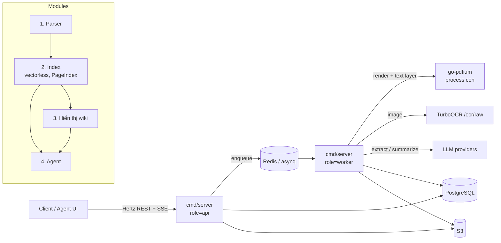
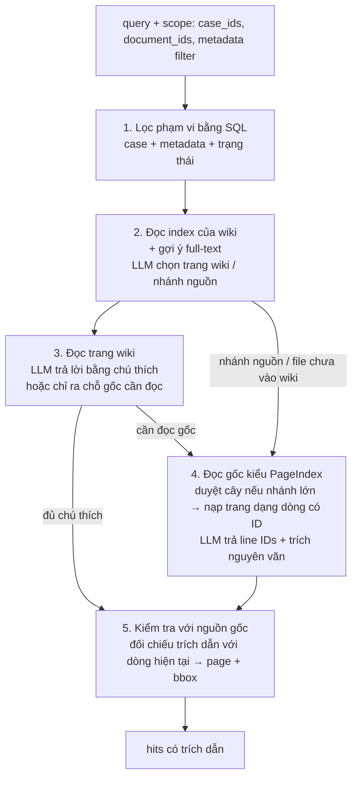

# BePaylot — Đặc tả kỹ thuật (Spec)

> Phiên bản: 0.6 · Ngày: 2026-09-27 · Trạng thái: đã triển khai P0–P3, P5 (case), P6 (LLM Wiki, API hiển thị wiki) và giao diện wiki/graph/case trong `frontend/`, xem §13, §15
>
> Phạm vi: nền tảng xử lý tài liệu, tìm kiếm và agent gồm bốn module:
> **Parser → Index (vectorless: LLM Wiki + PageIndex) → Hiển thị wiki hồ sơ (kiểu DeepWiki) → Agent**. Mọi tài liệu thuộc một **case** (bộ hồ sơ theo một mã nghiệp vụ, ví dụ mã thanh toán `RT112233`), và case là phạm vi cứng khi agent tìm kiếm.
>
> Thay đổi so với 0.5 (U26):
> - **Ingest wiki tiết kiệm LLM.** LLM chỉ còn một việc: **trích xuất** entity, thuộc tính và quan hệ dạng JSON ngắn, **1 lần gọi mỗi file** (file lớn: 1 lần mỗi phần). Mọi trang wiki (trang nguồn, trang entity, `overview`) được **dựng bằng code** từ cây mục lục đã có lúc index (§6.5) và từ kết quả trích xuất (§6.8). Trước đó mỗi file tốn khoảng 8–16 lần gọi vì LLM viết văn xuôi cho từng trang.
> - Code kiểm từng giá trị trích xuất với dòng gốc; chú thích lấy nguyên văn dòng gốc, nên không còn bước "viết lại trang khi chú thích sai".
> - Gỡ file, chú thích lỗi thời và làm mới trang **không gọi LLM**: trang được dựng lại từ dữ liệu còn lại.
> - Bỏ trang `topic` do LLM đề xuất (chỉ còn trang do người dùng tạo). Graph (Module 3) là liên kết giữa các trang wiki.
> - **Index theo đúng `index.md` của Karpathy và tối ưu token (U27).** Index được đọc **ở mỗi câu hỏi**, nên mỗi dòng chỉ còn `[w<n>] tiêu đề — tóm tắt một dòng (metadata)`, nhóm theo loại; bỏ slug (server ánh xạ `w<n>`). Tóm tắt entity = định danh + **vai trò** trong hồ sơ + số tệp; vai trò do LLM trả thêm **trong cùng lần gọi trích xuất** (không thêm lần gọi) và được lưu như thuộc tính có chú thích. Log ghi cả **query** như `log.md`. Prompt search bỏ trường `reason` (token đầu ra); tool `wiki_index` bỏ bảng `refs` lặp lại index; `wiki_read` nhận ID `w<n>` và không lặp lại những gì nội dung trang đã có.
> - Cấu hình: thêm `wiki.ingest.extract` (tắt = 0 lần gọi LLM, wiki chỉ có trang nguồn và tổng quan), `wiki.ingest.parallel`, `wiki.ingest.max_entities`; `max_llm_calls` mặc định 8; bỏ `wiki.parallel_pages`, `wiki.max_dropped_ratio`, `wiki.ingest.llm_confirm`.
>
> Thay đổi so với 0.4:
> - Thêm khái niệm **case** (§6.2): bảng `cases`, `documents.case_id NOT NULL` (không FK), loại case cấu hình bằng YAML để dùng cho nhiều bài toán (thanh toán, tín dụng doanh nghiệp…) mà không sửa code.
> - **Phiên agent gắn với một `case_id`** (§8.1). Mọi tool chỉ thấy tài liệu, cây mục lục và wiki của case đó. Bỏ `kb_ids` và `kb_filter` trên session.
> - Mã hồ sơ không còn là metadata (`ma_ho_so`). Metadata theo file vẫn giữ để lọc **bên trong** case (§6.3).
> - Chống trùng file theo `(case_id, sha256)` thay vì theo KB (§6.2, §9.2).
> - Bổ sung yêu cầu U18–U25 (§0, có cột "Hiệu lực" ghi yêu cầu nào đã được làm rõ hoặc thay), R11–R15 (§1), API case và wiki (§10.1, §10.4–10.5), tiêu chí N16–N25 (§12), giai đoạn P5–P6 (§13).
> - Thẻ tài liệu bỏ `doc_type` do LLM đoán: hệ thống không phân loại giấy tờ lúc index (§6.1, §6.5).
> - **Module 2** viết lại theo concept **LLM Wiki** của Karpathy, kết hợp PageIndex (§6.1). Mỗi case có một wiki do LLM biên soạn và duy trì (ingest / query / lint, có index và log), **lưu trong Postgres** thay vì file (§6.6–6.9). Search đọc index của wiki trước, rồi trang wiki, rồi mới đi theo trích dẫn xuống trang gốc để kiểm (§6.10).
> - **Module 3** chỉ còn phần **hiển thị** wiki theo hồ sơ, kiểu DeepWiki (§7).
> - Graph entity của bản 0.4 được gộp vào wiki: entity là trang wiki, quan hệ là liên kết có kiểu, `graph_schemas` thành `wiki_schemas` (§6.7). **Dữ liệu graph/wiki cũ bị xoá** ở migration `0014`.
>
> Thay đổi so với 0.3: thêm §0 (các yêu cầu gốc của người dùng), đồng bộ API §10 với code, trạng thái §13 và §15 (triển khai, khác biệt, việc chưa kiểm được).
>
> Thay đổi so với 0.1/0.2:
> - **Không dùng embedding** cho tài liệu. Search do LLM suy luận trên cây mục lục được nạp vào context (§6).
> - Render PDF bằng **thư viện Go (go-pdfium)**, có giới hạn RAM/CPU. **Text layer** (đặc biệt PDF/A) được dùng để sửa và bổ sung kết quả OCR (§5.7, §5.8).
> - File gốc và ảnh lưu trên **S3**, metadata lưu trên **Postgres** (§9.1).
> - Thêm **metadata tuỳ chọn theo file** (ví dụ `ma_ho_so`): gán khi upload, kể cả upload nhiều file một lần, và tìm kiếm/lọc được theo metadata (§6.3, §9, §10).

---

## 0. Yêu cầu gốc của người dùng

Các yêu cầu dưới đây là nguồn của spec, ghi theo thứ tự đưa ra. Mọi thay đổi spec về sau phải giữ đúng các yêu cầu này. Nếu một yêu cầu sau **làm rõ hoặc thay** yêu cầu trước, cột "Hiệu lực" ghi rõ; khi hai yêu cầu khác nhau thì yêu cầu sau thắng.

| # | Yêu cầu (tóm tắt nội dung người dùng đưa ra) | Hiệu lực | Đáp ứng tại |
|---|---|---|---|
| U1 | Cấu trúc dự án bố trí giống WeKnora | còn hiệu lực | §3 |
| U2 | Xử lý job/task tương tự WeKnora, đặc biệt với file PDF nặng | còn hiệu lực | §4 |
| U3 | Các module phân tách độc lập, dễ maintain | còn hiệu lực | §3.3 (có test `internal/archtest`) |
| U4 | Dùng CloudWeGo Hertz để phát triển API | còn hiệu lực | §1.1, §10 |
| U5 | Cơ sở dữ liệu dùng Postgres (pgvector) | còn hiệu lực | §9 |
| U6 | **Module Parser:** engine mặc định built-in là TurboOCR, theo mẫu `spec/parser/ocr_curl.txt` và response `spec/parser/output_example.json`. Kết quả phải có đầy đủ nội dung trang, các line, thứ tự trang và nội dung markdown, sao cho tra ngược thông tin text về trang và vị trí được tường minh | còn hiệu lực | §5 |
| U7 | **Module 2:** bộ chuyển đổi vectorless tạo nội dung cho hybrid search, lưu vào database, hỗ trợ tìm kiếm trên toàn bộ nội dung file theo trang | **được làm rõ bởi U22, U24**: "nội dung cho search" là wiki của hồ sơ theo LLM Wiki, lưu Postgres; tìm theo trang vẫn giữ | §6 |
| U8 | **Module 3:** chuyển nội dung đã parse thành graph kiểu wiki: xác định entity và quan hệ, cho phép cấu hình nhiều schema khác nhau, gọi LLM để trích xuất | **được thay bởi U23, U24, được làm rõ bởi U26**: Module 3 là phần hiển thị wiki kiểu DeepWiki. Entity, quan hệ và schema cấu hình nằm trong wiki của Module 2 (entity = trang wiki, quan hệ = liên kết có kiểu, schema = wiki schema). Phần "gọi LLM để trích xuất" giữ nguyên nghĩa: LLM chỉ trích xuất (1 lần gọi mỗi file), trang do code dựng (U26) | §6.6–6.8, §7 |
| U9 | **Module cuối:** agent, như source code đang có | còn hiệu lực; phạm vi theo case (U21) | §8 |
| U10 | Vectorless nghĩa là **không dùng embedding**. Search kiểu PageIndex: nạp context (cây mục lục) để LLM xác định nội dung nào cần tìm trong file | còn hiệu lực, **được mở rộng bởi U22, U24**: nạp index của wiki trước, cây mục lục dùng bên trong từng file | §6.1, §6.5, §6.10 |
| U11 | Mỗi file có **metadata đi kèm, không bắt buộc**, và search được theo metadata. Ví dụ upload nhiều file cùng gán một mã hồ sơ thì phải tìm được theo mã hồ sơ đó | metadata vẫn giữ; **phần mã hồ sơ được thay bởi U18** (mã hồ sơ là case, không phải metadata) | §6.2, §6.3, §10.2 |
| U12 | Render PDF sang ảnh bằng **thư viện Go**, nhanh, kiểm soát được RAM/CPU | còn hiệu lực | §5.7 |
| U13 | Với PDF/A (và PDF có text), nếu lấy được nội dung text thì dùng để **bổ sung context** cho đúng | còn hiệu lực | §5.8 |
| U14 | Ngôn ngữ lập trình là Go | còn hiệu lực | toàn bộ |
| U15 | File lưu trên **S3 storage**, ảnh cũng vậy; metadata lưu **Postgres** | còn hiệu lực; dữ liệu wiki cũng lưu Postgres (U24) | §9.1 |
| U16 | Spec đặt tại `spec/spec.md`, viết tiếng Việt | còn hiệu lực | — |
| U17 | Parser OCR: gọi TurboOCR lấy layout, **cắt ảnh theo từng vùng** của trang, gọi **đồng thời** VLM (host theo chuẩn OpenAI, thử với `allenai/olmocr-2-7b` chạy local) để lấy text, rồi tổng hợp lại theo từng trang | còn hiệu lực | §5.9 |
| U18 | Người dùng upload một loạt hồ sơ theo **một mã** (ví dụ mã thanh toán `RT112233`). Mã là khái niệm chung (**case**) để dùng cho nhiều bài toán khác (tín dụng doanh nghiệp…); không có khái niệm riêng của luồng thanh toán trong code, nhưng giữ đủ logic xử lý hồ sơ. Có **bảng case** | còn hiệu lực | §6.2, §9.2 |
| U19 | Parse bằng TurboOCR; nếu cấu hình VLM thì lấy text bằng VLM rồi gộp lại. TurboOCR vẫn luôn cung cấp text và **toạ độ** để hiển thị | còn hiệu lực (làm rõ U17) | §5.9 |
| U20 | Khi cần bóc tách trường thông tin hoặc kiểm tra tuân thủ một rule theo mã hồ sơ, người dùng chỉ việc hỏi agent. Agent tự tìm đúng tài liệu trong case bằng search vectorless, rồi bóc tách hoặc trả lời theo nội dung người dùng gửi | còn hiệu lực; search vectorless theo U22, U24 (index wiki → trang wiki → trang gốc) | §6.10, §8 |
| U21 | Tìm kiếm **cứng trong đúng một case**, không bao giờ nhầm sang case khác: phiên agent gắn với `case_id` để lấy đúng dữ liệu vectorless (wiki + cây mục lục của case) mà search. `documents.case_id` chỉ cần NOT NULL, **không cần FK** | còn hiệu lực | §6.2, §8.1 |
| U22 | **Module 2:** dựng vectorless theo concept PageIndex. Tạo **một nội dung mô tả chung của hồ sơ** để search nhanh hơn, tiết kiệm token hơn: nạp nội dung này thay cho cả đống file | còn hiệu lực, **được làm rõ bởi U24**: nội dung mô tả chung là wiki của hồ sơ và index của nó | §6.1, §6.6, §6.10 |
| U23 | **Module 3:** hiển thị dạng **wiki**, giống https://deepwiki.com nhưng theo mức **hồ sơ** (case) | còn hiệu lực | §7 |
| U24 | Vectorless viết rõ theo concept **LLM Wiki** (https://gist.github.com/karpathy/442a6bf555914893e9891c11519de94f): nguồn gốc bất biến → wiki do LLM duy trì → schema; các thao tác ingest / query / lint; có index và log. Khác gist: dữ liệu wiki **lưu ở Postgres**, không lưu file | còn hiệu lực, **được làm rõ bởi U26**: "wiki do LLM duy trì" nghĩa là LLM trích xuất, code dựng và duy trì trang | §6.1, §6.6–6.10, §9.2 |
| U25 | **Xoá dữ liệu graph/wiki cũ** để dựng lại theo cách mới | còn hiệu lực | §9.2 (migration `0014`) |
| U26 | Tối ưu LLM Wiki theo đúng concept của Karpathy và **giảm số lần gọi LLM**: cây mục lục đã có sau khi index thì dùng luôn để hiển thị wiki theo nội dung, không để LLM dựng lại; LLM chỉ trích xuất entity/quan hệ (JSON có cấu trúc, không viết văn xuôi), code gộp theo định danh, kiểm với dòng gốc và dựng trang; gỡ file hay làm mới trang không gọi LLM | còn hiệu lực | §6.6–6.9 |
| U27 | Index và tóm tắt theo đúng `index.md` của LLM Wiki (catalog mọi trang: link, tóm tắt một dòng, metadata như ngày hoặc số nguồn, nhóm theo loại; đọc index trước rồi mới đi vào trang), tóm tắt được làm ngay khi ingest; **tối ưu token**, tránh token thừa; dữ liệu vẫn lưu Postgres | còn hiệu lực | §6.6, §6.8, §6.10, §8.2 |

## 1. Yêu cầu chung

| # | Yêu cầu | Cách đáp ứng trong spec này |
|---|---|---|
| R1 | Cấu trúc dự án bố trí giống WeKnora | Phân lớp `types` / `types/interfaces` / `application/service` / `application/repository` / `handler` / `router` / `container` như WeKnora (§3) |
| R2 | Xử lý job/task tương tự WeKnora, nhất là file PDF nặng | Hàng đợi `asynq` + Redis, nhiều worker pool cô lập, fan-out theo **từng trang**, retry theo trang, dead-letter, khôi phục khi restart (§4) |
| R3 | Module phân tách độc lập, dễ maintain | Mỗi module chỉ giao tiếp qua interface trong `types/interfaces` và qua task; có quy tắc import bắt buộc (§3.3) |
| R4 | API dùng CloudWeGo **Hertz** | Toàn bộ HTTP qua Hertz, SSE qua `hertz-contrib/sse` (giữ nguyên từ code hiện tại) |
| R5 | CSDL là **PostgreSQL + pgvector** | Một Postgres duy nhất cho dữ liệu, metadata (JSONB), full-text và wiki (trang, chú thích, liên kết, index, log) (§9). Luồng tài liệu **không dùng vector**; pgvector chỉ còn phục vụ phần tìm skill sẵn có của agent |
| R6 | Search không dùng embedding: LLM Wiki + PageIndex | LLM đọc **index của wiki** (mô tả chung của hồ sơ), rồi trang wiki; khi cần thì duyệt cây mục lục của file (PageIndex), đọc trang và chỉ ra đúng dòng. Mọi hit được đối chiếu lại với dòng gốc (§6.1, §6.10) |
| R7 | Metadata tuỳ chọn theo file, tìm được theo metadata (trong case) | `documents.metadata` JSONB + GIN, gán khi upload đơn lẻ hoặc theo lô, lọc bằng toán tử `eq/in/prefix/range`; mã hồ sơ là case, không phải metadata (§6.2, §6.3) |
| R8 | Render PDF → ảnh bằng thư viện Go, nhanh, kiểm soát RAM/CPU; PDF/A có text thì dùng bổ sung | go-pdfium chạy multi-process, DPI thích ứng, tái chế process, timeout theo trang; text layer hợp nhất với OCR theo dòng (§5.7, §5.8) |
| R9 | Code bằng Go; file và ảnh lưu S3, metadata lưu Postgres | §9.1 |
| R10 | Layout TurboOCR + VLM đọc từng vùng đồng thời, tổng hợp theo trang | engine `turboocr_vlm`: cắt vùng, fan-out có giới hạn, căn text VLM với dòng OCR để giữ bbox/offset (§5.9) |
| R11 | Tài liệu nhóm theo mã hồ sơ, agent chỉ tìm trong đúng hồ sơ, dùng được cho nhiều bài toán | Bảng `cases` + loại case trong YAML (§6.2); session agent gắn một `case_id` bất biến, mọi truy vấn của tool lọc `case_id` phía server (§8.1) |
| R12 | Tri thức của hồ sơ được biên soạn sẵn để search nhanh, rẻ token (LLM Wiki), lưu Postgres | Ingest từng file vào wiki của case (trang nguồn, entity, chủ đề, chú thích về dòng gốc), index + log + lint; bảng `wiki_*` (§6.6–6.9, §9.2) |
| R13 | Entity, quan hệ, schema cấu hình được | Wiki schema YAML theo loại case: loại entity + định danh, quan hệ có kiểu, quy ước viết (§6.7) |
| R14 | Hiển thị wiki theo hồ sơ kiểu DeepWiki | Module 3: UI ba cột, chú thích tới trang gốc + bbox, sơ đồ liên kết, Nhật ký, Kiểm tra, "Hỏi về hồ sơ" (§7) |
| R15 | Dữ liệu graph/wiki cũ bị xoá | Migration `0014` xoá bảng cũ và ingest lại mọi file (§9.2) |

### 1.1 Tech stack

| Thành phần | Lựa chọn | Ghi chú |
|---|---|---|
| Ngôn ngữ | Go 1.26 | giữ như `go.mod` hiện tại |
| HTTP | `cloudwego/hertz` | + `hertz-contrib/sse`, `hertz-contrib/swagger` |
| LLM / Agent | `cloudwego/eino` (+ eino-ext) | giữ nguyên module agent hiện có |
| DB | PostgreSQL 16 + `pg_trgm`, `unaccent`, `pgcrypto`, `citext` (+ `pgvector` cho skill của agent) | driver `jackc/pgx/v5`, migration `pressly/goose` (giữ như hiện tại) |
| Task queue | `hibiken/asynq` + Redis 7 | giống WeKnora |
| Object storage | **S3** (AWS S3 / MinIO / Ceph), `aws-sdk-go-v2` | file gốc, ảnh trang, JSON thô từ OCR/text layer, ảnh crop, markdown toàn văn (§9.1) |
| Render PDF | `klippa-app/go-pdfium` (PDFium), chế độ multi-process | render + encode JPEG trong process con, giới hạn CPU/RAM, lấy text layer có toạ độ (§5.7) |
| Ảnh | Go stdlib `image/*`, `golang.org/x/image` (tiff, draw) | file ảnh upload trực tiếp |
| OCR mặc định | TurboOCR (`POST /ocr/raw`) | engine built-in, cắm thêm engine khác qua interface |
| OCR bằng VLM | endpoint OpenAI-compatible (`/v1/chat/completions`), mặc định `allenai/olmocr-2-7b` (vLLM, LM Studio…) | engine `turboocr_vlm`: TurboOCR cho layout, VLM đọc text từng vùng (§5.9) |

---

## 2. Kiến trúc tổng thể


```mermaid
flowchart LR
  U[Client / Agent UI] -->|Hertz REST + SSE| API[cmd/server<br/>role=api]
  API -->|enqueue| R[(Redis / asynq)]
  API --> PG[(PostgreSQL)]
  API --> OS[(S3)]

  R --> W[cmd/server<br/>role=worker]
  W -->|render + text layer| PDF[go-pdfium<br/>process con]
  W -->|image| OCR[TurboOCR /ocr/raw]
  W -->|extract / summarize| LLM[LLM providers]
  W --> PG
  W --> OS

  subgraph Modules
    M1[1. Parser] --> M2[2. Index<br/>vectorless, PageIndex]
    M2 --> M3[3. Hiển thị wiki]
    M2 --> M4[4. Agent]
    M3 --> M4
  end
```

- **Một binary, nhiều vai trò**: `cmd/server --role=api|worker|all` (mặc định `all` cho dev). Production chạy API và worker thành deployment riêng để scale worker theo tải OCR.
- **Luồng dữ liệu**: case + file + metadata → trang → block/line (Parser) → cây mục lục có tóm tắt + section + chỉ mục full-text → wiki của hồ sơ (LLM trích xuất, code dựng trang), lưu Postgres (Index, §6.6) → hiển thị kiểu DeepWiki (Module 3) → tool cho Agent.
- **Mọi thứ đều truy vết được về nguồn**: section, kết quả search, chú thích trong wiki, câu trả lời của agent đều mang `source_spans` / `citation_id` trỏ về `(document_id, page_no, line_no, bbox)`.

---

## 3. Cấu trúc dự án

### 3.1 Cây thư mục

Phân lớp theo WeKnora. Mỗi module nghiệp vụ là **một package con** trong `service/` và `repository/`, thay vì để phẳng như WeKnora.

```
cmd/
  server/              main: --role=api|worker|all, -migrate-only
  pdfium-worker/       process con của go-pdfium (multi_threaded), do pool render sinh ra
  seed/                tạo user + API key (giữ nguyên)
  skills-sync/         đồng bộ skills (giữ nguyên)
configs/
  config.yaml
  mcp.yaml
  wiki_schemas/        wiki schema theo loại case (YAML, §6.7), nạp vào DB khi khởi động
  case_types/          loại case (YAML, §6.2), nạp khi khởi động
migrations/
  postgres/            goose SQL migrations (chuyển từ internal/store/migrations)
internal/
  config/              nạp YAML + ${ENV}
  container/           wiring phụ thuộc, khởi tạo worker pool, khôi phục task khi restart
  router/
    router.go          đăng ký route Hertz theo nhóm
    routes_document.go
    routes_search.go
    routes_wiki.go
    routes_agent.go    (routes hiện có: /v1/messages, /v1/ag-ui, sessions, skills, mcp)
    task.go            đăng ký asynq handler + khởi tạo các server theo pool
  handler/             HTTP handler mỏng: bind → gọi service → trả DTO
    dto/
  middleware/          auth, request-id, recover, CORS; asynq: dead-letter, tracing, background ctx
  types/               entity, enum, payload task, cấu hình queue
    interfaces/        interface của service & repository (hợp đồng giữa các module)
  application/
    service/
      cases/           case và loại case (§6.2); tên `cases` vì `case` là từ khoá Go
      document/        Module 1: điều phối parse (split → page → assemble)
      index/           Module 2: section, cây mục lục + tóm tắt (PageIndex), FTS, metadata, search (index wiki → trang wiki → gốc)
      wiki/            Module 2: LLM Wiki của case — ingest, retract, lint, index, log, schema (§6.6–6.9); API đọc/sửa cho Module 3
      agent/           Module 4: session, message, run (bọc internal/agent)
    repository/
      postgres/        repository thuần SQL (pgx)
      retriever/
        postgres/      lọc metadata + truy vấn FTS/trigram
  parser/              engine parse (không phụ thuộc DB)
    engine.go          interface Engine + registry
    turboocr/          client TurboOCR + ánh xạ response
    pdf/               go-pdfium: probe, render batch, text layer, bookmark
    textlayer/         kiểm tra chất lượng + hợp nhất text layer với OCR (§5.8)
    assemble/          layout + lines → page model → markdown
  storage/             ObjectStore trên S3 (aws-sdk-go-v2): upload/download stream, presign
  queue/               asynq client, topology queue/pool, helper enqueue
  agent/ llm/ tools/ skills/ mcp/ retrieval/    (giữ nguyên code hiện có)
  logging/
deploy/
  docker-compose.yml   postgres(pgvector, dùng cho skill) + redis + minio (S3) + turboocr(optional)
  Dockerfile           kèm libpdfium (version cố định) + binary pdfium-worker
docs/                  swagger (swaggo)
skills/
spec/                  tài liệu mẫu (parser/ocr_curl.txt, output_example.json)
```

### 3.2 Ánh xạ từ code hiện tại

| Hiện tại | Chuyển sang | Ghi chú |
|---|---|---|
| `internal/domain` | `internal/types` | entity dùng chung |
| `internal/store/*.go` | `internal/application/repository/postgres` | giữ pgx, không chuyển sang GORM |
| `internal/store/migrations` | `migrations/postgres` | giữ số thứ tự; migration mới bắt đầu từ `0006` |
| `internal/api` | `internal/handler` (+ `handler/dto`) | route giữ nguyên đường dẫn |
| `internal/server` | `internal/router` + `internal/middleware` | Hertz engine, SSE writer |
| `cmd/server/wire.go` | `internal/container` | wiring tay, không dùng `dig` |

Việc chuyển code là refactor thuần: **không đổi hành vi, không đổi API** của phần agent. Nên làm trong một PR riêng trước khi thêm module mới.

### 3.3 Quy tắc độc lập module (bắt buộc, có kiểm tra CI)

1. `service/<A>` **không import** `service/<B>`. Nếu cần gọi chéo thì phụ thuộc vào `types/interfaces.<B>Service`, được inject tại `container`.
2. `handler` chỉ phụ thuộc `types/interfaces`, không phụ thuộc repository.
3. `parser/*` là thư viện thuần: không biết DB, queue hay HTTP, nên test được bằng file mẫu.
4. Module sau **chỉ đọc** dữ liệu của module trước qua interface đọc (`DocumentReader`, `SectionReader`), không ghi chéo bảng.
5. Chuyển giai đoạn luôn đi qua **task** (không gọi đồng bộ), để mỗi giai đoạn retry và scale độc lập.
6. CI chạy một test kiểm tra import graph (`go list -deps`) để chặn vi phạm quy tắc 1–3.

---

## 4. Hệ thống Job / Task (theo mô hình WeKnora)

### 4.1 Worker pool và queue

Mỗi pool là một `asynq.Server` riêng, nên concurrency được cô lập cứng: import hàng loạt không làm nghẽn các việc khác. Topology khai báo **một chỗ duy nhất** (`types/task.go`: `QueueDefinition{Name, Pool, Weight, TaskTypes}`) và được dùng cho cả khởi tạo server lẫn trang admin.

| Pool | Queue (weight) | Task type | Concurrency mặc định | Lý do |
|---|---|---|---|---|
| `core` | `default`(1), `interactive`(3) | `document:split`, `document:assemble` | 4 | việc nhẹ, cần độ trễ thấp |
| `render` | `render`(1), `render_interactive`(3) | `page:render` | `render.workers` (mặc định `min(NumCPU-1,4)`) | nặng CPU; số task song song = số process PDFium (§5.7) |
| `ocr` | `page`(1), `page_interactive`(3) | `page:ocr` | 8 (= năng lực TurboOCR) | nặng I/O, **nút thắt chính**; tách riêng để bảo vệ OCR |
| `index` | `index`(1), `index_interactive`(3) | `index:build`, `index:tree` | 6 | tách section, full-text, dựng cây + tóm tắt node (gọi LLM). Là điều kiện để search được nên tách khỏi pool `wiki` (ingest chạy sau, không chặn search) |
| `wiki` | `wiki`(1) | `wiki:ingest`, `wiki:retract`, `wiki:lint`, `wiki:index` | 8 | nhiều lần gọi LLM, không ai chờ trực tiếp; tuần tự trong một case (khoá `wiki:active:{case}`), song song giữa các case (§6.8) |
| `maintenance` | `low`(1) | `document:delete`, `case:delete`, `kb:delete`, `document:reparse`, `housekeeping:sweep` | 2 | việc dài, chạy nền |

- Queue `*_interactive` dành cho file đính kèm trong chat (người dùng đang chờ). Queue này có weight cao hơn để không bị kẹt sau import hàng loạt, giống `QueueChatAttachment` của WeKnora.
- Concurrency cấu hình qua `config.yaml` hoặc env `BEPAYLOT_ASYNQ_<POOL>_CONCURRENCY`.
- Mọi handler được bọc middleware: `backgroundCtx` → `tracing` → `deadLetter` → `cancelGuard` (bỏ qua nếu document đã `cancelled`/`deleting`).

### 4.2 Pipeline xử lý một tài liệu

```mermaid
sequenceDiagram
  participant API
  participant Q as asynq
  participant S as document:split
  participant RD as page:render (batch)
  participant P as page:ocr (xN)
  participant A as document:assemble
  participant I as index:*
  participant G as wiki:*

  API->>API: giải case (tạo nếu chưa có), stream upload → S3 (+ sha256, quét PDF/A), validate metadata, tạo documents(status=queued, case_id, metadata)
  API->>Q: document:split (TaskID=split:{doc})
  Q->>S: tải PDF về cache → pdfium Probe: page_count, kích thước, Info, bookmark → tạo N document_pages(pending)
  S->>Q: Advance(doc): enqueue các page:render batch đầu tiên
  Q->>RD: mở PDF 1 lần → mỗi trang: render JPEG + text layer → S3 → page rendered
  RD->>Q: enqueue page:ocr cho từng trang đã render; Advance(doc)
  Q->>P: stream ảnh S3 → TurboOCR → hợp nhất text layer → assemble trang → lưu page/blocks/lines
  P->>Q: Advance(doc): bù cửa sổ render/ocr
  P->>P: UPDATE documents SET pages_done=pages_done+1 RETURNING
  P->>Q: nếu done+failed = page_count → document:assemble (TaskID=assemble:{doc}:{gen})
  Q->>A: ghép markdown toàn văn + offset, status=indexing
  A->>Q: index:build
  Q->>I: section + FTS → index:tree (dựng cây, tóm tắt node bằng LLM)
  I->>Q: task_pending_ops(op=ingest) của case (nếu wiki bật)
  Q->>G: wiki:ingest (tuần tự theo case) → ghi trang + chú thích + liên kết → index → log → wiki:lint khi hàng đợi hết
```

### 4.3 Xử lý file PDF nặng (vài trăm đến vài nghìn trang)

| Vấn đề | Cách xử lý |
|---|---|
| Upload file lớn | Stream thẳng từ multipart vào S3 (multipart upload, RAM ≤ 64 MB), không buffer toàn file. Giới hạn `upload.max_bytes` (mặc định 500 MB). Tính sha256 trong khi stream để dedup trong cùng KB. |
| Render tốn RAM/CPU | go-pdfium chạy multi-process: số process = giới hạn CPU; bitmap nằm trong process con, chặn bởi `MaxPixels`; process được tái chế theo số trang và RSS; timeout mỗi trang thì kill process. Một batch mở PDF một lần. PDF gốc được cache trên đĩa local (LRU có giới hạn dung lượng). Chi tiết ở §5.7 |
| Tách render (CPU) khỏi OCR (I/O) | Hai pool riêng. Ảnh render xong nằm trên S3 nên OCR chạy song song với render các trang sau; lỗi OCR không bắt render lại |
| Một file chiếm hết render/OCR | **`Advance(doc)`**: hàm idempotent, khoá dòng `documents` (`FOR UPDATE`), đếm trang theo trạng thái rồi bù cửa sổ: ≤ `render_inflight_batches` batch render (mặc định 1) **và** ≤ `render_ahead_pages` trang đã render mà chưa OCR (mặc định 32, tạo backpressure); ≤ `ocr_inflight_pages` trang đang OCR (mặc định 8). Hàm được gọi sau mỗi task render/ocr và bởi `housekeeping:sweep`. Nhờ vậy nhiều file lớn chạy xen kẽ công bằng |
| Lỗi một trang làm hỏng cả file | Retry **theo trang** (`MaxRetry=3`, backoff mũ, `Timeout=15m`/trang để đủ cho engine `turboocr_vlm`, §5.9). Batch render lỗi thì các trang đã xong được giữ, chỉ retry phần còn lại. Trang OCR hết lượt retry mà có text layer đạt chất lượng thì dựng từ text layer (§5.8). Nếu không, trang được đánh dấu `failed` và ghi dead-letter; document vẫn assemble với trạng thái cuối `partial` kèm danh sách trang lỗi. Có thể reparse riêng trang đó. |
| Trùng lặp / chạy hai lần | Task ID xác định: `render:{doc}:{first_page}:{gen}`, `ocr:{doc}:{n}:{gen}`. Kết quả ghi bằng `UPSERT` theo `(document_id, page_no)`. `gen` tăng mỗi lần reparse để task cũ tự bỏ qua. |
| Đếm hoàn thành đúng khi chạy song song | `UPDATE documents SET pages_done = pages_done + 1 ... RETURNING pages_done, pages_failed, page_count`. Chỉ task nhìn thấy tổng = `page_count` mới enqueue `assemble`; task này còn có `TaskID` duy nhất để chống trùng. |
| OCR service quá tải hoặc sập | Concurrency của pool `ocr` = năng lực OCR. Client có circuit breaker: lỗi 5xx hoặc timeout liên tiếp thì mở mạch 30 giây, task trả lỗi retry thay vì dồn request. |
| Restart giữa chừng | Asynq giữ task trong Redis. `housekeeping:sweep` (chạy mỗi 5 phút) tìm trang `processing` quá `2 × timeout` mà không có task sống trong asynq, rồi đưa về `pending` và enqueue lại. Trang đã `rendered` không render lại, trang đã `done` **không bao giờ OCR lại**. |
| Theo dõi tiến độ | `documents.progress` (pages_done/page_count) và bảng `processing_spans` (giống `knowledge_processing_spans` của WeKnora). SSE `GET /v1/documents/:id/events` đẩy sự kiện thay đổi trạng thái. |
| Huỷ | `POST /cancel` đặt `status=cancelled`. Middleware `cancelGuard` bỏ qua các task còn lại; các trang đã xong vẫn được giữ. |
| Trang trắng / trang ảnh nhỏ | Trang có kết quả OCR rỗng được lưu `is_blank=true`, không tạo section. |

### 4.4 Tham số task mặc định

| Task | Queue | MaxRetry | Timeout | TaskID (dedup) |
|---|---|---|---|---|
| `document:split` | default / interactive | 3 | 5m | `split:{doc}:{gen}` |
| `page:render` | render / render_interactive | 3 | 10m (batch) | `render:{doc}:{first_page}:{gen}` |
| `page:ocr` | page / page_interactive | 3 | 3m | `ocr:{doc}:{n}:{gen}` |
| `document:assemble` | default | 3 | 10m | `assemble:{doc}:{gen}` |
| `index:build` | index | 3 | 30m | `index:{doc}:{gen}` |
| `index:tree` | index | 5 | 30m | `tree:{doc}:{gen}` |
| `wiki:ingest` / `wiki:retract` | wiki | 5 | 60m | `wi:{case}:{doc}:{gen}`; tuần tự theo case (§6.8) |
| `wiki:lint` | wiki | 3 | 30m | `wl:{case}:{wiki_version}` |
| `wiki:index` | wiki | 5 | 2m | `wx:{case}:{wiki_version}` |
| `document:delete` | low | 3 | 1h | `del:{doc}` |
| `case:delete` | low | 3 | 1h | `delcase:{case}` |

### 4.5 Dead-letter và pending ops (theo WeKnora)

- **`task_dead_letters`**: middleware asynq ghi một dòng khi task hết retry. Dòng gồm `task_type`, `scope`, `scope_id`, `related_id` (ví dụ `page_no`), `payload`, `last_error` và `fail_count`. Admin xem và retry qua API (§10.6).
- **`task_pending_ops`**: hàng đợi bền trong DB cho việc cần gom lô hoặc debounce (hàng đợi ingest tuần tự của wiki theo case). Dữ liệu sống qua restart và không bị TTL của Redis xoá.

### 4.6 Trạng thái document

```
queued → splitting → parsing → assembling → indexing → enriching → completed
                                   │                                  ↑
                                   └──(có trang failed)──────────→ partial
bất kỳ ─→ failed | cancelled | deleting
```

- `enriching` = file đang được ingest vào wiki (§6.8); chỉ có khi wiki của case bật. Search đã dùng được từ khi index xong: document ở `enriching` vẫn tìm kiếm được.
- Lọc theo metadata và tìm full-text theo trang dùng được **ngay khi parse xong** (trước khi có cây). Search kiểu cây cần `index:tree` hoàn tất.
- Mỗi giai đoạn con có trạng thái riêng: `parse_status`, `index_status`, `wiki_status`. UI và agent nhờ đó biết chính xác phần nào đã sẵn sàng.

### 4.7 Callback khi document hoàn thành (tuỳ chọn)

**Mục đích.** Hệ thống gọi upload không phải poll trạng thái. Họ truyền `callback_url` và bepaylot gửi `POST` tới URL đó khi document kết thúc.

**Khai báo.**
- Field form `callback_url` của `POST /kbs/:id/documents` là **tuỳ chọn** và áp cho mọi file của lần upload. Không truyền thì không có callback nào.
- Có thể đổi URL khi reparse: `callback_url` trong body `POST /documents/:id/reparse`.
- URL được lưu ở `documents.callback_url`.
- File trùng (cùng sha256 trong case): URL mới thay URL cũ. Nếu document đã kết thúc thì callback được gửi ngay.

**Khi nào gửi.** Khi document tới trạng thái cuối, sự kiện tương ứng được gửi:
- `completed` → `document.completed`;
- `partial` → `document.partial`;
- `failed` → `document.failed`;
- `cancelled` → `document.cancelled`.

`enriching` chưa phải trạng thái cuối: wiki bật thì callback đi sau khi file đã ingest vào wiki. Mỗi `(document, gen, run, url)` có đúng **một** lần giao (bảng `document_callbacks`), nên trạng thái bị ghi hai lần cũng không gửi hai lần. `run` tăng mỗi lần reparse theo trang (cùng gen), nên lần hoàn thành mới lại có callback. Mọi chỗ đổi trạng thái đi qua `document.Service.updateStatus`, và chính hàm này tạo lần giao.

**Request.** Luôn là `POST`, `Content-Type: application/json`. Header:

| Header | Ý nghĩa |
|---|---|
| `X-Bepaylot-Event` | `document.completed` … |
| `X-Bepaylot-Delivery` | id lần giao, **không đổi giữa các lần thử**; phía nhận dùng để chống trùng (giao ít nhất một lần) |
| `X-Bepaylot-Attempt` | lần thử thứ mấy (1, 2, …) |
| `X-Bepaylot-Timestamp` | unix giây lúc gửi |
| `X-Bepaylot-Signature` | `sha256=hex(HMAC_SHA256(secret, timestamp + "." + body))`, chỉ có khi cấu hình `callback.signing_secret` |

Body được cố định lúc tạo lần giao, nên mọi lần thử gửi cùng nội dung:

```json
{
  "event": "document.completed",
  "delivery_id": "…",
  "occurred_at": "2026-09-25T14:48:35Z",
  "document": {
    "id": "…", "kb_id": "…", "case_id": "…", "case_code": "RT112233", "batch_id": "…", "file_name": "…", "mime_type": "…", "size_bytes": 0,
    "gen": 1, "status": "completed", "parse_status": "done", "index_status": "done", "wiki_status": "done",
    "page_count": 1, "pages_done": 1, "pages_failed": 0, "metadata": {"loai_giay_to": "…"},
    "title": "…", "summary": "…", "error": "…(khi failed)", "created_at": "…", "updated_at": "…"
  },
  "links": {"document": "/v1/documents/…", "markdown": "/v1/documents/…/markdown", "pages": "/v1/documents/…/pages"}
}
```

**Thành công và retry.**
- Chỉ HTTP **2xx** là thành công. Redirect không được đi theo và bị tính là lỗi.
- Lỗi mạng, timeout (`callback.timeout`, mặc định 10 s) hoặc mã khác 2xx đều bị tính là lỗi. Lần thử đó được ghi lại, và lần sau được hẹn theo `callback.backoff` (mặc định 10s, 30s, 1m, 5m, 15m, 30m, 1h; giá trị cuối lặp lại).
- Hết `callback.max_attempts` lần (mặc định 8) thì lần giao chuyển `failed`.
- Retry do chính handler `document:callback` tự lên lịch (task mới với `ProcessIn`), không dựa vào retry của asynq, nên trạng thái trong DB luôn khớp số lần đã gửi.
- Queue `callback` thuộc pool `core`.

**Lưu trạng thái.**
- `document_callbacks`: `state` (`pending | succeeded | failed`), `attempts`, `max_attempts`, `last_status_code`, `last_error`, `last_attempt_at`, `next_attempt_at`, `delivered_at`, `payload`.
- `document_callback_attempts`: mỗi lần thử một dòng, gồm `status_code`, `error`, 1000 ký tự đầu của response và `duration_ms`.
- Xem bằng `GET /documents/:id/callbacks`.
- Gọi lại bằng `POST /documents/:id/callbacks/retry` (body tuỳ chọn `{callback_id}`): lần giao được mở lại thêm `max_attempts` lần thử và gửi ngay.

**Chống sót.** `housekeeping:sweep` tạo lần giao cho document đã kết thúc có `callback_url` mà chưa có bản ghi (process chết giữa lúc cập nhật trạng thái và lúc lên lịch). Nó cũng enqueue lại các lần giao `pending` đã quá hạn hơn 5 phút.

**An toàn (SSRF).**
- Chỉ nhận `http`/`https`, không nhận URL có user:password, độ dài tối đa 2048.
- Mặc định **chặn** đích là loopback, mạng riêng, link-local, CGNAT và multicast. Việc kiểm tra làm trên **IP đã phân giải lúc dial**, nên đổi DNS cũng không vượt qua được. Không dùng proxy.
- `callback.allow_private_networks: true` chỉ dùng cho dev (callback về `localhost`).
- URL sai bị từ chối ngay lúc upload (`422`), và các file của lần upload đó bị xoá.

**Cấu hình** (`callback`): `timeout, max_attempts, backoff, signing_secret (BEPAYLOT_CALLBACK_SECRET), allow_private_networks (BEPAYLOT_CALLBACK_ALLOW_PRIVATE)`.

---

## 5. Module 1 — Parser

### 5.1 Mục tiêu

Chuyển file (PDF, ảnh; giai đoạn 2 thêm DOCX/XLSX qua convert sang PDF) thành **mô hình trang có cấu trúc**:

- đầy đủ nội dung từng trang, giữ **thứ tự trang** và **thứ tự đọc** trong trang;
- đến cấp **line**: text, độ tin cậy, bounding box;
- nhóm theo **block** (layout region): tiêu đề, đoạn văn, bảng, ảnh, công thức, header;
- **markdown** theo trang và markdown toàn văn, mỗi line có **offset ký tự** trong cả hai;
- từ một đoạn text bất kỳ tra ngược ra được `trang → block → line → bbox`, và ngược lại.

### 5.2 Engine TurboOCR (mặc định, built-in)

Request (tham chiếu `spec/parser/ocr_curl.txt`):

```
POST {turboocr.base_url}/ocr/raw?layout=1&reading_order=1&tables=1&formulas=1
Content-Type: application/octet-stream
Body: <bytes ảnh trang, JPEG>
```

Response (tham chiếu `spec/parser/output_example.json`):

| Trường | Kiểu | Ý nghĩa | Cách dùng |
|---|---|---|---|
| `results[]` | `{id, text, confidence, bounding_box[4][2], layout_id}` | từng **line** OCR, bbox là tứ giác pixel (TL, TR, BR, BL) | → `page_lines` |
| `layout[]` | `{id, class, class_id, confidence, bounding_box[4][2]}` | vùng layout | → `page_blocks` |
| `reading_order[]` | `int[]` (id của `results`) | thứ tự đọc các line | → `line_no` |
| `tables[]` | `{layout_id, html, confidence, bounding_box}` | bảng dạng HTML, gắn với block `table` | → `page_blocks.html` + markdown bảng |
| `formulas[]` (khi bật) | `{layout_id, latex, ...}` | công thức | → `page_blocks.latex` |

Nhận xét từ file mẫu, bắt buộc xử lý:

1. **Block không có line**: 5/35 layout (ví dụ `header` 15, `image` 34) không có line nào. Vẫn lưu block, đặt `text=''`; với `image` thì lưu ảnh crop.
2. **Line nằm trong block `image`**: text trên con dấu ("PHÒNG / KINH T / NHA BỊCH") được gắn cho block `image`. Giữ line và đánh dấu `in_figure=true`. Mặc định line này không đưa vào section dùng cho graph nhưng vẫn tìm kiếm được.
3. **`reading_order` có thể sai hình học**: line 17 "3. Ngành, nghề kinh doanh:" nằm **phía trên** bảng nhưng lại đứng sau mọi line của bảng. Assembler áp dụng bước sửa thứ tự: nếu block X nằm hoàn toàn phía trên block Y và hai block giao nhau theo trục ngang ≥ 30%, thì X phải đứng trước Y (bật/tắt bằng `parser.reading_order_fix`).
4. **Line OCR chất lượng thấp** (con dấu ngân hàng: "Ngày surta thhnng am ng Băm"): line có `confidence < parser.low_conf_threshold` (mặc định 0.6) được đánh dấu `low_confidence=true`. Không loại bỏ, nhưng index và graph giảm trọng số hoặc bỏ qua.
5. **`class_id` phụ thuộc model OCR**. Hệ thống **chỉ dựa vào `class` (tên)** và ánh xạ sang `BlockType` chuẩn qua bảng cấu hình, không hard-code id.
6. **Block `header`** trong mẫu chứa quốc hiệu và cơ quan ban hành, tức là **nội dung có giá trị**. Chỉ coi là "page furniture" (loại khỏi body) khi cùng text lặp lại ở ≥ 50% số trang (running header/footer), giống cơ chế lọc lặp lại theo trang của WeKnora.

### 5.3 BlockType chuẩn

| `class` của OCR | `BlockType` | Markdown |
|---|---|---|
| `doc_title` | `title` | `# …` |
| `paragraph_title` | `heading` | `## …` (cấp heading có thể suy từ cỡ bbox hoặc đánh số "1.", "I.") |
| `text`, `abstract`, `content`, `reference`, `aside_text` | `paragraph` | nối các line thành đoạn; line kết thúc bằng gạch nối thì ghép liền |
| `table` | `table` | HTML → GFM table nếu không có `rowspan`/`colspan`, ngược lại giữ HTML đã làm sạch |
| `formula`, `formula_number` | `formula` | `$$ latex $$` |
| `image`, `chart`, `seal`, `header_image`, `footer_image` | `figure` | `` + text trong hình (nếu có) dạng `> ` |
| `figure_title`, `table_title`, `chart_title` | `caption` | `*…*` |
| `header`, `footer`, `number`, `footnote` | `header` / `footer` / `page_number` / `footnote` | theo quy tắc lặp lại ở mục 5.2 (6) |
| (khác) | `unknown` | như `paragraph` |

### 5.4 Mô hình dữ liệu parse (Go)

```go
// internal/types/parse.go
type BBox struct { X0, Y0, X1, Y1 float64 }          // pixel trên ảnh trang
type Quad [4][2]float64                                // tứ giác gốc từ OCR

type ParsedPage struct {
    PageNo      int           // 1-based
    Width       int           // px ảnh đã render
    Height      int
    DPI         int           // để quy đổi về point PDF: pt = px * 72 / DPI
    Rotation    int
    Engine      string        // "turboocr"
    TextSource  string        // ocr | merged | layer_only (§5.8) | vlm (§5.9)
    TextQuality float64       // chất lượng text layer, 0 nếu không có
    IsBlank     bool
    Blocks      []ParsedBlock // đã sắp theo thứ tự đọc
    Lines       []ParsedLine  // đã sắp theo thứ tự đọc
    Markdown    string        // markdown của riêng trang
    RawRef      string        // object key của JSON gốc từ OCR (để debug/reparse)
}

type ParsedBlock struct {
    BlockNo    int       // thứ tự đọc trong trang (0-based)
    SourceID   int       // layout.id gốc
    Type       BlockType
    RawClass   string
    Confidence float64
    BBox       BBox
    Text       string    // các line ghép lại
    HTML       string    // bảng
    LaTeX      string    // công thức
    AssetKey   string    // ảnh crop (figure)
    IsFurniture bool
    MdStart, MdEnd int   // offset (rune) trong ParsedPage.Markdown
}

type ParsedLine struct {
    LineNo     int       // thứ tự đọc trong trang (0-based)
    SourceID   int       // results.id gốc
    BlockNo    int       // -1 nếu không thuộc block nào
    Text       string
    Confidence float64
    Quad       Quad
    BBox       BBox
    InFigure, LowConfidence bool
    TextSource string    // ocr | layer | layer_only
    TextOCR    string    // text gốc từ OCR (khi đã thay bằng text layer)
    TextLayer  string    // text layer tương ứng (khi không dùng để thay)
    MdStart, MdEnd int   // offset trong markdown trang; -1 nếu không xuất hiện (vd line trong bảng)
}
```

- **Offset tính theo rune (ký tự Unicode)**, không theo byte, vì tiếng Việt có dấu.
- Line thuộc bảng không có offset riêng trong markdown (bảng render từ HTML). Line vẫn được lưu với `BlockNo` của bảng, nên tra vị trí theo bảng hoặc theo text của line.
- **Markdown toàn văn** = nối markdown các trang, mỗi trang bắt đầu bằng marker `<!-- page:{n} -->`. Bảng `document_pages.doc_md_offset` lưu offset đầu trang trong toàn văn, nên `doc_offset = doc_md_offset[page] + page_offset`.

Ví dụ markdown trang từ file mẫu (sau khi sửa thứ tự đọc):

```markdown
<!-- page:1 -->
UBND XÃ NHA BÍCH
PHÒNG KINH TẾ

CỘNG HÒA XÃ HỘI CHỦ NGHĨA VIỆT NAM
Độc lập - Tự do - Hạnh phúc

# GIẤY CHỨNG NHẬN ĐĂNG KÝ HỘ KINH DOANH

Mã số hộ kinh doanh: 070082001498
...
3. Ngành, nghề kinh doanh:

| STT | Tên ngành | Mã ngành |
|---|---|---|
| 1 | Gia công cơ khí; xử lý và tráng phủ kim loại Chi tiết: Gia công tôn) | 2592 |
| 2 | Bán buôn vật liệu, thiết bị lắp đặt khác trong xây dựng (Chi tiết: …) | 4673 (Chính) |

4. Vốn kinh doanh:
...
```

### 5.5 Interface engine (cắm được engine khác)

```go
// internal/parser/engine.go
type PageImage struct {
    DocumentID string
    PageNo     int
    Image      []byte // JPEG
    Width, Height, DPI int
}

type Engine interface {
    Name() string
    // ParsePage nhận ảnh một trang, trả về dữ liệu thô đã chuẩn hoá (chưa ghép markdown).
    ParsePage(ctx context.Context, in PageImage, opt PageOptions) (*RawPage, error)
    Health(ctx context.Context) error
}

type PageOptions struct { Layout, ReadingOrder, Tables, Formulas bool }

// Registry: chọn engine theo KB config hoặc theo request reparse.
type Registry interface {
    Get(name string) (Engine, bool)
    Default() Engine
    List() []EngineInfo
}
```

- `parser/turboocr`: client HTTP (timeout, retry cho lỗi mạng, circuit breaker) cộng với ánh xạ response → `RawPage`.
- `parser/assemble`: nhận `RawPage` và trả `ParsedPage` (sắp thứ tự, gán line vào block, dựng markdown, tính offset, lọc furniture). Hàm thuần: có golden test với `spec/parser/output_example.json`.
- `parser/pdf`: go-pdfium, `Probe` + `RenderBatch` (§5.7).
- `parser/textlayer`: kiểm tra chất lượng + hợp nhất với OCR (§5.8). Hàm thuần, có golden test.
- Chế độ PDF: `parser.pdf_mode = ocr_all` (mặc định, mọi trang qua OCR nên dữ liệu line/bbox đồng nhất) hoặc `auto` (P4: trang có text layer đạt chất lượng thì bỏ qua OCR, §5.8 bước 7). Ở `ocr_all`, text layer vẫn được dùng để sửa và bổ sung OCR.

### 5.6 Tra cứu vị trí (locate)

| Truy vấn | Kết quả |
|---|---|
| `(doc, page, line_no)` | text + quad + bbox (px và pt) + block |
| `(doc, doc_md_start, doc_md_end)` | danh sách `(page, line_no, bbox)` giao với đoạn |
| `(doc, text, page?)` | tìm chuỗi (chuẩn hoá khoảng trắng, không phân biệt dấu nếu `fuzzy=true`, dùng `pg_trgm`) và trả các vị trí khớp |
| `citation_id` / `section_id` / chú thích wiki (`wiki_footnotes`) | `source_spans[]` → danh sách vị trí |

Kết quả `locate` đủ để UI tô sáng vùng trên ảnh trang: `GET /v1/documents/:id/pages/:n/image` cộng với bbox.

### 5.7 Render PDF bằng Go (pdfium) — nhanh và kiểm soát được RAM/CPU

**Chọn thư viện**

| Lựa chọn | Kết luận |
|---|---|
| **`github.com/klippa-app/go-pdfium`** (binding Go cho PDFium) | **Chọn.** PDFium là engine của Chrome: render nhanh, ổn định với PDF lỗi. Giấy phép BSD/Apache, dùng thương mại được. Một thư viện lo cả render, text layer có toạ độ, metadata Info và bookmark |
| `gen2brain/go-fitz` (MuPDF) | Loại: MuPDF là **AGPL**, cần license thương mại |
| `pdfcpu` (thuần Go) | Không render được. Chỉ dùng làm phương án dự phòng để đọc XMP/metadata khi cần |
| Gọi `pdftoppm` (poppler) qua subprocess | Loại: yêu cầu là dùng thư viện Go, và subprocess mỗi trang tốn chi phí khởi động |

**Chế độ chạy go-pdfium**

| Chế độ | Khi nào dùng | Cách kiểm soát tài nguyên |
|---|---|---|
| `multi_threaded` (**production**) | worker mặc định | Mỗi instance là **một process con** (`cmd/pdfium-worker`) chạy PDFium đơn luồng. Số process = số trang render song song = số core dùng cho render. Một PDF làm treo hoặc crash chỉ giết process con đó; pool tự sinh lại |
| `webassembly` (dev/CI) | máy dev, CI không có `libpdfium` | Thuần Go (wazero), không cần cgo. Chậm hơn nên không dùng cho production |
| `single_threaded` | không dùng | PDFium không thread-safe; chế độ này buộc tuần tự hoá toàn process |

Binary PDFium lấy từ bản build dựng sẵn (ví dụ `bblanchon/pdfium-binaries`), cố định version trong `Dockerfile`, build với `CGO_ENABLED=1` và tag `pdfium_experimental` nếu cần API thử nghiệm.

**Package `internal/parser/pdf`**

```go
type Renderer interface {
    // Probe: số trang, kích thước từng trang (pt), Info dict, bookmark, dấu hiệu PDF/A.
    Probe(ctx context.Context, path string) (*DocInfo, error)
    // RenderBatch mở document MỘT lần rồi xử lý một dải trang liên tiếp.
    // Mỗi trang gọi emit ngay khi xong, để upload S3 song song với việc render trang tiếp theo.
    RenderBatch(ctx context.Context, path string, pages []int, opt RenderOptions,
        emit func(PageRender) error) error
}

type RenderOptions struct {
    DPI          int  // mặc định 300
    MaxLongSide  int  // px, mặc định 4000: chặn trang khổ lớn (A0, bản vẽ)
    MaxPixels    int  // mặc định 16_000_000 (RGBA ≈ 64 MB)
    JPEGQuality  int  // mặc định 85
    ExtractText  bool // lấy text layer kèm toạ độ pixel (§5.8)
}

type PageRender struct {
    PageNo        int
    JPEG          []byte   // đã encode trong process con
    Width, Height int      // px
    DPI           float64  // DPI thực tế sau khi áp MaxLongSide/MaxPixels
    WidthPt, HeightPt float64
    Rotation      int
    Text          *TextLayer // nil nếu không có text layer
    RenderMs, TextMs int
}
```

Cách gọi PDFium (tên API theo go-pdfium hiện hành, cần xác nhận khi code):
- `OpenDocument{FilePath}`: mở từ **file trên đĩa**. PDFium đọc lazy theo xref, không nạp cả file vào RAM.
- `RenderToFile{RenderPageInDPI | RenderPageInPixels, OutputFormat: JPG, OutputQuality, OutputTarget: Bytes}`: render **và encode JPEG ngay trong process con**. Chỉ khoảng 0,5–2 MB JPEG đi qua RPC về process chính, bitmap RGBA lớn không bao giờ rời process con.
- `GetPageTextStructured{Mode: Rects, PixelPositions: {Calculate, Width, Height}}`: text layer có toạ độ **pixel khớp đúng ảnh vừa render**, nên không phải tự quy đổi toạ độ hay xử lý xoay trang.
- `FPDF_GetMetaText` (Title, Author, Subject, Keywords, Creator, Producer, CreationDate), `GetBookmarks` (mục lục/outline).

**DPI thích ứng**

DPI thực tế = `min(DPI, MaxLongSide / cạnh_dài_inch, sqrt(MaxPixels / diện_tích_inch²))`. Trang A4 ở 300 DPI (2480×3508 ≈ 8,7 MP) giữ nguyên. Trang A0 tự hạ DPI, nên không bao giờ sinh bitmap hàng GB. DPI thực tế được lưu vào `document_pages.dpi` để quy đổi toạ độ về sau.

**Kiểm soát RAM/CPU**

| Cơ chế | Chi tiết |
|---|---|
| Giới hạn CPU | `render.workers` process con (mặc định `min(NumCPU-1, 4)`); mỗi process PDFium đơn luồng, nên CPU tối đa ≈ `render.workers` core. Pool asynq `render` có concurrency đúng bằng số này |
| Giới hạn RAM mỗi trang | `MaxPixels` chặn kích thước bitmap; bitmap sống trong process con và được giải phóng ngay sau khi encode (`Cleanup()`) |
| Tái chế process | Process con bị kill và sinh lại sau `render.recycle_after_pages` trang (mặc định 500), hoặc khi RSS > `render.max_worker_rss_mb` (mặc định 1024, đọc `/proc/<pid>/status`). Cách này chặn rò rỉ bộ nhớ tích luỹ của PDFium |
| Timeout mỗi trang | `render.page_timeout` (mặc định 30s). Quá hạn thì kill process con; trang đó được retry, sau đó đánh dấu `failed` (PDF độc hại hoặc lỗi) |
| Mở document một lần mỗi batch | `page:render` xử lý `render.batch_pages` trang liên tiếp (mặc định 8) trên một lần `OpenDocument`, rồi `FPDF_CloseDocument` |
| Pipeline trong batch | Render trang *n+1* chạy song song với upload S3 trang *n* (kênh có buffer 2) nên RAM phía Go ≤ ~3 JPEG mỗi worker |
| File nguồn trên đĩa local | Worker tải PDF gốc từ S3 về `render.cache_dir` (tải song song theo range). Cache LRU giới hạn `render.cache_max_bytes` (mặc định 20 GB); file đang dùng được pin, không bị xoá |
| Giới hạn container | Deployment worker đặt `resources.limits` (cgroup), với `GOMEMLIMIT` ≈ 70% limit cho process Go chính |

**File ảnh (không phải PDF)**: JPEG/PNG/TIFF được decode bằng thư viện chuẩn Go và `golang.org/x/image/tiff`, xoay theo EXIF orientation, thu nhỏ bằng `golang.org/x/image/draw` nếu vượt `MaxPixels`, rồi coi như PDF một trang. TIFF nhiều trang để P4, vì `x/image/tiff` chỉ đọc trang đầu.

**Mục tiêu hiệu năng** (đo bằng benchmark `make bench-render` trên máy tham chiếu 4 vCPU, là cổng nghiệm thu của P1):
- A4 ở 300 DPI, render + encode JPEG: ≤ 300 ms/trang/worker (p95).
- Throughput với 4 worker: ≥ 12 trang/giây.
- RSS process chính ≤ 300 MB; mỗi process con ≤ `max_worker_rss_mb`.

### 5.8 Text layer và PDF/A — bổ sung cho OCR

**Mục đích.** Với PDF có text layer (đặc biệt PDF/A), text layer cho **đúng từng ký tự**: dấu tiếng Việt, chữ số, mã số, số tiền. OCR thì có thể sai ở đúng những chỗ này (ví dụ "BỊCH" thay cho "BÍCH"). Hệ thống vẫn dùng OCR để lấy layout, block, thứ tự đọc và bảng; text layer được dùng để **sửa và bổ sung nội dung**, và để làm giàu context cho LLM.

**Nhận diện PDF/A**
- Quét luồng byte **ngay khi upload** (cùng lúc tính sha256, không đọc file thêm lần nào) để tìm `pdfaid:part` và `pdfaid:conformance` trong XMP. PDF/A yêu cầu metadata stream không nén, nên quét byte là đủ. Dự phòng: đọc bằng `pdfcpu` khi quét không kết luận được.
- Lưu `documents.pdfa_part` (1–4) và `documents.pdfa_conformance` (`a`/`b`/`u`/`e`/`f`).
  - `a` và `u` bảo đảm ánh xạ Unicode, nên text layer **được tin cậy cao**.
  - `b` chỉ bảo đảm hiển thị: vẫn lấy text layer nhưng phải qua kiểm tra chất lượng như PDF thường.

**Áp dụng cho PDF nào**: cấu hình `parser.text_layer.enabled = all | pdfa_only | off` (mặc định `all`). PDF sinh từ Word/Excel cũng có text layer tốt; PDF/A chỉ làm tăng mức tin cậy.

**Kiểm tra chất lượng text layer theo trang** (`text_quality` ∈ [0,1]):
- đủ ký tự (≥ `min_chars`, mặc định 20);
- tỉ lệ ký tự lỗi (U+FFFD, Private Use Area, ký tự điều khiển) < 2%;
- tỉ lệ chữ tiếng Việt hoặc Latin hợp lệ trên tổng chữ cái;
- **độ khớp với OCR**: độ tương đồng Levenshtein chuẩn hoá giữa text layer và text OCR, sau khi bỏ dấu.

Kiểm tra này chặn trường hợp "text layer rác": font không có ToUnicode, hoặc lớp OCR ẩn chất lượng kém do phần mềm scan tạo ra.

**Thuật toán hợp nhất theo dòng** (chạy trong `page:ocr`, sau khi có kết quả OCR):

1. Text layer (các rect có toạ độ pixel) được gom thành từ.
2. Với mỗi line OCR: lấy các từ của text layer có tâm nằm trong bbox của line (nới rộng 15% chiều cao dòng) và chưa được gán cho line nào, sắp theo x, rồi ghép lại.
3. `sim = similarity(unaccent(ocr), unaccent(layer))`:
   - nếu `sim ≥ merge_min_similarity` (mặc định 0.6) và trang đạt chất lượng: `text = text layer`, `text_source = layer`, giữ `text_ocr` để đối chiếu;
   - nếu không: giữ OCR và lưu text layer vào `text_layer` để tham khảo.
4. **Từ của text layer không thuộc line OCR nào** (OCR bỏ sót): gom thành dòng theo trục y và thêm làm line mới (`text_source = layer_only`). Line mới được gán vào block chứa nó; nếu không có block nào chứa thì tạo block `paragraph` mới, chèn vào thứ tự đọc theo vị trí.
5. **Bảng**: với line OCR thuộc bảng đã được thay text, thay chuỗi tương ứng trong HTML của ô (khớp chính xác chuỗi OCR, best-effort).
6. **Dự phòng khi OCR hỏng**: trang có text layer đạt chất lượng mà OCR thất bại hết lượt retry thì **không đánh dấu `failed`**. Trang được dựng từ text layer (dòng theo toạ độ, không có layout), với `text_source = layer_only` và `status = done`.
7. `pdf_mode = auto` (P4): trang có text layer đạt chất lượng và không bị ảnh phủ (tỉ lệ diện tích ảnh < 0,5, như WeKnora) được **bỏ qua OCR**, dựng layout từ text layer.

**Bổ sung context cho LLM và search**
- Info dict và XMP (`dc:title`, `dc:description`, `dc:subject`) được lưu vào `documents.pdf_info` (JSONB, **tách biệt** với metadata người dùng nhập). Các trường này được đưa vào thẻ tài liệu (§6.5) và `meta_tsv`.
- **Bookmark/outline** của PDF là nguồn khung cây ưu tiên cao nhất khi dựng cây mục lục (§6.5).
- Khi nạp trang cho LLM (§6.10, bước 4), dòng đã hợp nhất được dùng. Dòng có `text_source = ocr` và `low_confidence` có thêm hậu tố `(?)` để LLM biết độ tin cậy thấp.
- Chỉ số `pages_text_layer` / `page_count` được hiển thị trên UI để biết file có "text thật" hay không.

Golden test: một PDF/A-2u mẫu gồm một trang sinh từ Word và một trang scan có lớp OCR ẩn kém. Kết quả mong đợi: trang 1 lấy text layer (dấu và số đúng), trang 2 giữ OCR (`sim` thấp).

### 5.9 Engine `turboocr_vlm` — layout TurboOCR + đọc từng vùng bằng VLM

**Mục đích.** TurboOCR cho layout, dòng và bbox tốt, nhưng text có thể sai dấu, sai số hoặc dính chữ trên bản scan xấu. Một VLM chuyên OCR (mặc định `allenai/olmocr-2-7b`) đọc text chính xác hơn nhưng không trả về vị trí. Engine `turboocr_vlm` kết hợp cả hai: **vị trí lấy từ TurboOCR, nội dung lấy từ VLM**, và vẫn giữ tra cứu tường minh theo trang/dòng/bbox (§5.6).

**Luồng một trang** (task `page:ocr`, package `internal/parser/vlm`):

```
ảnh trang (S3) ──► TurboOCR /ocr/raw?layout=1&reading_order=1&tables=1
                     │  lines + regions (layout) + reading_order
                     ▼
               chọn vùng cần đọc ──► cắt ảnh từng vùng (+padding, thu nhỏ ≤ max_side)
                     │
                     ▼  đồng thời, giới hạn max_concurrency request/process
               VLM (OpenAI-compatible POST /v1/chat/completions, ảnh base64)
                     │  text markdown (+ YAML front matter của olmOCR, bị bỏ)
                     ▼
               RawRegion.Text / .HTML (bảng) / .LaTeX (công thức)
                     ▼
               assemble.Build: căn text VLM với các dòng OCR của từng block
                     ▼
               assemble.Render: markdown trang (text VLM nguyên văn) + offset từng dòng
```

**Chọn vùng.**
- Chỉ gửi các lớp dạng text: `doc_title, paragraph_title, text, abstract, content, reference, aside_text, algorithm, table, formula, figure_title, table_title, chart_title, header, footer, footnote` (cấu hình `classes`). Ảnh, con dấu và số trang để lại cho OCR.
- Vùng nhỏ hơn `min_side` px bị bỏ.
- **Vùng lồng nhau:** model layout hay trả vùng "container" bao vùng con, hoặc vùng con nằm trong vùng khác. Một vùng **không có dòng OCR nào** mà chồng ≥ 80% (theo diện tích vùng nhỏ hơn) với một vùng có dòng thì bị bỏ qua, vì nếu đọc sẽ nhân đôi text.
- Trang không có vùng nào (layout tắt hoặc rỗng) mà có dòng: gửi cả vùng bao các dòng (`full_page`).

**Gọi VLM.** Mỗi vùng là một request chat gồm prompt và ảnh JPEG `data:` URL. Prompt mặc định là prompt v4 của olmOCR: bảng dạng HTML, công thức dạng LaTeX, front matter YAML. Tất cả vùng của trang chạy song song; semaphore chung của process giới hạn `max_concurrency`. Lỗi 5xx/429/mạng được retry `retries` lần. Vùng vẫn lỗi thì:
- `on_error: fallback` (mặc định): giữ text OCR của vùng đó, ghi cảnh báo;
- `on_error: fail`: trang lỗi, task retry cả trang.

Kết quả gán theo loại vùng:
- `table`: nếu có `<table>` thì thay HTML bảng của TurboOCR (render thành GFM hoặc HTML sạch như §5.2); nếu là bảng markdown thì dùng nguyên văn.
- `formula`: bỏ dấu `$$`, `\[ \]` rồi lưu vào LaTeX.
- Các loại còn lại: lưu vào `RawRegion.Text`.

**Căn text VLM với dòng OCR** (`assemble/refine.go`, hàm thuần):
1. Tách từ của text VLM và của các dòng OCR trong block. So sánh theo dạng bỏ dấu, bỏ dấu câu ở hai đầu. Căn đơn điệu bằng quy hoạch động kiểu edit distance: thay thế tốn `1 − similarity` (hoặc 1 nếu khác hẳn), khoảng trống tốn 0,7.
2. **Chống bịa:** nếu số từ OCR khớp tốt (chi phí ≤ 0,5) ít hơn `min_coverage` (mặc định 0,3), hoặc text VLM dài hơn 4 × số từ OCR + 20, thì bỏ kết quả VLM và giữ OCR cho block đó.
3. **Cắt phần tràn:** chỉ giữ đoạn text VLM từ từ khớp tốt đầu tiên tới từ khớp tốt cuối cùng; ký hiệu markdown sát hai đầu được giữ. Chữ của vùng bên cạnh lọt vào do padding hoặc lồng vùng bị loại.
4. Mỗi dòng OCR nhận `text` = đoạn text VLM mà các từ của nó căn tới, `text_ocr` = text OCR gốc, `text_source = vlm`, và bỏ cờ `low_confidence`. Dòng không căn được giữ text OCR và không có offset.
5. Block nhận `text` = text VLM đã cắt và `text_source = vlm` (cột `page_blocks.text_source`, migration `0011`). Block không có dòng OCR nào nhưng có text VLM được tạo **dòng tổng hợp**: mỗi dòng text một dòng, chia đều theo chiều cao bbox của vùng.
6. `Render` ghi text VLM **nguyên văn** làm markdown của block (tiêu đề: một dòng, thêm `#`/`##`), rồi tìm lần lượt từng dòng VLM trong đó để đặt `md_start/md_end`. Vì vậy `markdown[md_start:md_end] == line.text` luôn đúng, và từ bất kỳ đoạn text nào vẫn tra ngược được trang + bbox. Render lại (đánh dấu header/footer lặp, §5.2) cho cùng kết quả vì block lưu `text_source`.
7. `PlainText` (FTS trang) dùng toàn bộ text VLM của block, kể cả từ không có dòng OCR tương ứng. `page.text_source = vlm` khi trang có ít nhất một block được refine.

**Không có layout → gửi cả trang** (`full_page: true`, mặc định). Khi TurboOCR lỗi (không kết nối được, timeout, circuit breaker mở), hoặc trả về trang không có vùng và không có dòng, thì cả ảnh trang (thu nhỏ về `max_side`) được gửi cho VLM trong **một** request. Nếu VLM cũng lỗi, trang lỗi và task retry. `SplitMarkdown` tách markdown trả về thành các vùng theo thứ tự đọc:
- `#`… → `doc_title` / `paragraph_title`;
- dòng thường khớp cấu trúc văn bản hành chính (`Điều N`, `Chương`, `Mục`, `Phần`) → `paragraph_title`;
- dòng VIẾT HOA bắt đầu bằng loại văn bản (`GIẤY`, `HỢP ĐỒNG`, `QUYẾT ĐỊNH`, `BIÊN BẢN`, `THÔNG BÁO`…) → `doc_title`;
- `<table>…</table>` / bảng `|` → `table`; `$$`/`\[` → `formula`;
- `` → `figure`, với bbox thật do model báo, quy đổi về pixel trang;
- còn lại là đoạn văn, tách theo dòng trống.

Vì không có OCR, bbox của vùng là **dải dọc xấp xỉ** tỉ lệ với độ dài text (confidence 0), và assemble tạo dòng tổng hợp trong dải đó. Tra cứu theo trang vẫn đúng; bbox chỉ gần đúng. Bảng không có dòng OCR thì mỗi hàng thành một dòng tổng hợp `ô | ô | ô`, được định vị trong bảng GFM, nên search/locate tới được từng ô. Chế độ này vẫn áp dụng khi pipeline tắt `Refine` (trang có text layer), vì khi layout lỗi thì VLM là nguồn text duy nhất của engine. Client TurboOCR có dial timeout 5 s, nên host không phản hồi chỉ giữ trang vài giây trước khi chuyển sang VLM. Raw lưu `mode: "full_page"` và `layout_error`.

**Quan hệ với text layer (§5.8).** Trang PDF có text layer đạt chất lượng thì **không gọi VLM** (`skip_with_text_layer: true`): text layer đúng từng ký tự và không tốn GPU. Trang đã refine bằng VLM thì không merge text layer nữa, vì merge theo dòng sẽ làm lệch markdown nguyên văn của block.

**Raw.** `ocr/raw` của trang lưu `{"engine":"turboocr_vlm","model":…,"layout":<JSON TurboOCR>,"regions":[{layout_id,class,bbox,ms,text,meta,prompt_tokens,completion_tokens,error}],"ms":…}` để debug và đo chi phí.

**Chọn engine.** Engine chỉ được đăng ký khi có `parser.engines.vlm.base_url`. Thứ tự ưu tiên: `engine` khi reparse document → `parser.engine` của loại case (§6.2) → `parser_engine` trong config của KB → `parser.default_engine` (`BEPAYLOT_OCR_ENGINE=turboocr_vlm`). Không cấu hình VLM thì engine này không đăng ký và mọi case dùng `turboocr` (text + toạ độ từ TurboOCR). `GET /v1/parser/engines` báo engine khả dụng khi cả TurboOCR và VLM đều sống và model có trong `/v1/models`.

**Timeout.** Một trang có thể có 30–50 vùng. Với model 7B chạy local (≈ 5–15 s/vùng), một trang mất cỡ 1 phút ở `max_concurrency: 4`, nên `page:ocr` có `Timeout = 15m`.

**Cấu hình** (`parser.engines.vlm`): `base_url, api_key, model, prompt, max_tokens, temperature, timeout, max_concurrency, classes, padding (12), max_side (1288), min_side, jpeg_quality (90), retries (1), on_error, full_page, min_coverage (0,3), skip_with_text_layer`.

**Kiểm thử.**
- Unit: căn dòng khi VLM nối đoạn, chống bịa, cắt text tràn, dòng tổng hợp, render lại ổn định, fan-out đồng thời có giới hạn, bỏ vùng lồng, `on_error`.
- Live: `VLM_BASE_URL=http://localhost:1234/v1 VLM_TEST_IMAGE=<ảnh> go test -run TestLiveVLM ./internal/parser/vlm`, dùng layout mẫu `spec/parser/output_example.json`.

---

## 6. Module 2 — Index (vectorless, kiểu PageIndex)

### 6.1 Nguyên tắc

**Không dùng embedding và không dùng vector search** cho tài liệu. "Vectorless" trong bepaylot kết hợp hai ý:
- **LLM Wiki** ([Karpathy](https://gist.github.com/karpathy/442a6bf555914893e9891c11519de94f)): LLM **biên soạn trước** hồ sơ thành một wiki bền vững, có liên kết chéo. Wiki được cập nhật dần khi có file mới, nên mỗi câu hỏi không phải đọc và tổng hợp lại từ đầu các file gốc.
- **PageIndex**: trong từng file, LLM duyệt **cây mục lục** (§6.5) để tới đúng trang, thay vì so độ giống vector.

**Vì sao.** Một hồ sơ vài chục file, vài trăm trang có thể lên tới hàng trăm nghìn token. Nạp cả đống file vào mỗi lần hỏi thì chậm, tốn token và dễ bỏ sót. LLM Wiki dời phần việc nặng (đọc, tóm tắt, nối các file với nhau) sang lúc **ingest**, làm một lần cho mỗi file. Khi search, hệ thống chỉ nạp **index của wiki** (vài nghìn token) và vài trang wiki, rồi mở đúng các trang gốc cần kiểm.

**Ba tầng** (theo LLM Wiki, điều chỉnh cho bepaylot):

| Tầng | Trong bepaylot | Ai ghi | Lưu ở đâu |
|---|---|---|---|
| **Nguồn gốc** (raw sources, bất biến) | file của case sau khi parse: trang, dòng, bbox (Module 1), cộng cây mục lục và section (§6.4, §6.5) | Parser/Index; LLM chỉ đọc | S3 + Postgres |
| **Wiki** (LLM trích xuất, code dựng) | mỗi case một wiki: trang tổng quan, trang nguồn (mỗi file một trang, dựng từ cây mục lục), trang entity, ghi chú; **index** và **log** (§6.6) | ingest: LLM trích xuất entity/quan hệ, code viết trang; lint bằng code; người dùng sửa tay được | **Postgres** (bảng `wiki_*`), không lưu file markdown |
| **Schema** (quy ước) | cấu trúc wiki theo loại case: loại entity, thuộc tính định danh, quan hệ, chủ đề gợi ý, quy ước viết (§6.7) | người quản trị cấu hình | YAML trong `configs/wiki_schemas`, nạp vào bảng `wiki_schemas` |

**Ba thao tác**

| Thao tác | Khi nào | Làm gì |
|---|---|---|
| **Ingest** (§6.8) | mỗi file index xong; file bị xoá hoặc reparse | code dựng trang nguồn từ cây mục lục; LLM trích xuất entity/thuộc tính/quan hệ (**1 lần gọi mỗi file**); code kiểm với dòng gốc, gộp vào trang entity (mâu thuẫn được giữ), dựng lại tổng quan, index, ghi log. Gỡ file không gọi LLM |
| **Query** (§6.10) | mỗi lần search / agent hỏi | đọc index → đọc trang wiki liên quan → đi theo trích dẫn về trang gốc để kiểm → trả hit có trích dẫn. Câu trả lời tốt có thể được **lưu lại thành trang ghi chú** (theo yêu cầu người dùng) |
| **Lint** (§6.9) | sau mỗi đợt ingest và định kỳ | tìm mâu thuẫn, trích dẫn cũ, trang mồ côi, thiếu liên kết, file chưa có trang; tự sửa phần sổ sách, báo cáo phần nội dung |

**Ví dụ chi phí.** Case 20 file, 400 trang có toàn văn khoảng 300.000 token.
- Index của wiki khoảng 4–6 nghìn token.
- Một câu hỏi thường chỉ cần index, 1–3 trang wiki và vài dòng gốc để kiểm: tổng khoảng 8–15 nghìn token, 2–3 lần gọi LLM.
- Chi phí đọc toàn văn được trả **một lần** lúc ingest, không trả lại ở mỗi câu hỏi.

**Nguyên tắc bắt buộc**
- **Nguồn gốc là sự thật; wiki là lớp biên soạn để tìm nhanh.** Mọi câu, con số và thuộc tính trong wiki đều có chú thích trỏ về dòng gốc (`citation_id`). Hit trả về từ search luôn trỏ về **dòng gốc** và được đối chiếu lại với nội dung gốc hiện tại (§6.10, bước 5).
- **Wiki không loại trừ.** Search không bao giờ bỏ một file chỉ vì wiki không nhắc tới nó. Nếu wiki không đủ để trả lời, search đi tiếp xuống cây và trang gốc (PageIndex). File đã index nhưng chưa ingest xong vẫn được đưa vào index dạng thẻ tài liệu.
- **Mô tả, không phân loại lúc index.** Trang nguồn tóm tắt nội dung file theo khoảng trang. Hệ thống không gán loại giấy tờ để lọc, và không tách "phần" của file. Một file gộp CCCD + biên bản + hoá đơn vẫn là một file, và trang nguồn của nó mô tả từng khoảng trang.
- **Không kết luận nghiệp vụ.** Wiki chỉ trình bày những gì có trong hồ sơ. Mâu thuẫn giữa các nguồn được nêu ra kèm trích dẫn nguyên văn của cả hai bên, không phán xét. Kiểm tra tuân thủ là việc của agent theo yêu cầu người dùng (§8.3).
- **Phạm vi là case** (§6.2): wiki, index, log và mọi bước search đều nằm trong một case. Không có trang wiki nào tổng hợp nhiều case.
- **Wiki lưu ở Postgres**, không lưu file. Trang, chú thích, liên kết, index, log và lịch sử sửa đều là bảng (§9.2), nên truy vấn, phân quyền, lịch sử và giao dịch đều dùng cơ chế của Postgres.
- Các tín hiệu **rẻ, xác định** (case và metadata qua SQL; full-text qua Postgres FTS + trigram trên trang gốc và trang wiki) dùng để thu hẹp phạm vi hoặc làm gợi ý. Chúng không thay thế suy luận của LLM.

**Module này tạo ra:**

| Thành phần | Phạm vi | Mục đích |
|---|---|---|
| **Metadata** (tuỳ chọn) | file | mô tả và lọc file trong case (§6.3) |
| **Section** (`sections`) | file | đơn vị nội dung ở lá của cây, dùng cho full-text, trích dẫn và ingest (§6.4) |
| **Cây tài liệu** (`doc_tree_nodes`) | file | mục lục có tóm tắt để duyệt kiểu PageIndex (§6.5) |
| **Wiki** (`wiki_pages`, `wiki_footnotes`, `wiki_links`) | case | tri thức đã biên soạn của hồ sơ (§6.6) |
| **Index của wiki** (`wiki_index`) | case | danh mục các trang, mỗi trang một dòng tóm tắt; nạp đầu tiên khi search (§6.6) |
| **Log** (`wiki_log`), **lint** (`wiki_lint_issues`) | case | lịch sử thay đổi wiki và các vấn đề cần xem (§6.6, §6.9) |
| **Chỉ mục full-text** trang gốc, section, trang wiki | file / case | gợi ý từ khoá, tìm trong file theo trang (§6.11) |

### 6.2 Case (bộ hồ sơ theo một mã) — phạm vi cứng

**Khái niệm.** Case là một bộ hồ sơ của một nghiệp vụ, định danh bằng mã do nghiệp vụ cấp: mã thanh toán `RT112233`, mã hồ sơ tín dụng doanh nghiệp, mã khoản vay… Code lõi chỉ biết "case", không có khái niệm riêng của luồng thanh toán. Bài toán mới chỉ cần một **loại case** (`case_type`) mới trong config, không sửa code. Các logic xử lý hồ sơ (parse, cây mục lục, wiki, search, locate, citation, agent) giữ nguyên cho mọi loại case.

**Quy tắc**
- Case thuộc một KB. Mã case là duy nhất trong KB (`UNIQUE (kb_id, code)` trên các case chưa xoá) và được lưu ở dạng đã chuẩn hoá theo loại case.
- Mỗi document thuộc **đúng một** case: `documents.case_id NOT NULL`. **Không có FK**; toàn vẹn do tầng service đảm bảo:
  - upload chỉ gắn file vào case đã tồn tại, cùng KB, chưa xoá, trạng thái `open`;
  - xoá case thì task `case:delete` xoá các document và toàn bộ dữ liệu wiki của case (không dựa vào `ON DELETE`);
  - `housekeeping:sweep` báo lỗi (log + dead-letter `scope=case`) nếu gặp document có `case_id` không trỏ tới case nào.
- `case_id` của document **không đổi** sau khi upload. Muốn chuyển file sang case khác thì xoá rồi upload lại, để việc chuyển luôn có vết.
- **Chống trùng theo `(case_id, sha256)`**, không theo KB. Cùng một file (ví dụ CCCD) được phép nằm ở hai case, và upload trùng không bao giờ trả về document của case khác.
- Metadata theo file (§6.3) vẫn giữ, nhưng chỉ dùng để mô tả và lọc **bên trong** case (loại giấy tờ, ngày nộp…). Metadata không còn là cách xác định hồ sơ.

**Loại case** (`configs/case_types/*.yaml`, nạp khi khởi động, không bắt buộc)

```yaml
# configs/case_types/thanh_toan.yaml
name: thanh_toan
title: Hồ sơ thanh toán
code:
  pattern: '^RT\d{6}$'         # mã không khớp → 422
  normalize: upper_trim         # " rt112233" → "RT112233"
case_metadata_schema:           # metadata của chính case (cùng cú pháp metadata_schema §6.3)
  fields:
    - { key: so_tien,  type: number }
    - { key: don_vi,   type: string }
metadata_schema:                # metadata của document trong case; thay cho metadata_schema của KB
  fields:
    - { key: loai_giay_to, type: string }
parser:
  engine: turboocr_vlm          # ghi đè engine của KB và parser.default_engine
wiki:
  enabled: true
  schema: thanh_toan            # configs/wiki_schemas/thanh_toan.yaml (§6.7)
```

```yaml
# configs/case_types/tin_dung_dn.yaml
name: tin_dung_dn
title: Hồ sơ tín dụng doanh nghiệp
code: { pattern: '^TD-\d{4}-\d{6}$', normalize: upper_trim }
parser: { engine: turboocr }
```

- Case không ghi loại thì thuộc loại `default`: mã tự do, chỉ `trim`, không kiểm tra thêm.
- Engine parse được chọn theo thứ tự: `engine` khi reparse → loại case → config KB → `parser.default_engine` (§5.9).
- Loại case **không** chứa workflow, prompt, danh sách trường cần bóc tách hay danh sách rule. Những thứ đó là nội dung người dùng gửi cho agent (§8.1).
- Đổi file YAML chỉ ảnh hưởng case và upload **mới**. Case cũ giữ `case_type`; mã đã lưu không bị chuẩn hoá lại.

**Vòng đời:** `open` → `closed` → xoá.
- Case `closed` không nhận upload mới, nhưng vẫn đọc, search, chat và xem wiki được. Wiki vẫn được lint và sửa tay.
- Xoá case là xoá mềm (`deleted_at`), sau đó task `case:delete` (pool `maintenance`) xoá từng document như `document:delete` (không chạy `wiki:retract` cho từng file), rồi xoá toàn bộ `wiki_*` của case. Session gắn với case đã xoá thì các tool tài liệu và wiki bị từ chối.

**Tạo case**
- Tạo trước bằng `POST /kbs/:id/cases`, hoặc tự tạo khi upload với `case_code` chưa tồn tại (§10.2).
- Hai upload đồng thời cùng mã phải ra cùng một case: `INSERT … ON CONFLICT (kb_id, code) DO NOTHING` rồi đọc lại.

**Phạm vi cứng**
- Mọi đường đọc tài liệu đều đi qua `case_id`: lọc ứng viên search, đọc index và trang wiki, duyệt cây mục lục, đọc trang, tìm trong file, locate, giải citation.
- Điều kiện luôn là `documents.case_id = $case AND documents.deleted_at IS NULL`, với `$case` lấy từ phía server (session agent, §8.1, hoặc tham số API đã kiểm quyền), không bao giờ lấy từ tham số model.
- Các bảng con (`document_pages`, `sections`, `doc_tree_nodes`, `page_lines`) không cần cột `case_id`, vì luôn được truy cập qua `document_id` đã kiểm phạm vi.

### 6.3 Metadata theo file

**Gán metadata**

- Mỗi file có `metadata` là một JSON object, **không bắt buộc**. Metadata dùng để mô tả và lọc file **trong** case, không dùng để xác định hồ sơ (§6.2). Ví dụ:
  ```json
  {"loai_giay_to": "GCN_HKD", "chi_nhanh": "Binh Phuoc", "ngay_nop": "2026-09-20"}
  ```
- **Upload nhiều file một lần**: request có `metadata` dùng chung cho cả lô, cộng `files_metadata` để ghi đè cho từng file (khớp theo tên field multipart hoặc theo chỉ số). Metadata cuối của một file = chung ⊕ riêng, trong đó riêng thắng. Mỗi lô có một `batch_id`, được lưu vào `documents.batch_id` để truy vết.
- Sửa được sau khi upload: `PATCH /v1/documents/:id/metadata` (merge hoặc replace), hoặc sửa hàng loạt theo bộ lọc (`POST /v1/kbs/:id/documents/metadata/bulk-update`). Sửa metadata **không** làm parse lại file.

**Metadata schema của KB (tuỳ chọn)**

KB có thể khai báo `metadata_schema` để kiểm tra dữ liệu và để LLM/agent biết có những field nào. Loại case có `metadata_schema` riêng thì schema đó được dùng cho document của case thay cho schema của KB (§6.2). Nếu không có schema nào thì metadata là JSON tự do (key dạng `snake_case`, value là string/number/bool/date hoặc mảng các kiểu đó).

```yaml
metadata_schema:
  fields:
    - { key: chi_nhanh,    type: string, required: false, description: "Chi nhánh tiếp nhận", normalize: upper_trim }
    - { key: loai_giay_to, type: enum,   values: [GCN_HKD, BCTC, HOP_DONG, CCCD, KHAC] }
    - { key: ngay_nop,     type: date }
    - { key: so_tien,      type: number }
  strict: false            # true = từ chối key không khai báo
```

- `normalize` (`upper_trim`, `lower_trim`, `none`) áp dụng **khi ghi** để lọc chính xác: "binh phuoc " được lưu thành "BINH PHUOC".
- Lỗi validate khi upload trả `422`, kèm tên file và field lỗi. Trong upload theo lô, file lỗi bị từ chối còn file hợp lệ vẫn được nhận (response liệt kê từng file).

**Tìm kiếm theo metadata**

Mọi API list/search nhận chung một bộ lọc `metadata`. Bộ lọc luôn được AND với phạm vi case (§6.2), không bao giờ mở rộng phạm vi:

```json
{
  "metadata": {
    "loai_giay_to": {"in": ["GCN_HKD", "CCCD"]},
    "ngay_nop": {"gte": "2026-01-01", "lt": "2026-07-01"},
    "chi_nhanh": {"prefix": "Binh"},
    "ghi_chu": {"exists": true}
  }
}
```

| Toán tử | SQL (tóm tắt) | Index |
|---|---|---|
| giá trị trực tiếp / `eq` | `metadata @> '{"k": v}'` | GIN `jsonb_path_ops` |
| `in` | `metadata @> ANY(...)` hoặc `metadata->>'k' = ANY($1)` | GIN / expression index |
| `gte/gt/lte/lt` | `(metadata->>'k')::<type>` so sánh (kiểu lấy theo schema) | expression index cho field hay dùng |
| `prefix` | `metadata->>'k' LIKE $1 || '%'` | expression index `text_pattern_ops` |
| `exists` | `metadata ? 'k'` | GIN |

- Field khai báo `indexed: true` trong `metadata_schema` sẽ được tạo expression index riêng (task `maintenance`), ví dụ `loai_giay_to` nếu hay lọc theo field này.
- **Tìm tự do theo giá trị metadata**: giá trị metadata được đưa vào `documents.meta_tsv` (full-text). Gõ "GCN_HKD" vào ô tìm kiếm trong case vẫn ra các file có giá trị đó, kể cả khi không dùng bộ lọc có cấu trúc. Tìm hồ sơ theo mã thì dùng danh sách case (`GET /kbs/:id/cases?q=`), không dùng metadata.
- **Liệt kê theo metadata**: `GET /v1/cases/:id/documents?metadata=<json>` trả các file của case khớp bộ lọc, kèm trạng thái xử lý.
- **Gom nhóm**: `GET /v1/kbs/:id/metadata/values?key=loai_giay_to&case_id=` trả các giá trị khác nhau và số file tương ứng (trong một case nếu truyền `case_id`). Tool agent tương ứng chỉ đếm trong case của session.
- Metadata **được đưa vào context LLM** ở mọi bước search (§6.10), để LLM biết mỗi file là loại giấy tờ gì.

### 6.4 Section

- Section là **lá của cây tài liệu**: một chuỗi block liên tiếp theo thứ tự đọc (bỏ furniture), giới hạn bởi heading và độ dài (`index.section.max_tokens`, mặc định 1.500).
- **Bảng là section riêng**. Bảng dài thì tách theo hàng và lặp lại dòng tiêu đề.
- Section được phép vượt ranh giới trang, luôn ghi `page_start/page_end`, `line_from/line_to` theo `(page, line_no)` và `source_spans`.
- Section là đơn vị cho full-text, trích dẫn và ingest vào wiki (§6.8).

### 6.5 Dựng cây tài liệu (`index:tree`)

0. **Bookmark/outline của PDF** (nếu có, §5.8): dùng làm khung cây ưu tiên cao nhất (tiêu đề + trang đích).
1. **Khung từ cấu trúc**: các block `title`/`heading` theo thứ tự đọc tạo thành cây. Cấp heading suy từ kiểu đánh số ("I.", "1.", "1.1", "a)") và kích thước bbox.
2. **Mục lục trong file**: nếu phát hiện trang "Mục lục" (bảng hoặc danh sách có số trang), dùng nó để hiệu chỉnh tên node và khoảng trang.
3. **Không có heading rõ** (giấy tờ scan, file vài trang): LLM nhận tóm tắt ngắn của từng nhóm trang và đề xuất cây. Với file ≤ `index.tree.flat_max_pages` (mặc định 5), cây chỉ có một cấp: **mỗi trang là một node**.
4. **Ràng buộc**: `page_start ≤ page_end` và nằm trong file; các node con phủ kín node cha, không chồng lấn. Cây LLM đề xuất mà vi phạm thì được sửa tự động hoặc bị loại, khi đó dùng lại khung ở bước 1.
5. **Tóm tắt node** (bottom-up): lá được tóm tắt từ nội dung section, node cha từ tóm tắt của con. Tóm tắt dài ≤ `index.tree.summary_words` (mặc định 60 từ), ưu tiên giữ **thực thể, số hiệu, ngày tháng, số tiền** (thứ người dùng hay hỏi).
6. **Thẻ tài liệu** (document card, node gốc): `title`, `summary` ≤ 120 từ (mô tả nội dung theo khoảng trang nếu file gộp nhiều giấy tờ), `page_count` và metadata. Không có `doc_type`: hệ thống không phân loại giấy tờ lúc index (§6.1). Thẻ là đầu vào của ingest (§6.8) và là dòng tạm cho file chưa ingest trong index của wiki (§6.6).
7. Ghi `token_count` cho từng node và cho toàn cây, để bước search biết nạp được bao nhiêu vào context.

### 6.6 Wiki của hồ sơ (lưu Postgres)

**Loại trang** (`wiki_pages.kind`)

| `kind` | Số lượng | Nội dung |
|---|---|---|
| `overview` | đúng 1 | **code dựng**: bảng các file (liên kết tới trang nguồn, tóm tắt từ thẻ tài liệu), các entity theo loại, mục "Điểm chênh lệch giữa các nguồn" (thuộc tính `conflict`), danh sách ghi chú |
| `source` | mỗi file 1 trang (`document_id`) | **code dựng từ index (§6.5)**: thẻ tài liệu (tiêu đề, tóm tắt), **mục lục của cây** 3 cấp kèm tóm tắt từng mục và liên kết mở đúng trang gốc (`doc:<id>:p<n>`), danh sách entity có trong file |
| `entity` | theo schema (§6.7) | **code dựng từ kết quả trích xuất**: một đối tượng (tổ chức, cá nhân, tài khoản, tài sản…): bảng **thuộc tính** (theo schema, mỗi giá trị kèm chú thích; hai nguồn khác nhau thì hiện cả hai), quan hệ có kiểu tới entity khác, danh sách file nhắc tới nó |
| `topic` | do người dùng tạo | chủ đề xuyên file do người dùng viết; ingest không tạo trang chủ đề |
| `note` | do người dùng lưu | câu trả lời của agent được người dùng chọn "Lưu vào wiki" (§6.10); trích dẫn được kiểm lại khi lưu |

Nguyên tắc (U26): **LLM chỉ trích xuất, code viết trang.** Trang của wiki là hàm của dữ liệu đã lưu (thẻ + cây của file, thuộc tính, chú thích, liên kết), nên dựng lại trang sau khi gỡ file hay khi chú thích lỗi thời không cần gọi LLM. Nội dung "xuyên file" của LLM Wiki vẫn giữ: một entity nhắc ở nhiều file có **một** trang, mâu thuẫn giữa các nguồn được giữ và đánh dấu, mọi trang liên kết với nhau bằng `[[slug]]`.

**Dữ liệu của một trang** (chi tiết DDL ở §9.2)
- `slug`: duy nhất trong case, ổn định giữa các lần cập nhật. Dạng `nguon/<tên-file>`, `<loại-entity>/<tên>`, `chu-de/<tên>`.
- `title`, `summary`: **một dòng**, dùng cho index. Trang nguồn lấy từ thẻ tài liệu (tóm tắt đã có từ lúc index, §6.5). Trang entity do code ghép: giá trị định danh; các **vai trò** trong hồ sơ; số tệp nhắc tới, ví dụ `MST 0101234567; bên giao thầu; bên chuyển tiền (2 tệp)`. Không lặp lại loại entity vì index đã nhóm theo loại.
- Vai trò (`attributes.vai_tro`): mỗi vai trò một mục trong `history` kèm chú thích (dòng nêu tên entity); vai trò từ nhiều file **cộng dồn**, không coi là mâu thuẫn.
- `content`: markdown; chú thích dạng `[^n]`, liên kết nội bộ dạng `[[slug]]`.
- `attributes` (entity): `{"ma_so_thue": {"value": "0101…", "footnotes": [3], "conflict": false, "history": […]}}`.
- `footnotes` (bảng `wiki_footnotes`): `n → (document_id, gen, page_no, line_from, line_to, quote, citation_id, status)`. Đây là cầu nối từ wiki về nguồn gốc. Nhờ có `document_id` và `gen`, hệ thống biết chính xác trang nào bị ảnh hưởng khi một file bị xoá hoặc reparse.
- Liên kết (bảng `wiki_links`): `from → to`, có thể có `relation` theo schema (ví dụ `chu_tai_khoan`) và chú thích làm bằng chứng. `[[slug]]` trong nội dung tạo liên kết thường; quan hệ có kiểu do ingest ghi.
- Lịch sử: mỗi lần ghi (bởi hệ thống hoặc người dùng) là một dòng `wiki_page_revisions`.

**Index của wiki** (tương đương `index.md` của LLM Wiki)
- Là danh mục mọi trang, **nhóm theo loại** (Tổng quan / Nguồn / từng loại entity / Chủ đề / Ghi chú). Mỗi trang một dòng `[w<n>] tiêu đề — tóm tắt`, trang nguồn là `[w<n>] tên-file (N tr.) — tóm tắt`. Metadata trong dòng: số trang (nguồn), số tệp nhắc tới (entity). Riêng trang nguồn có thêm các nhánh đầu của cây kèm khoảng trang (ID dạng `w2.n5`), để search đi thẳng xuống PageIndex được.
- **Tối ưu token** (index được nạp ở mọi câu hỏi, còn ingest chỉ một lần mỗi file): không in slug (ID `w<n>` được server ánh xạ về trang), không lặp loại entity trong tóm tắt, không in ngày (ngày có ở log và giao diện).
- Được **dựng bằng code** (không gọi LLM) từ `wiki_pages.summary` và cây tài liệu, sau mỗi lần ingest hoặc sửa trang. Kết quả lưu vào `wiki_index` kèm `version`.
- Ngân sách `wiki.index.max_tokens` (mặc định 6.000). Nếu vượt: bỏ nhánh cây của trang nguồn → rút ngắn summary → chỉ còn tiêu đề. Phần bị lược mở lại được bằng `expand`.
- File đã index xong nhưng **chưa ingest** vẫn có một dòng tạm từ thẻ tài liệu (§6.5), đánh dấu `(chưa vào wiki)`, nên search không bỏ sót.
- ID ngắn (`w5`, `w2.n5`) cố định trong một `version`, và được server ánh xạ về `(page_id)` hoặc `(document_id, node_id)`.

Ví dụ index đưa vào prompt:

```
<wiki case="RT112233" title="Hồ sơ thanh toán" files="4" pages="12" version="12">
## Tổng quan
[w1] Tổng quan hồ sơ RT112233 — Hồ sơ RT112233: 4 tệp, 3 thực thể, 1 điểm chênh lệch
## Nguồn
[w2] HopDong_15-2026.pdf (18 tr.) — HĐ thi công 15/2026/HĐ, giá trị 5,2 tỷ, thanh toán 4 đợt.
  [w2.n2] Điều 1–3. Đối tượng, giá trị (tr. 2–4)   [w2.n5] Điều 7. Thanh toán (tr. 8–9)
[w3] UNC_dot2.pdf (1 tr.) — Công ty A chuyển 1.250.000.000 đ cho Công ty B ngày 20/09/2026.
[w4] HoSoGop.pdf (12 tr.) — tr. 1–2 CCCD ông Nguyễn Văn A; tr. 3–7 biên bản nghiệm thu đợt 2; tr. 8–12 hoá đơn GTGT 0000123.
[w9] (chưa vào wiki) BangKe.pdf (3 tr.) — bảng kê khối lượng đợt 2.
## Tổ chức
[w5] Công ty A — Ma so thue 0101234567; bên giao thầu; bên chuyển tiền (3 tệp)
[w6] Công ty B — Ma so thue 0309876543; bên nhận thầu; bên thụ hưởng (3 tệp)
## Tài khoản
[w7] TK 0123456789 — So tai khoan 0123456789; Ngan hang X; tài khoản nhận tiền (2 tệp)
</wiki>
```

**Log** (tương đương `log.md`)
- Bảng `wiki_log`, chỉ ghi thêm (append-only). Như `log.md` của LLM Wiki, log ghi cả ingest, **query** và lint. Mỗi dòng gồm `at`, `op` (`ingest | retract | lint | edit | note | rebuild | query`), `ref` (file, trang, hoặc câu hỏi), `pages` (các trang bị chạm hoặc được đọc), `summary`, `actor` (`system` hoặc user id).
- Hiển thị theo dạng `## [2026-09-26] ingest | UNC_dot2.pdf — tạo 2 trang, cập nhật 4 trang`.
- Log dùng để truy vết "ai/cái gì đã đổi wiki, khi nào, vì file nào", và là đầu vào cho lint.

**Trạng thái wiki của case** (`cases.wiki_status`): `none | building | ready | stale | failed`, kèm `wiki_version`, `wiki_built_at` và số file đã vào wiki (ví dụ "18/20 file"). `documents.wiki_status` (`pending | done | partial | failed | skipped`) cho biết từng file đã ingest chưa (`skipped` khi wiki của case tắt).

**Dựng lại index.** Ingest dựng lại index trong cùng transaction. Các thay đổi khác (sửa tay, ghi chú, lint) enqueue task `wiki:index` (§4.4). Cả hai đều chỉ dùng code, không gọi LLM.

### 6.7 Wiki schema (quy ước của wiki theo loại case)

Tương đương tầng **schema** của LLM Wiki: quy định wiki có những loại trang, entity và quan hệ nào, và được viết theo quy ước gì. Mỗi loại case chọn một schema (`wiki.schema` trong `configs/case_types/*.yaml`, §6.2). Không chọn thì dùng `wiki.default_schema` (`generic`). Tên schema được chốt vào `cases.wiki_schema` khi tạo case, nên sửa file loại case không đổi schema của case đã có. Schema được version hoá; đổi version thì sinh lại wiki của các case dùng schema đó bằng `POST /cases/:id/wiki/rebuild`.

```yaml
# configs/wiki_schemas/thanh_toan.yaml
name: thanh_toan
version: 1
language: vi
entity_types:
  - name: to_chuc
    title: Tổ chức
    identity: [ma_so_thue]            # định danh để không tạo trùng trang (§6.8 bước 3)
    attributes:
      - { name: ten, type: string, required: true }
      - { name: ma_so_thue, type: string, pattern: "^[0-9]{10}(-[0-9]{3})?$" }
      - { name: dia_chi, type: string }
  - name: ca_nhan
    title: Cá nhân
    identity: [so_dinh_danh]
    attributes:
      - { name: ho_ten, type: string, required: true }
      - { name: so_dinh_danh, type: string }
      - { name: ngay_sinh, type: date }
  - name: tai_khoan
    title: Tài khoản
    identity: [so_tai_khoan, ngan_hang]
    attributes:
      - { name: so_tai_khoan, type: string, required: true }
      - { name: ngan_hang, type: string }
relations:
  - { name: chu_tai_khoan, from: [to_chuc, ca_nhan], to: tai_khoan }
  - { name: dai_dien,      from: ca_nhan,            to: to_chuc, attributes: [ { name: chuc_vu, type: string } ] }
  - { name: thanh_toan_cho, from: to_chuc,           to: to_chuc, attributes: [ { name: so_tien, type: money }, { name: ngay, type: date } ] }
topics:                                 # giữ để tương thích; ingest 0.6 không tạo trang chủ đề
  - Giá trị hợp đồng và các đợt thanh toán
  - Dòng thời gian
conventions: |
  Viết tiếng Việt, câu ngắn, trung lập.
  Mọi con số, ngày tháng, tên riêng, số hiệu phải có chú thích về dòng gốc.
  Không suy đoán, không kết luận đúng/sai hay tuân thủ.
  Hai nguồn ghi khác nhau thì nêu cả hai kèm chú thích.
  Được dùng sơ đồ mermaid (flowchart, timeline) khi giúp đọc nhanh hơn.
limits: { max_pages_touched: 15, max_pages: 200 }   # 0.6: số entity mỗi file theo wiki.ingest.max_entities
```

- Schema `generic` có sẵn: `to_chuc`, `ca_nhan`, `dia_diem`, `tai_san`, cộng quan hệ tự do (`lien_quan`).
- `conventions` là quy ước của wiki, đưa vào prompt **trích xuất** (§6.8). Nó không phải workflow của agent và không vào system prompt của agent.
- Thay cho `graph_schemas` của bản 0.4: entity và quan hệ nay là trang và liên kết có kiểu của wiki. Schema cũ `ho_kinh_doanh` được chuyển sang định dạng này.
- Quản lý qua API §10.5 và lưu trong bảng `wiki_schemas`. Schema được validate khi nạp: kiểu thuộc tính, `identity` phải nằm trong `attributes`, quan hệ trỏ tới entity type có thật.

### 6.8 Ingest (`wiki:ingest`)

**Kích hoạt**
- File xong `index:tree` thì ghi `task_pending_ops(op=ingest, scope=case, document_id, gen)`.
- Mỗi case có **một luồng ingest tuần tự**, giữ khoá Redis `wiki:active:{case}`, vì một file có thể chạm vào các trang dùng chung. Các case khác nhau chạy song song (pool `wiki`).
- File được ingest theo thứ tự hoàn thành index. Upload 20 file thì 20 lần ingest nối tiếp, mỗi lần làm việc với wiki đã có sẵn thông tin từ các file trước.

**Các bước cho một file** (LLM chỉ ở bước 2)
1. **Trang nguồn (code).** Dựng từ thẻ tài liệu và cây mục lục của file đã có sau `index:tree` (§6.5): tiêu đề, tóm tắt, mục lục 3 cấp kèm tóm tắt từng mục và liên kết mở trang gốc. Không gọi LLM.
2. **Trích xuất (LLM, 1 lần gọi).** Chỉ khi `wiki.ingest.extract: true` và schema có entity type. LLM nhận `conventions`, danh sách entity/thuộc tính/quan hệ của schema và nội dung file dạng dòng có ID `[p<trang>:L<dòng>]`; trả **JSON ngắn**, không viết văn xuôi:
   ```json
   {"entities": [{"id": "e1", "type": "to_chuc", "name": "Công ty Anh Dương", "role": "bên thụ hưởng", "at": "p1:L2",
                  "attributes": {"ma_so_thue": {"value": "0101-234-567", "at": "p1:L3"}}}],
    "relations": [{"from": "e2", "to": "e1", "type": "dai_dien", "at": "p1:L5"}]}
   ```
   - File ≤ `wiki.ingest.doc_token_budget` (mặc định 24.000 token): 1 lần gọi cho cả file.
   - File lớn hơn: 1 lần gọi cho mỗi nhánh cấp đầu của cây (nhóm 5 trang nếu không có cây), nhánh còn quá lớn thì cắt tiếp; chạy song song tối đa `wiki.ingest.parallel`. Entity gặp ở nhiều phần được gộp theo định danh, rồi theo tên.
3. **Kiểm với dòng gốc (code).**
   - Mỗi giá trị phải có trên dòng được nêu hoặc dòng gần đó trong cùng trang (so không dấu; số so theo chữ số, nên `0101-234-567` khớp `0101234567`). Không thấy thì bỏ giá trị. Entity không còn tên hay thuộc tính nào kiểm được thì bỏ.
   - `role` (tối đa khoảng 8 từ) chỉ được giữ khi tên entity đã kiểm được; chú thích của nó là dòng nêu tên.
   - Chú thích lấy **nguyên văn dòng gốc** (không dùng câu LLM chép lại), nên luôn khớp; `citation_id = doc:<id>:p<trang>:l<a>-<b>`.
   - Thuộc tính và quan hệ phải có trong schema (kiểu, `pattern`; giá trị sai `pattern` được thử lại sau khi bỏ dấu phân cách). Tối đa `wiki.ingest.max_entities` entity mỗi file.
4. **Giải định danh entity (code, không để LLM đặt slug).**
   - Thuộc tính `identity` được chuẩn hoá thành `identity_key`. Trùng `(case_id, entity_type, identity_key)` thì là **cập nhật** trang đã có.
   - Không có định danh thì so tên đã chuẩn hoá với tên và alias của trang cùng loại bằng `pg_trgm similarity ≥ wiki.ingest.name_similarity` (mặc định 0,85). **Không dùng embedding.**
5. **Gộp và dựng trang (code).**
   - Thuộc tính mới được gộp vào trang: giá trị trùng thì thêm chú thích; giá trị **khác** giá trị đã có thì giữ cả hai trong `history`, đặt `conflict=true` và tạo lint issue `contradiction` (§6.9). Không tự chọn giá trị nào.
   - Vai trò được cộng dồn vào `vai_tro` (không tạo mâu thuẫn); tóm tắt một dòng của trang được ghép lại (§6.6).
   - Quan hệ thành liên kết có kiểu (`wiki_links.relation`) kèm chú thích; liên kết cũ của trang được giữ.
   - Trang entity và `overview` được dựng lại bằng code từ dữ liệu sau khi gộp (§6.6).
6. **Ghi (một transaction).** Upsert trang, `wiki_page_revisions`, `wiki_footnotes`, `wiki_links`; ghi `wiki_log` (kèm số lần gọi LLM); dựng lại index (bằng code) và tăng `cases.wiki_version`; đặt `documents.wiki_status=done`.
   - Trang người dùng đã sửa tay (`last_edit_source=user`) **không bị ghi đè**: nội dung mới vào `proposed_content` để người dùng chấp nhận hoặc bỏ (§7.4).

**File bị xoá hoặc reparse (`wiki:retract`)** — không gọi LLM
- Xoá các `wiki_footnotes` trỏ tới `(document_id, gen cũ)`.
- Trang nguồn của file bị xoá. Trang entity mất hết chú thích thì bị xoá. Trang còn chú thích khác thì bỏ thuộc tính/giá trị/liên kết chỉ dựa vào file đó và **dựng lại bằng code**; `overview` cũng được dựng lại.
- Reparse toàn bộ = retract + ingest `gen` mới. Cả hai đều ghi log.
- Reparse theo trang (cùng `gen`): chú thích trỏ tới các trang đó được đối chiếu lại ngay. Chú thích không còn khớp chuyển `stale`; trang chứa nó được làm mới (ingest `op=refresh`): bỏ chú thích lỗi thời và phần dựa vào nó, dựng lại bằng code.

**Chi phí và giới hạn**
- Mỗi file: **1 lần gọi LLM** (file lớn: 1 lần mỗi phần), cộng tối đa 1 lần sửa JSON hỏng. Các thao tác khác của wiki (trang nguồn, trang entity, `overview`, index, retract, refresh, lint) không gọi LLM. Riêng index file (§6.5) tốn thêm vài lần gọi tóm tắt cây (tắt được bằng `index.tree.llm: false`).
- Giới hạn cứng mỗi file: `wiki.ingest.max_llm_calls` (mặc định 8). Chạm giới hạn (hoặc `max_entities`) thì ghi phần đã có, đánh dấu `documents.wiki_status=partial` và tạo lint issue `gap`.
- LLM lỗi liên tục (5 lần) thì file vẫn vào wiki với trang nguồn dựng từ cây (không có entity), `wiki_status=partial`, kèm issue `gap`.
- `wiki.ingest.extract: false` (hoặc không cấu hình LLM): wiki chỉ gồm trang nguồn và `overview`, **0 lần gọi LLM**; search vẫn đi qua index của wiki và cây mục lục.
- Model cấu hình riêng (`wiki.model`); việc chỉ là trích xuất JSON nên model nhỏ, chạy local vẫn dùng được.
- Wiki bị tắt (loại case có `wiki.enabled: false`) thì không ingest. Index khi đó chỉ gồm thẻ tài liệu + cây (search vẫn chạy kiểu PageIndex).

### 6.9 Lint (`wiki:lint`)

**Khi nào chạy.** Chạy khi hàng đợi ingest của case vừa hết, định kỳ theo `wiki.lint.interval` (mặc định 24 h), hoặc khi gọi `POST /cases/:id/wiki/lint`.

| Kiểm tra | Cách làm | Xử lý |
|---|---|---|
| Trích dẫn cũ (`stale`) | đối chiếu `quote` của chú thích với dòng gốc của `gen` hiện tại (SQL + trigram) | tự đánh dấu `status=stale`; trang chứa chú thích mới lỗi thời được làm mới bằng code (bỏ phần dựa vào nó), không gọi LLM |
| Mâu thuẫn (`contradiction`) | thuộc tính có `conflict=true`; tuỳ chọn (`wiki.lint.llm: true`) LLM so các trang cùng nói về một đối tượng, và **bắt buộc kèm hai trích dẫn nguyên văn** | tạo issue, hiển thị ở trang liên quan và ở `overview`; không tự sửa |
| Trang mồ côi (`orphan`) | trang `entity`/`topic`/`note` không có liên kết đến | tạo issue; tự thêm liên kết từ trang nguồn nếu trang có chú thích từ file đó |
| Thiếu liên kết (`missing_link`) | tên/alias của entity xuất hiện trong trang khác mà không có `[[slug]]` (trigram trên nội dung) | tự thêm liên kết (việc sổ sách) |
| Thiếu dữ liệu (`gap`) | file chưa có trang nguồn; thuộc tính `required` thiếu; ingest `partial` | tạo issue; file chưa có trang nguồn được đưa lại vào hàng đợi ingest |
| Index lệch (`index_drift`) | `wiki_index.version` khác `cases.wiki_version` | dựng lại index |

- Nguyên tắc: **lint tự sửa phần sổ sách** (liên kết, index, đánh dấu stale). **Phần nội dung** (mâu thuẫn, thiếu dữ liệu) thì chỉ báo cáo; người dùng xử lý ở Module 3.
- Issue lưu ở `wiki_lint_issues` (`open | fixed | dismissed`). Mỗi lần lint ghi một dòng log.

### 6.10 Luồng search (`POST /v1/search`)


```mermaid
flowchart TD
  Q[query + scope: case_ids, document_ids, metadata filter] --> S1[1. Lọc phạm vi bằng SQL<br/>case + metadata + trạng thái]
  S1 --> S2[2. Đọc index của wiki<br/>+ gợi ý full-text<br/>LLM chọn trang wiki / nhánh nguồn]
  S2 --> S3[3. Đọc trang wiki<br/>LLM trả lời bằng chú thích<br/>hoặc chỉ ra chỗ gốc cần đọc]
  S3 -->|đủ chú thích| S5
  S3 -->|cần đọc gốc| S4[4. Đọc gốc kiểu PageIndex<br/>duyệt cây nếu nhánh lớn → nạp trang dạng dòng có ID<br/>LLM trả line IDs + trích nguyên văn]
  S2 -->|nhánh nguồn / file chưa vào wiki| S4
  S4 --> S5[5. Kiểm tra với nguồn gốc<br/>đối chiếu trích dẫn với dòng hiện tại → page + bbox]
  S5 --> R[hits có trích dẫn]
```

**Bước 1: lọc phạm vi (SQL, không gọi LLM).** Áp dụng `case_id` (bắt buộc với agent: đúng case của session; với API: `case_ids` hoặc `kb_ids`, ít nhất một), `document_ids` (chỉ giữ file thuộc phạm vi đó, file ngoài phạm vi bị bỏ im lặng), bộ lọc `metadata` (§6.3) và `status ∈ {completed, partial, enriching}`. Nếu phạm vi rỗng thì trả kết quả rỗng ngay. Các bước 2–5 chỉ thấy các file còn lại sau bước này, nên LLM không thể chọn, duyệt cây hay đọc trang của case khác.

**Bước 2: đọc index của wiki** (một lần gọi LLM):
- Nạp index của wiki (§6.6), đã gồm cả dòng tạm cho file chưa vào wiki. Nếu request có `document_ids` hoặc `metadata`, index được lọc: trang nguồn chỉ giữ file khớp; trang khác chỉ giữ nếu có chú thích từ file khớp.
- Tín hiệu full-text rẻ (FTS + trigram trên trang gốc, section và trang wiki, §6.11) được gắn **dạng gợi ý** cạnh dòng tương ứng, ví dụ `(khớp từ khoá)` hay `(khớp: tr. 8, 9)`. Gợi ý không loại bỏ dòng nào.
- LLM trả JSON:
  ```json
  {"wiki": ["w8", "w3"], "raw": [{"ref": "w2.n5"}], "expand": ["w4"]}
  ```
  - `wiki`: các trang wiki cần đọc (bước 3), tối đa `search.max_wiki_pages` (mặc định 4).
  - `raw`: nhánh nguồn hoặc file cần đọc gốc ngay (bước 4), ví dụ khi câu hỏi hỏi đúng một điều khoản, hoặc file chưa vào wiki.
  - `expand`: mở phần bị lược của index (các nhánh cây sâu hơn của một trang nguồn), tính vào `search.max_hops`.
- Tổng số file được đọc gốc trong một request (bước 2 và bước 3 cộng lại) tối đa `search.max_docs_selected` (mặc định 5).
- **Search nhiều case qua API** (`kb_ids`, không áp cho agent): nếu tổng index vượt `search.map_token_budget` (mặc định 12.000 token), tầng trên cùng là danh sách case (mã + summary của trang `overview`). LLM chọn case trước.
- Case chưa có wiki (vừa tạo, hoặc wiki tắt): index chỉ gồm thẻ tài liệu + cây, và search đi thẳng bước 4.

**Bước 3: đọc trang wiki** (một lần gọi LLM):
- Nạp nội dung các trang wiki đã chọn (trang entity đã có bảng thuộc tính, vai trò, quan hệ trong nội dung; giá trị mâu thuẫn đánh dấu ⚠) kèm danh sách chú thích (`[^n]` → file, trang, `quote`). Thuộc tính chỉ nạp riêng cho trang đã sửa tay (nội dung có thể không còn bảng).
- LLM trả một trong hai (hoặc cả hai):
  - **Trả lời bằng chú thích** (đường nhanh): `{"hits": [{"page": "w3", "footnotes": [2, 5], "relevance": 0.9}]}`. Chú thích được chuyển thẳng sang bước 5; không phải đọc lại trang gốc.
  - **Cần đọc gốc**: `{"raw": [{"ref": "w2.n5"}, {"footnote": "w8#4"}]}`. Đi xuống bước 4 cho đúng chỗ đó.
- Trang wiki có chú thích `stale` hoặc thuộc tính `conflict` thì LLM được yêu cầu đọc gốc thay vì dựa vào wiki.
- Không có trang wiki nào phù hợp thì đi xuống bước 4 theo các nhánh nguồn LLM chọn ở bước 2.

**Bước 4: đọc gốc kiểu PageIndex** (chạy song song theo file, giới hạn `search.parallel_docs`)

*4a. Duyệt cây* (chỉ khi nhánh hoặc file được chọn còn lớn):
- Nhánh có `token_count` ≤ `search.node_read_budget` (mặc định 6.000 token) thì đọc thẳng (4b).
- Nếu không, nạp cây con của nhánh trong giới hạn `search.tree_token_budget` (mặc định 8.000 token). LLM chọn node con hoặc mở tiếp bằng `expand: [node_id]` (tổng số lần mở tối đa `search.max_hops`, mặc định 3, tính chung với bước 2).
- Định dạng cây đưa cho LLM:
  ```
  [n3] II. Báo cáo tình hình tài chính (tr. 7–8) — Tổng tài sản 655,1 tỷ; tiền 26,5 tỷ…
    [n4] A. Tài sản ngắn hạn (tr. 7) — …
  ```
- LLM trả JSON: `{"select": [{"node_id": "n4"}], "expand": [], "answerable": true}`.
- **Đường tắt**: nếu cả file ≤ `search.full_doc_token_budget` (mặc định 12.000 token), bỏ qua duyệt cây và nạp thẳng toàn văn.

*4b. Đọc trang và định vị:*
- Nạp nội dung các trang thuộc node đã chọn, **dạng dòng có ID**. Bảng giữ dạng markdown và có ID theo hàng.
  ```
  <page n="1" doc="d1">
  [L4] # GIẤY CHỨNG NHẬN ĐĂNG KÝ HỘ KINH DOANH
  [L5] Mã số hộ kinh doanh: 070082001498
  ...
  ```
- Ngân sách mỗi lần gọi là `search.page_token_budget` (mặc định 24.000 token). Vượt ngân sách thì chia lô và gọi song song.
- LLM trả: `{"hits": [{"doc": "d1", "page": 1, "lines": [5], "quote": "Mã số hộ kinh doanh: 070082001498", "relevance": 0.95}], "not_found": false}`.
- **Không có trường `reason`** trong mọi JSON của search: lý do chỉ là token đầu ra mà không bước nào dùng (0.6). `reason` của hit để trống.

**Bước 5: kiểm tra với nguồn gốc và đổi ra vị trí** (không gọi LLM):
- Áp dụng cho **cả** hit đến từ chú thích wiki (bước 3) lẫn hit đọc gốc (bước 4). Wiki không bao giờ là bằng chứng cuối cùng.
- `quote` phải khớp (sau khi chuẩn hoá khoảng trắng; `pg_trgm similarity ≥ search.quote_min_similarity`, mặc định 0,8) với text **hiện tại** của các dòng được nêu, thuộc `gen` hiện tại của file. Hit không khớp bị loại, để chặn hallucination.
- Chú thích wiki không còn khớp (file đã reparse) bị loại khỏi kết quả và được đánh dấu `stale` để lint xử lý (§6.9).
- Dòng được đổi thành `page_no + bbox` (và `doc_md_start/end`) nhờ dữ liệu Parser (§5.6).
- Sắp kết quả theo `relevance`, sau đó theo thứ tự file/trang.

**Kết quả trả về** (mỗi hit):

```json
{
  "document_id": "…", "file_name": "GCN_HKD.pdf",
  "case_id": "…", "case_code": "RT112233",
  "metadata": {"loai_giay_to": "GCN_HKD"},
  "page_no": 1, "lines": [5], "node_id": "…", "node_path": ["Giấy chứng nhận"],
  "quote": "Mã số hộ kinh doanh: 070082001498",
  "relevance": 0.95,
  "citation_id": "doc:…:p1:l5-5",
  "via": "wiki", "wiki_pages": ["nguon/gcn-hkd"],   // "wiki" = từ chú thích wiki, "raw" = đọc gốc
  "bboxes": [[x0, y0, x1, y1]]
}
```

Response còn có `trace`: `wiki_version`, các trang wiki, file và node đã chọn ở từng bước, số lần gọi LLM, token và thời gian. Trace giúp debug và giải thích vì sao ra kết quả.

**Chế độ (`mode`)**

| `mode` | Dùng LLM | Mô tả |
|---|---|---|
| `reasoning` (mặc định) | có | đủ 5 bước ở trên: index wiki → trang wiki → gốc |
| `keyword` | không | full-text + trigram trên section/trang, trả trang + dòng khớp. Dùng khi cần nhanh và rẻ, tìm mã số/số tiền chính xác, hoặc khi LLM không khả dụng |
| `metadata` | không | chỉ bước 1, trả danh sách file |

`reasoning` tự rơi về `keyword` (có ghi `trace.fallback`) khi LLM lỗi hoặc timeout.

**Chi phí và độ trễ**
- Dùng **prompt caching** của provider: index của wiki là prefix ổn định theo `(case_id, wiki_version)`; phần cây/trang của một file ổn định theo `(document_id, gen)`. Câu hỏi tiếp theo trên cùng hồ sơ nhờ vậy rẻ và nhanh hơn.
- Cache kết quả theo `(hash(query + scope), wiki_version, gen của các file)`; scope luôn gồm `case_id`, nên hai case không bao giờ dùng chung kết quả cache trong Redis, TTL `search.cache_ttl` (mặc định 10 phút).
- Model cho search cấu hình riêng (`search.model`). Nên chọn model nhanh; nếu không cấu hình thì dùng `llm.default_model`.
- Giới hạn cứng mỗi request: `search.max_llm_calls` (mặc định 12). Chạm giới hạn thì trả những gì đã có, kèm `trace.truncated=true`.

**Lưu câu trả lời vào wiki** (thao tác query của LLM Wiki). Một câu trả lời tốt của agent có thể được **người dùng** chọn lưu thành trang `note` (`POST /cases/:id/wiki/notes`, §10.4). Server kiểm tra lại mọi `citation_id` trong câu trả lời (thuộc case, khớp dòng hiện tại); câu không có trích dẫn hợp lệ bị bỏ. Trang được thêm vào index và ghi log. Agent không tự ghi vào wiki.

### 6.11 Full-text tiếng Việt trên Postgres (tín hiệu lọc)

Postgres không có dictionary tiếng Việt, nên dùng:

| Cột | Cách tạo | Dùng cho |
|---|---|---|
| `tsv` | `to_tsvector('simple', unaccent_vi(text))` | không phân biệt dấu, xếp hạng `ts_rank_cd` |
| `tsv_exact` | `to_tsvector('simple', lower(text))` | tăng điểm khi khớp đúng dấu |
| text + GIN `gin_trgm_ops` | `pg_trgm` | mã số, số tiền, từ gõ sai, chuỗi con ("0101021398", "RT1122") |

- `unaccent_vi` là hàm `IMMUTABLE` bọc `unaccent` (cần để tạo generated column/index). Hàm này xử lý `đ → d`.
- Truy vấn: `websearch_to_tsquery('simple', unaccent_vi($q))`.
- Có trên bốn đối tượng: `document_pages` (tìm trong file theo trang), `sections`, `documents.meta_tsv` (title + thẻ tài liệu + giá trị metadata) và `wiki_pages.tsv` (tiêu đề + nội dung trang wiki).

### 6.12 Tìm trong một file theo trang

`POST /v1/documents/:id/search` (`{query, mode?, page_from?, page_to?}`) trả kết quả **nhóm theo trang**: `[{page_no, hits:[{line_no, snippet, bbox}], score}]`.
- `mode=keyword` (mặc định): "Ctrl+F" trên PDF scan, không dấu vẫn khớp.
- `mode=reasoning`: chạy bước 3–5 trên đúng file đó.

Endpoint phục vụ UI xem file và tool `kb_find_in_document` của agent.

---

## 7. Module 3 — Hiển thị wiki hồ sơ (kiểu DeepWiki)

### 7.1 Mục tiêu

Module 3 **hiển thị** wiki mà Module 2 biên soạn và duy trì (§6.6–6.9), để người dùng **đọc hiểu cả bộ hồ sơ** mà không phải mở từng file. Cách trình bày giống [DeepWiki](https://deepwiki.com), nhưng đơn vị là **một hồ sơ** thay cho một repository. Dữ liệu đọc thẳng từ Postgres; Module 3 không tự sinh nội dung.

| DeepWiki (repository) | Wiki hồ sơ (case) |
|---|---|
| Trang Overview của repo | trang `overview` |
| Trang theo module/thành phần | trang `source` (mỗi file), `entity` (các bên, tài khoản…), `topic` (chủ đề xuyên file) |
| Sơ đồ kiến trúc (mermaid) | sơ đồ quan hệ giữa các bên, dòng thời gian, luồng tiền; sơ đồ liên kết từ `wiki_links` |
| Trích dẫn tới file + dòng code | chú thích tới **file + trang + dòng**, bấm vào mở ảnh trang và tô sáng bbox |
| Mục lục bên trái, "On this page" bên phải | như vậy |
| "Ask Devin" về repo | ô **"Hỏi về hồ sơ"**, mở phiên agent gắn đúng case (§8.1) |

Thêm hai màn hình không có ở DeepWiki nhưng có trong LLM Wiki: **Nhật ký** (log) và **Kiểm tra** (lint issues).

### 7.2 Cấu trúc hiển thị

- **Mục lục (cột trái)**, dựng từ `wiki_pages`:
  1. Tổng quan
  2. Nguồn (mỗi file một mục, theo thứ tự upload; file chưa vào wiki hiện mờ kèm trạng thái)
  3. Một nhóm cho mỗi loại entity của schema (Tổ chức, Cá nhân, Tài khoản…)
  4. Chủ đề
  5. Ghi chú
  6. Nhật ký · Kiểm tra (kèm số issue đang mở) · Sơ đồ liên kết
- **Trang (cột giữa)**: markdown (đoạn văn, bảng, mermaid) và chú thích `[^n]`.
  - Trang `entity` có **hộp thuộc tính** ở đầu: mỗi giá trị kèm chú thích; giá trị `conflict` hiện cả hai giá trị và hai nguồn, có nhãn "Chênh lệch giữa các nguồn".
  - Trang `source` có nút "Xem file" (mở trình xem tài liệu) và mục lục trang của file.
  - Cuối trang có "Trang liên kết tới đây" (backlinks) và quan hệ có kiểu.
- **Cột phải**: "Trên trang này" (các heading), danh sách file nguồn của trang, và thời điểm cập nhật cùng file gây ra lần cập nhật đó (từ log).
- **Header**: mã case, loại case, `wiki_status`, "dựa trên 18/20 file", thời điểm cập nhật. Banner khi `building` hoặc `stale`.

### 7.3 Trích dẫn và điều hướng

- Hover `[^n]` hiện đoạn trích nguyên văn, tên file và trang. Bấm vào mở trình xem tài liệu tại trang đó và tô sáng bbox (qua `GET /citations?id=`, §10.3).
- Chú thích `stale` hiện gạch chân đỏ kèm "nguồn đã thay đổi".
- `[[slug]]` là liên kết nội bộ trong wiki của case; tên file trong bảng liên kết tới trang `source`.
- **Sơ đồ liên kết**: đồ thị các trang (nút) và `wiki_links` (cạnh, có nhãn quan hệ), lọc được theo loại entity. Dùng stack three.js hiện có của frontend.
- **Tìm trong wiki**: full-text trên tiêu đề và nội dung các trang wiki của case (`GET /cases/:id/wiki/search`).

### 7.4 Sửa tay, đề xuất và lịch sử

- Người dùng sửa được `content`, `title` và thuộc tính của trang. Khi lưu, server kiểm tra các chú thích: `citation_id` phải thuộc case và khớp dòng gốc. Chú thích không hợp lệ được đánh dấu (hoặc trả `422` nếu `wiki.strict_citations=true`).
- Trang đã sửa tay có `last_edit_source=user`. Ingest sau đó không ghi đè mà tạo `proposed_content`. UI hiện so sánh (diff) để người dùng **chấp nhận** hoặc **bỏ**.
- Mỗi lần ghi là một `wiki_page_revisions`; UI xem được lịch sử và khôi phục bản cũ.
- Mọi thao tác sửa đều ghi `wiki_log` (`op=edit`, `actor`=user).

### 7.5 Nhật ký và Kiểm tra

- **Nhật ký**: danh sách `wiki_log` mới nhất trước, dạng `## [2026-09-26 14:05] ingest | UNC_dot2.pdf — tạo 2 trang, cập nhật 4 trang`. Bấm vào để xem các trang bị chạm và diff của từng trang.
- **Kiểm tra**: danh sách `wiki_lint_issues` đang mở, theo loại (§6.9). Mỗi issue có liên kết tới trang và chú thích liên quan, cùng các nút "Đã xử lý" / "Bỏ qua" và "Chạy kiểm tra lại".

### 7.6 Tương tác với agent

- Ô **"Hỏi về hồ sơ"** ở đầu mỗi trang mở (hoặc tiếp tục) phiên agent gắn `case_id` (§8.1). Tiêu đề trang đang xem được gửi kèm làm ngữ cảnh hiển thị, không làm phạm vi.
- Mỗi câu trả lời của agent có nút **"Lưu vào wiki"**, tạo trang `note` (§6.10). Agent không tự ghi vào wiki.

### 7.7 Xuất và realtime

- **Xuất**: zip markdown (mỗi trang một file, chú thích chuyển thành liên kết tới trình xem) hoặc một file HTML tĩnh. Dữ liệu gốc vẫn ở Postgres; bản xuất chỉ là ảnh chụp tại một thời điểm.
- **Realtime**: SSE `GET /cases/:id/wiki/events` đẩy các sự kiện `ingest_started`, `page_updated`, `ingest_done`, `lint_done`. UI cập nhật mục lục và trang đang xem mà không cần tải lại.

## 8. Module 4 — Agent

Giữ nguyên source code hiện có (`internal/agent`, `llm`, `tools`, `skills`, `mcp`, API tương thích Anthropic Messages, AG-UI, sessions). Phần bổ sung:

### 8.1 Phiên agent theo case

Một phiên agent (session) làm việc với **đúng một case**. Đây là cơ chế đáp ứng U21: agent chỉ đọc dữ liệu vectorless (index wiki, trang wiki, cây mục lục) và nội dung của tài liệu trong case đó.

**Gắn case vào session**
- Gắn bằng `metadata.case_id` trong `POST /messages` / `POST /ag-ui/run`, hoặc khi tạo session (`POST /sessions {case_id}`). Có thể truyền `metadata.case: {kb_id, code}` thay cho `case_id`; server tự giải ra `case_id` (mã được chuẩn hoá theo loại case).
- Server kiểm tra case tồn tại, chưa xoá và người gọi có quyền trên KB của case, rồi lưu vào cột `sessions.case_id`.
- `case_id` của session **bất biến**. Gửi `case_id` khác cho session đã gắn case thì trả `409`. Muốn làm việc với case khác thì mở session mới.
- Session không có case vẫn chat được, nhưng không có tool tài liệu nào được bind.
- Bỏ `metadata.kb_ids` và `metadata.kb_filter` của phiên bản trước. Server trả `422` nếu vẫn nhận các field này, để client cũ không tưởng là mình đang được giới hạn phạm vi.

**Thực thi phạm vi (phía server, không phụ thuộc model)**
- Khi chạy một lượt, agent đọc `sessions.case_id` và đưa vào context của tool (`tools.CaseScope{Owner, CaseID, KBID}`). Tool **không có tham số chọn case hay KB**, nên model không có cách nào yêu cầu tìm ở case khác.
- `kb_search`, `kb_list_documents`, `kb_metadata_values`: truy vấn luôn có `documents.case_id = scope.CaseID`. Bộ lọc `metadata` model truyền chỉ AND thêm vào, không bao giờ mở rộng phạm vi. `document_ids` ngoài case bị bỏ.
- `kb_read_pages`, `kb_document_tree`, `kb_page_overview`, `kb_find_in_document`, `kb_locate`: trước khi đọc, gọi `Searcher.DocumentInCase(owner, document_id, case_id)`. File ngoài case bị từ chối với cùng một thông báo như file không tồn tại, kể cả khi model đoán đúng `document_id`, để không lộ file của case khác.
- `kb_locate` và bước kiểm tra citation giải `citation_id` ra `document_id` rồi kiểm tra như trên.
- `wiki_index`, `wiki_read`, `wiki_search`, `wiki_links`: wiki lưu theo case (§6.6), nên truy vấn luôn có `case_id = scope.CaseID`. Các tool này luôn được bind trong session theo case; nếu case chưa có wiki thì `wiki_index` trả index gồm thẻ tài liệu + cây (§6.6), còn các tool khác trả rỗng.
- Nếu case bị xoá trong lúc session đang mở, mọi tool tài liệu trả lỗi "case không còn tồn tại".

**Prompt.** Thay section `<knowledge_bases>` bằng `<case>`, gồm: mã case, loại case (`title`), metadata của case, số file và trạng thái xử lý, trạng thái wiki (`wiki_status`, số file đã vào wiki), các field metadata của file (từ `metadata_schema` của loại case/KB, hoặc các key đang có). Section chỉ mô tả dữ liệu, **không** chứa workflow (xem dưới).

### 8.2 Tool tài liệu (built-in, đăng ký qua `tools.Registry`)

| Tool | Tham số chính | Trả về |
|---|---|---|
| `wiki_index` | `expand?` (ID ngắn, ví dụ `w4`) | index của wiki (§6.6): mỗi trang một dòng, trang nguồn kèm nhánh cây; `expand` trả phần bị lược. Không kèm bảng ID → slug (`wiki_read` nhận ID) |
| `wiki_read` | `page` (ID `w<n>` trong index, hoặc slug) | nội dung trang (trang entity đã có thuộc tính, vai trò, quan hệ, nguồn), chú thích `{n, citation_id, quote, stale?}`, các trang liên kết tới; không lặp lại những gì nội dung đã có |
| `wiki_search` | `query` | trang wiki khớp full-text (slug, tiêu đề, đoạn khớp) |
| `wiki_links` | `page, relation?, direction?` | các trang liên kết tới/từ trang này, kèm loại quan hệ và chú thích bằng chứng |
| `kb_search` | `query, document_ids?, metadata?, mode?, page_from?, page_to?, top_k?` | hit có `citation_id`, trang, trích dẫn, metadata của file (§6.10), chỉ trong case của session |
| `kb_list_documents` | `metadata?, status?, limit?` | các file của case (lọc thêm theo metadata), kèm trạng thái và số trang |
| `kb_metadata_values` | `key` | các giá trị metadata khác nhau + số file, chỉ đếm trong case |
| `kb_find_in_document` | `document_id, query, page_from?, page_to?` | các trang và line khớp (§6.12) |
| `kb_page_overview` | `document_id, page_from?, page_to?` (mặc định mọi trang) | từng trang: tiêu đề layout, đoạn đầu, số dòng, nhánh cây chứa trang |
| `kb_read_pages` | `document_id, page_from, page_to` (tối đa 10 trang/lần) | markdown các trang, có marker trang |
| `kb_document_tree` | `document_id, node_id?` | cây mục lục của file kiểu PageIndex (một cấp, để agent tự duyệt dần) |
| `kb_locate` | `citation_id` hoặc `(document_id, text)` | trang + bbox |

- Tên tool giữ tiền tố `kb_` để không đổi hợp đồng với client và skill hiện có; phạm vi thực tế là case.
- Các tool là **built-in** (luôn bind, không deferred) khi session có case.
- **Cách tìm là do agent quyết định.** Agent tự chọn tool và thứ tự gọi, trong phạm vi case: ví dụ `wiki_index` → `wiki_read` → theo chú thích xuống `kb_read_pages`; hoặc `kb_document_tree` / `kb_page_overview` → `kb_find_in_document` → `kb_read_pages`; hoặc gọi thẳng `kb_search` (tự đi index wiki → trang wiki → gốc, §6.10). File nhỏ thì có thể đọc thẳng. Chỉ phạm vi là cố định.
- **Trích dẫn dòng gốc, không trích dẫn wiki.** Câu trả lời cho người dùng trích dẫn `citation_id` của dòng gốc; chú thích wiki đã mang sẵn `citation_id` nên dùng lại được. Wiki là lớp tìm nhanh, không phải bằng chứng (§6.1).
- **Tool theo trang**: `page_from`/`page_to` của `kb_search`, `kb_find_in_document`, `kb_page_overview` là tuỳ chọn; không truyền thì lấy cả file. Hệ thống **không** phân loại loại giấy tờ lúc index (file gộp CCCD + giấy chứng nhận + hợp đồng… vẫn là một file).
- **Không có workflow trong system prompt.** Việc cần làm — bóc tách những trường nào, kiểm tra rule nào, trả lời theo định dạng nào — do người dùng (hoặc client/skill) viết trong tin nhắn gửi agent. Server chỉ cung cấp tool và phạm vi.
- So sánh bằng (`eq`) trong bộ lọc metadata chịu lệch kiểu số/chuỗi: `"123"` khớp giá trị lưu `123` và ngược lại (không áp cho chuỗi như `"0123"`).
- **Trích dẫn**: mọi hit trả `citation_id` dạng `doc:{id}:p{n}:l{a}-{b}`. Prompt section `<citations>` yêu cầu model trích dẫn theo id này. Server kiểm tra mỗi citation trong câu trả lời **tồn tại và thuộc case của session** trước khi stream (tương tự cơ chế giữ JSON hiện có). Citation không hợp lệ bị đánh dấu `invalid` trong event gửi client. Client dùng `kb_locate` để tô sáng vùng trên trang.
- **File đính kèm trong chat**: file được upload **vào case của session** (queue `*_interactive`), không còn KB tạm. Session không có case thì không nhận file đính kèm (`409`). Agent được báo tiến độ và dùng được các trang đã xong ngay cả khi file chưa parse hết.

### 8.3 Ví dụ nghiệp vụ

**Case thanh toán `RT112233`** (loại `thanh_toan`):
1. Client tạo case `RT112233`, upload các file (hoá đơn, hợp đồng, uỷ nhiệm chi…) vào case. Parser chạy `turboocr_vlm` theo loại case; mỗi file có cây mục lục riêng và lần lượt được ingest vào wiki của case (các bên, tài khoản, giá trị, dòng thời gian).
2. Client mở session với `case_id` của `RT112233`.
3. **Bóc tách trường.** Người dùng gửi ví dụ: "Lấy số hợp đồng, bên thụ hưởng, số tài khoản thụ hưởng, số tiền. Trả JSON, mỗi trường có `value`, `citation_id`, `confidence`, `needs_review`." Agent tự tìm trong case (thường là index wiki → trang entity/nguồn → dòng gốc), rồi trả kết quả có trích dẫn dòng gốc.
4. **Kiểm tra rule.** Người dùng gửi ví dụ: "Kiểm tra: số tiền trên uỷ nhiệm chi không vượt giá trị hợp đồng. Trả `pass | fail | insufficient_evidence`, lý do và citation." Agent tìm hai con số trong case, so sánh và trả lời. Rule và định dạng kết quả nằm trong tin nhắn, không nằm trong server.
5. **Đọc hồ sơ.** Người dùng mở wiki của `RT112233` (§7) để xem tổng quan, các bên, giá trị và dòng thời gian, mỗi ý đều bấm được tới trang gốc. Từ wiki, ô "Hỏi về hồ sơ" mở đúng phiên agent của case.

Dù người dùng gõ nhầm mã hồ sơ khác trong câu hỏi, agent vẫn chỉ thấy tài liệu của `RT112233`.

Luồng tín dụng doanh nghiệp dùng đúng các bước trên với loại case `tin_dung_dn`; chỉ khác file YAML (loại case, wiki schema) và nội dung tin nhắn.

Skill `tham-dinh-phuong-an` và các file trong `compare/` (trích xuất báo cáo tài chính có `pageNumber`, `confidence`, `needs_review`) là use case trực tiếp. Agent đọc trang bằng `kb_read_pages`, trích số liệu, và mỗi trường có `citation_id`. `fields_to_verify` nhờ đó tô sáng được đúng ô trên trang gốc.

---

## 9. Cơ sở dữ liệu (PostgreSQL) và lưu trữ (S3)

### 9.1 Phân chia lưu trữ: S3 và Postgres

| Dữ liệu | Nơi lưu | Ghi chú |
|---|---|---|
| File gốc | **S3** | không lưu blob trong Postgres |
| Ảnh trang đã render (JPEG) | **S3** | cần cho OCR, highlight bbox, reparse |
| JSON thô từ OCR, text layer thô | **S3** (gzip) | để debug và hợp nhất lại mà không phải OCR lại |
| Ảnh crop của figure | **S3** | |
| Markdown toàn văn | **S3** | markdown từng trang nằm ở Postgres để truy vấn nhanh |
| Metadata: case, document, page, block, line, section, cây, metadata người dùng, `pdf_info`, wiki (trang, chú thích, liên kết, index, log, lint), task | **Postgres** | chỉ lưu **object key** + `size`, `etag`, `content_type` |

**Bố cục key** (bucket `storage.s3.bucket`, tiền tố `storage.s3.prefix`):

```
{prefix}/kb/{kb_id}/doc/{doc_id}/source/original.{ext}
{prefix}/kb/{kb_id}/doc/{doc_id}/g{gen}/pages/{page:05d}.jpg
{prefix}/kb/{kb_id}/doc/{doc_id}/g{gen}/ocr/{page:05d}.json.gz
{prefix}/kb/{kb_id}/doc/{doc_id}/g{gen}/text/{page:05d}.json.gz
{prefix}/kb/{kb_id}/doc/{doc_id}/g{gen}/figures/p{page}-b{block}.jpg
{prefix}/kb/{kb_id}/doc/{doc_id}/g{gen}/document.md
```

**Quy tắc**
- **Upload**: request multipart được stream thẳng vào `aws-sdk-go-v2/feature/s3/manager.Uploader` (`PartSize` 16 MB, `Concurrency` 4 → RAM ≤ 64 MB mỗi upload). Trên đường stream có `io.TeeReader` → sha256 + bộ quét PDF/A. Key đặt theo `doc_id`, không theo sha256. Nếu sau khi upload phát hiện trùng `(case_id, sha256)`, object mới bị xoá và API trả document đã có (`200`, `duplicate: true`).
- **Worker đọc file gốc**: `manager.Downloader` tải song song theo range về cache đĩa local (§5.7). PDFium cần truy cập ngẫu nhiên nên không đọc trực tiếp từ S3.
- **Gửi ảnh cho OCR**: body của `GetObject` được stream thẳng vào request `POST /ocr/raw` (đặt `Content-Length` từ S3), không đệm ảnh trong RAM.
- **Phục vụ ảnh cho client**: `GET /documents/:id/pages/:n/image` trả `302` tới presigned URL (TTL `storage.presign_ttl`, mặc định 15 phút). Nếu `storage.presign=false` (S3 nội bộ không lộ ra ngoài) thì API proxy stream.
- **Xoá và reparse**: object của `gen` cũ được xoá bằng `DeleteObjects` theo lô 1.000 key trong task `maintenance`. Upload dang dở (multipart chưa hoàn tất) được dọn bằng lifecycle rule `AbortIncompleteMultipartUpload` sau 1 ngày.
- Tương thích S3 API: AWS S3, MinIO (dev và on-prem), Ceph RGW. Cấu hình `use_path_style` cho MinIO.
- Tuỳ chọn mã hoá phía server (`SSE-S3`/`SSE-KMS`) qua `storage.s3.sse`.

### 9.2 DDL

Migration mới đặt trong `migrations/postgres`, tiếp nối `0005`. Case được thêm ở `0013_cases.sql` (cuối khối DDL); bảng `documents` dưới đây đã ghi cột `case_id` cho dễ đọc. Dưới đây là DDL rút gọn: đã bỏ bớt cột audit `created_at`/`updated_at`, còn các cột chính thì giữ đủ.

```sql
-- 0006_extensions.sql
CREATE EXTENSION IF NOT EXISTS pg_trgm;
CREATE EXTENSION IF NOT EXISTS unaccent;
CREATE OR REPLACE FUNCTION unaccent_vi(text) RETURNS text
  LANGUAGE sql IMMUTABLE PARALLEL SAFE AS
  $$ SELECT lower(public.unaccent('public.unaccent'::regdictionary, replace(replace($1,'đ','d'),'Đ','D'))) $$;

-- 0007_knowledge.sql
CREATE TABLE knowledge_bases (
  id uuid PRIMARY KEY DEFAULT gen_random_uuid(),
  owner_id uuid NOT NULL REFERENCES users(id),
  name text NOT NULL,
  config jsonb NOT NULL DEFAULT '{}',        -- parser engine, section, tree, search, wiki...
  metadata_schema jsonb,                      -- tuỳ chọn (§6.3)
  graph_schema_id uuid,                       -- bỏ ở 0014
  is_temporary boolean NOT NULL DEFAULT false, -- KB tạm của session chat (không tạo mới từ 0.5, §8.2)
  created_at timestamptz NOT NULL DEFAULT now(),
  deleted_at timestamptz
);

CREATE TABLE upload_batches (
  id uuid PRIMARY KEY DEFAULT gen_random_uuid(),
  kb_id uuid NOT NULL REFERENCES knowledge_bases(id),
  created_by uuid NOT NULL REFERENCES users(id),
  metadata jsonb NOT NULL DEFAULT '{}',       -- metadata chung của lô
  file_count int NOT NULL,
  accepted int NOT NULL, rejected int NOT NULL,
  created_at timestamptz NOT NULL DEFAULT now()
);

CREATE TABLE documents (
  id uuid PRIMARY KEY DEFAULT gen_random_uuid(),
  kb_id uuid NOT NULL REFERENCES knowledge_bases(id),
  case_id uuid NOT NULL,                      -- thêm ở 0013 (§6.2); không FK, service đảm bảo case tồn tại và cùng KB
  file_name text NOT NULL,
  mime_type text NOT NULL,
  size_bytes bigint NOT NULL,
  sha256 text NOT NULL,
  storage_key text NOT NULL,
  page_count int,
  gen int NOT NULL DEFAULT 1,                 -- tăng khi reparse toàn bộ
  status text NOT NULL,                       -- queued|splitting|parsing|assembling|indexing|enriching|completed|partial|failed|cancelled|deleting
  parse_status text NOT NULL DEFAULT 'pending',
  index_status text NOT NULL DEFAULT 'pending',
  graph_status text NOT NULL DEFAULT 'skipped',  -- đổi tên thành wiki_status ở 0014
  pages_done int NOT NULL DEFAULT 0,
  pages_failed int NOT NULL DEFAULT 0,
  pages_text_layer int NOT NULL DEFAULT 0,   -- số trang có text layer đạt chất lượng
  pdfa_part int,                              -- 1..4, NULL nếu không phải PDF/A
  pdfa_conformance text,                      -- a|b|u|e|f
  pdf_info jsonb NOT NULL DEFAULT '{}',       -- Info dict + XMP + bookmark (tách biệt metadata người dùng)
  engine text NOT NULL DEFAULT 'turboocr',
  markdown_key text,                          -- object key markdown toàn văn
  error text,
  batch_id uuid REFERENCES upload_batches(id),
  metadata jsonb NOT NULL DEFAULT '{}',       -- metadata tuỳ chọn của file (§6.3), đã validate/normalize
  title text,                                 -- thẻ tài liệu (sinh ở index:tree)
  doc_type text,                              -- bỏ ở 0014 (không phân loại lúc index)
  summary text,
  meta_tsv tsvector,                          -- title + summary + giá trị metadata; cập nhật khi đổi metadata/thẻ
  created_at timestamptz NOT NULL DEFAULT now(),
  updated_at timestamptz NOT NULL DEFAULT now(),
  deleted_at timestamptz
);
CREATE UNIQUE INDEX documents_kb_sha_uq ON documents (kb_id, sha256) WHERE deleted_at IS NULL;  -- thay bằng (case_id, sha256) ở 0013
CREATE INDEX documents_metadata_gin ON documents USING gin (metadata jsonb_path_ops);
CREATE INDEX documents_meta_tsv_idx ON documents USING gin (meta_tsv);
CREATE INDEX documents_kb_created_idx ON documents (kb_id, created_at DESC) WHERE deleted_at IS NULL;
-- Field metadata khai báo indexed: true có expression index riêng, do task maintenance tạo, ví dụ:
-- CREATE INDEX documents_md_loai_giay_to ON documents (kb_id, (metadata->>'loai_giay_to')) WHERE deleted_at IS NULL;

CREATE TABLE document_pages (
  document_id uuid NOT NULL REFERENCES documents(id) ON DELETE CASCADE,
  page_no int NOT NULL,
  gen int NOT NULL,
  status text NOT NULL,                       -- pending|rendering|rendered|ocr|done|failed
  attempts int NOT NULL DEFAULT 0,
  width int, height int, dpi int, rotation int DEFAULT 0,
  image_key text,                             -- ảnh trang đã render (S3)
  raw_key text,                               -- JSON gốc từ OCR (S3)
  text_layer_key text,                        -- text layer thô (S3)
  text_source text,                           -- ocr|merged|layer_only
  text_quality real,
  render_ms int, ocr_ms int,
  engine text,
  markdown text,
  text_plain text,                            -- để FTS theo trang
  doc_md_offset int,                          -- offset đầu trang trong markdown toàn văn
  is_blank boolean NOT NULL DEFAULT false,
  error text,
  started_at timestamptz, finished_at timestamptz,
  tsv tsvector GENERATED ALWAYS AS (to_tsvector('simple', unaccent_vi(coalesce(text_plain,'')))) STORED,
  PRIMARY KEY (document_id, page_no)
);
CREATE INDEX document_pages_pending_idx ON document_pages (document_id, page_no) WHERE status = 'pending';
CREATE INDEX document_pages_tsv_idx ON document_pages USING gin (tsv);

CREATE TABLE page_blocks (
  document_id uuid NOT NULL,
  page_no int NOT NULL,
  block_no int NOT NULL,
  source_id int,
  type text NOT NULL,
  raw_class text,
  confidence real,
  bbox real[4] NOT NULL,                      -- x0,y0,x1,y1 (px)
  text text, html text, latex text, asset_key text,
  is_furniture boolean NOT NULL DEFAULT false,
  md_start int, md_end int,
  PRIMARY KEY (document_id, page_no, block_no),
  FOREIGN KEY (document_id, page_no) REFERENCES document_pages ON DELETE CASCADE
);

CREATE TABLE page_lines (
  document_id uuid NOT NULL,
  page_no int NOT NULL,
  line_no int NOT NULL,
  source_id int,
  block_no int,                               -- -1 nếu không thuộc block
  text text NOT NULL,                         -- text cuối cùng (đã hợp nhất)
  text_ocr text, text_layer text,
  text_source text NOT NULL DEFAULT 'ocr',     -- ocr|layer|layer_only
  confidence real,
  quad real[8] NOT NULL,
  bbox real[4] NOT NULL,
  in_figure boolean NOT NULL DEFAULT false,
  low_confidence boolean NOT NULL DEFAULT false,
  md_start int, md_end int,
  PRIMARY KEY (document_id, page_no, line_no),
  FOREIGN KEY (document_id, page_no) REFERENCES document_pages ON DELETE CASCADE
);
CREATE INDEX page_lines_trgm_idx ON page_lines USING gin (unaccent_vi(text) gin_trgm_ops);

-- 0008_index.sql
CREATE TABLE sections (
  id uuid PRIMARY KEY DEFAULT gen_random_uuid(),
  document_id uuid NOT NULL REFERENCES documents(id) ON DELETE CASCADE,
  kb_id uuid NOT NULL,
  gen int NOT NULL,
  seq int NOT NULL,
  kind text NOT NULL,                         -- text|table|figure
  content text NOT NULL,                      -- markdown
  heading_path text[] NOT NULL DEFAULT '{}',  -- breadcrumb heading
  heading_text text NOT NULL DEFAULT '',      -- heading_path nối sẵn (generated column cần hàm IMMUTABLE)
  page_start int NOT NULL, page_end int NOT NULL,
  line_from int NOT NULL, line_to int NOT NULL, -- line_no trên page_start / page_end
  doc_md_start int, doc_md_end int,
  source_spans jsonb NOT NULL,                -- [{page,line_from,line_to,block_nos,bbox}]
  token_count int NOT NULL,
  tsv tsvector GENERATED ALWAYS AS (to_tsvector('simple', unaccent_vi(heading_text || ' ' || content))) STORED,
  tsv_exact tsvector GENERATED ALWAYS AS (to_tsvector('simple', lower(content))) STORED
);
CREATE INDEX sections_doc_idx ON sections (document_id, gen, seq);
CREATE INDEX sections_kb_idx ON sections (kb_id);
CREATE INDEX sections_tsv_idx ON sections USING gin (tsv);
CREATE INDEX sections_tsv_exact_idx ON sections USING gin (tsv_exact);
CREATE INDEX sections_trgm_idx ON sections USING gin (content gin_trgm_ops);

CREATE TABLE doc_tree_nodes (
  id uuid PRIMARY KEY DEFAULT gen_random_uuid(),
  document_id uuid NOT NULL REFERENCES documents(id) ON DELETE CASCADE,
  gen int NOT NULL,
  parent_id uuid REFERENCES doc_tree_nodes(id) ON DELETE CASCADE,  -- NULL = node gốc (thẻ tài liệu)
  short_id text NOT NULL,                     -- "n3": ID ngắn đưa vào prompt, duy nhất trong (document_id, gen)
  ord int NOT NULL,
  level int NOT NULL,
  title text NOT NULL,
  origin text NOT NULL,                       -- heading|toc|llm|page
  page_start int NOT NULL, page_end int NOT NULL,
  summary text,
  section_ids uuid[] NOT NULL DEFAULT '{}',   -- chỉ lá
  token_count int NOT NULL,                   -- token nội dung dưới node
  UNIQUE (document_id, gen, short_id)
);
CREATE INDEX doc_tree_nodes_doc_idx ON doc_tree_nodes (document_id, gen, parent_id, ord);

-- 0009_graph.sql (bản 0.4; toàn bộ bảng graph/wiki dưới đây bị XOÁ ở 0014)
CREATE TABLE graph_schemas (
  id uuid PRIMARY KEY DEFAULT gen_random_uuid(),
  name text NOT NULL, version int NOT NULL,
  spec jsonb NOT NULL,
  UNIQUE (name, version)
);

CREATE TABLE kg_entities (
  id uuid PRIMARY KEY DEFAULT gen_random_uuid(),
  kb_id uuid NOT NULL,
  schema_id uuid NOT NULL,
  type text NOT NULL,
  name text NOT NULL,
  norm_key text NOT NULL,                     -- khoá gộp
  aliases text[] NOT NULL DEFAULT '{}',
  attributes jsonb NOT NULL DEFAULT '{}',
  attributes_history jsonb NOT NULL DEFAULT '[]',
  conflict boolean NOT NULL DEFAULT false,
  UNIQUE (kb_id, type, norm_key)
);
CREATE INDEX kg_entities_name_trgm ON kg_entities USING gin (unaccent_vi(name) gin_trgm_ops);

CREATE TABLE kg_relations (
  id uuid PRIMARY KEY DEFAULT gen_random_uuid(),
  kb_id uuid NOT NULL,
  type text NOT NULL,
  source_id uuid NOT NULL REFERENCES kg_entities(id) ON DELETE CASCADE,
  target_id uuid NOT NULL REFERENCES kg_entities(id) ON DELETE CASCADE,
  attributes jsonb NOT NULL DEFAULT '{}',
  UNIQUE (kb_id, type, source_id, target_id)
);
CREATE INDEX kg_relations_src ON kg_relations (source_id);
CREATE INDEX kg_relations_tgt ON kg_relations (target_id);

CREATE TABLE kg_mentions (
  id bigserial PRIMARY KEY,
  entity_id uuid REFERENCES kg_entities(id) ON DELETE CASCADE,
  relation_id uuid REFERENCES kg_relations(id) ON DELETE CASCADE,
  document_id uuid NOT NULL REFERENCES documents(id) ON DELETE CASCADE,
  gen int NOT NULL,
  section_id uuid,
  evidence text NOT NULL,                     -- trích nguyên văn
  source_spans jsonb NOT NULL,
  CHECK (entity_id IS NOT NULL OR relation_id IS NOT NULL)
);

CREATE TABLE wiki_pages (
  id uuid PRIMARY KEY DEFAULT gen_random_uuid(),
  kb_id uuid NOT NULL,
  entity_id uuid REFERENCES kg_entities(id) ON DELETE SET NULL,
  slug text NOT NULL,
  title text NOT NULL,
  page_type text NOT NULL,                    -- entity|index|category
  summary text, content text NOT NULL,
  aliases text[] NOT NULL DEFAULT '{}',
  source_refs text[] NOT NULL DEFAULT '{}',
  in_links text[] NOT NULL DEFAULT '{}',
  out_links text[] NOT NULL DEFAULT '{}',
  version int NOT NULL DEFAULT 1,
  last_edit_source text NOT NULL DEFAULT 'system',  -- system|user
  UNIQUE (kb_id, slug)
);
CREATE TABLE wiki_page_revisions (
  page_id uuid NOT NULL REFERENCES wiki_pages(id) ON DELETE CASCADE,
  version int NOT NULL,
  content text NOT NULL, summary text,
  edit_source text NOT NULL, editor_id uuid,
  edited_at timestamptz NOT NULL DEFAULT now(),
  PRIMARY KEY (page_id, version)
);

-- 0010_tasks.sql
CREATE TABLE task_dead_letters (
  id bigserial PRIMARY KEY,
  task_type text NOT NULL, scope text NOT NULL, scope_id text NOT NULL,
  related_id text NOT NULL DEFAULT '',
  payload jsonb NOT NULL, last_error text NOT NULL DEFAULT '',
  fail_count int NOT NULL, failed_at timestamptz NOT NULL DEFAULT now()
);
CREATE TABLE task_pending_ops (
  id bigserial PRIMARY KEY,
  task_type text NOT NULL, scope text NOT NULL, scope_id text NOT NULL,
  op text NOT NULL, dedup_key text NOT NULL DEFAULT '',
  payload jsonb NOT NULL DEFAULT '{}',
  fail_count int NOT NULL DEFAULT 0,
  enqueued_at timestamptz NOT NULL DEFAULT now()
);
CREATE INDEX task_pending_ops_scope ON task_pending_ops (task_type, scope, scope_id, id);
CREATE TABLE processing_spans (
  id bigserial PRIMARY KEY,
  document_id uuid NOT NULL REFERENCES documents(id) ON DELETE CASCADE,
  gen int NOT NULL,
  stage text NOT NULL,                        -- split|page|assemble|index|tree|wiki
  ref text,                                   -- vd page_no
  status text NOT NULL, error text,
  started_at timestamptz NOT NULL, finished_at timestamptz
);

-- 0013_cases.sql (§6.2)
CREATE TABLE cases (
  id uuid PRIMARY KEY DEFAULT gen_random_uuid(),
  kb_id uuid NOT NULL REFERENCES knowledge_bases(id),
  code text NOT NULL,                         -- mã đã chuẩn hoá theo loại case, vd RT112233
  case_type text NOT NULL DEFAULT 'default',  -- tên file trong configs/case_types
  title text,
  status text NOT NULL DEFAULT 'open',        -- open|closed
  metadata jsonb NOT NULL DEFAULT '{}',       -- metadata của case, validate theo case_metadata_schema
  created_by uuid NOT NULL,
  created_at timestamptz NOT NULL DEFAULT now(),
  updated_at timestamptz NOT NULL DEFAULT now(),
  deleted_at timestamptz
);
CREATE UNIQUE INDEX cases_kb_code_uq ON cases (kb_id, code) WHERE deleted_at IS NULL;
CREATE INDEX cases_kb_created_idx ON cases (kb_id, created_at DESC) WHERE deleted_at IS NULL;
CREATE INDEX cases_code_trgm_idx ON cases USING gin (code gin_trgm_ops);   -- tìm case theo một phần mã
CREATE INDEX cases_metadata_gin ON cases USING gin (metadata jsonb_path_ops);

ALTER TABLE documents ADD COLUMN case_id uuid;
-- Chuyển dữ liệu cũ: mỗi giá trị metadata->>'ma_ho_so' (đã trim/upper) trong một KB thành một case;
-- document còn lại của mỗi KB vào case '_UNASSIGNED' (loại default) để người dùng chuyển sau (xoá + upload lại).
-- ... INSERT INTO cases ... ; UPDATE documents SET case_id = ... ;
ALTER TABLE documents ALTER COLUMN case_id SET NOT NULL;
DROP INDEX documents_kb_sha_uq;
CREATE UNIQUE INDEX documents_case_sha_uq ON documents (case_id, sha256) WHERE deleted_at IS NULL;
CREATE INDEX documents_case_created_idx ON documents (case_id, created_at DESC) WHERE deleted_at IS NULL;

ALTER TABLE sessions ADD COLUMN case_id uuid;  -- NULL = session không gắn case; không FK
CREATE INDEX sessions_case_idx ON sessions (case_id) WHERE case_id IS NOT NULL;
-- Xoá kb_ids / kb_filter khỏi sessions.metadata. KB tạm của session (is_temporary) không còn được tạo mới.

-- 0014_llm_wiki.sql (§6.6–6.9)
-- 1) Xoá dữ liệu graph/wiki cũ (theo KB, bản 0.4). Không chuyển dữ liệu: wiki được dựng lại theo case bằng ingest.
DROP TABLE IF EXISTS kg_mentions, kg_relations, kg_entities, graph_schemas,
                     wiki_page_revisions, wiki_pages CASCADE;
DELETE FROM task_pending_ops WHERE task_type LIKE 'graph:%' OR task_type LIKE 'wiki:%';
DELETE FROM task_dead_letters WHERE task_type LIKE 'graph:%' OR task_type LIKE 'wiki:%';
ALTER TABLE knowledge_bases DROP COLUMN graph_schema_id;
ALTER TABLE documents RENAME COLUMN graph_status TO wiki_status;   -- pending|done|partial|failed|skipped
ALTER TABLE documents DROP COLUMN doc_type;
UPDATE documents SET wiki_status = 'pending' WHERE deleted_at IS NULL AND status IN ('completed','partial','enriching');
-- Sau migration, housekeeping đưa mọi file 'pending' vào hàng đợi ingest của case để dựng wiki mới.

-- 2) Trạng thái wiki trên case
ALTER TABLE cases
  ADD COLUMN wiki_schema text NOT NULL DEFAULT 'generic',
  ADD COLUMN wiki_status text NOT NULL DEFAULT 'none',       -- none|building|ready|stale|failed
  ADD COLUMN wiki_version int NOT NULL DEFAULT 0,
  ADD COLUMN wiki_built_at timestamptz,
  ADD COLUMN wiki_docs_covered int NOT NULL DEFAULT 0;

-- 3) Schema
CREATE TABLE wiki_schemas (
  id uuid PRIMARY KEY DEFAULT gen_random_uuid(),
  name text NOT NULL, version int NOT NULL,
  spec jsonb NOT NULL,                                      -- §6.7, đã validate
  UNIQUE (name, version)
);

-- 4) Trang (không FK tới cases, giống documents.case_id)
CREATE TABLE wiki_pages (
  id uuid PRIMARY KEY DEFAULT gen_random_uuid(),
  case_id uuid NOT NULL,
  slug text NOT NULL,
  kind text NOT NULL,                                       -- overview|source|entity|topic|note
  entity_type text,                                         -- kind=entity: loại theo schema
  identity_key text,                                        -- kind=entity: định danh đã chuẩn hoá (§6.8 bước 3)
  document_id uuid,                                         -- kind=source
  title text NOT NULL,
  aliases text[] NOT NULL DEFAULT '{}',
  summary text NOT NULL DEFAULT '',                         -- một dòng, dùng cho index
  content text NOT NULL DEFAULT '',                         -- markdown, chú thích [^n], liên kết [[slug]]
  attributes jsonb NOT NULL DEFAULT '{}',                   -- {name: {value, footnotes, conflict, history}}
  ord int NOT NULL DEFAULT 0,
  version int NOT NULL DEFAULT 1,
  last_edit_source text NOT NULL DEFAULT 'system',          -- system|user
  proposed_content text,                                    -- đề xuất từ ingest khi trang đã sửa tay
  proposed_attributes jsonb,
  tsv tsvector GENERATED ALWAYS AS (to_tsvector('simple', unaccent_vi(title || ' ' || summary || ' ' || content))) STORED,
  created_at timestamptz NOT NULL DEFAULT now(),
  updated_at timestamptz NOT NULL DEFAULT now(),
  UNIQUE (case_id, slug)
);
CREATE UNIQUE INDEX wiki_pages_identity_uq ON wiki_pages (case_id, entity_type, identity_key) WHERE identity_key IS NOT NULL;
CREATE UNIQUE INDEX wiki_pages_source_uq ON wiki_pages (case_id, document_id) WHERE kind = 'source';
CREATE UNIQUE INDEX wiki_pages_overview_uq ON wiki_pages (case_id) WHERE kind = 'overview';
CREATE INDEX wiki_pages_case_kind_idx ON wiki_pages (case_id, kind, entity_type, ord);
CREATE INDEX wiki_pages_tsv_idx ON wiki_pages USING gin (tsv);
CREATE INDEX wiki_pages_title_trgm ON wiki_pages USING gin (unaccent_vi(title) gin_trgm_ops);

-- 5) Chú thích: cầu nối wiki → nguồn gốc
CREATE TABLE wiki_footnotes (
  page_id uuid NOT NULL REFERENCES wiki_pages(id) ON DELETE CASCADE,
  n int NOT NULL,
  document_id uuid NOT NULL,
  gen int NOT NULL,
  page_no int NOT NULL,
  line_from int NOT NULL, line_to int NOT NULL,
  quote text NOT NULL,
  citation_id text NOT NULL,                                -- doc:{id}:p{n}:l{a}-{b}
  status text NOT NULL DEFAULT 'valid',                     -- valid|stale
  checked_at timestamptz NOT NULL DEFAULT now(),
  PRIMARY KEY (page_id, n)
);
CREATE INDEX wiki_footnotes_doc_idx ON wiki_footnotes (document_id, gen);   -- retract khi xoá/reparse file

-- 6) Liên kết (thường và có kiểu)
CREATE TABLE wiki_links (
  case_id uuid NOT NULL,
  from_page uuid NOT NULL REFERENCES wiki_pages(id) ON DELETE CASCADE,
  to_page uuid NOT NULL REFERENCES wiki_pages(id) ON DELETE CASCADE,
  relation text NOT NULL DEFAULT '',                        -- '' = [[slug]] thường; khác = quan hệ theo schema
  attributes jsonb NOT NULL DEFAULT '{}',
  footnote_n int,                                           -- chú thích bằng chứng trên trang from_page
  PRIMARY KEY (from_page, to_page, relation)
);
CREATE INDEX wiki_links_to_idx ON wiki_links (to_page);

-- 7) Lịch sử trang
CREATE TABLE wiki_page_revisions (
  page_id uuid NOT NULL REFERENCES wiki_pages(id) ON DELETE CASCADE,
  version int NOT NULL,
  title text NOT NULL, content text NOT NULL, attributes jsonb NOT NULL,
  edit_source text NOT NULL, editor_id uuid, log_id bigint,
  edited_at timestamptz NOT NULL DEFAULT now(),
  PRIMARY KEY (page_id, version)
);

-- 8) Index (index.md) — giữ bản mới nhất + một bản trước
CREATE TABLE wiki_index (
  case_id uuid NOT NULL,
  version int NOT NULL,                                     -- = cases.wiki_version lúc dựng
  content text NOT NULL,                                    -- text đưa vào prompt
  refs jsonb NOT NULL,                                      -- {"w5": {page_id}, "w2.n5": {document_id, node_id}}
  token_count int NOT NULL,
  doc_gens jsonb NOT NULL,                                  -- {document_id: gen} đã có trang nguồn
  built_at timestamptz NOT NULL DEFAULT now(),
  PRIMARY KEY (case_id, version)
);

-- 9) Log (log.md) — chỉ ghi thêm
CREATE TABLE wiki_log (
  id bigserial PRIMARY KEY,
  case_id uuid NOT NULL,
  at timestamptz NOT NULL DEFAULT now(),
  op text NOT NULL,                                         -- ingest|retract|lint|edit|note|rebuild|query
  ref text NOT NULL DEFAULT '',                             -- tên file / slug
  document_id uuid,
  pages text[] NOT NULL DEFAULT '{}',                       -- slug bị chạm
  summary text NOT NULL DEFAULT '',
  actor text NOT NULL DEFAULT 'system',                     -- system | user:<id>
  llm_calls int, tokens_in int, tokens_out int
);
CREATE INDEX wiki_log_case_idx ON wiki_log (case_id, at DESC);

-- 10) Lint
CREATE TABLE wiki_lint_issues (
  id bigserial PRIMARY KEY,
  case_id uuid NOT NULL,
  kind text NOT NULL,                                       -- stale|contradiction|orphan|missing_link|gap|index_drift
  page_ids uuid[] NOT NULL DEFAULT '{}',
  detail jsonb NOT NULL,                                    -- vd hai giá trị + hai citation_id
  status text NOT NULL DEFAULT 'open',                      -- open|fixed|dismissed
  found_at timestamptz NOT NULL DEFAULT now(),
  resolved_at timestamptz, resolved_by uuid
);
CREATE INDEX wiki_lint_open_idx ON wiki_lint_issues (case_id, status, kind);
```

Ghi chú:

- Các bảng con không lọc theo `gen` khi ghi đè. Reparse toàn bộ thì tăng `documents.gen`, ghi dữ liệu mới rồi xoá `gen` cũ trong một task `maintenance`. Nhờ vậy, trong lúc reparse, search vẫn dùng được bản cũ.
- Luồng tài liệu không có cột vector nào. Extension `vector` chỉ còn phục vụ bảng `skills` hiện có.
- Đổi metadata chỉ cập nhật `documents.metadata` và `meta_tsv`; không đụng tới trang, section hay cây.
- `documents.case_id` và `sessions.case_id` cố ý **không có FK** (yêu cầu U21): chỉ `NOT NULL` trên document. Mọi truy vấn đọc tài liệu vẫn kiểm `cases.deleted_at IS NULL` qua join hoặc qua bước giải case của session.

---

## 10. API (Hertz, prefix `/v1`)

Auth giữ nguyên (`x-api-key` hoặc `Authorization: Bearer`). Lỗi trả theo dạng hiện có. Mọi endpoint đều có annotation swag (`make test` đang chặn route thiếu annotation).

### 10.1 Knowledge base và case

| Method | Path | Mô tả |
|---|---|---|
| POST | `/kbs` | tạo KB (`name`, `config`) |
| GET | `/kbs` | danh sách KB |
| GET / PATCH / DELETE | `/kbs/:id` | chi tiết, cập nhật config, xoá (async) |
| GET | `/case-types` | các loại case đã nạp (`name, title, code.pattern`, metadata schema, wiki schema, engine parse) |
| POST | `/kbs/:id/cases` | tạo case `{code, case_type?, title?, metadata?}` → `201`; mã đã tồn tại → `409` kèm case hiện có; mã sai `pattern` → `422` |
| GET | `/kbs/:id/cases` | danh sách case, lọc `q` (một phần mã/tiêu đề), `case_type`, `status`, `metadata` (JSON); kèm số file theo trạng thái |
| GET | `/kbs/:id/cases/by-code/:code` | tra case theo mã (mã được chuẩn hoá trước khi tra) |
| GET | `/cases/:id` | chi tiết case + tiến độ xử lý các file + trạng thái wiki (`wiki_status`, `wiki_version`, số file đã vào wiki) |
| PATCH | `/cases/:id` | sửa `title`, `status` (`open`/`closed`), `metadata`; `code`, `case_type`, `kb_id` không đổi được |
| DELETE | `/cases/:id` | xoá mềm + task `case:delete` xoá các document và toàn bộ wiki của case (async) |
| GET | `/cases/:id/documents` | các file của case, lọc `status`, `batch_id`, `metadata`, `q` |
| POST | `/cases/:id/documents` | upload vào case; cùng field như `POST /kbs/:id/documents` nhưng không cần `case_code` |
| POST | `/cases/:id/search` | như `POST /search` với phạm vi là case này |

### 10.2 Document và parse

| Method | Path | Mô tả |
|---|---|---|
| POST | `/kbs/:id/documents` | upload **một hoặc nhiều** file multipart (stream) vào **một case**. Field `case_code` **bắt buộc** (hoặc `case_id`); case chưa có thì được tạo với `case_type` (tuỳ chọn, mặc định `default`); case đã có mà `case_type` khác → `422`; case `closed` → `409`. Field `metadata` (JSON, chung cho cả lô), `files_metadata` (JSON `{"<tên file hoặc chỉ số>": {...}}`, ghi đè từng file) và `callback_url` (POST khi mỗi document kết thúc, §4.7) đều tuỳ chọn. Trả `202 {batch_id, case:{id, code, created}, documents:[{document_id, file_name, status, callback_url?}], rejected:[{file_name, errors}]}`. `?interactive=1` cho chat |
| GET | `/kbs/:id/documents` | danh sách, lọc theo `case_id`, `status`, `batch_id`, `metadata` (JSON, §6.3), `q` (full-text trên tên file + metadata) |
| PATCH | `/documents/:id/metadata` | `{metadata, mode: merge\|replace}` |
| POST | `/kbs/:id/documents/metadata/bulk-update` | `{filter: {case_id, metadata, document_ids, batch_id}, set: {...}, unset: [keys]}` |
| GET | `/kbs/:id/metadata/values` | `?key=loai_giay_to&prefix=&case_id=` → giá trị khác nhau + số file |
| GET / PUT | `/kbs/:id/metadata-schema` | đọc / cập nhật `metadata_schema` (§6.3) |
| GET | `/documents/:id` | metadata + trạng thái + tiến độ + trang lỗi + `wiki_status` |
| GET | `/documents/:id/events` | SSE: sự kiện `status` (status, các stage, `pages_done`, `pages_failed`, `progress`) mỗi khi có thay đổi, `ping` giữ kết nối; kết thúc khi document tới trạng thái cuối |
| POST | `/documents/:id/cancel` | huỷ |
| GET | `/documents/:id/callbacks` | các lần giao callback (mới nhất trước), mỗi lần kèm `history` từng lần thử (§4.7) |
| POST | `/documents/:id/callbacks/retry` | `{callback_id?}`: gửi lại ngay lần giao (mặc định lần mới nhất), thêm `max_attempts` lần thử |
| POST | `/documents/:id/reparse` | `{pages?: [n…], engine?: string, callback_url?: string}`: không có `pages` thì parse lại toàn bộ (gen mới, wiki: retract + ingest lại); có `pages` thì OCR + assemble lại các trang đó của gen hiện tại (wiki: kiểm lại chú thích trên các trang đó, §6.8) |
| DELETE | `/documents/:id` | xoá (async); wiki: `wiki:retract` (§6.8) |
| GET | `/documents/:id/file` | tải file gốc |
| GET | `/documents/:id/markdown` | markdown toàn văn (`?pages=1-5`) |
| GET | `/documents/:id/pages` | danh sách trang (`status`, `is_blank`, `width/height`) |
| GET | `/documents/:id/pages/:n` | `{markdown, blocks[], lines[]}` của trang |
| GET | `/documents/:id/pages/:n/image` | ảnh trang: `302` tới presigned URL S3 (hoặc proxy stream nếu `presign=false`) |
| POST | `/documents/:id/locate` | `{line}` \| `{md_start, md_end}` \| `{text, page?, fuzzy?}` → vị trí + bbox |
| GET | `/parser/engines` | engine đang đăng ký + health |
| POST | `/sessions/:id/attachments` | upload file đính kèm chat vào **case của session** (lane `interactive`); session chưa gắn case → `409` |

### 10.3 Search

| Method | Path | Mô tả |
|---|---|---|
| POST | `/search` | `{query, case_ids?, kb_ids?, document_ids?, metadata?, page_from?, page_to?, mode: reasoning\|keyword\|metadata, top_k}` → `{hits, trace}` (§6.10). Cần ít nhất `case_ids` hoặc `kb_ids`; `kb_ids` (tìm trên nhiều case) chỉ dành cho API/UI, agent không dùng được |
| POST | `/documents/:id/search` | tìm trong file, nhóm theo trang (§6.12) |
| GET | `/documents/:id/tree` | cây mục lục + thẻ tài liệu (`?node_id=` để lấy nhánh) |
| GET | `/citations?id=doc:<id>:p<n>:l<a>-<b>` | giải một citation ra text + bbox (chấp nhận cả `l<a>` = `l<a>-<a>` và `doc:<id>:p<n>` = cả trang) |

### 10.4 Wiki của hồ sơ (theo case)

Đọc là cho Module 3 (§7); ghi là sửa tay, ghi chú và vận hành. Nội dung tự động chỉ đi qua ingest/lint (§6.8–6.9).

| Method | Path | Mô tả |
|---|---|---|
| GET | `/cases/:id/wiki` | mục lục (các trang theo `kind`/`entity_type`/`ord`: `slug, title, kind, summary`), `wiki_status`, `wiki_version`, `wiki_built_at`, số file đã vào wiki, số lint issue đang mở |
| GET | `/cases/:id/wiki/index` | index dạng text như đưa cho LLM (§6.6), `?expand=w4` để lấy phần bị lược |
| GET | `/cases/:id/wiki/pages/:slug` | trang: `content`, `attributes`, `footnotes` (`n → citation_id, quote, file, page, status`), liên kết ra/vào, `proposed_content` nếu có |
| PUT | `/cases/:id/wiki/pages/:slug` | sửa tay (`title`, `content`, `attributes`); kiểm tra chú thích (§7.4) |
| GET | `/cases/:id/wiki/pages/:slug/revisions` | lịch sử; `POST …/revisions/:v/restore` để khôi phục |
| POST | `/cases/:id/wiki/pages/:slug/proposal` | `{action: accept\|reject}` với đề xuất từ ingest |
| GET | `/cases/:id/wiki/links` | đồ thị liên kết (nút = trang, cạnh = `wiki_links`), lọc `?kind=&entity_type=&relation=` |
| GET | `/cases/:id/wiki/search` | `?q=`: full-text trong wiki của case |
| POST | `/cases/:id/wiki/notes` | `{title, content}` hoặc `{session_id, message_id}`: lưu câu trả lời thành trang `note`, chú thích được kiểm lại (§6.10) |
| DELETE | `/cases/:id/wiki/pages/:slug` | chỉ cho trang `note`; các trang khác do ingest quản lý |
| GET | `/cases/:id/wiki/log` | nhật ký (§6.6), `?op=&document_id=&before=` |
| GET | `/cases/:id/wiki/lint` | lint issue (§6.9), `?status=open&kind=` |
| POST | `/cases/:id/wiki/lint` | chạy lint ngay |
| PATCH | `/cases/:id/wiki/lint/:issue_id` | `{status: fixed\|dismissed}` |
| POST | `/cases/:id/wiki/rebuild` | xoá wiki của case và ingest lại mọi file (dùng khi đổi schema); trang `note` và trang sửa tay được giữ, trang sửa tay nhận đề xuất |
| GET | `/cases/:id/wiki/export` | `?format=md\|html`: zip markdown hoặc một file HTML tĩnh |
| GET | `/cases/:id/wiki/events` | SSE: `ingest_started`, `page_updated`, `ingest_done`, `lint_done` |

Mọi endpoint kiểm tra quyền trên case; slug của case khác trả `404`.

### 10.5 Wiki schema

| Method | Path | Mô tả |
|---|---|---|
| GET / POST | `/wiki/schemas` | danh sách / tạo version mới (validate §6.7) |
| GET | `/wiki/schemas/:name` | các version |
| POST | `/wiki/schemas/:name/test` | `{text}` hoặc `{document_id}`: chạy thử bước trích xuất (§6.8) trên một văn bản, trả entity/quan hệ còn lại sau khi kiểm với dòng gốc và số lần gọi LLM, không lưu |

### 10.6 Admin / vận hành

Chỉ user có email nằm trong `http.admin_emails` được gọi (rỗng = tắt, trả `403`).

| Method | Path | Mô tả |
|---|---|---|
| GET | `/admin/queues` | độ sâu queue theo pool (từ asynq Inspector) |
| GET | `/admin/dead-letters` | lọc theo `task_type`, `scope_id` |
| POST | `/admin/dead-letters/:id/retry` | enqueue lại |

### 10.7 Agent

`POST /messages`, `POST /ag-ui/run`, `/sessions*`, `/skills*`, `/mcp/servers*` giữ nguyên, với thay đổi sau (§8.1):
- `POST /sessions` nhận `case_id`. `POST /messages` và `POST /ag-ui/run` nhận `metadata.case_id` hoặc `metadata.case: {kb_id, code}`, gắn case cho session nếu session chưa có case.
- Session đã gắn case mà nhận `case_id` khác → `409`. `PATCH /sessions/:id` không đổi được `case_id`.
- `metadata.kb_ids` và `metadata.kb_filter` bị bỏ; gửi lên → `422`.
- `GET /sessions?case_id=` liệt kê các session của một case.

Các module tài liệu (§10.1–10.6) trả `503` nếu server chưa cấu hình được chúng (thiếu S3 hoặc Redis ở môi trường không phải development).

---

## 11. Cấu hình (`configs/config.yaml`, phần bổ sung)

Ngoài các khoá dưới đây, `http.admin_emails` (danh sách email) mở quyền gọi API admin §10.6. Mọi giá trị đều ghi đè được bằng biến môi trường `${...}` (xem `.env.example`).

```yaml
redis:
  addr: ${REDIS_ADDR}
  db: 0

storage:                          # S3 (bắt buộc; dev dùng MinIO)
  s3:
    endpoint: ${S3_ENDPOINT}
    region: ${S3_REGION}
    bucket: ${S3_BUCKET}
    prefix: bepaylot
    access_key: ${S3_ACCESS_KEY}
    secret_key: ${S3_SECRET_KEY}
    use_path_style: true            # MinIO
    create_bucket: true             # tạo bucket nếu chưa có (dev)
    sse: ""                         # "" | AES256 | aws:kms
    part_size_mb: 16
    upload_concurrency: 4
  presign: true
  presign_ttl: 15m

cases:
  types_dir: configs/case_types     # mỗi file YAML là một loại case (§6.2)
  default_type: default             # loại dùng khi upload/tạo case không ghi case_type
  auto_create_on_upload: true       # false = case phải được tạo trước bằng POST /kbs/:id/cases

upload:
  max_bytes: 524288000              # 500 MB mỗi file
  max_files: 100                    # mỗi request
  allowed_types: [application/pdf, image/jpeg, image/png, image/tiff]

workers:
  role: ${BEPAYLOT_ROLE}             # api | worker | all
  concurrency: { core: 4, ocr: 8, index: 6, wiki: 8, maintenance: 2 }   # render = render.workers
  render_inflight_batches: 1        # mỗi document
  render_ahead_pages: 32            # trang đã render chờ OCR tối đa, mỗi document
  ocr_inflight_pages: 8             # mỗi document
  housekeeping_interval: 5m

parser:
  default_engine: turboocr
  pdf_mode: ocr_all                 # ocr_all | auto
  render:
    mode: multi_threaded            # multi_threaded (prod) | webassembly (mặc định khi không cấu hình; dev/CI)
    worker_bin: /app/pdfium-worker
    workers: 0                      # 0 = min(NumCPU-1, 4)
    dpi: 300
    max_long_side: 4000
    max_pixels: 16000000
    jpeg_quality: 85
    batch_pages: 8
    page_timeout: 30s
    recycle_after_pages: 500
    max_worker_rss_mb: 1024
    cache_dir: /var/cache/bepaylot/pdf
    cache_max_bytes: 21474836480    # 20 GB
  text_layer:
    enabled: all                    # all | pdfa_only | off
    min_chars: 20
    max_bad_char_ratio: 0.02
    merge_min_similarity: 0.6
  reading_order_fix: true
  low_conf_threshold: 0.6
  furniture_repeat_ratio: 0.5
  class_map: {}                     # ghi đè ánh xạ class → BlockType
  engines:
    turboocr:
      base_url: ${TURBOOCR_URL}     # vd http://10.215.122.20:30189
      timeout: 120s
      options: { layout: true, reading_order: true, tables: true, formulas: false }
      breaker: { failures: 5, open_for: 30s }

index:
  section: { max_tokens: 1500 }
  keyword_engine: pg_fts            # pg_fts | paradedb
  tree: { llm: true, flat_max_pages: 5, summary_words: 60, card_summary_words: 120, model: "" }

search:
  model: ""                        # rỗng = llm.default_model; nên chọn model nhanh
  default_mode: reasoning           # reasoning | keyword | metadata
  map_token_budget: 12000          # index nhiều case (API kb_ids) vượt ngưỡng → chọn case trước
  max_wiki_pages: 4                # số trang wiki đọc ở bước 3 (§6.10)
  node_read_budget: 6000           # nhánh nhỏ hơn thì đọc thẳng, không duyệt cây
  max_docs_selected: 5             # số file đọc gốc tối đa mỗi request (§6.10)
  parallel_docs: 4
  tree_token_budget: 8000
  full_doc_token_budget: 12000
  page_token_budget: 24000
  max_hops: 3
  max_llm_calls: 12
  quote_min_similarity: 0.8
  cache_ttl: 10m
  timeout: 60s

wiki:                               # LLM Wiki của case (§6.6–6.9)
  enabled_by_default: true          # loại case tắt được bằng wiki.enabled: false
  schemas_dir: configs/wiki_schemas
  default_schema: generic
  model: ""                         # rỗng = llm.default_model; chỉ dùng để trích xuất JSON (§6.8)
  strict_citations: false           # true = từ chối lưu trang sửa tay có chú thích không hợp lệ
  index: { max_tokens: 6000 }
  ingest:
    extract: true                   # false = chỉ trang nguồn + tổng quan, 0 lần gọi LLM
    doc_token_budget: 24000         # file lớn hơn thì trích xuất theo nhánh cây
    parallel: 2                     # số phần trích xuất song song
    max_llm_calls: 8                # mỗi file
    max_entities: 40                # mỗi file
    name_similarity: 0.85
  lint: { interval: 24h, llm: false }
```

---

## 12. Yêu cầu phi chức năng và tiêu chí nghiệm thu

| # | Tiêu chí | Cách kiểm |
|---|---|---|
| N1 | PDF 1.000 trang parse xong mà RAM mỗi worker < 1 GB | test tải với file sinh sẵn, đo RSS |
| N2 | Kill worker giữa chừng thì sau khi khởi động lại document hoàn tất; **số lần gọi OCR ≤ page_count + số trang đang chạy lúc kill** | integration test đếm request tới fake OCR |
| N3 | 1 trang lỗi vĩnh viễn → document `partial`, các trang khác search được, có dead-letter | fake OCR trả 500 cho trang 7 |
| N4 | Hai file lớn upload cùng lúc thì cả hai tiến triển xen kẽ, không file nào phải chờ file kia xong | kiểm tra timeline `processing_spans` |
| N5 | Upload chat (`interactive`) bắt đầu parse trong < 5 giây khi đang có import hàng loạt | integration test |
| N6 | Mọi hit search, chú thích wiki và citation của agent đều tra ra được `page + bbox` hợp lệ | property test trên dữ liệu mẫu |
| N7a | `make bench-render`: A4 ở 300 DPI ≤ 300 ms/trang/worker (p95); PDF 1.000 trang với 4 worker: RSS process chính ≤ 300 MB, không process con nào vượt `max_worker_rss_mb`; trang A0 tự hạ DPI và không vượt `max_pixels` | benchmark + test |
| N7b | PDF độc hại hoặc lỗi (vòng lặp vô hạn trong content stream) → process con bị kill sau `page_timeout`, các trang khác vẫn xong | test với file fuzz |
| N7c | PDF/A-2u sinh từ Word: text dòng cuối = text layer (đúng dấu và số); trang scan có lớp OCR ẩn kém giữ OCR; OCR hỏng thì trang dựng từ text layer | golden test `parser/textlayer` |
| N7 | Golden test assembler với `spec/parser/output_example.json`: thứ tự đọc đã sửa (mục "3. Ngành, nghề kinh doanh" đứng trước bảng), bảng GFM đúng 3 hàng, offset line khớp markdown | `parser/assemble` unit test |
| N8 | `mode=keyword`: tìm "nha bich" (không dấu) ra trang có "NHA BÍCH"; tìm "4673" ra đúng trang/line | integration test search |
| N9 | Không vi phạm quy tắc import module | test CI (§3.3) |
| N10 | API p95 < 200 ms cho các endpoint đọc (trừ search `reasoning`) với KB 10.000 trang | benchmark |
| N11 | Upload 20 file một lần với `case_code=" rt112233"` (loại `thanh_toan`): tạo đúng một case `RT112233`, `GET /cases/:id/documents` trả đúng 20 file. Mã sai `pattern` bị từ chối `422`. Hai upload đồng thời cùng mã chỉ tạo một case | integration test |
| N12 | `files_metadata` ghi đè đúng từng file; file vi phạm `metadata_schema` bị từ chối riêng, các file khác vẫn được nhận | integration test |
| N13 | Search `reasoning` với `case_id` chỉ trả hit từ file thuộc case đó; mọi hit có `quote` khớp dòng thật (hit bịa bị loại ở bước 5) | integration test với fake LLM trả cả hit đúng lẫn hit bịa |
| N14 | Không có lời gọi embedding nào trong luồng tài liệu (parse → index → ingest wiki → search) | test đếm lời gọi `Embedder` = 0 |
| N15 | Bộ đánh giá search: ≥ 30 câu hỏi có đáp án (trang + dòng) trên các file mẫu (GCN hộ kinh doanh, BCTC). Đo recall@5 theo trang và số lần gọi LLM trung bình mỗi câu; báo cáo mỗi lần đổi prompt/model | `make eval-search` |
| N16 | **Không lọt case.** Hai case A, B cùng KB, có file giống hệt nhau về nội dung. Session gắn A: (a) `kb_search` với `metadata`/`document_ids` trỏ sang B chỉ trả hit của A; (b) `kb_read_pages`, `kb_document_tree`, `kb_page_overview`, `kb_find_in_document`, `kb_locate` với `document_id`/`citation_id` của B đều bị từ chối, cùng thông báo như file không tồn tại; (c) `kb_metadata_values` chỉ đếm file của A; (d) tool graph/wiki không được bind; (e) fake LLM cố chọn file/node của B ở bước 2–4 của search thì bị loại | integration test, bắt buộc trong CI |
| N17 | Gửi `case_id` khác cho session đã gắn case → `409`; gửi `kb_ids`/`kb_filter` → `422`; file đính kèm vào session có case thì thuộc case đó | integration test |
| N18 | Cùng một file upload vào hai case tạo hai document riêng; upload lại trong cùng case trả `duplicate: true` với document của chính case đó | integration test |
| N19 | **Tiết kiệm token.** Case mẫu 20 file / 400 trang: index của wiki ≤ `wiki.index.max_tokens`. Trên bộ câu hỏi N15, search `reasoning` trung bình ≤ 3 lần gọi LLM và ≤ 15.000 token input mỗi câu; recall@5 theo trang không thấp hơn search chỉ dùng cây (bản 0.4) | `make eval-search`, báo cáo token |
| N20 | **Wiki không loại trừ.** File đã index nhưng chưa ingest vẫn có trong index và search tìm được. Câu hỏi mà wiki không nhắc tới vẫn tìm được bằng đường đọc gốc | integration test |
| N21 | **Chú thích đúng.** Mọi chú thích trong wiki là `citation_id` hợp lệ **thuộc đúng case** và khớp dòng gốc. Chú thích bịa (fake LLM) bị loại lúc ingest. Hit từ đường nhanh (chú thích wiki) cũng qua bước 5; sau khi reparse file, chú thích cũ bị loại khỏi kết quả và đánh dấu `stale` | integration test với fake LLM |
| N22 | **Ingest tăng dần, bền và rẻ.** Mỗi file tốn **1 lần gọi LLM** (trích xuất; file lớn: 1 lần mỗi phần) và ghi đúng một dòng log; giá trị không có trên dòng được nêu bị bỏ. Entity có cùng định danh (MST, số TK) từ hai file cho **một** trang. Hai giá trị khác nhau tạo `conflict` + lint issue, không tự chọn. Xoá file thì trang nguồn bị xoá, trang khác được dựng lại bằng code từ dữ liệu còn lại (không gọi LLM). Trang sửa tay không bị ghi đè mà nhận `proposed_content`. Hai file cùng case không ingest song song | integration test đếm lời gọi LLM |
| N23 | **Wiki không lọt case.** Hai case có cùng một công ty thì có hai trang riêng. `wiki_*` trong session case A không đọc được trang của case B; API trả `404` cho slug của case khác | integration test |
| N24 | **Lint.** Phát hiện đủ 6 loại issue trên dữ liệu mẫu; chỉ tự sửa liên kết, index và đánh dấu stale, không sửa nội dung | integration test |
| N25 | Migration `0014` chạy trên DB có dữ liệu 0.4: bảng graph/wiki cũ bị xoá, mọi file `completed` chuyển `wiki_status=pending` và được ingest lại | migration test trên `bepaylot_test` |

Observability: `slog` có `request_id`, `document_id`, `task_id`; bảng `processing_spans`; `agent_runs` giữ như cũ; (tuỳ chọn) metrics Prometheus cho độ sâu queue, độ trễ OCR theo trang và tỉ lệ lỗi.

---

## 13. Lộ trình triển khai

| Giai đoạn | Nội dung | Kết quả kiểm được | Trạng thái (2026-09-26) |
|---|---|---|---|
| **P0** | Refactor cấu trúc theo §3 (không đổi hành vi), thêm Redis/asynq, S3 storage, container, dead-letter | toàn bộ test agent hiện có pass | ✅ xong |
| **P1** | Module 1 Parser: S3 storage, go-pdfium render (multi-process), text layer/PDF/A, split → render → ocr → assemble, TurboOCR, locate, API §10.2 | N1–N5, N7, N7a–c | ✅ xong; chưa chạy với TurboOCR thật và PDFium native (§15.3) |
| **P2** | Module 2 Index (bản 0.4, search chỉ dùng cây; phần wiki ở P6): metadata (upload lô, schema, lọc, bulk update), section, FTS tiếng Việt, cây mục lục + tóm tắt, search `reasoning`/`keyword`/`metadata`; tool agent `kb_*` | N6, N8, N10–N14 | ✅ xong; chưa đánh giá với LLM thật (N15) |
| **P3** | Module 3 Graph/Wiki (bản 0.4, theo KB; bị thay ở P6): schema, extract, resolve, wiki ingest/finalize, API §10.4–10.5; tool `graph_*`, `wiki_read` | test schema `ho_kinh_doanh` trên file mẫu | ✅ xong (theo KB, sẽ thay ở P6); chưa đánh giá với LLM thật |
| **P4** | `pdf_mode=auto`, DOCX/XLSX qua convert sang PDF, TIFF nhiều trang, ParadeDB tuỳ chọn, UI highlight | — | chưa làm |
| **P5** | Case (§6.2, §8.1): migration `0013_cases.sql` + chuyển dữ liệu cũ; package `service/cases` + repository; nạp `configs/case_types`; upload theo `case_code`, chống trùng theo case; search/`DocumentInCase` theo `case_id`; session gắn `case_id` (thay `kb_ids`/`kb_filter` trong `internal/agent/knowledge.go`, `internal/tools/knowledge.go`, `handler/session_kb.go`); prompt `<case>`; đính kèm chat vào case; kiểm tra citation theo case; API §10.1, §10.7; frontend chọn case | N11, N13, N16–N18 | ✅ backend + agent xong (test tích hợp N13, N16–N18); chưa có: kiểm citation trước khi stream, frontend chọn case |
| **P6** | LLM Wiki theo case (§6.6–6.10): migration `0014` (xoá graph/wiki cũ), `wiki_schemas` + chuyển `ho_kinh_doanh`, `wiki:ingest` / `retract` / `lint` / `index`, search index → trang wiki → gốc, tool `wiki_*`, bỏ `service/graph` và tool `graph_*`. Module 3 (§7): API §10.4–10.5, UI ba cột kiểu DeepWiki + Nhật ký + Kiểm tra + sơ đồ liên kết trong `frontend/` | N19–N25 | ✅ backend, API §10.4–10.5 và tool `wiki_*` xong (test tích hợp N20–N23, một phần N24; N19 cần LLM thật); chưa có UI trong `frontend/` |

---

## 14. Câu hỏi mở

| # | Câu hỏi | Giả định hiện tại |
|---|---|---|
| Q1 | ~~Vectorless nghĩa là gì?~~ **Đã chốt** (0.5): không embedding; LLM Wiki của case (index + trang wiki) kết hợp PageIndex (cây mục lục trong từng file) (§6.1) | — |
| Q8 | Có cần phân quyền theo metadata không (ví dụ user chỉ thấy hồ sơ của chi nhánh mình)? | Chưa; phân quyền theo KB |
| Q9 | ~~Mã hồ sơ có cần là thực thể riêng hay chỉ là metadata?~~ **Đã chốt**: bảng `cases`, `documents.case_id NOT NULL`, không FK (§6.2) | — |
| Q11 | ~~Có cần graph/wiki theo case không?~~ **Đã chốt** (0.5): wiki theo case; entity là trang wiki (§6.6) | — |
| Q15 | Wiki có cần đa ngôn ngữ không? | Không; `language` của schema, mặc định tiếng Việt |
| Q17 | Có cho agent tự ghi vào wiki (như LLM Wiki gốc) không? | Không; chỉ người dùng bấm "Lưu vào wiki". Tránh ghi kết luận chưa được kiểm vào lớp tri thức dùng chung |
| Q18 | Ingest nên dùng model nào, và chi phí mỗi file có chấp nhận được không? | **Đã giảm** (0.6): 1 lần gọi trích xuất mỗi file, dùng được model nhỏ/local; `wiki.model` cấu hình riêng |
| Q16 | Có cần phân quyền xem wiki khác quyền xem file gốc không? | Không; cùng quyền của case |
| Q12 | Có cần endpoint tiện ích (vd `POST /cases/:id/extract`, `/check`) tự soạn tin nhắn từ danh sách trường/rule không? | Không; client hoặc skill tự soạn tin nhắn gửi agent. Server không giữ danh mục trường/rule |
| Q13 | Có cần một session so sánh nhiều case (vd đối chiếu hai lần thanh toán) không? | Không; một session một case. Đối chiếu nhiều case làm ở tầng client bằng nhiều session |
| Q14 | Phân quyền theo case (người phụ trách, chi nhánh)? | Chưa; quyền vẫn theo owner của KB |
| Q2 | TurboOCR có cần auth, và giới hạn concurrency/throughput thực tế là bao nhiêu? | Không auth; `ocr` pool = 8 |
| Q3 | Có OCR cả trang PDF đã có text layer không? | Có (`ocr_all`), text layer dùng để sửa/bổ sung; `auto` (bỏ qua OCR) ở P4 |
| Q10 | Môi trường chạy worker có cho phép cgo + `libpdfium` (Linux x64/arm64) không? | Có; chế độ WebAssembly chỉ cho dev/CI |
| Q4 | Có cần multi-tenant/phân quyền KB giữa nhiều user không? | KB thuộc một `owner_id`, chưa có chia sẻ |
| Q5 | ~~Graph chỉ dùng Postgres hay cần Cypher?~~ **Đã chốt** (0.5): không còn graph riêng; liên kết wiki trong Postgres (`wiki_links`) | — |
| Q6 | Giữ ảnh trang đã render bao lâu? | Giữ vĩnh viễn (cần cho highlight/reparse); cấu hình TTL sau |
| Q7 | Định dạng ngoài PDF/ảnh cần ngay ở P1 không? | Không, để P4 |

---

## 15. Trạng thái triển khai

### 15.1 Đã có trong code

| Phần | Vị trí chính |
|---|---|
| Wiring, vai trò `-role api\|worker\|all`, housekeeping | `internal/container`, `cmd/server` |
| Queue asynq theo pool, dead-letter, queue in-process khi không có Redis (chỉ dev) | `internal/queue` |
| S3 (aws-sdk-go-v2 transfermanager), store in-memory (dev/test), cache file nguồn | `internal/storage` |
| Parser: TurboOCR, engine `turboocr_vlm` (layout + VLM từng vùng, §5.9), assemble, text layer, go-pdfium, ảnh upload | `internal/parser/*` |
| Case và loại case (§6.2), `case:delete`, housekeeping case | `internal/application/service/cases`, `configs/case_types`, `repository/postgres/cases.go` |
| Module 1–2 (upload theo case, cây mục lục, search index wiki → trang wiki → gốc) | `internal/application/service/{document,index,metadata}` |
| LLM Wiki của case: ingest (1 lần gọi trích xuất mỗi file/phần, kiểm giá trị với dòng gốc, giải định danh bằng code, mâu thuẫn, đề xuất cho trang sửa tay), trang dựng bằng code (`render.go`), retract/refresh không gọi LLM, lint, index, log, schema, API Module 3 (sửa tay, ghi chú, lịch sử, xuất, SSE) | `internal/application/service/wiki`, `configs/wiki_schemas`, `repository/postgres/wiki.go` |
| Tool agent `wiki_*`, `kb_*` theo `CaseScope`; session gắn `case_id`; section prompt `<case>` | `internal/tools/knowledge.go`, `internal/agent`, `internal/handler/session_case.go` |
| Kiểm tra quy tắc module (§3.3) | `internal/archtest` |
| Migrations `0006`–`0014` | `migrations/postgres` |
| Callback hoàn thành document (tuỳ chọn, retry + lưu trạng thái, §4.7) | `internal/webhook`, `internal/application/service/document/callback.go` |
| Worker PDFium native (cgo, tag `pdfium_cgo`), Docker target `api` / `worker` | `cmd/pdfium-worker`, `deploy/Dockerfile` |

### 15.2 Khác biệt so với spec (có chủ đích, có thể bổ sung sau)

| Spec | Code hiện tại |
|---|---|
| Cache kết quả search trên Redis (§6.10) | Cache TTL trong bộ nhớ của từng instance |
| Hiển thị wiki kiểu DeepWiki (§7) | Có UI trong `frontend/` (wiki theo hồ sơ, graph từ liên kết wiki, chọn hồ sơ khi upload/chat); chưa có sơ đồ mermaid và SSE trên giao diện |
| Khoá ingest tuần tự theo case là khoá Redis `wiki:active:{case}` (§6.8) | Khoá advisory của Postgres (`pg_try_advisory_lock`, khoá `wiki:active:{case}`), chạy được cả khi không có Redis. Worker khác gặp khoá thì task `wiki:ingest` retry |
| Upload: `case_code` gửi trước file | Các field của form (`case_code`, `case_id`, `case_type`, `metadata`, `callback_url`) gửi trước hay sau file đều được: file stream lên S3 trước, case được giải ở cuối request rồi mới tạo dòng `documents` |
| Ingest thất bại sau `MaxRetry` → `wiki_status=failed` (§6.8) | Sau 5 lần lỗi, file được đưa vào wiki bằng trang nguồn dạng mẫu (thẻ tài liệu + mục lục, không gọi LLM), `wiki_status=partial`, kèm lint issue `gap`. Lint không tự ingest lại file lỗi (tránh vòng lặp); dùng `POST /cases/:id/wiki/rebuild` |
| Không cấu hình LLM cho wiki, hoặc `wiki.ingest.extract: false` | Ingest chỉ dựng trang nguồn (từ cây) và trang tổng quan (không entity) |
| `wiki_lint_issues` | Thêm cột `fingerprint` để một vấn đề chưa xử lý không bị ghi trùng; lint đóng (`fixed`) các issue không còn phát hiện |
| Route `/cases/:id/wiki/pages/:slug/...` | Slug chứa `/` nên dùng route catch-all `pages/*slug`; `…/{slug}/revisions`, `…/{slug}/proposal`, `…/{slug}/revisions/{v}/restore` được tách trong handler. OpenAPI ghi một path `/v1/cases/{id}/wiki/pages/{slug}` cho GET/PUT/POST/DELETE |
| `wiki.lint.llm` | Mới là cờ cấu hình, chưa có hiệu lực: lint chỉ dùng SQL + trigram |
| Session: gửi `kb_ids`/`kb_filter` → 422 | Áp dụng cho `metadata` của `POST /messages`, `POST /ag-ui/run` (cả `forwardedProps`) và `metadata` của `POST/PATCH /sessions` |
| Search nhiều case (`kb_ids`) | Các case được tìm song song, mỗi case chạy bước 2–5 riêng rồi gộp hit; bước chọn case chỉ chạy khi tổng index vượt `search.map_token_budget` |
| Server kiểm tra citation trước khi stream (§8.2) | Chưa làm; chỉ có kiểm tra quote trong kết quả search (§6.10 bước 5) |
| Tái chế worker PDFium theo RSS (§5.7) | Chỉ trên Linux (đọc `/proc`); nơi khác chỉ tái chế theo số trang |
| Timeout theo trang kill process con (§5.7) | Đúng với `multi_threaded`. Với `webassembly` không ngắt được lời gọi đang chạy; instance bị thải ở nền |
| Reparse toàn bộ vẫn search được bản cũ (§9.2) | Trong lúc reparse, document không search được cho tới khi gen mới index xong (bảng `document_pages` khoá theo trang, không theo gen) |
| `GET /sections/:id` (§10.3) | Thay bằng `GET /citations?id=` |
| Metadata `bulk-update` dạng `metadata:bulk-update` | `metadata/bulk-update` (Hertz không định tuyến tốt dấu `:` trong path) |

### 15.3 Chưa kiểm được

- **TurboOCR thật:** endpoint nội bộ không truy cập được từ máy phát triển; pipeline đã chạy với một server `/ocr/raw` giả.
- **PDFium native (`multi_threaded`) và image Docker `worker`:** chưa build/chạy vì máy dev không có libpdfium. Chế độ `webassembly` đã chạy thật (benchmark ≈ 134 ms/trang 300 DPI, 1 worker, Apple M3 Pro).
- **VLM (§5.9):** đã chạy thật với `allenai/olmocr-2-7b` qua LM Studio (`localhost:1234`) trên một trang dựng lại từ layout mẫu. Kết quả: 30 vùng, 0 lỗi, ≈ 59 s/trang ở `max_concurrency: 4`, 28 block được refine, 38/38 dòng VLM định vị được offset. Chưa chạy chung với TurboOCR thật và chưa đo trên bản scan thật.
- **Chạy đầu-cuối (25/09/2026):** Postgres + Redis + MinIO (Docker), `role=all`, engine `turboocr_vlm`, VLM olmOCR-2-7B (LM Studio), LLM `inclusionai/ling-3.0-flash-fin:free` qua OpenRouter. TurboOCR không truy cập được, nên cả hai trang của một PDF scan đi nhánh `full_page` (≈ 70 s cho 2 trang). Cây mục lục dựng từ tiêu đề nhận diện được (Hợp đồng → Điều 1–4). Search `keyword` và `reasoning` (1 lần gọi LLM) trả đúng dòng bảng "Tiền thuê hằng tháng | 12.000.000" và dòng thời hạn thuê. Agent gọi `kb_list_documents` (lọc `ma_ho_so`), `kb_search`, `kb_read_pages` rồi trả lời có trích dẫn `p/l`. Model `inclusionai/ling-3.0-flash` (trả phí) chưa chạy được vì key hết hạn mức. Chế độ cả trang đọc kém hơn chế độ theo vùng (ví dụ "TÍNH" thay cho "TÌNH") vì ảnh bị thu về 1288 px.
- **LLM thật:** tóm tắt cây, search `reasoning` qua wiki và ingest wiki mới chạy với LLM kịch bản (`testkit.ScriptLLM`) và LLM giả. Chưa đo N19 (token/câu hỏi) và N15. Ingest kiểu 0.5 (LLM viết từng trang) đã thử với `qwythos-9b` qua LM Studio: khoảng 12 token/s, 1–4 phút mỗi lần gọi, 8–16 lần gọi mỗi file, quá chậm; đây là lý do của U26. Ingest 0.6 (1 lần gọi trích xuất mỗi file) chưa đo với model thật.
- **Chạy đầu-cuối bản 0.5 (27/09/2026):** server thật trên một database mới, LLM `fake`, OCR không truy cập được: tạo KB, upload theo `case_code= rt112233` + `case_type=thanh_toan` (case `RT112233` tự tạo, mã sai → 422, thiếu `case_code` → 422), PDF có text layer xong ở `completed`; ingest bằng LLM giả lỗi 5 lần rồi rơi về trang nguồn mẫu; index wiki, trang có slug chứa `/`, lịch sử, log, xuất zip, search `keyword` theo case, session gắn case qua `metadata.case_id`, `kb_ids` → 422, slug của case khác → 404. Migration `0014` chưa chạy trên DB dev có dữ liệu thật (sẽ xoá dữ liệu graph/wiki cũ theo U25).

### 15.4 Môi trường dev và test

- `make up` chạy Postgres, Redis, MinIO (`deploy/docker-compose.yml`). Cổng mặc định: Postgres 5433 (đổi bằng `BEPAYLOT_PG_PORT`), Redis 6380, MinIO 9110/9111.
- Test tích hợp **chỉ** chạy trên database riêng `bepaylot_test` (`make test-db`), không bao giờ trỏ `TEST_DATABASE_URL` vào DB dev.
- Mẫu biến môi trường: `.env.example`.

